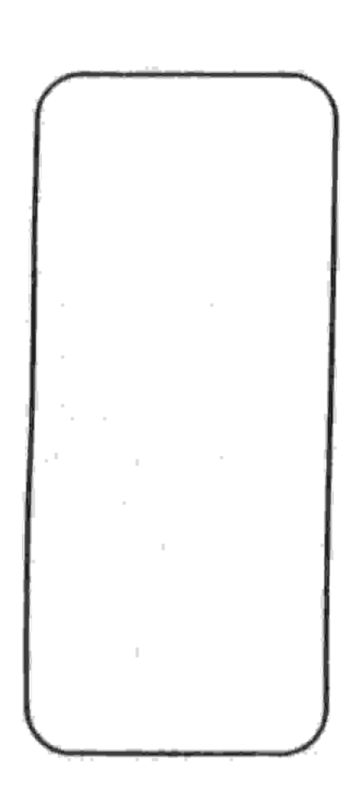

# UNIVERSIDADE ESTADUAL DE FEIRA DE SANTANA DEPARTAMENTO DE CIÊNCIAS EXATAS

NEMOC - Núcleo de Educação Matemática Omar Catunda

Folhetim de Educação Matemática.

Ano 1. n.3. 15.08.93

Editores: Carloman e Wilson

Editoração Eletrônica: C.E.El. - (CPD).

Impressão: Setor de Reprografia

Tiragem: 500 exemplares

Endereço: Km 3 BR 116 CAMPUS UNIVERSITÁRIO

CEP 44031-460 - Feira de Santana-BA.

Fax: (075) 224.2284

#### Objetivo

Este Folhetim é um veículo de divulgação, circulação de idéias e de estímulo ao estudo e à curiosidade intelectual. Dirige-se a todos os interessados pelos aspectos pedagógicos, filosóficos e históricos da Matemática. Pretende construir uma ponte para unir os que estão próximos e os que estão distantes.

### Comitê Editorial

Carloman Carlos Borges (Doutor) Inácio de S. Fadigas (Mestre) Wilson Pereira de Jesus (Mestre)

#### Editorial

Com esse terceiro número do Folhetim iniciaremos uma série de publicações, reproduzindo a coluna *Pergunte que o NEMOC responde* editada pelo professor Carloman aos domingos no Feira Hoje, jornal local. Nossa intenção é ir mais além das fronteiras do estado e estabelecer relações com tantos interessados em Educação Matemática nesse país.

Pergunta: Existe algum ramo da Matemática no qual o conceito de número não possua importáncia?

Resposta: Existe, sim. Este "ramo" é chamado de Topologia. Para compreender este conceito, faremos a seguinte digressão:

## O OBJETO DA TOPOLOGIA

Consideremos as seguintes perguntas: (1) Qual é o comprimento desta sala de aula? (2) Qual o ângulo feito por aquelas duas paredes? (3) Qual a área desta sala? (4) Qual a distância do centro da cidade para a Universidade de Feira? (5) Aonde vamos hoje à noite? (6) Você é vizinho de Paula? (7) Maria derramou o café fora da xicara? (8) José se encontra à direita ou à esquerda de Maria? Ou ele está entre Maria e João? (9) O móvel já está dentro da sala? (10) Qual a divisa (fronteira) entre Sergipe e a Bahia? (11) A porta está aberta ou fechada?

Agora vamos tentar "comparar" as quatro primeiras perguntas acima com as demais. Desta comparação podemos chegar a muitas conclusões, naturalmente, porém vamos nos restringir àquela que nos interessa. Para responder às quatro primeiras perguntas mencionadas, você pode fazê-lo por intermédio de um número, de uma quantidade. Nesse sentido, chamemos a essas quatro perguntas de perguntas quantitativas. E quanto às demais perguntas? Obviamente, elas poderão ser perfeitamente respondidas sem o emprego de qualquer número para representar uma quantidade. Nesse sentido, chamemos a essas perguntas de perguntas qualitativas. Entre os dois grupos de perguntas acima, há, então, uma diferença notável: o primeiro grupo está relacionado à quantidade do objeto, do fenômeno, etc.,

enquanto o segundo grupo se relaciona com a sua qualidade

Os numerosos objetos e fenômenos que nos cercam estão em permanente movimento, mudança, etc. Apesar disto, aos nossos olhos eles se distinguem uns dos outros. Esta discriminação é devida ao seu duplo aspecto: quantitativo e qualitativo. Aparentemente há uma diferença, uma quase oposição entre esses dois aspectos, porém, entre eles existe uma grande unidade indissoluvel.

Qualquer ciência estuda a realidade, isto é, uma parte desta. A riqueza inesgotável da realidade justifica o apareceimento de numerosas ciências e é responsável pelo seu desenvolvimento.

A matemática não é uma exceção à regra acima, pois, obviamente, ela é uma ciência. Algumas pessoas ingênuas e mesmo algumas consideradas sabidas, costumam afirmar que a matemática estuda somente o aspecto quantitativo das coisas, dos fenômenos, etc. Segundo essas pessoas, a Matemática é a ciência da quantidade, isto é, a ciência do número. (Observem só a confusão que elas fazem entre quantidade e número). A afirmação de que a Matemática estuda apenas o aspecto quantitativo dos objetos dos fenômenos, processos, etc, será verdadeira? O desenvolvimento desta ciência mostra que não. Há, na Matemática, diversos ramos independentes, por assim dizer, do número e das noções de quantidade. Um exemplo conhecido dos alunos do 2º grau ou da graduação, é a Geometria Projetiva ou Descritiva. Mais adiante tomaremos contacto com outro ramo do conhecimento matemático que é ''mais qualitativo'' do que quantitativo.

Retornemos, agora, aos dois grupos de perguntas propostas acima. Você conhece alguma "parte da

Matemática" que estuda o primeiro grupo, dando-lhe respostas satisfatórias? A mesma pergunta para o segundo grupo.

A primeira pergunta será, com certeza, respondida prontamente por você: "A Geometria que estudei nos primeiros anos escolares". Quanto à segunda podemos lhe assegurar que existe uma "parte" da Matemática, na qual você encontrará respostas satisfatórias envolvendo os conceitos sublinhados no segundo grupo de perguntas acima. Esta "parte" da Matemática chama-se Topologia. Portanto, noções de vizinhança, fora, dentro, interior, exterior, aberto, fechado, são noções topológicas. Claramente, estas noções costumam vir associadas a outras tais como continuidade, adjacência (proximidade), ordem, etc, as quais, igualmente se incluem no rol das noções topológicas. Quando eu digo: "estou junto com você", emprego, por assim dizer, uma linguagem topológica, ou seja, nesta frase, emprego noções topológicas.

No próximo Folhetim você terá as respostas das seguintes perguntas:

Você poderia aprofundar o que escreveu anteriormente sobre esse ramo fascinante da Matemática que se chama Topologia?

A Matemática pode nos dar alguma "dica" a respeito do popular "jogo da velha?" Aguardem!

SELO

MESS