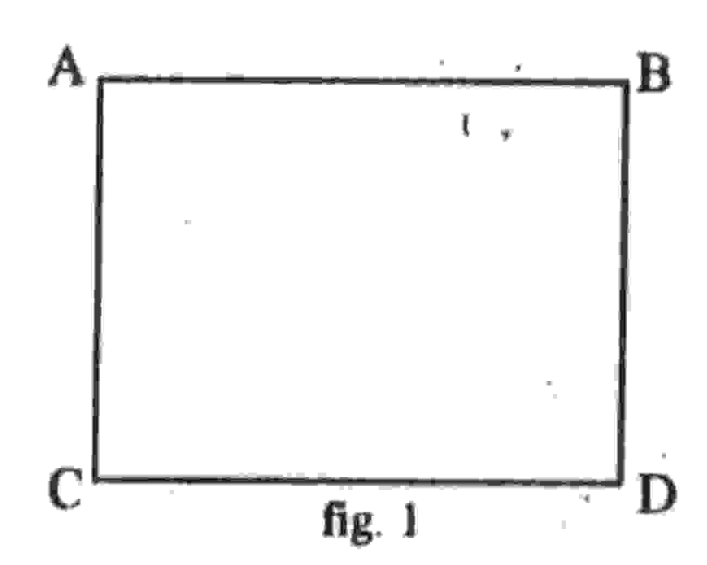
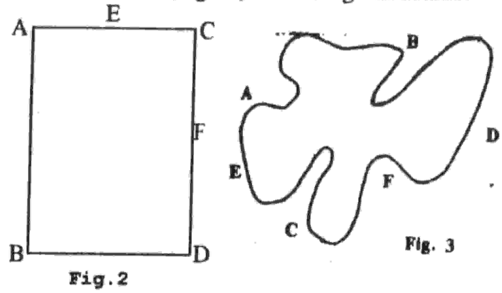
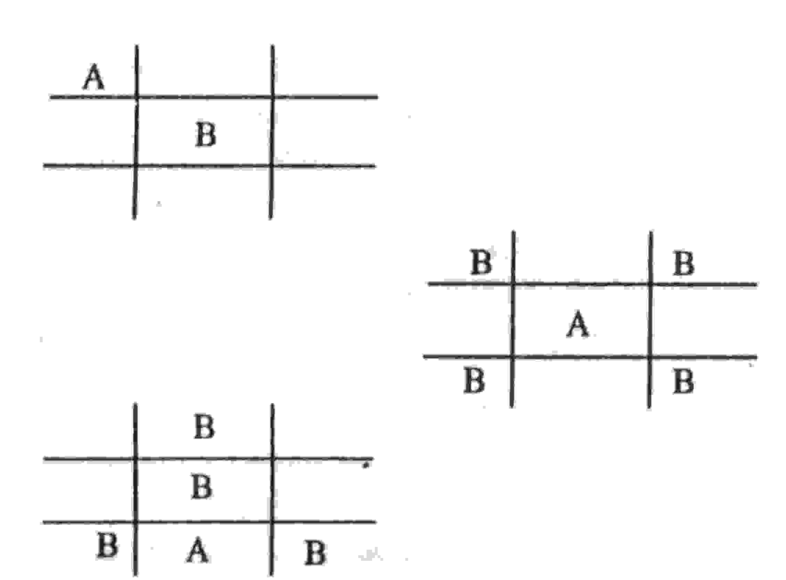

## UNIVERSIDADE ESTADUAL DE FEIRA DE SANTANA DEPARTAMENTO DE CIÊNCIAS EXATAS

NEMOC - Nucleo de Educação Matemática Omar Catunda

Folhetim de Educação Matemática.

Ano 1. n.4. 22.08.93

Editores: Carloman e Wilson

Editoração Eletrônica - C.E.El. - (CPD).

Impressão: Setor de Reprografia

Tiragem: 500 exemplares

Endereço: Km 3 BR 116 CAMPUS UNIVERSITÁRIO

CEP 44031-460 - Feira de Santana-BA.

Fax: (075) 224.2284

## Objetivo

Este Folhetim é um veiculo de divulgação, circulação de idéias e de estímulo ao estudo e à curiosidade intelectual. Dirige-se a todos os interessados pelos aspectos pedagógicos, filosóficos e históricos da Matemática. Pretende construir uma ponte para unir os que estão próximos e os que estão distantes.

## Comité Editorial

Carloman Carlos Borges (Doutor) Inácio de S. Fadigas (Mestre) Wilson Pereira de Jesus (Mestre)

## Editorial

Com esse quarto número damos prosseguimento às publicações do NEMOC visando criar entre os professores de 1° e 2° graus principalmente, uma discussão acerca do ensino de matemática. Pergunta 1: Você poderia aprofundar o que escreveu anteriormente sobre esse ramo fascinante da Matemática que se chama Topologia?

Resposta: Claro. Considere o quadrado abaixo:

Rotulemos algumas propriedades dessa figura:

- 1. O lado AB mede 5cm.
- 2. Seus quatro lados são iguais.
- 3. A distância do lado AC à margem esquerda é de 6cm.
- 4. Todos os seus ângulos são iguais.
- 5. A figura divide o plano em três conjuntos de pontos:
  - a) os pontos que estão dentro dela.
  - b) os pontos que estão sobre as quatro linhas.
  - c) os pontos que estão fora dela.

De todas as propriedades acima mencionadas apenas a última não é estudada na Geometria de Euclides; as demais se caracterizam por suas propriedades métricas e, pertencem a essa Geometria. A propriedade assinalada por último não é uma propriedade métrica, ela não pode ser medida, não é associada a nenhum número, é uma "propriedade qualitativa" e, por conseguinte, pertence à Topologia.

Consideremos, agora, as duas figuras abaixo:

Qualquer pessoa de ''bom senso'' dirá imediatamente: não há nenhuma coisa em comum a essas duas figuras. A fig. 3 é uma "deformação" da fig. 2 e pode lembrar tudo, menos o retângulo da fig. 2. No entanto, um exame mais atento revela o seguinte: apesar de toda a "deformação" apresentada pela fig. 3 em relação à fig. 2, algumas propriedades permaneceram invariantes pela distorção. Quais são elas? Observe que em ambas as figuras, os pontos E, D e F permanecem, respectivamente, entre os pontos A e C, B e F, C e D. Apesar, pois, de toda a sua distorção, a fig. 3 conserva, para os pontos citados, a mesma ordem dentro da qual eles se apresentam na fig.2. Aqui, estamos na presença de uma transformação topológica, uma vez que a transformação que levou a figura retangular à seguinte conservou a ordem dos pontos citados, embora não tenha conservado a retidão dos lados e os ângulos tenham sofrido alterações profundas.

Consideremos outra transformação, aquela que transforma um círculo em um oito. Esta transformação é topológica? Observe que podemos ter no circulo dois

pontos distintos A e B, os quais, após a transformação, podem se apresentar no oito, em contacto; logo, tratase de uma transformação que não transforma todos os pontos distintos do círculo em pontos distintos na segunda figura (o oito). Portanto, não é uma transformação topológica. Imaginemos uma bola de couro e recalquemos uma parte de sua superficie. Pode-se apresentar duas situações:

- a) o recalque provoca na superficie apenas um pequeno rebaixamento. Não há rompimento do couro.
- b) o recalque provoca na superficie um buraco; o couro foi rompido.

Qual das duas transformações acima, podemos considerar como topológica?

Na transformação (a) permanecem invariantes duas propriedades topológicas, quais sejam, o interior e o exterior, enquanto que na transformação (b) não permanecerá a conservação acima mencionada. Nesta última transformação, pontos que eram vizinhos e permaneceram vizinhos em (a), simplesmente deixam de ser vizinhos. Portanto, a vizinhança não é conservada, e consequentemente a transformação (b) não é uma transformação topológica.

Analisando os exemplos acima, podemos concluir: em uma transformação topológica não há nem "fusões" (se houvessem, pontos distintos se transformariam em pontos não distintos, destruindo, assim, a vizinhança entre os mesmos), nem rompimentos (se tal ocorresse, propriedades como interior e exterior seriam destruídas).

A Topologia é um ramo bem recente da Geometria. Pelos exemplos dados acima, conclui-se que ela se preocupa com o aspecto qualitativo dos objetos e nesse sentido ela independe do número. Pergunta 2: A Matemática pode nos dar alguma ''dica'' a respeito do popular ''jogo da velha?''

Resposta: Pode Inicialmente, observe que este jogo possui "quatro cantos", "quatro meios" Simbolizemos o primeiro jogador e suas jogadas pela letra A e o segundo jogador e suas jogadas pela letra B Existem, apenas, três possíveis aberturas: um canto, o centro, o meio. Abaixo, esquematizamos essas três possíveis aberturas pelo jogador A e as respostas convenientes do jogador B. Assim jogando, B evita a derrota.

De todas as três possíveis aberturas a mais perigosa é o canto. O jogador B somente evitará, no lance seguinte, de cair numa armadilha, se escolher o centro. Na modalidade apresentada acima, o número de jogadas possíveis apenas para os seis primeiros movimentos é muito grande: 60.480 (9x8x7x6x5x4) sequências diferentes.

Na sua obra Arte de Amar, Ovidio aconselha às mulheres a aprendizagem deste jogo, a fim de, elas, as mulheres, agradarem aos homens...

SELO