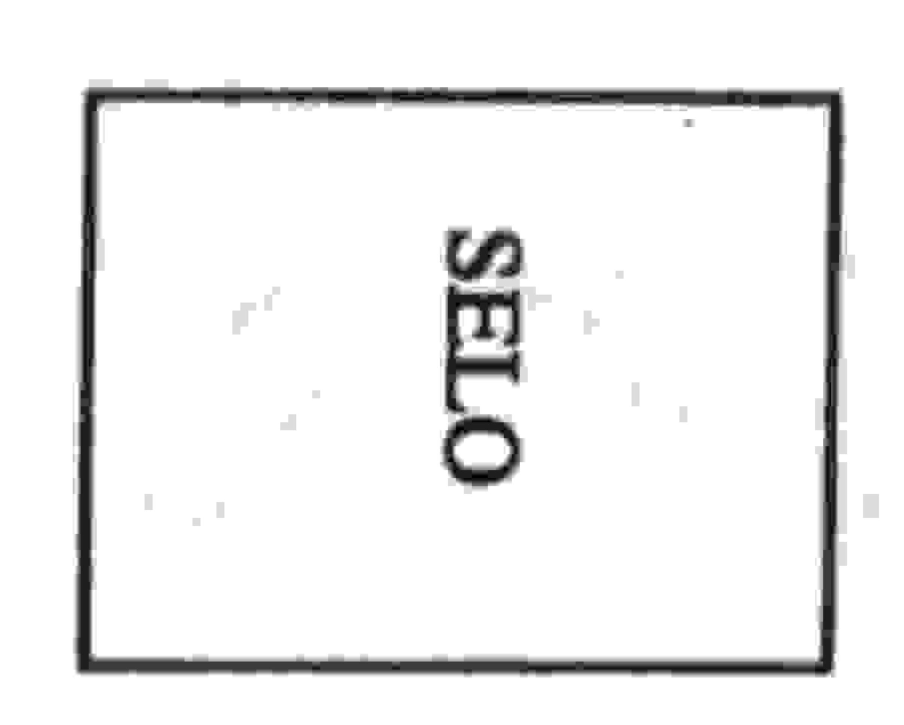

## UNIVERSIDADE ESTADUAL DE FEIRA DE SANTANA DEPARTAMENTO DE CIÊNCIAS EXATAS

NEMOC - Nucleo de Educação Matemática Omar Catunda

Folhetim de Educação Matemática.

Ano 1. n.7. 12.09.93

Editores: Carloman e Wilson

Editoração Eletrônica - C.E.El. - (CPD).

Impressão: Setor de Reprografia

Tiragem: 500 exemplares

Endereço: Km 3 BR 116 CAMPUS UNIVERSITÀRIO

CEP 44031-460 - Feira de Santana-BA.

Fax: (075) 224.2284

## Objetivo

Este Folhetim é um veículo de divulgação, circulação de idéias e de estímulo ao estudo e à curiosidade intelectual. Dirige-se a todos os interessados pelos aspectos pedagógicos, filosóficos e históricos da Matemática. Pretende construir uma ponte para unir os que estão próximos e os que estão distantes.

## Comité Editorial

Carloman Carlos Borges (Doutor) Inácio de Sousa Fadigas (Mestre) Wilson Pereira de Jesus (Mestre)

## Editorial

Dando continuidade às publicações da coluna Pergunte que o NEMOC responde de autoria do Professor Carloman Carlos Borges, editada aos domingos no Feira Hoje, jornal local, aqui estamos com o número 7. Pergunta: Claudene Ferreira Mendes, de Feira de Santana, pergunta:

(a) Há um modelo para o ensino da 'regra dos

sinais ' '?

- (b) Qual a melhor maneira de ''passar'' ao aluno o conceito de número primo ?
- -(a)- A tão falada regra dos sinais refere-se à multiplicação de números relativos e diz que, nesta operação:

Na sociedade dentro da qual vivemos, ter é mais importante do que ser, isto é, somos avaliados pelas nossas posses materiais e não pelo que somos; assim, um modelo bem contextualizado com essa situação deve referir-se a dinheiro. O Prof. Morris Kline, em seu livro O fracasso da matemática moderna apresenta o seguinte: "Concordemos que, se um homem lida com dinheiro, um ganho será representado por um número positivo e a perda por um número negativo. Igualmente, o tempo no futuro será representado por um número positivo e no passado por um número negativo... Assim, se ele ganha CR\$200,00 por dia, daí a três dias estará com CR\$600,00. Em símbolos:

$$+200 \cdot (+3) = 600$$

Se perde CR\$200,00, então, daí a três dias estará com uma perda de CR\$600,00. Em símbolos:

$$-200 \cdot (+3) = -600$$

Se ganha CR\$200,00 por dia, então, três dias atrás estava CR\$600,00 pobre. Em simbolos:

$$+200 \cdot (-3) = -600$$

Finalmente, se perde CR\$200,00 por dia, então três dias atrás, estava CR\$600,00 mais rico. Em símbolos:

$$-200 \cdot (-3) = 600$$

- (b) - Um número primo é um inteiro, maior que um, cujos únicos fatores são ele mesmo e a unidade; assim, exemplificando, 7 é um número primo, pois 7 admite apenas como seus divisores ele mesmo e o número um. Em torno dos números primos existem muitas questões curiosas e embaraçosas. A apresentação dessas questões ao aluno poderá motivá-lo na direção desejada por você, Claudene. Além disso, observe que a grande importância do conjunto dos números primos se deve ao fato de que qualquer inteiro pode expressar-se como produto de números primos.

Exemplificando: o número 6 é composto, pela

multiplicação, de 2 e 3, isto é

$$6 = 2 . 3$$

Isto, repetindo, pode ser estendido a qualquer número inteiro que não seja primo. Por isso, dizemos que um número inteiro que não é primo, é composto. Os números primos são os tijolos com os quais construimos o edificio dos inteiros. Você pode, também, Claudene, considerar que um número composto é uma palavra composta de duas ou mais letras que são os números primos. Considere, pois a palavra 720; ela é composta pelas letras 2 (repetida quatro vezes), 3 (repetida duas vezes) e 5 (uma vez); pois:

$$720 = 2^4 \cdot 3^2 \cdot 5$$

Esta apresentação sugere que a Matemática é estruturada como uma linguagem, tese defendida por alguns ilustres matemáticos. Aliás, alguns físicos, filó-

sofos, etc., avançam a tese de que a natureza está estruturada como uma linguagem. O desenvolvimento deste tema você pode apreciar lendo o belissimo livro do astrofisico francês Hubert Reeves. A hora do deslumbramento, com o subtitulo o universo tem um sentido? Nesta direção, a água é uma palavra formada pelas letras hidrogênio e oxigênio... Vejamos, agora, algumas questões em torno dos número primos, questões curiosas e embaraçosas. Começamos com a pergunta: quantos números primos existem? Apesar de conhecermos apenas um número finito de números primos, existem infinitos números primos. Coisa estranha, hein? Onde se acha a estranheza? No seguinte: os matemáticos não conhecem todos os números primos e jamais atingirão tal conhecimento, porém, afirmam que eles são em número infinito. Isto faz parte da natureza da Matemática: provar a existência de algo com base na ausência de contradição. A existência de um número finito de múmeros primos leva a uma contradição; para afastar esta, conclui-se pela existência de uma infinidade daqueles números. Vejamos, agora, algumas questões curiosas e embaraçosas que você, Claudene, pode apresentar aos seus alunos como motivação. De quando em quando, aparecem pares de números impares consecutivos, ambos primos, como: 5,7; 11,13; 17,19; 29,31; 41,43. Acredita-se que a proposição de que existem infinitos pares deste tipo é certa, porém, até hoje, ninguém sabe Um senhor de nome Goldbach (1690-1764) surge nas páginas de qualquer História da Matemática unicamente porque notou que qualquer número par maior que 2 pode ser escrito como a soma de dois primos.

$$4 = 2 + 2$$

$6 = 3 + 3$  
 $8 = 3 + 5$  
 $12 = 5 + 7$  
 $14 = 5 + 9$ etc.

Este palpite de Goldbach ainda não foi demonstra-

do por nenhum matemático e ninguém, até agora, mostrou, através de um contra-exemplo, que ele é falso. Estas questões costumam despertar interesse por parte do alunado. Experimente.

\* \* \*

Obs.: Perguntas para o Nemoc podem ser encaminhadas para o endereço na capa desse folhetim.

Os interessados em receber esse folhetim devem escrever para o NEMOC. A distribuição é gratuita.

É permitida a reprodução desde que citada a fonte.

\* \*

No próximo Folhetim você terá as respostas às seguintes Perguntas:

(a) A Matemática é uma ciênca exata? Por que?

(b) Quem é Bourbaki?

(c) Qual foi o matemático que inventou os números naturais: 1, 2, 3, 4, 5, etc?

Aguardem!

MPRESS

