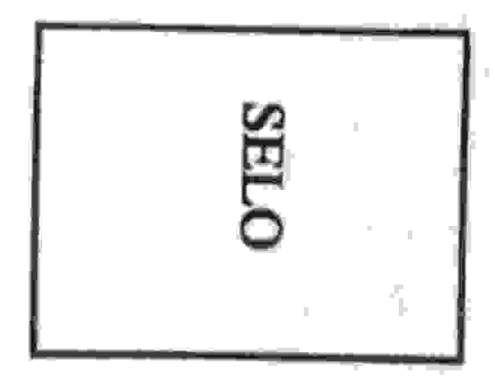

## UNIVERSIDADE ESTADUAL DE FEIRA DE SANTANA DEPARTAMENTO DE CIÊNCIAS EXATAS

NEMOC - Núcleo de Educação Matemática Omar Catunda

Folhetim de Educação Matemática.

Ano 1. n. 12. 18.10.93

Editores: Carloman e Wilson

Editoração Eletrônica - C.E.El. - (CPD).

Impressão: Setor de Reprografia

Endereço: Km 3 BR 116 CAMPUS UNIVERSITÁRIO

CEP 44031-460 - Feira de Santana-BA.

Fax: (075) 224.2284

## Objetivo

Este Folhetim é um veículo de divulgação, circulação de idéias e de estímulo ao estudo e à curiosidade intelectual. Dirige-se a todos os interessados pelos aspectos pedagógicos, filosóficos e históricos da Matemática. Pretende construir uma ponte para unir os que estão próximos e os que estão distantes.

## Comitê Editorial

Carloman Carlos Borges (Doutor) Inácio de Sousa Fadigas (Mestre) Wilson Pereira de Jesus (Mestre)

## Editorial

Dando continuidade às publicações da coluna Pergunte que o NEMOC responde de autoria do professor Carloman Carlos Borges, editada aos domingos no Feira Hoje, aqui estamos com o número 12.

Estamos cadastrando cada professor interessado em manter-se a par das últimas tendências em Educação

Matemática. A UEFS nos proporcionará as condições para que cada professor, em qualquer parte desse país, que solicitar um exemplar do *folhetim* possa recebê-lo.

1ª Pergunta. A professora Urânia, da cidade de Serrinha, indaga se a raiz quadrada de um número inteiro positivo possui dois valores.

Resposta: A colega Urânia deseja saber se, por exemplo, a raiz quadrada de 16 pode ser -4 e, também +4, pois ambos estes valores quando elevados ao quadrado reproduzem 16. Como já enfatizamos anteriormente, a Matemática, localmente, deve ser consistente. Uma das propriedades da radiciação diz que:

$$\sqrt{a}$$
 ,  $\sqrt{b} = \sqrt{ab}$ ;  $a, b \in Z^*$ 

assim, se você considerar que  $\sqrt{a}$  pode ser, também, igual a -a, isto viola a lei mencionada. Verifique! Agora, se você vai trabalhar com as equações algébricas, como, exemplificando,

 $x^2 = 16$ , então, os valores de x são -4 e +4,

este resultado é compatível com o Teorema Fundamental da Álgebra:

toda equação polinomial f(x) = 0, tem pelo menos uma raiz, sejam os coeficientes reais ou imaginários.

Este importante teorema foi a tese de doutoramento do matemático alemão Carl Friedrich Gauss (1777-1855), cuja precocidade causava espanto; aliás, para muitos entendidos, Gauss é o maior matemático ou pelo menos um dos maiores de todos os tempos.

2º Pergunta. Um colega de Salvador pergunta afirmando: existem condições necessárias e suficientes para um bom professor de matemática, quando concordamos, que a condição necessária é dominar o conteúdo matemático?

Resposta: O colega afirma, acertadamente, dentro do nosso entendimento, o seguinte: Se A é um bom professor de Matemática, então, A domina o conteúdo matemático que ensina. Observemos que, numa proposição na forma se...emtão... o que se escreve entre as palavras se e então (no caso: A é um bom professor de Matemática constitui uma condição suficiente para que se cumpra a condição que se escreve depois da palavra então (no caso, A domina o conteúdo matemático; esta condição escrita após a palavra então, chama-se condição necessária para que se cumpra a outra condição: A é um bom professor de Matemática. -. As condições necessárias e suficientes para ser um bom professor de Matemática e, consequentemente, para que se verifique uma melhora no ensino dessa ciência são, no entendimento dos especialistas: (a) conteúdo matemático; (b) metodologia de ensino; (c) conhecimentos de Psicologia. A condição (a) pode ser adquirida em um bom curso numa boa Universidade, se o candidato possuir dedicação e seriedade; a condição (b) nos conduz à pergunta: qual metodologia mais adequada ao ensino da Matemática? Aqui, devemos procurar inspiração na Heuristica; o objeto desta é a pesquisa de métodos e caminhos ligados às descobertas e às invenções. O matemático G. Polya dedicou os últimos anos de sua vida a ensinar às gerações mais jovens como aplicar o método heurístico ao ensino da Matemática. Escreveu algumas obras bem interessantes: A arte de resolver problemas (Editora Interciência), La découverte des mathématiques, ainda não traduzido em Português, e outras. No Prefácio à

Segunda Edição do primeiro livro mencionado acima. o autor, citando um estudo elaborado pelo Educational Testing Service, Princeton, N.Y., cf. Time, 18 de junho de 1956, escreve: ...a Matemática tem a duvidosa honra de ser a matéria menos apreciada do curso... Os futuros professores passam pelas escolas elementares a aprender a detestar a Matemática... Depois, voltam à escola elementar para ensinar uma nova geração a detestá-la. Ainda dentro do item (b) já citado, colocamos o estudo da História da Matemática, não como enfoque anedótico, porém dentro da perspectiva não euclidiana, isto é, a Matemática como ciência indutiva e experimental onde se possa apreciar a filogênese e a ontogênese do saber matemático. Em seu admirável livro A lógica do descobrimento matemático: provas e refutações, Imre Lakatos, no rodapé da p.17, Ed. brasileira da Zahar de 1978 escreve: H. Poincaré e G. Polya propõem aplicar a 'lei biogenética fundamental' de E. Haeckel sobre a ontologia resumindo a filogenia ao desenvolvimento mental, sobretudo ao desenvolvimento mental matemático... Citando Poincaré: Os zoólogos afirmam que o desenvolvimento do embrião de um animal reproduz, em resumo, toda a história dos seus antepassados através do tempo geológico. Parece acontecer o mesmo com o desenvolvimento das mentes... Por esta razão, a história da ciência deve ser nosso primeiro guia (C.B.Halsted). Anteriormente, na p. 15, Lakatos enfatiza: ...a história da matemática, à falta da orientação da filosofia, tornou-se cega, ao passo que a filosofia da matemática, voltando as costas aos fenômenos mais curiosos da história da matemática, tornou-se vazia. Resumindo o item (b): a heurística - a ciência que procura explicitar, com auxilio de outras ciências, os mecanismos criadores da mente humana, deve inspirar a postura

metodológica do professor de Matemática juntamente com a sua história e a sua filosofia. Os ensinamentos de Herbert Fremont em seu livro Teaching secondary mathematics through applications (O ensino da matemática na escola secundária por meio de aplicações), ainda não traduzido para o português, devem fazer parte de sua bagagem, dentro da orientação de Fremont, o aluno deve exercitar as quatro liberdades: - Cometer erros, - fazer perguntas; - pensar por si mesmo; escolher o método de solução. Maiores detalhes sobre o assunto estão contidos em dois artigos publicados na Revista do Professor de Matemática, n. 5, 2º semestre de 1984: um, assinado por Maria Laura Mouzinho Leite Lopes, especialista no assunto e outro por Elon Lages Lima, nome bastante conhecido nos meios acadêmicos, dispensando qualquer apresentação. Quanto ao item (c) pouca coisa há a acrescentar. Devemos sair de nosso referencial em direção ao referencial do aluno, sem o que é impossível o diálogo e, consequentemente, a aprendizagem. A empatia deve ser cultivada a todo instante e em qualquer lugar.

\*\*

Obs.: É permitida a reprodução total ou parcial desse folhetim desde que citada a fonte.

Caso você tenha interesse em receber esta publicação escreva para o NEMOC.

No próximo número, as respostas para:

- Que argumento deve ser usado pelo professor para que o aluno entenda o significado das potências, evitando-se, assim, que ele, o aluno, multiplique a base pelo expoente? -Qual a relação entre Matemática e Numerologia?

Aguardem!

