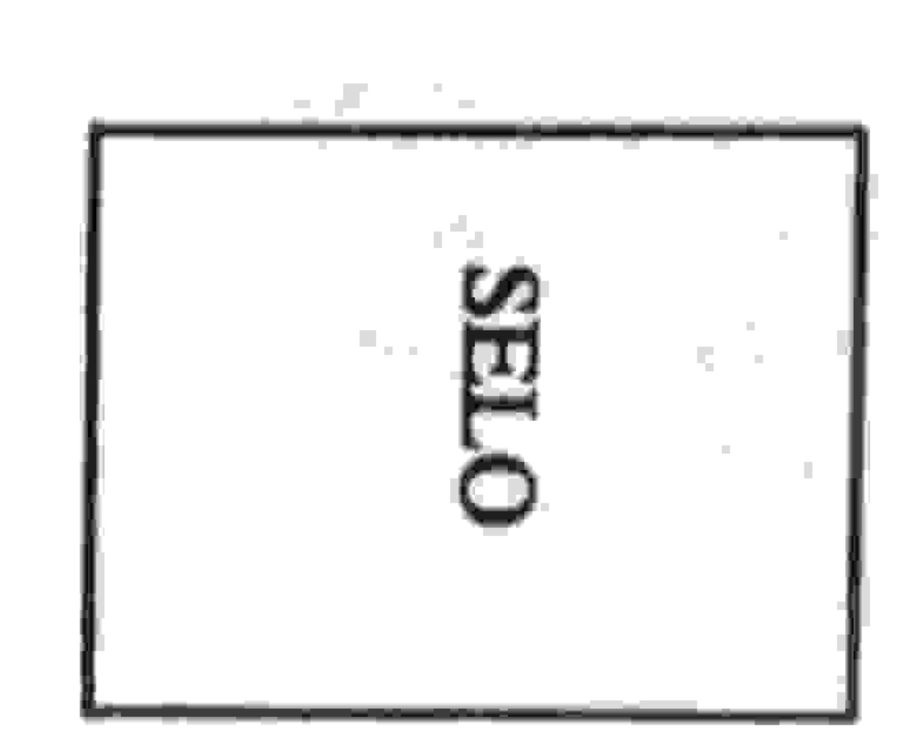

# UNIVERSIDADE ESTADUAL DE FEIRA DE SANTANA DEPARTAMENTO DE CIÊNCIAS EXATAS

NEMOC - Nucleo de Educação Matemática Omar Catunda

Folhetim de Educação Matemática.

Ano 1. n. 14. 01.11.93

Editores: Carloman e Wilson

Editoração Eletrônica - C.E.El. - (CPD).

Impressão: Setor de Reprografia

Endereço: Km 3 BR 116 CAMPUS UNIVERSITÁRIO

CEP 44031-460 - Feira de Santana-BA.

Fax: (075) 224.2284

#### Objetivo

Este Folhetim é um veículo de divulgação, circulação de idéias e de estímulo ao estudo e à curiosidade intelectual. Dirige-se a todos os interessados pelos aspectos pedagógicos, filosóficos e históricos da Matemática. Pretende construir uma ponte para unir os que estão próximos e os que estão distantes.

#### Comité Editorial

Carloman Carlos Borges (Doutor) Inácio de Sousa Fadigas (Mestre) Wilson Pereira de Jesus (Mestre)

#### Editorial

Dando continuidade às publicações da coluna Pergunte que o NEMOC responde de autoria do professor Carloman Carlos Borges editada aos domingos no Feira Hoje, aqui estamos com o número 14. Devido a problemas de ordem administrativa houve um pequeno contratempo... Tinha que ser na confecção do número 13! 1º Pergunta - Um aluno da UNEB (Universidade do Estado da Bahia) indaga: Como pode existir uma adição com infinitas parcelas e, mais do que isto, como pode esta soma ter como resultado um número finito?

R. A pergunta do aluno refere-se a certos tipos de somas como, exemplificando:

$$\frac{1}{2} + \frac{1}{4} + \frac{1}{8} + \frac{1}{16} + \frac{1}{32} + \frac{1}{64} + \cdots$$

As reticências significam que se trata de um processo infinito, isto é, esta soma possui infinitas parcelas e, todavia, nunca vai ultrapassar o número /; na verdade, por mais termos que acrescentemos na soma acima e efetuemos o cálculo das parcelas, nunca o resultado será I, porém, dele se aproxima indefinidamente. Parece que, por parte do aluno e, igualmente, da parte de muita gente não familiarizada com tais processos, existem dois espantos: o primeiro, na constatação de uma soma com infinitas parcelas e o segundo, esta soma apresentar como resultado um número finito, no caso, o número 1. Os espantos são procedentes pois estamos perante um processo infinito e, pergunto: existirá, no mundo de nossas idéias, algo mais fascinante e perturbador do que a idéia do infinito? Toda vez que com ela nos deparamos, o primeiro sentimento que experimentamos é o do espanto acompanhado por vezes desse outro angustiante sentimento: o do medo, Porém, no caso em questão, fiquemos apenas com o sentimento de espanto vez que tal processo não representa nenhuma ameaça à nossa segurança psicológica. Meu caro aluno: o simples fato de você sentir-se perturbado perante a existência dessas somas com seus resultados ainda mais espantosos - é um ótimo começo na sua carreira acadêmica. Aqui e agora, aprenderá a

primeira lição: em processos infinitos é bom precaverse ante o chamado senso comum ou mesmo o bom senso pois, via de regra, eles servem apenas para atrapalhar a compreensão; nosso guia é a mente com suas ferramentas lógicas, é este poderoso instrumento de trabalho - a mente humana, a qual, embora imaterial possui um suporte bem material - o cérebro - que servirá de guru na grande aventura de lidar com o infinito. Assim, simples conhecimentos de progressões geométricas, assunto aliás estudado ainda no 2º grau, serve de base para uma demonstração rigorosa de que a soma apontada acima se aproxima indefinidamente de 1, sem nunca ser 1 e muito menos ultrapassá-lo. Quanto ao fato de os matemáticos se preocuparem com tais operações, isto se explica, também. Todos sabemos que a Matemática é de uma espantosa fecundidade. Uma pergunta, então, logo se impõe: como é possível tanta fecundidade? A análise, a síntese, a abstração e a generalização são operações inerentes à mente humana; nós as usamos diariamente porém, é nesta ciência que elas encontram o seu terreno mais fértil. É construindo abstrações sobre abstrações e destas, generalizando, que os matemáticos enriquecem, sem interrupção a sua ciência, podemos mesmo acrescentar que a generalização é a matriz básica da fecundidade na Matemática. Veja o que aconteceu com os números: inicialmente, foram criados os números naturais, 1, 2, 3, 4, etc, e, com eles, o problema primitivo da contagem, anterior àquela criação, foi resolvido; em seguida vem o problema da medida e com ele generaliza-se o conceito de número criando-se os números fracionários. De generalização em generalização, surgem os números racionais, irracionais, reais, complexos, hiper-complexos. Como se não bastasse tanta generalização, o matemático alemão Cantor, criador da Teoria dos Conjuntos, cria os números transfinitos e com eles nos conduz ao reino do Além do Infinito.

- 2º Pergunta. Maria A. do Carmo escreve: quando definimos a potenciação de base a e expoente n, destacamos que n assume valores inteiros positivos a partir de 2. Como explicar, então, que aº = 1?
- R. A questão levantada pela colega costuma suscitar muitas dúvidas. Realmente, definimos an= a x a x a x a ... um número n de vezes, para n a partir de 2. Uma definição em Matemática serve, entre outras coisas, para nortear o desenvolvimento geral de uma teoria. Casos particulares como aº ou mesmo a¹, são resolvidos tendo em vista principalmente as propriedades da potenciação, no caso presente, bem como outras pertinentes. Neste caso, dizemos que  $a^0 = I$ ,  $a \neq 0$ , por convenção mas, não se trata de uma convenção de natureza similar às convenções sociais:  $a^0 = I$  porque é compativel com as propriedades atinentes a esta operação. Assim, sabemos que  $a^{m}.a^{n} = a^{m+n}$ ; esta propriedade, fundamental no que estamos tratando, é conservada com aquela convenção, outras propriedades mantidas são a existência do elemento neutro tanto na adição como na multiplicação. Se aº fosse convencionado ser igual a outro valor diferente de 1, as propriedades mencionadas seriam violadas e a tão falada harmonia da Matemática sofreria sérios arranhões podendo mesmo desmoronar-se.
- 3" Pergunta. Alice P. Silveira, de Salvador indaga: a Matemática é uma criação ou uma descoberta?
- R. Sua pergunta, colega, nos conduz ao estudo, embora superficial, de duas posições diametralmente

opostas, elas são denominadas de realismo e de construtivismo; alguns empregam no lugar do último vocábulo, a palavra intuicionismo. Segundo o ponto de vista do realismo, de inspiração no filosofo Platão, a Matemática é uma descoberta, o seu mundo pertence ao mundo das essencias ideais. Para os construtivistas, um objeto matemático somente existe quando ele é construído ou quando se conhece um método que permita a sua construção, por conseguinte, para eles, os construtivistas, a Matemática é uma livre criação da mente humana; eles não aceitam as famosas demonstrações por absurdo, um dos pilares da Matemática. Como se procede nesse tipo de demonstração? Da seguinte maneira para provar a existência deum objeto matemático A, inicialmente, faz-se a suposição que ele não existe e dai, por intermédio de uma cadeia de inferências lógicas, chega-se a uma falsidade (um absurdo). Desta falsidade e aplicando alguns princípios da lógica clássica, conclui-se pela existência do objeto A. Para os construtivistas, tal prova é um verdadeiro absurdo.

# \*\*\*

Obs.: É permitida a reprodução total ou parcial desse folhetim desde que citada a fonte.

Caso você tenha interesse em receber esta publicação escreva para o NEMOC.

### 

No próximo número, as respostas para:

- Qual a origem dos princípios lógicos? Será que estes princípios são inatos?
- 2 + 2 também pode ser igual a 5?

## Aguardeni

IMPRES

