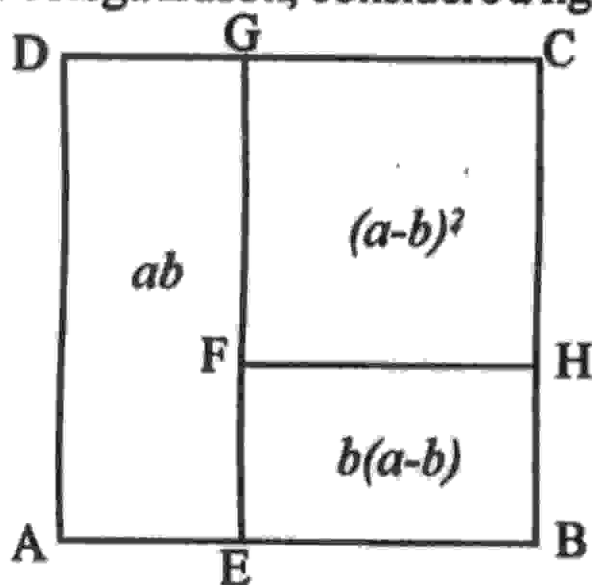
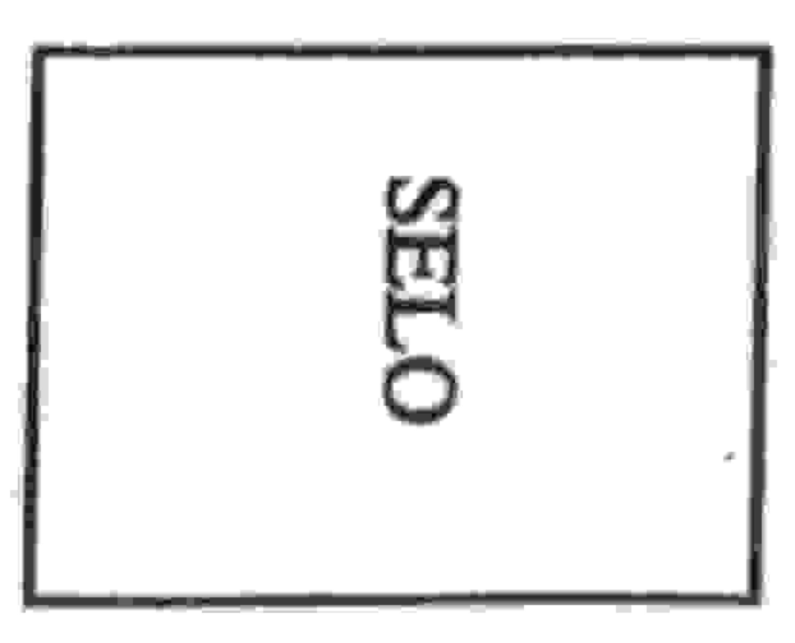

# UNIVERSIDADE ESTADUAL DE FEIRA DE SANTANA DEPARTAMENTO DE CIÊNCIAS EXATAS

NEMOC - Núcleo de Educação Matemática Omar Catunda

Folhetim de Educação Matemática.

Ano 1. n.23. 03.01.94

Editores: Carloman e Wilson

Editoração Eletrônica - C.E.Et. - (CPD).

Impressão: Setor de Reprografia

Endereço: Km 3 BR 116 CAMPUS UNIVERSITÁRIO

CEP 44031-460 - Feira de Santana-BA.

Fax: (075) 224.2284

## Objetivo

Este Folhetim é um veículo de divulgação, circulação de idéias e de estímulo ao estudo e à curiosidade intelectual. Dirige-se a todos os interessados pelos aspectos pedagógicos, filosóficos e históricos da Matemática. Pretende construir uma ponte para unir os que estão próximos e os que estão distantes.

#### Comitê Editorial

Carloman Carlos Borges (Doutor) Inácio de Sousa Fadigas (Mestre) Wilson Pereira de Jesus (Mestre)

### Editorial

Dando continuidade às publicações da coluna Pergunte que o NEMOC responde de autoria do professor Carloman Carlos Borges, editada aos domingos no Feira Hoje, aqui estamos com o número 23. 1ª Pergunta. Edson Ramos, de São Gonçalo dos Campos e aluno da UEFS, indaga: (a) existe alguma representação geométrica para o produto notável (a-b)²? e (b) qual a justificativa dos critérios de divisibilidade?

R. Caro colega Edson, considere a figura abaixo:

Em relação a ela convencionemos: 1) o lado do quadrado ABCD mede a; 2) o lado do quadrado FHCG mede a-b; 3) o retângulo AEGD possui lados de medidas b e a; 4) o retângulo EBHF possui lados de medidas b e a-b. Desta maneira, podemos escrever: área de FHCG=área de ABCD-(área de AEGD+área de EBHF); isto também pode ser escrito deste modo:

$$(a-b)^2 = a^2 - [ab + b(a-b)] = a^2 - [ab + ab - b^2] =$$

$$= a^2 - 2ab + b^2.$$

Quanto aos critérios de divisibilidade indicam condições para que um número natural seja divisível por outro, pelo que começamos nossa resposta salientando alguns preliminares. Sabemos que as operações de adição, subtração e multiplicação entre números naturais apresentam como resultados sempre números naturais. Numa linguagem sofisticada, expressamos este fato afirmando que o conjunto dos naturais é fechado em relação às operações mencionadas. O fechamento do conjunto dos números naturais não se verifica

quando a operação é a divisão pois, neste caso, podemos aplicar esta operação a dois números naturais e obter como resultado um número não natural. Em virtude disto, dados dois números naturais e a operação de divisão, devemos imediatamente considerar a seguinte questão: é possível esta operação dentro do conjunto dos números naturais? Com esta pergunta queremos dizer simplesmente isto: o resultado da operação é um número natural? Esta pergunta é respondida com os chamados critérios de divisibilidade. Agora, uma definição: O número a é divisível por b, isto é, b divide a, se existir um número c que satisfaça a igualdade a = bc. Consideremos um número natural como, por exemplo, 25674. Que significa esta representação? Ela é simplesmente a abreviatura do seguinte:

$$25674 = 2.10^4 + 5.10^3 + 6.10^2 + 7.10 + 4$$

Todos concordamos que seria bastante incômodo empregarmos a representação indicada no segundo membro da igualdade acima, toda vez que fôssemos escrever o numeral representativo de um número. Exemplificando mais uma vez, se em lugar de 356 devêssemos escrever 3.102 + 5.10 + 6, isto seria, no mínimo, muito cansativo. Pois bem, quando se trata de justificar a divisibilidade de um número natural por outro, devemos ter em mente, precisamente, esta representação na base decimal. Ao generalizarmos o que foi dito logo acima, podemos representar um número natural A qualquer da maneira que segue:

$$A = a_n \cdot 10^n + a_{n-1} \cdot 10^{n-1} + ... + a_2 \cdot 10^2 + a_1 \cdot 10 + a_{n-1}$$

representação que pode ser simplificada com a escrita

$$A = a_n a_{n-1} \dots a_2 a_i a_0$$

Vejamos algumas aplicações: (a) o número representado por 24548 é divisível por 4, pois 48 (observe seus dois últimos algarismos) o é. Qual a justificativa? Façamos a representação:

$$24548 = 2.10^4 + 4.10^3 + 5.10^2 + 4.10 + 8 =$$

$$= (2.10^2 + 4.10 + 5)10^2 + (4.10 + 8);$$

note que tanto o número representado no primeiro parêntese como o representado no segundo são divisíveis por 4; logo, o número dado 24548 é divisível por 4; daí, a regrinha: um número é divisível por 4 quando o número formado por seus dois últimos algarismos também o é. O número, exemplificando, 45478991188, certamente que é divisível por 4, pois, 88 o é. Seria aconselhável que o caro colega justificasse essa assertiva, de uma maneira inteiramente análoga à que já fizemos acima. Em nome de um rigor maior, enunciamos o teorema pertinente à divisão por 4:

Para que um número $A = a_n a_{n-1} ... a_2 a_1 a_0$ seja divisível por 4, é necessário e suficiente que o número $a_1 a_0$ (isto é, o formado pelos seus dois últimos algarismos) seja divisível por 4.

Será que o número 784 é divisível por 2? A resposta é positiva, pois ele termina em 4 e este é divisível por 2. A justificativa: 784 = 7.102 + 8.10 + 4 = (7.10 + 8)10 + 4; os números representados dentro dos dois parênteses são divisíveis por 2, logo, o número dado 784 também o é. É preciso acrescentar que as justificativas que apresentamos acima são, ambas, incompletas, servindo tão somente para a introdução do assunto. Quando um teorema fala em condição necessária e suficiente, a sua demonstração se desdobra em duas etapas; acima, nos fixamos apenas em uma dessas etapas. A outra etapa, o colega poderá tentar seguindo

um raciocínio análogo ao empregado por nós. Os demais critérios de divisibilidade seguem um caminho semelhante ao já discutido e você poderá, então, discutilos sozinho...

2ª Pergunta. Um colega de Feira de Santana pergunta: Qualquer pessoa pode aprender matemática?

R. Penso que o conhecimento matemático pode ser adquirido por qualquer pessoa dita normal. Por conhecimento matemático me refiro àquele ensinado em nossas escolas incluindo nestas, as universidades. Agora, se alguém deseja tornar-se matemático, não basta o seu desejo, mesmo estando mergulhado em condições culturais e sociais satisfatórias; torna-se indispensável ser possuidor de uma herança biológica compatível, a qual, aliada às outras condições já mencionadas o tornarão um matemático. Tudo isto também é válido para alguém que deseja aprender, por exemplo, Biologia, Astronomia, Física, Sociologia, etc. Afirmar que a Matemática desenvolve a inteligência é um truísmo, pois todas as demais ciências e as artes também desenvolvem esta faculdade e isto jamais deveria ser - como está sendo - argumento para o seu ensino em cursos como Enfermagem, Odontologia, etc. Por outro lado, devemos refletir sobre as palavras do naturalista Stephen Jay Gould:

Não há uma vantagem absoluta no desenvolvimento da inteligência. Ela é uma formidável ferramenta, mas não é uma garantia de que vamos sobreviver como espécie (o grifo é nosso). O intelecto humano não tem compromisso absoluto com a sobrevivência da humanidade nem com a manutenção da vida no planeta (o grifo é nosso).

É preciso dar exemplos para ilustrar a tese acima?

#### \* \* \* \*

Obs.: É permitida a reprodução total ou parcial desse folhetim desde que citada a fonte.

Caso você tenha interesse em receber esta publicação escreva para o NEMOC.

Números atrasados - envie para cada folhetim um selo de postagem nacional de 1º porte. Dentro de no máximo quatro semanas, contadas a partir da data de recebimento do seu pedido, você estará recebendo os folhetins solicitados.

No próximo número, as respostas para:

- A ordem dentro da qual as palavras de um dicionário aparecem, tem algo a ver com a ordem estudada em Matemática?
- Qual a finalidade de uma demonstração? Ela deve ser ensinada no 1º Ciclo?

Aguardens

