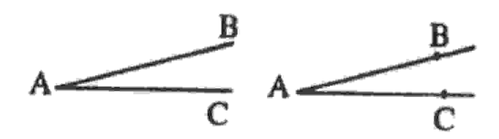
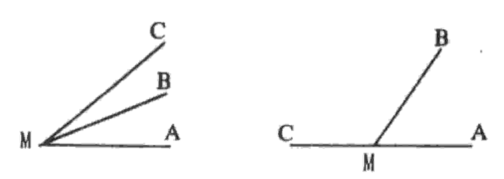
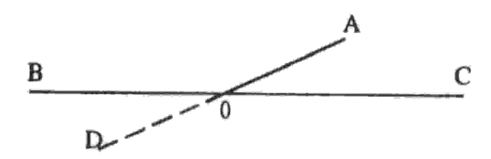

### UNIVERSIDADE ESTADUAL DE FEIRA DE SANTANA DEPARTAMENTO DE CIÊNCIAS EXATAS

NEMOC - Núcleo de Educação Matemática Omar Catunda -

Folhetim de Educação Matemática.

Ano 2. n.26. Marco/95

Editores: Carloman e Wilson

Editoração e Impressão: Núcleo de Editoração Gráfica - NUEG

Endereço: Av. Universitária, s/n - Campus Universitário

CEP 44031-460 - Feira de Santana-BA.

Fone: (075) 224.1521 - Fax: (075) 224.2284

### Objetivo

Este Folhetim é um veículo de divulgação, circulação de idéias e de estímulo ao estudo e à curiosidade intelectual. Dirige-se a todos os interessados pelos aspectos pedagógicos, filosóficos e históricos da Matemática. Pretende construir uma ponte para unir os que estão próximos e os que estão distantes.

### Comitê Editorial

Carloman Carlos Borges (Doutor) Inácio de Sousa Fadigas (Mestre) Wilson Pereira de Jesus (Mestre)

#### Editorial

O Pergunte que o NEMOC responde é de autoria do Professor Dr. Carloman Carlos Borges e objetiva atingir ao público interessado em Matemática nos seus múltiplos aspectos.

1º Pergunta. Um grupo de alunos da UEFS e também professores do 1º grau, indaga (a) qual a definição de ângulo? e (b) a diferença entre ângulos consecutivos e ângulos adjacentes?

R. O item (a) pode ser respondido de diversas maneiras e algumas delas damos abaixo.

Definição 1: ângulo é a figura formada por duas semiretas com a mesma origem. As duas semi-retas são chamadas de lados do ângulo e a origem comum, de vértice do ângulo. Deve-se observar que os lados de um ângulo são semi-retas e não segmentos.

Assim, a figura abaixo e à esquerda, não é um ângulo, embora ela determine um ângulo como apresentado à direita.

Deve-se lembrar, também, que o segmento $\overline{AB}$ como aparece na figura acima, à esquerda, é o conjunto cujos pontos são A e B, juntamente com todos os pontos que estão entre A e B, sendo estes chamados de extremidades do segmento $\overline{AB}$ .

Definição 2: em um plano orientado P, para dois vetores unitários $v_1$ e $v_2$ , ha uma única rotação r que transforma $v_1$ em $v_2$ ; chama-se-lhe o angulo de $v_1$ com $v_2$ .

Definição 3: sejam duas retas distintas e não paralelas e A o seu ponto de interseção. Estas duas retas r e s determinam dois semi-planos; a interseção desses dois semi-planos é uma figura chamada de ângulo. O emprego das definições acima depende do contexto e exemplificando: em Trigonometria, a definição 2 pode ser mais conveniente. Como o contexto de vocês é a geometria elementar, a definição 1 é satisfatória; não há, portanto, como na definição 2, necessidade de ângulos orientados. Quanto a (b) damos as seguintes definições: (i) ângulos consecutivos: dois ângulos são consecutivos quan-

do eles possuem um lado comum, um vértice comum e nenhum ponto interior comum; (ii) ângulos adjacentes: dois ângulos consecutivos são chamados de ângulos adjacentes quando possuem os lados exteriores como semi-retas opostas. Na figura abaixo, à esquerda, os ângulos AMB e BMC são ângulos consecutivos, enquanto que na figura à direita, os ângulos AMB e BMC são consecutivos e adjacentes. Deve-se observar que a soma de dois ângulos adjacentes é sempre 180° o que nem sempre se verifica com a soma de dois ângulos consecutivos.

Deve-se ainda observar que o suplemento de um ângulo é o ângulo adjacente ao ângulo dado obtido pelo prolongamento de um de seus lados. Na figura abaixo é dado o ângulo AOB; com o prolongamento de seus lados temos os ângulos adjacentes AOB e AOC e ... vocês devem completar a frase.

2º Pergunta. Uma professora leu, em um de seus livros, que a expressão 1/12 deve ser lida: um doze avos; porém, ao assistir uma palestra, o palestrante lhe assegurou que a expressão acima deve ser lida: um doze avo. Em dúvida, ela indaga: e agora?

R. A expressão 1/12 é pronunciada usualmente como um doze avos e não um doze avo. A palavra avo deve provir da terminação de oitavos e designa fração de unidade, quando esta é dividida em mais de dez partes iguais, porém não em número

expresso por potência de base 10. Ex.: 1/15 - um quinze avos; 4/17 - quatro dezessete avos. Em Matemática ela é empregada apenas no plural.

- 3º Pergunta. Um colega de Feira de Santana perguntou: sempre escutei dizer que zero escrito à esquerda de um número, não altera este número, porém, dado o número 54, por exemplo, 0,54 é outro número bem diferente de 54.
- R. Quando se diz que zero à esquerda de um número não altera, é no seguinte sentido: o número 180, exemplificando, pode ser escrito como 0180, 00180, 000180, etc; neste caso, diz-se que empregam zeros desnecessários ou zero à esquerda; fica claro que zero escrito à esquerda de um número quando acompanhado da vígula deve alterá-lo.
- 4º Pergunta. Sônia P. Albuquerque, pergunta: quando escrevemos A = B, o que queremos, realmente, afirmar com isto?

R. O sinal =, em Matemática é empregado em dois ou mais sentidos diferentes e, portanto, costuma produzir alguns malentendidos. A = B se e somente se A possui toda propriedade que B possui, e B possui toda propriedade que A possui. Este é o sentido da identidade lógica. Com este significado, a igualdade goza das propriedades de simetria (se A = B, B = A); reflexividade (A = A) e transitividade (se A = B = B = C, então, A = C). Existem casos, nos quais dois entes podem ser iguais sem, todavia, serem os mesmos; isto acontece, exemplificando, com dois segmentos. Esta igualdade geométrica, embora goze das propriedades mencionadas, não é a identidade lógica definida acima. Na prática do dia-a-dia, A = B, a menos de um determinado erro e $\mathbf{B} = \mathbf{C}$ , também a menos de um certo erro, donde $\mathbf{A} = \mathbf{C}$ , a menos de um erro maior que os mencionados. Quando escrevemos 3/11 = 0.2727... não queremos dizer que o número representado no segundo membro é o mesmo número representado no primeiro membro; 0,2727... representa uma sequência infinita de frações decimais e as frações decimais 0,27; 0,2727; 0,272727, etc. são aproximações da fração ordinária 3/11. A identidade

lógica, por tratar-se de uma igualdade formal, é uma idealização inspirada na experiência humana de milhares e milhares de gerações. O grande matemático Jules-Henri Poincaré, em seu livro Ciência e Hipótese, Editora UNB escreve: Observou-se, por exemplo, que um peso A de 10 gramas e um peso B de 11 gramas produziam sensações idênticas, e, também, que o peso B não podia ser distinguido de um peso C de 12 gramas, mas que se distinguia facilmente o peso A do peso C. Os resultados brutos da experiência podem, pois, ser expressos pelas seguintes relações: A = B, B = C, porém, A < C, que podem ser vistas como a fórmula do contínuo físico. Existe aí uma intolerável discordância com o princípio de contradição e foi a necessidade de eliminá-la que nos forçou a inventar o contínuo matemático.

### 米米米米米米

Obs.: É permitida a reprodução total ou parcial desse folhetim desde que citada a fonte.

Caso você tenha interesse em receber esta publicação escreva para o NEMOC.

## 光光光光光

Números atrasados - envie para cada folhetim um selo de postagem nacional de 1º porte. Dentro de no máximo quatro semanas, contadas a partir da data de recebimento do seu pedido, você estará recebendo os folhetins solicitados.

# \*\* \*\* \*\*

No próximo número, a resposta para:

-No Portugês, a disjunção "ou" representa duas coisas separadas; exemplo: quero falar com Pedro ou João, enquanto que, a conjunção "e" significa união; exemplo: quero falar com Pedro e João. Na Matemática, "ou" representa união de conjuntos e "e" interseção de conjuntos. Como se processa essa relação entre a linguagem comum e a lingua-

gem matemática?

- Empregando as coordenadas cartesianas ortogonais e, usando escalas diferentes nos dois eixos, a inclinação de uma reta passando pelos pontos $(x_1,y_1)$ e $(x_2,y_2)$ continua sendo definida como o quociente de $y_2$ - $y_1$ por $x_2$ - $x_1$ ?

. . . . . . . . . . . . . . . . . . . .

- Venho lendo, semanalmente, à sua coluna Pergunte que o NEMOC responde e, às vezes o que você escreve me causa muita surpresa. Por exemplo: por que você é contrário ao ensino dessa bela ciência em cursos de Enfermagem, Odontologia, etc.?

Aguardemi

SELO
