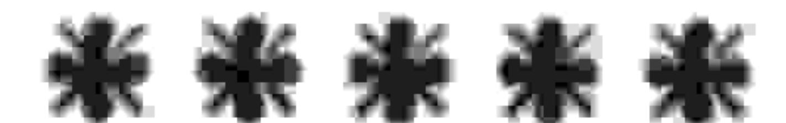

# UNIVERSIDADE ESTADUAL DE FEIRADE SANTANA DEPARTAMENTO DE CIÊNCIAS EXATAS

NEMOC - Núcleo de Educação Matemática OmarCatunda

Folhetim de Educação Matemática

Ano 2. n.34. Junho/95

Editores: Carloman e Wilson

Editoração e Impressão: Núcleo de Editoração Gráfica - NUEG

Endereço: Av. Universitária, s/n - Km 03 BR 116

Campus Universitário - Fax:(075)224-2284

CEP 44031-460 Feira de Santana-BA

# Objetivo

Este Folhetim é um veículo de divulgação, circulação de idéias e de estímulo ao estudo e à curiosidade intelectual. Dirige-se a todos os interessados pelos aspectos pedagógicos, filosóficos e históricos da Matemática. Pretende construir uma ponte para unir os que estão próximos e os que estão distantes.

#### Comitê Editorial

Carloman Carlos Borges (Doutor) Inácio de Sousa Fadigas (Mestre) Wilson Pereira de Jesus (Mestre)

# PERGUNTE QUE O NEMOC RESPONDE

#### Editorial

O Pergunte que o NEMOC responde é de autoria do Prof. Dr. Carloman Carlos Borges e objetiva atingir ao público interessado em Matemática nos seus múltiplos aspectos.

Pergunta. Vlademir R. dos Santos, de Salvador, escreve Já fiz diversos cursos de reciclagem em matemática e continuinsatisfeito quanto ao ensino dessa ciência. O que pensa você

R. Você toca num assunto bastante interessante além d importante: os chamados cursos de reciclagem em matemático À parte as excessões honrosas, tais cursos não contribuem en nada à melhoria do ensino de matemática pois, via de regra, sã elaborados dentro de uma metodologia industrial, cujo compo nente principal é a rapidez na sua duração, sem falar no pouc conteúdo matemático de alguns professores responsáveis po eles. Dentro do nosso entendimento, o objetivo de qualque ensino, seja de Matemática ou de qualquer outra disciplina pode ser resumido numa palavra: autonomia. Autonomia signi fica ser governado por si próprio. Somente as pessoas que sã governadas por si próprias possuem personalidade, cujo núcleo em nosso entendimento, é a liberdade. Nos somos a nossa própri autoridade quando se trata de pensar o que queiramos pensar. A História da Ciência - mestra inigualável na aprendizagem d qualquer disciplina - ilustra as nossas vidas com grandes homen que possuiam uma grande autonomia intelectual; entre eles podemos mencionar Copérnico, Darwin e Einstein. O ensino d Matemática como é ministrado atualmente - salvo, ainda, a honrosas exceções - é um ensino reacionário, retrógrado, anti autonomia. Nossas escolas continuam ensinando a crianças iner mes verdadeiras caricaturas, como, exemplificando, a Teoria do Conjuntos. Vejam bem, o que se passa para nossos alunos não a essência dessa Teoria - que é a idéia do infinito e o seu estudo - porém, um palavreado oco revestido de um simbolismo que o uma obscura estenografia. Já vi em diversos cadernos de aluno: exemplos do conjunto vazio ditados por professores dessa disci plina, exemplos que são mais aberrações e agressões ao senso comum. Cito um deles: O conjunto dos círculos com dois lado: iguais para caracterizar o conjunto vazio. Ora, esta frase é autocontraditória, desapercebida de significado e assim, não define qualquer coisa, quanto mais, um conjunto. Prosseguindo no

mesmo equívoco, é dado ao aluno, exemplificando, uma equação

que tem por raízes os números a e b, exigindo-se dele como resposta o palavreado: o conjunto verdade da sentença... (aqui é reproduzido a equação dada) é $V = \{a, b\}$ quando muito mais simples é o aluno falar: a e b são as raízes da equação dada. Tópicos de Trigonometriz - bicho papão de nossos alunos em qualquer nível (1°, 2° e 3° graus) são apresentados de modo inteiramente arcaico e superado. Ora, a Trigonometria, como mencionamos em artigo anterior, possui apenas três fórmulas básicas, daí derivando todas as demais; isto não é passado ao aluno e sim, uma infinidade de fórmulas, cada uma surgindo aos olhos dele como saindo de uma cartola mágica. O conceito de função, ainda em nível elementar, é ensinado, sem levar em conta a familiaridade do aluno com processos quantitativos; introduz-se este conceito, talvez o mais importante conceito de toda Matemática, através de inúmeros outros conceitos novos que somente servem para sobrecarregar a mente de nossos alunos. A Algebra Linear, importante assunto tanto do ponto de vista matemático como do aluno (já que lhes são familiares várias situações lineares) não merece o tratamento adequado, sendo ensinado sem conexão com outros tópicos atraentes como a Geometria Analítica, por exemplo. Não se deve esquecer que qualquer ciência é mais um maneira de pensar do que um montão de informações quase

sempre desconexas e inúteis. No ensino da Matemática, o simbo-

lismo deve ser ensinado em doses homeopáticas quando o concre-

to-familiar do aluno já tiver sido exaurido. Alguns especialistas

definem inteligência como a capacidade de resolver problemas;

mesmo que tal definição não esteja totalmente correta, ninguém

pode negar que a capacidade de resolver problemas é uma caraç-

terística forte das pessoas inteligentes. Que se passa com o ensino

Para o colega ilustrar-se mais, aconselhamos a leitura da RPM

0

e

n

0

0

a

S

da Matemática quando se trata de resolver problemas? Passa-se o seguinte: nossos alunos detestam resolver aquilo chamado de problemas que na realidade não são problemas - pois não provocam no aluno a motivação inerente a todo problema. Os mecanismos de análise, síntese, abstração e generalização - os quatro momentos fundamentais de todo movimento mental, não são explicitados ao aluno quando sabemos que a Matemática os possue em abundância.

número 23, nos artigos O Ensino da Matemática, de Geraldo Ávila e sobre o Ensino de Sistemas Lineares, de Elon Lages Lima, autores que dispensam qualquer apresentação.

## \*\*\*\*\*\*\*\*\*\*\*\*\*\*\*\*\*\*\*\*\*\*\*\*\*\*\*\*\*\*\*\*\*\*\*\*\*

Obs.: É permitida a reprodução total ou parcial desse folhetim desde que citada a fonte.

Caso você tenha interesse em receber esta publicação escreva para o NEMOC.

# \*\*\*\*\*\*\*\*

Números atrasados - envie para cada folhetim um selo de postagem nacional de 1º porte. Dentro de no máximo quatro semanas, contadas a partir da data de recebimento do seu pedido, você estará recebendo os folhetins solicitados.

## \* \* \* \*

No próximo número, as respostas para:

Não entendo a razão pela qual você é contra a matemática, condenando, inclusive, o seu ensino em curso como Enfermagem, Odontologia, etc. Ademais, você critica tópicos dessa ciência que são ensinados por sugestões, em Simpósios internacionais, de matemáticos profissionais.

Aguardeni

MARKET SECTION

ELO
