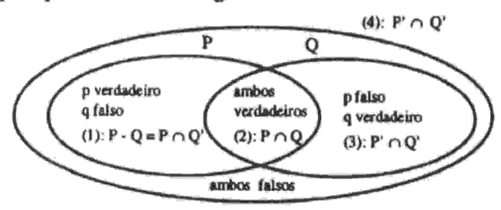

# UNIVERSIDADE ESTADUAL DE FEIRADE SANTANA DEPARTAMENTO DE CIÊNCIAS EXATAS

NEMOC - Núcleo de Educação Matemática OmarCatunda

Folhetim de Educação Matemática

Ano 2. n.37. Julho/95

Editores: Carloman e Inácio

Editoração e Impressão: Núcleo de Editoração Gráfica - NUEG

Endereço: Av. Universitária, s/n - Km 03 BR 116

Campus Universitário - Fax:(075)224-2284

CEP 44031-460 Feira de Santana-BA

## Objetivo

Este Folhetim é um veículo de divulgação, circulação de idéias e de estímulo ao estudo e à curiosidade intelectual. Dirige-se a todos os interessados pelos aspectos pedagógicos, filosóficos e históricos da Matemática. Pretende construir uma ponte para unir os que estão próximos e os que estão distantes.

### Comitê Editorial

Carloman Carlos Borges (Doutor) Inácio de Sousa Fadigas (Mestre) Wilson Pereira de Jesus (Mestre)

# PERGUNTE QUE O NEMOC RESPONDE

#### Editorial

O Pergunte que o NEMOC responde é de autoria do Prof. Dr. Carloman Carlos Borges e objetiva atingir ao público interessado em Matemática nos seus múltiplos aspectos.

Pergunta: Um colega de São Paulo, Buzolim, escreve: como deveria ser o ensino de Lógica no 2º grau ou mesmo na Universidade, no chamado ciclo básico?

R. A única convicção que tenho sobre o assunto é a seguinte: o ensino dessa ciência deveria ser bem diferente de como é ministrado atualmente na maioria dos casos: excesso de artificialismo e desligamento de outras disciplinas, particularmente, da Matemática. No caso em apreço acho que ela deveria ser estudada conjuntamente com a Teoria dos Conjuntos e a Teoria da Probabilidade. Exemplificando: como ser efetuado o casamento entre a Lógica e a Teoria dos Conjuntos? Uma alternativa: suponhamos já definidos (a) os operadores (ou conectivos lógicos). Isto pode ser feito por intermédio das tabelinhas-verdade; (b) definem-se as operações usuais entre conjuntos, igualmente, através das tabelinhas; então, define-se: para as proposições p,q,r,..., considerem-se os conjuntos P,Q,R,..., subconjuntos de U (conjunto universo) como conjuntos-verdade, respectivamente, dessas proposições; então,

à ~p (lê-se: não p) corresponde o conjunto-verdade (P)' (lê-se: complementar de p);

à $(p \land q)$ (lê-se: $p \in q$ ) corresponde o conjunto-verdade $(P \land Q)$ ;

à $(p \vee q)$ (lê-se: p ou q) corresponde o conjunto-verdade $(P \cup Q)$ ;

à implicação (p $\Rightarrow$ q) (lê-se: se p, então q) corresponde o conjunto-verdade (P - Q)', (lê-se: complementar de p menos q);

à equivalência (p⇔q) (lê-se: p se e somente se q) corresponde (P = Q).

Com as postulações acima, as regras de cálculo entre os conjuntos correspondem às regras de cálculo lógico. Exemplifiquemos com o diagrama abaixo:

A figura apresentada pode ser explorada em diversas direções; assim, é evidente que o conjunto-verdade da implicação é a reunião de (2), (3) e (4). Esta reunião é o complementar de ( $P \cap Q'$ ); logo, temos: conjunto-verdade da implicação = $(P \cap Q')' = (P' \cup (Q')') = (P' \cup Q)$ , donde se conclui que a proposição ( $p \Rightarrow q$ ) é equivalente a ( $p \lor q$ ). Ainda da figura: como (1) representa ( $p \cap Q'$ ), temos que ele é o conjunto-verdade da proposição ( $p \land p \lor q$ ), a qual (observe a figura), é a negação de $p \Rightarrow q$ .

Um método bastante útil no estudo de determinadas relações entre conjuntos consequentemente nas respectivas relações entre proposições é o proposto por F. Elis: as tabelas de pertinência, análogas às tabelas-verdade do cálculo proposicional em Lógica (vide, Teoria Intuitiva dos Conjuntos de Jair Minoro Abe e Nelson Papavero, Instituto de Estudos Avançados, USP/Mc Graw Hill). O método considera os símbolos: 1 e 0 (um e zero) como significando, respectivamente pertence ao conjunto e não pertence ao conjunto.

Alguns exemplos o ilustrarão:

c) Seja comprovar as regras: (A ∪ B)'= (A') ∩ (B'), (A ∩ B)'= (A') ∪ (B').
Uma simples tabelinha fará a comprovação solicitada:

| PQ  | P Q | (P \( \text{Q} \) | (P') | (Q') | [(P')^(Q')] | (Page | $(P \cap Q)$ | [('P')\_(Q')] |
| --- | --- | ----------------- | ---- | ---- | ----------- | ----- | ------------ | ------------- |
| 1 1 | 1   | 0                 | 0    | 0    | 0           | 1     | 0            | 0             |
| 1 0 | 1   | 0                 | 0    | I.   | 0           | 0     | 1            | 1             |
| 0 1 |     | 0                 | 1    | 0    | Ü           | 0     | 1            | 1             |
| 0 0 | 0   | 1                 |      | 1    | 1           | 0     | 1            | 1             |
|     |     | <u> </u>          |      |      |             |       | <u></u>      |               |

Em (b) mostramos que (U') = Ø (lê-se: complementar de U em relação a U é igual ao conjunto vazio) e (Ø') = U (lê-se: complementar do vazio em relação a U é igual a U). As regras mostradas em (c) se traduzem por: $\sim$ (p $\vee$ q) $\Leftrightarrow$ ( $\sim$ p) $\wedge$ ( $\sim$ q) (lê-se: não p ou q é equivalente a não p e não q, $\sim$ (p $\wedge$ q) $\Leftrightarrow$ ( $\sim$ p) $\vee$ ( $\sim$ q) (lê-se: não p e q é equivalente a não p ou não q. Estas regras

facilitam o cálculo na negação de relações complicadas.

Em toda esta exposição o conjunto universal U é o conjunto X dos números reais. Para um dado referencial, X, por exemplo, denomina-se forma proposicional com uma variável, definida sobre X, toda expressão contendo uma variável x e abreviada por p(x) (lê-se: $p \ de \ x$ ) (ou q(x), ou f(x),...) e da qual se obtém uma proposição, para todo valor dado a x pertencente a X. Exemplo: em N (conjunto dos naturais) seja a forma proposicional $x^2$ - 3x + 6 = 0; os valores que a transformam em proposição verdadeira são, claramente, 2 ou 3.

Pode-se, agora, introduzir a noção de quantificador:

- (i): Se para cada a de X, p(a) é verdadeira, escreve-se: $(\forall x \in X)$ (p(x)), que se lê: "para todo x elemento de X, p(x)". Veja como este quantificador conhecido como quantificador universal também, transforma uma forma proposicional em uma proposição. A introdução do outro quantificador (quantificador existencial) faz-se da seguinte maneira.
- (ii) se para um a ao menos, de X, p(a), é verdadeira, escreve-se
  (∃ x ∈ X) (p(x)), que se lê: existe ao menos um elemento x de X tal que p(x). Podemos resumir esta situação:
  - $(\exists x) p(x)$ significa que $P \neq \emptyset$ ;
  - (4/x) p(x) significa que P = X.

Como $P = \emptyset$ equivale a P' = X. obtem-se a regra: $\sim [(\exists x) p(x)] \Leftrightarrow (\forall x) (\sim (p(x)))$ . Como $P \neq X$ equivale a $P' \neq \emptyset$ , obtem-se a regra: $\sim [(\forall x) p(x)] \Leftrightarrow (\exists x) (\sim p(x))$ . Voltando à primeira figura, vimos que $(p \Rightarrow q)$ é logicamente verdadeiro se e somente se seu conjunto verdade é X, ou $(P - Q) = \emptyset$ . Ora, se (P - Q) é vazio, então $P \subset Q$ . Assim $p \Rightarrow q$ é logicamente verdadeiro, se e somente se, $P \subset Q$ . É evidente que se $P \subset Q$ , então $Q' \subset P'$ e reciprocamente, donde: $(p \Rightarrow q) \Leftrightarrow (\sim q \Rightarrow \sim p)$ . Isto significa que uma demonstração envolvendo a implicação $p \Rightarrow q$ , pode ser substituida pela demonstração da veracidade da implicação $\sim q \Rightarrow \sim p$ , o que, aliás, é muito usual em alguns tipos de demonstrações indiretas.

O resumo básico do exposto consiste no seguinte: a cada

proposição corresponde um conjunto-verdade e a cada conective lógico corresponde uma operação de conjunto. Os conjunto $P \cup Q$ , $P \cap Q$ , $P' \in (P - Q)'$ representam, respectivamente, o conjuntos-verdade das proposições $(p \vee q)$ , $(p \wedge q)$ , $(\sim p) \in (p \Rightarrow q)$ . A proposição p é logicamente verdadeira se e soment se seu conjunto-verdade é X.

Tudo o que acabamos de expor perde muito de seu valor se não for suficientemente contextualizado. Qual o significado de suficientemente contextualizado? Significa simplesmente isto para o estudante de matemática, o estudo da Lógica não é um finem si mesmo; ele deve servir, apenas, para convencer o aluno de veracidade daquilo a ser exposto, quando for o caso exemplificando, uma demonstração por absurdo, tão rejeitada no princípio e no fim, pelo aluno, deve ser precedida da corres pondente justificativa lógica; aqui, porém, a responsabilidad cabe ao professor pois, ele mesmo, nem sempre, conhece esti justificativa lógica. Ainda, como exemplo: seja o sistema,

(1)
$$\begin{cases} (x-2)(x-5) = 0 & (1') \\ x+y=8 & (1'') \end{cases}$$

Tem-se: (1') verifica-se se e somente se x = 2 ou x = 5. Se x = 2, (1") verifica-se se e somente se y = 8 - 2 = 6. Se x = 5 y = 8 - 5 = 3. Assim, o sistema (1) é verificado se e somente se (x,y) = (2,6) ou (x,y) = (5,3). Agora o suporte lógico do mecanismo acima. O sistema (1) pode ser escrito como,

(2)
$$(x = 2 \text{ ou } x = 5) \in (x + y = 8)$$

Se designarmos x = 2 de p, x = 5 de q, x + y = 8 de r, (2) é equivalente, logicamente, a $[(p \lor q) \land r]$ que por sua vez equivale a $[(p \land r) \lor (q \land r)]$ .

Ainda, os seguintes exemplos:

- a) Uma relação binária R sobre um conjunto P é reflexiva se: (∀x) (x R x); logo, ela é não reflexiva se: (∃x) (x~Rx).
  - b) Sendo (a, b, c elementos de N):
  - (a < b) ⇒ (a = b) tem por negação a < b. Realmente:

$(a < b) \Rightarrow (a = b) \Leftrightarrow (a \ge b) \lor (a = b) \Leftrightarrow (a > b) \lor (a = b)$ $\lor (a = b) \Leftrightarrow (a > b) \lor (a = b) \Leftrightarrow (a \ge b)$ . Logo, a negação de $(a < b) \Rightarrow (a = b) \Leftrightarrow$ a negação de $(a \ge b)$ que é (a < b).

## Exercícios Propostos

- c) $(a < b) \implies (a = a)$ tem por negação $a \neq a$ .
- d) $(a < b) \implies (a = a)$ tem por negação $c \neq c$ .
- c) (a < b) ⇒ (a > b) equivale a a ≥ b e tem por negação a < b.

Para encerrar, um contra-exemplo (aliás, exemplos devem vir sempre acompanhados de contra-exemplos). Após explicada a negação da implicação, considere a frase: "se você for ao cinema então eu fico com Carlos"; sua negação é: Você vai ao cinema e eu não fico com Carlos". Este e outros similares enunciados são apresentados ao aluno como bons exemplos ilustrativos dessa negação. Como se não bastasse, o professor ainda acrescenta: "vocês estão vendo como é importante a Lógica? Sem ela como iríamos fazer tal negação?". Ora bolas, qualquer criança negaria o enunciado, assim: "pode ir ao cinema que eu não vou ficar com Carlos, não". E, felizmente, sem nunca ter estudado a negação lógica de proposições, nossa criança seria muito bem compreendida.

## \* \* \* \*

No próximo número, as respostas para: Uma reta pode ser considerada uma curva?

\*\* \*\* \*\*

Aguardemi

IM PRESSO

SELO
