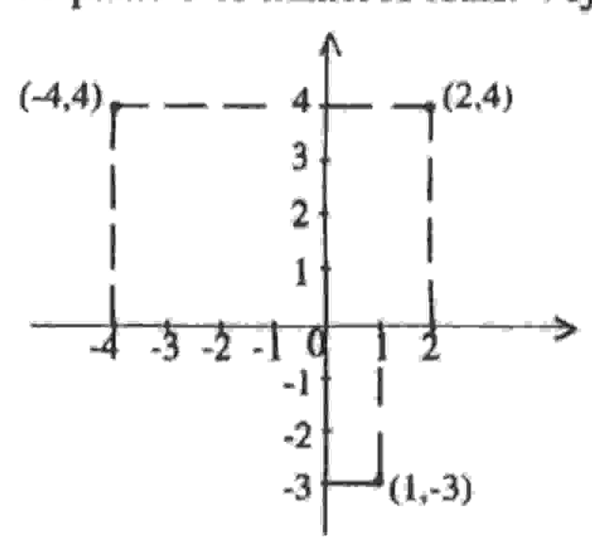
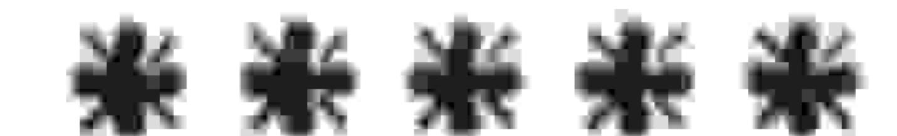

### UNIVERSIDADE ESTADUAL DE FEIRADE SANTANA DEPARTAMENTO DE CIÊNCIAS EXATAS

NEMOC - Núcleo de Educação Matemática OmarCatunda

Folhesim de Educação Masemásica

Ano 2. n.38. Julho/95

Editores: Carloman e Inácio

Editoração e Impressão: Núcleo de Editoração Gráfica - NUEG

Endereço: Av. Universitária, s/n - Km 03 BR 116

Campus Universitário - Fax:(075)224-2284

CEP 44031-460 Feira de Santana-BA

### Objetivo

Este Folhetim é um veículo de divulgação, circulação de idéias e de estímulo ao estudo e à curiosidade intelectual. Dirige-se a todos os interessados pelos aspectos pedagógicos, filosóficos e históricos da Matemática. Pretende construir uma ponte para unir os que estão próximos e os que estão distantes.

#### Comitê Editorial

Carloman Carlos Borges (Doutor) Inácio de Sousa Fadigas (Mestre) Wilson Pereira de Jesus (Mestre)

# PERGUNTE QUE O NEMOC RESPONDE

#### Editorial

O Pergunte que o NEMOC responde é de autoria do Prof. Dr. Carloman Carlos Borges e objetiva atingir ao público interessado em Matemática nos seus múltiplos aspectos. Pergunta. Ana Paula, pedagoga, do Rio de Janeiro, indaga se a reta pode ser uma considerada como uma curva.

R. Pode, Ana Paula, embora, à primeira vista isto contrarie o senso comum. Para que você possa entender melhor a resposta torna-se necessária a seguinte digressão. No século XVII, mais precisamente na primeira metade desse século surge um ramo inteiramente novo na matemática, denominada de Geometria Analítica. Embora toda criação científica obedeça a um processo histórico, isto é, nunca seja criação exclusiva de um só homem, o chamado gênio, atribui-se a René DESCARTES, latinizado como Cartesius (1596-1650), filósofo, físico e matemático francês, a criação da Geometria Analítica. O conceito básico desse novo ramo da matemática é o estabelecimento de uma correspondência entre pontos do plano e os números reais. Veja a figura abaixo:

Nesta figura temos dois eixos (duas retas orientadas nas quais foi fixado um ponto O de origem). Observe que a cada ponto (um ente geométrico) corresponde um par de números reais, sendo o primeiro elemento desse par designado abscissa e o segundo elemento chamado de ordenada do ponto P. Quando se fala em coordenadas de um ponto P no plano, faz-se referência a sua abscissa e a sua ordenada. Baseado numa idéia tão simples, Descartes sugeriu que, dada uma equação algébrica F(x,y) = 0, x e y fossem, respectivamente considerados como a abscissa e a ordenada de um ponto. Dessa forma, Descartes procurou traduzir uma curva do plano por uma equação algébrica com duas variáveis e, assim, ligou a Geometria com a Álgebra. Como uma

reta pode ser traduzida por uma equação algébrica com duas variáveis: Ax + By + C = 0, na qual A, B, C são números e A e B não são ao mesmo tempo, nulos, nada mais natural do que considerá-la como uma curva. Claramente, Ana Paula, nos primeiros anos escolares não se deve, em meu entendiemnto, insistir junto a criança que uma reta é uma curva pois isto a afastaria do senso comum fora do tempo...

O tratamento de problemas gométricos com os recursos da álgebra e da análise - objeto da Geometria Analítica - significa um importante progresso metodológico. Foi justamente essa nova técnica que abriu para os matemáticos novas e promissoras perspectivas na resolução de velhos problemas que desafiaram dezenas de gerações de ilutres matemáticos. A propósito, basta lembrar os três problemas clássicos da antiguidade: quadratura do cículo, duplicação do cubo, trissecção do ângulo. Formulados no século V a.C., estes três problemas somente foram resolvidos mais de 2200 anos depois. Talvez a maior contribuição dos gregos antigos ao desenvolvimento do conhecimento tenha sido a de proporem problemas interessantes como os três mencionados. Na história da ciência, assume importância capital a formulação de tais problemas e, segundo um dos grandes sábios deste século, Einstein, eles são mais importantes do que a sua resolução. Realmente não há regras na formulação de bons problemas, enquanto para a sua resolução exista já uma metodologia. Na aprendizagem, saber propor questões interessantes deveria ser uma etapa anterior à solução mecânica dos problemas. O método analítico inventado por Descartes serve de base para a invenção da noção de função e do cálculo infinitesimal no mesmo século XVII. Ao obter sucesso na tradução de problemas geométricos por intermédio dos números, Descartes sonhou mais alto: a unificação não só do conhecimento científico como de todo conhecimento, por intermédio da razão. Baseado na matemática, Descartes criou a corrente filosófica denominada de racionalismo. Segundo esta corrente, o verdadeiro saber não pode ser inferido da experiência e suas generalizações; ele é extraído do próprio entendimento: as idéias fundamentais do ser humano são inatas.

Como escrevem Philip J. Davis e Reuben Hersh em O Sonho de Descartes: A visão de Descartes transformou-se num novo espírito. Duas gerações mais tarde, o filósofo e matemático Leibnitz se referia à característica universalis. Era um sonho de "um método universal, pelo qual todos os problemas humanos, fossem científicos, legais ou políticos, pudessem ser tratados racional e sistematicamente, através de uma computação lógica.

Ninguém pode negar que uma das singularidades do atual conhecimento humano seja a sua matematização; porém, inferir daí que tudo pode ser matematizado é um sonho que provavelmente jamais será realizado.

### \*\*\*\*\*\*\*\*\*\*\*\*\*\*\*

Obs.: É permitida a reprodução total ou parcial desse folhetim desde que citada a fonte.

Caso você tenha interesse em receber esta publicação escreva para o NEMOC.

## 米米米米

Números atrasados - envie para cada folhetim um selo de postagem nacional de 1º porte. Dentro de no máximo quatro semanas, contadas a partir da data de recebimento do seu pedido, você estará recebendo os folhetins solicitados.

### **米米米米米**

No próximo número, a resposta para:

Algumas regras que ajudam você a tornar-se um bom professor de Matemática.

Aguardemi

#### Noticias:

O Programa Terça em Ponto, que vai ao ar às terças-feira das 20:00 às 20:30 h pela Rádio Sociedade de Feira de Santar - AM, 970 kHz, está divulgando através de leitura radiofônio o livro O Homem que Calculava de Malba Tahan.

# Não percam!

SE