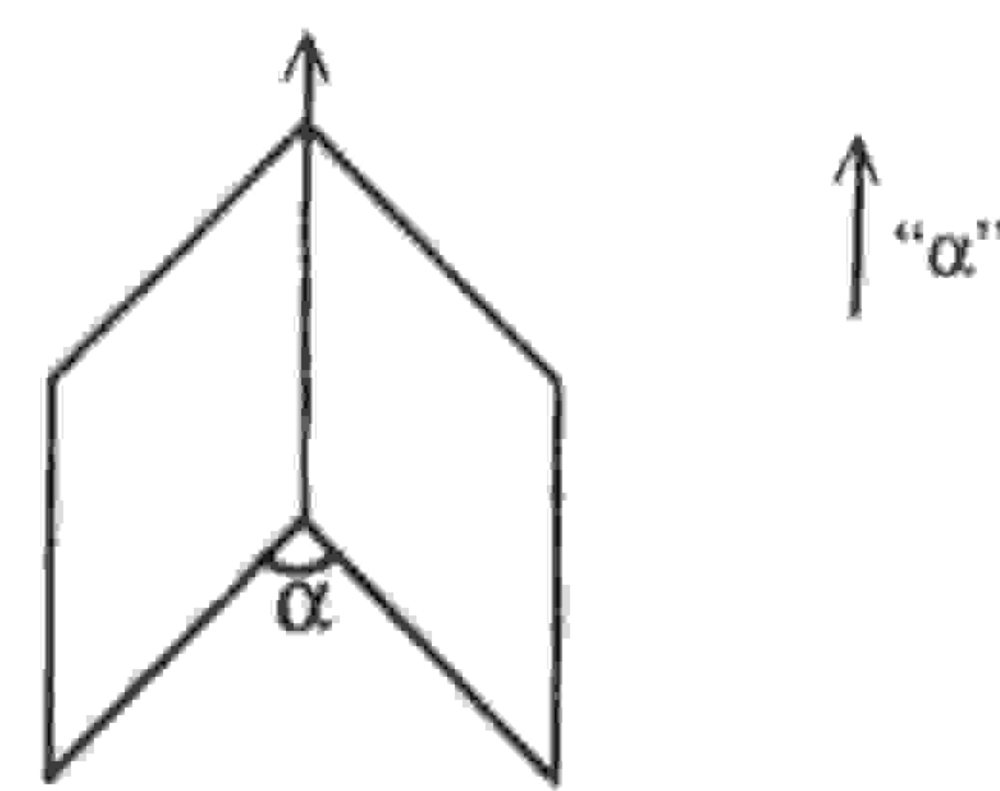

## UNIVERSIDADE ESTADUAL DE FEIRADE SANTANA DEPARTAMENTO DE CIÊNCIAS EXATAS

NEMOC - Núcleo de Educação Matemática Omar Catunda

Folhetim de Educação Matemática

Ano 3. n.41. Agosto/95

Editores: Carloman e Inácio

Editoração e Impressão: Núcleo de Editoração Gráfica - NUEG

Endereço: Av. Universitária, s/n - Km 03 BR 116

Campus Universitário - Fax:(075)224-2284

CEP 44031-460 Feira de Santana-BA

### Objetivo

Este Folhetim é um veículo de divulgação, circulação de idéias e de estímulo ao estudo e à curiosidade intelectual. Dirige-se a todos os interessados pelos aspectos pedagógicos, filosóficos e históricos da Matemática. Pretende construir uma ponte para unir os que estão próximos e os que estão distantes.

#### Comitê Editorial

Carloman Carlos Borges (Doutor) Inácio de Sousa Fadigas (Mestre) Wilson Pereira de Jesus (Mestre)

# PERGUNTE QUE O NEMOC RESPONDE

#### Editorial

O Pergunte que o NEMOC responde é de autoria do Prof. Dr. Carloman Carlos Borges e objetiva atingir ao público interessado em Matemática nos seus múltiplos aspectos. 1º Pergunta. José Nilson da Silva, morador na Avenida Princesa Leolpodina, 56 bairro da Graça em Salvador apresenta algumas dúvidas: (a) uma grandeza física que tenha direção, sentido e um tamanho, é uma grandeza vetorial? (b) há diferença entre circunferência e círculo?

R. Quanto ao item (a) a resposta é negativa. Imagine você o caso das rotações finitas em torno de eixos diferentes. Seja a rotação alfa ao redor de um dos eixos; você pode imaginar o vetor  $\vec{\alpha}$ , considerando a rotação  $\alpha$  na direção do eixo e com o tamanho dado pelo ângulo  $\alpha$  de rotação; quanto ao sentido  $\vec{\alpha}$  considere o sentido de rotação, tendo por referencial a flecha de  $\vec{\alpha}$  como anti-horário. Temos, assim,  $\vec{\alpha}$  com um tamanho, direção e sentido bem determinados sem, todavia ser um vetor pois não satisfaz à comutatividade.

Um ente matemático para ser considerado um vetor, além de possuir tamanho, direção e sentido, ele deve satisfazer algumas leis como a associatividade, a comutatividade e aquelas outras mencionadas exaustivamente nos manuais de Álgebra Linear. Estas leis ou axiomas servem de ponto de partida para a dedução de outro tipo de proposição denominado de teorema. Quando introduzimos um ente matemático por intermédio de termos primitivos (aqueles termos que não se definem), e de axiomas e daí elaboramos definições e teoremas (proposições que devem ser demonstradas) - estamos trabalhando na cumeeira da Matemática. É desta maneira que se organiza o saber matemático e, esta maneira de organização denomina-se axiomática. Como foi esclarecido acima, há dois tipos de proposições fundamentais na Matemática: os axiomas (proposições iniciais que não se demostram) e teoremas (proposições que devem ser demonstradas). Com relação à axiomática

mencionada (a que trata dos vetores), é interessante observar que o axioma da comutatividade: a + b = b + a, decorre dos outros axiomas e da unicidade do vetor oposto. Vejamos: (a + b) - (b - a) == a + b + (-1)(b + a) = a + (b - b) - a = a - a = 0, donde, b + a = a= a + b. Isto não deveria acontecer, pois viola um dos princípios de uma boa axiomática: a independência entre seus axiomas isto é, um axioma não pode ser demonstrado baseado nos demais axiomas de uma mesma teoria, pois, então, ele deixaria de ser um axioma passando a ser um teorema. O princípio de independência dos axiomas também é violado na axiomática da Macânica de Newton; alguns manuais costumam postular a mecânica de Newton considerando como axiomas a primeira lei (sem ação de forças, uma partícula não pode mudar seu estado de repouso ou de movimento); a segunda lei (que estabelece a conexão entre a aceleração da partícula e a força que produz o movimento); e a terceira lei (quando duas partículas exercem forças entre si, essas forças são iguais em módulo, têm a direção da reta que une as duas partículas e são de sentidos opostos). Pois bem, se na segunda lei você considerar F = 0, mostrará, facilmente que a primeira lei decorre desta. Quanto ao item (b): se você examinar Geometria Moderna, de Moise Downs, verá que este conhecido autor estabelece diferença entre circunferência e círculo, sendo esta a região limitada por aquela linha. Veja sua definição de círculo: é a reunião de uma circunferência e seu interior (região circular ou disco). Os autores da antiga União Soviética costumam empregar a palavra circunferência para a linha; alguns autores franceses consideram o círculo como a linha sem mencionarem a palavra circunferência. Complicado? Qual a conclusão à qual devemos chegar? Como não há consenso entre os especialistas, siga uma dessas duas direções com a condição de não entrar em contradição com a escolhida. Para saber mais sobre o assunto recomendo Meu Professor de Matemática e outras histórias, de Elon Lages Lima - livro de leitura fácil, agradável e altamente instrutivo.

2ª Pergunta. O mesmo leitor da questão anterior quer saber a razão pela qual a forma circular é considerada perfeita.

R. A designação de perfeição à forma circular envolve mais

questões místicas e filosóficas e menos questões matemáticas. A Matemática estuda formas geométricas sem preocupação com supostas perfeições. A História da Ciência nos mostra um fato interessante: o movimento circular uniforme predominou em todas as cosmologias, de Platão até Copérnico (inclusive). Em um de seus diálogos, Timeu, aquele filósofo escreve: Quanto à forma, concedeu-lhe a mais conveniente e natural. Ora, a forma mais conveniente ao animal que deveria conter em si mesmo todos os seres vivos, só poderia ser a que abrangesse todas as formas existentes. Por isso ele torneou o mundo em forma de esfera, por estarem todas as suas extremidades a igual distância do centro, a mais perfeita das formas e mais semelhante a si mesma, por acreditar que o semelhante é mil vezes mais belo do que o dessemelhante (o grifo é nosso). No livro I do De Revolutionibus, Copérnico escreve: ... seja porque essa forma é a mais perfeita de todas, seja porque é a forma cuja capacidade é a maior e a que convém melhor para tudo conter e tudo abranger. Com Kleper foi iniciada a derrubada do mito da circularidade; porém, o fim dessa derrubada deu-se com o princípio da inércia. Mas qual o porquê dessa preferência multimilenar pela forma circular? Os antigos consideravam o movimento circular uniforme como sempre idêntico a si mesmo e desta maneira, sem alterações, eterno. A própria cosmologia de Aristóteles, o sistematizador da lógica clássica, postulava o Universo é finito esférico, limitado pela esfera do céu... O movimento circular uniforme sempre idêntico a si mesmo pode ilustrar, para este sábio, a lei lógica da identidade. A ausência de mudanças nesse movimento perfeito, é condizente com igual ausência de alterações no regime social da época - o escravismo. Até mesmo Galileu postulava que a ordenação ideal do Universo somente poderia ser feita através do repouso ou pelo movimento circular... Por intermédio de Salviati, o ilustre sábio fala: Podemos concluir racionalmente, parece-me, que a condição suficiente para manter uma ordem perfeita entre as partes do mundo é a de que os corpos móveis se movam circularmente... pois somente o repouso e o movimento

circular são aptos à conservação da ordem. Baseado no princípio da inércia de Galileu (se sobre um corpo não se exercem ações exteriores, o mesmo pode mover-se com qualquer velocidade constante ou encontrar-se em estado de repouso), Newton deu a solução completa para o problema básico da dinâmica (descobrir a lei que liga as forças e o movimento). Esta solução, hoje, é conhecida pela primeira lei de Newton, mencionada acima. Este fascinante capítulo da história da ciência mostra como, para o ser humano, é difícil libertar-se de uma idéia preconceituosa, mesmo que ela o leve à sua própria destruição e à de seus semelhantes.

## 张 张 张 张

Obs.: É permitida a reprodução total ou parcial desse folhetim desde que citada a fonte.

Caso você tenha interesse em receber esta publicação escreva para o NEMOC.

# \*\* \*\* \*\*

Números atrasados - envie para cada folhetim um selo de postagem nacional de 1º porte. Dentro de no máximo quatro semanas, contadas a partir da data de recebimento do seu pedido, você estará recebendo os folhetins solicitados.

# \*\* \*\* \*\*

No próximo número, as respostas para:

Diversos professores de várias regiões do País têm nos solicitado a indicação de alguns livros para composição de uma pequena biblioteca.

**张 张 张 张** 

Aguarden!

MIPRESSC