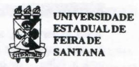
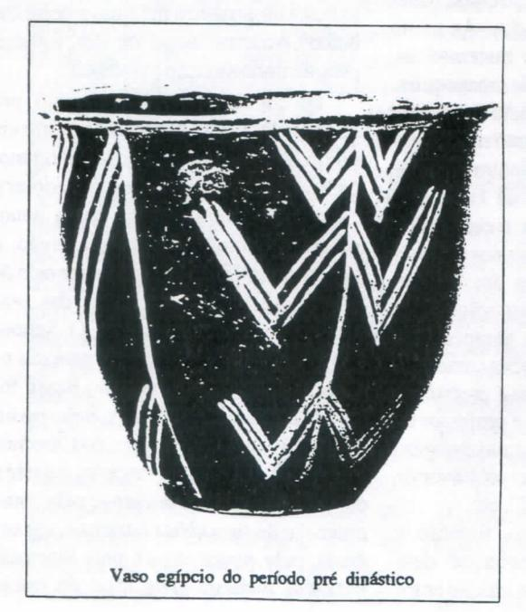

# FOLHETIM DE EDUCAÇÃO MATEMÁTICA

Ano 3 - número 45 - Folhetim de Educação Matemática - Departamento de Ciências Exatas

Dezembro/1995

# O ENSINO DA MATEMÁTICA\*

Carloman Carlos Borges

# Objetivo

Este Folhetim é um veículo de divulgação, circulação de idéias e de estímulo ao estudo e à curiosidade intelectual. Dirige-se a todos os interessados pelos aspectos pedagógicos, filosóficos e históricos da Matemática. Pretende construir uma ponte para unir os que estão próximos e os que estão distantes.

### **Editorial**

A partir deste número resolvemos mudar a apresentação gráfica do *Folhetim*, visando a um maior conforto para os nossos leitores.

Esse número em especial, traz uma conferência do professor Carloman Carlos Borges, proferida em agosto de 84 e, ainda muito presente, tendo em vista a atualidade do tema.

Com esse formato o Folhetim passa a ser mensal. Estamos estudando algumas mudanças para diversificar as informações que veiculamos.

# Comitê Editorial

Carloman Carlos Borges (Doutor) Inácio de Sousa Fadigas (Mestre) Wilson Pereira de Jesus (Mestre) 1. Introdução

Sem dúvida alguma o ensino da Matemática se debate em uma crise pro-funda. Claro que podemos generalizar a-crescentando que essa crise abarca todo o ensino em geral. Contudo, parece-nos, é no setor da matemática onde sentimos mais a gravidade desse problema. Na maioria das classes de estudantes do 1º e 2º graus comprova-se, estatisticamente, uma percentagem de mais de 60% de alunos que não gostam de Matemática. Até mesmo entre crianças que ainda não ingressaram no curso primário e, por conseguinte, não tiveram nenhum contato com a Matemática, pode-se notar esse tipo de aversão. A Matemática - pelo menos até a graduação plena - surge aos olhos do aluno muitas vezes como uma pura magia, plena de "armadilhas", truques mirabolantes, e outros quejandos. As assim chamadas demonstrações matemáticas, muitas delas possuidoras de uma arquitetura lógica por si mesmo cheia de beleza e fascinação provocam mesmo nos alunos que estão cursando licenciatura plena de Matemática uma mistura de incompreensão e pavor. Vejam bem: o espanto e o pavor são provocados em alunos que brevemente serão professores dessa disciplina. É fácil prever a propagação desses sentimentos negativos de geração para geração. São comuns posições como tais: "para gostar de Matemática é preciso ter sangue no olho "; "ah! Ele é professor de Matemática, então, possui uma inteligência fora do comum"; "eu ser professor de Matemática? Deus é mais!", etc.

O eminente psicólogo, filósofo e educador Jean Piaget acredita ter descoberto uma profunda aproximação entre

o pensamento humano e os processos matemáticos. De acordo com ele(1) as estruturas lógicos-matemáticas estão subjascentes à ação do sujeito. Assim, nenhum conhecimento físico e nenhuma aprendizagem possuem possibilidades à margem dos esquemas lógico-matemáticos. Na análise dos processos cognitivos, Piaget partiu dos modelos da Matemática(2) concluindo, após diversos anos de pesquisas pela aproximação desses processos com os modelos mencionados. Será que de tudo isso, estaremos conformes ao pensamento desse eminente sábio, afirmando ser a aprendizagem da Matemática por parte da criança muito mais fácil do que se supunha anteriormente às pesquisas piagetianas? Se esta conclusão é verdadeira, como adequá-la à realidade exposta no primeiro parágrafo desse trabalho? Aparentemente ou não, estamos perante uma situação paradoxal.

Há alguns anos atrás surgiu nos Estados Unidos da América do Norte um movimento que se auto-denominou movimento moderno, visando a reelaborar o ensino da Matemática em bases denominadas de modernas; surgiu, então, a Matemática Moderna e uma en xurrada de livros modernos tomou conta das prateleiras de nossas livrarias. O School Mathematics Study Group organizou uma série de textos que aqui no Brasil foi publicada pela Fundação Brasileira para o Desenvolvimento do Ensino das Ciências. Firmou-se o seguinte princípio: o ensino da Matemática deve iniciar-se pela compreensão de suas idéias básicas e, em seguida, pela aquisição de suas técnicas. Passados mais de vinte anos do início

dessa experiência, a crise permanece e assume um caráter desesperador. Onde está a falha - se houver - do School Mathematics Study Group? Não parece plausível iniciar-se o estudo de uma disciplina pela exposição de suas idéias fundamentais? Hoje em dia, com o avanço da tecnologia, grande parte operacional da Matemática pode ser desenvolvida pelas máquinas. Uma maquinazinha dessas de bolso, resolve além das quatro operações fundamentais, radiciação, exponenciação, logaritmação e até mesmo calcula derivadas e integrais. Algumas mais sofisticadas resolvem problemas relacionados com algumas equações diferenciais ordinárias. A falha - caso exista - daquele mencionado grupo, formado por ilustres matemáticos, pode ser encontrada onde? Em seu princípio pedagógico - o fundamental no ensino de uma disciplina consiste na ênfase às suas idéias básicas - ou na operacionalidade desse princípio? A fim de não nos emaranharmos numa teia de dúvidas e interrogações, deixemos claro o fato insofismável: a assim chamada Matemática Moderna foi um fracasso. A propósito, quem ainda não leu o livro do eminente matemático americano Kline:O Fracasso da Matemática Moderna?

Para fins de ilustração e somente pa-

ra esses fins, vamos abrir um desses livros de *Matemática Moderna* na parte de *lógica matemática*. Quais são as proposições dadas ao alunado (geralmente numa faixa etária de 11/15 anos) a fim de serem estudadas *logicamente*? Escolhamos ao acaso algumas delas:

Se Pedro vai à escola, então a lua é redonda;

2) Se o queijo é branco, então a Terra é um planeta.

A multiplicação desses exemplos poderia prolongar-se muito mais, e sua análise pode suscitar em nossos espíritos dúvidas até mesmo angustiantes: será que, a reunião em uma mesma proposição de frases pertencentes a conjuntos semânticos disjuntos, não poderá acarretar perturbações mentais a crianças pertencentes a uma faixa etária suscetível a ilusões?

E os terríveis problemas sobre o conjunto vazio? Ainda hoje vemos professores esgotarem uma Unidade apenas com o ensino da *Teoria dos Conjuntos*. Parece-nos que a denominada Matemática Moderna sobrecarregava as crianças de muitas e muitas idéias novas que historicamente precisaram de vários anos para serem incorporadas ao patrimônio matemático: por outrolado, ela foi colocada

nas escolas sem uma preparação adequada dos professores, a maioria dos quais formada na antiga Matemática.

Todos sabemos que a resolução de um problema qualquer abrange diversas etapas. Vamos nos fixar em um problema matemático. Quando ele tem início? Como resolvê-lo? As idéias gerais implícitas em um problema matemático se encontram também em qualquer outro problema enfrentado pelo ser humano, quer nas outras diversas ciências, quer em sua vida cotidiana? Um problema matemático não é um problema sui generis, sem nenhuma analogia com os demais dentro dos quais o ser humano está envolvido? Agora

estamos diante do seguinte problema: o ensino da Matemática. Como enfrentá-lo? Oual o plano para a sua resolução? Veja bem: a realidade nos impõe uma problemática, em nosso caso, a profunda crise no ensino da Matemática. Ante essa situação penosa à sensibilidade de qualquer educador, como podemos proceder? Podemos raciocinar das seguintes maneiras diferentes: bem, não se pode fazer nada, o melhor é deixar assim mesmo; o problema não é tão sério como aparenta; logo, com um pouco de boa vontade ele será resolvido: trata-se de uma situação de extrema gravidade perante a qual não devemos nos omitir. São três atitudes típicas do ser humano quando se defronta ante uma dificuldade. A omissão total, a omissão parcial ou solução conciliatória (o chamado jeitinho brasileiro) e, finalmente, o enfrentamento puro e simples. Embora a última atitude seja a mais rara, ela é, em contrapartida, a mais saudável, pelo menos no caso em foco.

# 2. A aprendizagem em Matemática

O enfrentamento do problema levantado na introdução acima exige, naturalmente, alguns pré-requisitos. Após a identificação da dificuldade - primeira etapa da resolução - uma segunda etapa consistirá no reconhecimento de todos os recursos a serem postos em marcha para a resolução do problema. Uma pergunta logo se impõe: como se processa a aprendizagem em Matemática? Claramente, a aprendizagem em Matemática, como em qualquer outra ciência faz parte da aprendizagem geral do ser humano e se encontra ligada à própria sobrevivência, isto é, o primeiro tipo de aprendizagem do ser vivo se relaciona com sua adaptação ao seu contorno, ao meio no qual está imerso, sem o que não poderá sobreviver. Daí, parece ser razoável encarrar o problema da aprendizagem em Matemática, não de uma perspectiva específica (como acontece, por exemplo com a Didática Especial da Matemática), porém, de um panorama mais amplo e mais abrangente. Não deixa de ser uma situação curiosa a seguinte: o professor lidando diuturnamente com o conhecimento, sem,

contudo, possuir uma epistemologia, isto é, uma teoria de conhecimento capaz de iluminar seu próprio caminho dentro dos próprios fundamentos de sua ciência. Assim, não acreditamos que o simples domínio, por parte do professor, de algumas técnicas educacionais - tão propagadas hoje em dia, através dos chamados cursos de reciclagem - possam responder às expectativas que envolvem um ensino de boa qualidade. Estamos todos de acordo: o problema do ensino, particularmente do ensino em Matemática é um problema vertical e, assim, dispensa paliativos e exige medidas amplas e profundas. Exige, inicialmente, novas posturas dos professores, a maioria dos quais está apegada a um método tradicional e superado de apresentar tanto o conteúdo como a metodologia do ensino da Matemática. Ora, novas atitudes implicam em mudanças mentais e essas mudanças provocam resistências inerciais nem sempre ultrapassadas pelos que nelas estão mergulhados. A história da ciência é bem elucidativa a esse respeito. Basta lembrar, aqui, as palavras de Max Planck (1858 - 1947) o eminente sábio alemão, um dos criadores da Mecânica Quântica: As grandes idéias científicas em geral não conquistam o mundo mediante a adesão de seus adversários, os quais terminariam por convencer-se de sua verdade e por adotá-las. Sempre é raro que um Saulo se converta em Paulo. O que acontece é que esses adversários acabam por morrer e a geração em ascensão se educa no clima da idéia nova. Quem possui a juventude possui o porvir. (apud Álvaro Vieira Pinto: Ciência e Existência 2ª ed., Rio de Janeiro, Paze Terra, 1979, p.58). Curioso acrescentar que, em sua autobiografia, Max Planck escreve que ele mesmo tentou adaptar sua fórmula referente ao quantum elementar de ação, à física clássica; isto é, o próprio criador de algumas idéias novas, não reconheceu que a introdução do quantum mencionado abriria caminho para a física atômica e seus desdobramentos.

A consciência do homem não é algo parado, estático, porém, dinâmico; o dinamismo da consciência pode ser comprovado em um processo educacional condizente com as pesquisas modernas da ciência. A aprendizagem é efetuada pela modificação da consciência do homem no seu relacionamento com o mundo.

Recapitulemos as linhas gerais de nosso trabalho até aqui. Inicialmente, constatamos a existência de uma séria crise no ensino da Matemática, crise não somente nossa, mas de outros países mais adiantados que o nosso. A reflexão desse problema, nos trouxe à lembrança algumas tentativas já feitas para solucioná-lo, como foi o caso da chamada Matemática Moderna. Em seguida fomos levados ao problema da aprendizagem da Matemática. Novamente uma reflexão sobre ele mostrou-nos que algumas das técnicas a ele ligadas não deram ainda os resultados almejados. Continuando a refletir sobre o assunto, fomos levados naturalmente a um problema mais geral e abrangente: a teoria do conhecimento.

# 3. Matemática e teoria do conhecimento

É o conhecimento matemático diferente dos demais conhecimentos? Para melhor responder a essa pergunta, pensamos ser necessário a formulação de outras interrogações e suas correspondentes tentativas de elucidação.

Que é o conhecimento? Acreditamos que o conhecimento está ligado ao problema da sobrevivência. Inicialmente, partimos da premissa de que o conhecimento é uma reação dialética entre o ser vivo e o seu contorno, visando à sobrevivência daquele. Como essa relação é dialética, existe uma ação do contorno para o ser vivo e outra ação deste para aquele. É natural concluir portanto: o conhecimento está ligado à vida. Mais ainda: é através dele que o ser vivo sobrevive, isto é, adapta-se ao seu contorno. Por conseguinte: o conhecimento é vida e é poder, este, para transformar o mundo e, nessa transformação, transformar a vida com a aquisição, pela consciência, de novos estados de percebimento. Ora, sendo a Matemática uma parte do conhecimento, ela é vida e é

poder, no sentido acima indicado.

A formação de conceitos matemáticos obedece às mesmas regras verificadas quando da formação de conceitos não pertencentes ao domínio dessa ciência. Ilustremos a afirmativa com a elaboração de dois conceitos tais como cor e número. sendo este último um dos conceitos básicos da Matemática. Para fixar idéias, particularizaremos a cor preta e o número cinco. Nesse processo podemos distinguir três fases. A primeira é resolvida através de frases assim: como um corvo, tantos como a mão; em seguida, temos pedra negra, cinco árvores e, finalmente, surge negro e o número cinco, aquele primeiro conceito para significar a propriedade geral de todas as coisas possuidoras da mesma cor do corvo e este último significando, igualmente, a propriedade geral a todos os conjuntos que possuem tantos elementos como a mão(\*) . Nota-se aí, como na formação geral do conceito, a idéia a este subjacente de classe de equivalência, isto é, a todo conceito corresponde a sua classe de equivalência, sendo a formação desta uma operação natural da mente humana.

Notemos como o conhecimento novo, isto é, a formação dos conceitos negro ecinco parte em primeiro lugar de um problema e de sua negação. Nas duas etapas iniciais o homem dirige-se para o desconhecido, formado por negro e cinco, sempre a partir do conhecido, no caso, corvo e mão. Não é preciso acrescentar que isso é verificado em toda a esfera do conhecimento humano. Pensamos ser importante ressaltar ainda mais o seguinte: as duas primeiras fases acima mencionadas caracterizam o estado de consciência, no qual o ser humano, por não possuir sufuciente abstratividade. não conseguiu até então, a separação entre a idéia e o objeto. O homem ainda não possui a capacidade de formar classes de equivalência. Pois encontra-se no estágio em que a sua consciência comeca o seu despertar e a sua longa marcha até a autoconsciência. A formação do con-

(\*)vide Aleksandrov, A. D. y otros La matemática: su contenido, métodos y significado 7\* ed., Madrid, Alianza, 1985 p. 24-25.

ceito de número - um dos pilares da Matemática - já se inicia, assim, juntamente com o início da consciência humana.(3)

Todo novo conhecimento trás dentro dele mesmo uma negação e nasce sempre de uma situação problemática. As diversas generalizações do conceito de número, de origens tão humildes, são bem elucidativas a esse respeito. Inicialmente, temos os números naturais: 1, 2, 3, 4,... formados na atividade social do homem, mais especificamente, nas atividades do homem primitivo relacionadas com o problema da contagem. Depois, com o surgimento das operações algébricas, o número sofreu novas extensões: números fracionários, números reais, números complexos, cada extensão proveio da negação de uma impossibilidade. Assim, por exemplo o número negativo nasceu da negação da impossibilidade de efetuar-se qualquer subtração no domínio dos números naturais; o número fracionário nasceu da negação da impossibilidade de expressarse toda medida através de números naturais. Fato importante na criação de novos números é aquele relacionado com os números irracionais, isto é, números que não podem ser expressos como razão entre dois números inteiros. Esta criação está ligada à primeira crise histórica da ciência grega. Até então os gregos, através de Pitágoras e seus discípulos afirmavam: todas as coisas têm um número e nada se pode compreender sem o número. Número na frase acima significa: número racional positivo, isto é, os números naturais e os números fracionários. Com o problema da medida de segmentos surgiu a necessidade de compará-los entre si, devendo esta ser expressa por um número racional positivo, uma vez que todas as coisas têm um número... . Ora, os gregos descobriram a incomensurabilidade (ausência de medida comum) entre a medida da hipotenusa de um triângulo retângulo isósceles tendo como unidade um dos catetos desse triângulo. Neste caso, a medida é expressa por um número irracional, até então, desconhecida dos gregos. É curioso observar que nessa grande crise da ciência grega teve papel predominante o próprio Teorema de Pitágoras. Podemos assinalar ainda que nessa importante descoberta matemática um papel decisivo coube ao princípio da compatibilidade lógica.

Em toda a história da ciência, quer se trate de Matemática, Física, Química, etc., o processo da criação de novos conhecimentos é idêntico: inicialmente surge uma dificuldade (que não precisa ser necessariamente prática) e, com a negação desta, surge um novo conhecimento. As implicações metodológicas desse fato devem ser explicadas exaustivamente por todos os professores e servem de advertência para aqueles que transformam suas aulas em tediosos monólogos.

Uma das idéias mais simples e primitivas do ser humano é a idéia de correspondência biunívoca, a qual pode ser notada até em certos vertebrados superiores. (4) Era baseado nela que o homem primitivo contava sem empregar o número que ele ainda não conhecia. Essa idéia é muito bem popularizada pelo aforismo popular um lugar para cada coisa, cada coisa no seu lugar. Quando o pastor de ovelhas, na antiguidade, saia com seu rebanho de ovelhas, com ele levava um saco de pedrinhas: a cada animal fazia corresponder uma pedrinha e cada pedrinha fazia corresponder uma ovelha. Observe como esse emparelhamento repousa sobre o número dois, isto do nosso ponto de vista pois o pastor desconhecia a existência de qualquer número; este se originou da idéia de correspondência, a qual, de origem tão humilde, porém de uma importância singular na história da Matemática. Apesar de conhecida desde uma época imemorável. somente recentemente foi elaborada na Teoria dos Conjuntos do matemático Cantor (1845 - 1918), o que parece confirmar a tese de Aristóteles quando afirmava que o primeiro na realidade, é o último no conhecimento e vice-versa, o primeiro no conhecimento é o último na realidade, tese, aliás, igualmente sustentada por Piaget.

A idéia do zero, sua criação, foi uma

das maiores aventuras da razão(5). Como explicar que nenhum sábio da Grécia antiga o tenha inventado? Gênios extraordinários como Pitágoras, Euclides, Tales de Mileto, Aristóteles, etc., não foram capazes de criá-lo. Por que? Mário Schenberg, em seu belíssimo livro Pensando a Física, levanta a seguinte conjectura: os filósofos gregos, em geral, rejeitavam a idéia do vazio, a qual, todavia, sempre desempenhou um papel fundamental na Índia. Para os hindus todas as coisas se moviam no vazio, que eles identificavam com Deus. Ora, como sabemos, foram os hindus os inventores do zero. Parece termos aí um exemplo da influência de idéias religiosas no desenvolvimento da ciência. Aliás, a história da Física, somente para exemplificar, apresenta essa relação entre idéias religiosas e idéias científicas. Consideremos as idéias de amor e ódio originárias talvez do hermetismo egípcio. Segundo Mário Schenberg ela tornou-se muito importante na história da Ciência. Na Mecânica Clássica de Newton, o amor é interpretado como força de atração e o ódio como força de repulsão.

A maior invenção ocorrida na História da Matemática aconteceu no século XVII: a criação do Cálculo Diferencial e Integral, simultaneamente criado por Newton e Leibniz. Com essa extraordinária criação, os processos infinitos, o eterno devenir dos fenômenos da natureza penetram profundamente na Matemática. Pode-se mesmo afirmar que se iniciou com o Cálculo a domesticação do infinito, idéia que sempre fascinou e perturbou os sábios da Grécia antiga. Na história da Ciência, acontecem coisas realmente curiosas. Embora os germens do Cálculo remontem à época de Arquimedes (287-212 a.C.) o qual, com ométodo de exaustão já exibia os elementos básicos do Cálculo, foi somente no século XVII que essas idéias explodiram por assim dizer. Vejam quanto tempo isso demorou! É também curioso assinalar o seguinte: criado o Cálculo, por Leibniz e Newton, ele foi usado intensamente por todos os matemáticos durante um largo espaço de tempo sem maiores preocupações de rigor; somente no século XIX por obra de Cauchy, Weierstrass e outros matemáticos, o Cálculo foi expurgado de muitas noções obscuras. Isso nos sugere que, na criação científica, o rigor tem pouco papel a desempenhar; que cabe à intuição e não à Lógica, o impulso verdadeiramente criador; que a fecundidade liga-se muito mais à necessidade e muito menos à Lógica; que, finalmente, as teses do positivismo lógico não são confirmadas pela História da Ciência.

A origem dos princípios fundamentais de qualquer ciência ainda é um problema em aberto. Como explicar, por exemplo, a intuição de Platão (428-348 a.C.) sobre a possibilidade de limitação do conhecimento humano quando se trata de fenômenos físicos simultâneos? Ora, tal possibilidade somente foi confirmada cientificamente no século XX pelo princípio da incerteza de Heisenberg. É bem verdade que, como acontece sempre em situações afins, algumas teorias podem ser formuladas. Pessoalmente nós pensamos assim: na mente do homem ocidental a análise assume papel predominante podendo-se mesmo afirmar que o nosso conhecimento, na esfera mental. se inicia pela análise seguindo-se até a síntese. Basta lembrar como é importante para a ciência ocidental o conceito de causalidade. Na mente do oriental, parece que a análise não assume uma importância tão grande pois, os orientais desde a mais remota antiguidade quer através de seus místicos, quer pelos seus sábios, advogam o conhecimento simultâneo, a visão global e instantânea da realidade. Uma das obras mais importantes da cultura chinesa chama-se I Ging e lá podem ser identificados princípios não causais. Isto é chocante para a nossa mentalidade ocidental e soa naturalmente como anticientífico; porém, não devemos basear-nos em nossos preconceitos para a não aceitação de novas teorias. O sábio C. G. Jung(6) escreve: descobri, inicialmente que existem manifestações psicológicas paralelas que não se relacionam absolutamente de modo causal, mas apresentam uma forma de correlação totalmente diferente. Tal conexão parece basear-se essencialmente na relativa simultaneidade dos eventos...

Embora os princípios fundamentais de qualquer ciência - segundo nos parece-provenha da intuição, claramente não se pode na elaboração de uma ciência, prescindir-se da Lógica. Ademais, a história desta mostra inúmeros enganos da intuição. Umbom exemplo desse fato pode ser apresentado através da continuidade de uma função, em todos os pontos, sem, contudo, possuir derivadas em nenhum deles. Para a nossa intuição é impossível a existência de uma função contínua com a impossibilidade mencionada pois, como se diz, qualquer curva possui uma tangente.

Segundo o eminente físico, filósofo e matemático francês Poincaré (1854-1912) a criação matemática atravessa quatro fases. Inicialmente há um problema sobre o qual o matemático reflete profundamente sem, contudo, resolvê-lo em virtude de sua complexidade. Após algum tempo de infrutífera reflexão, o problema é simplesmente abandonado, esquecido, escorrega para o inconsciente e lá permanece, às vezes, vários anos. Quando menos se espera, eis que surge a solução. Aí então, a mente consciente efetua a sua elaboração final. A história da Matemática está repleta de exemplos de grandes criadores todos eles, através de suas memoráveis criações, confirmando a teoria de Poincaré; ele mesmo nos dá um exemplo elucidativo, mencionado em qualquer livro sobre as grandes criações matemáticas: as funções fuchsianas.

Assinalemos na teoria da criatividade matemática de Poincaré alguns pontos
básicos: em primeiro lugar, o conhecimento é provocado por uma dificuldade para
cuja superação o sujeito encontra-se suficientemente motivado. Sem um problema inicial, não há novo conhecimento,
continuamos na segurança do conhecido. Uma pergunta se impõe: isto se verifica
apenas na Matemática? A resposta
é imediata, não! Em todas as ciências is-

so é válido. A interação entre o consciente e o inconsciente também se verifica em toda criação científica. Esta integração pode sugerir alguns princípios éticos. Sabemos que o inconsciente é um fator codeterminante na criação científica. Sabemos igualmente, que vivemos apegados ao nosso eu - que é o centro da consciência. Por que não deslocá-lo desse centro e colocá-lo entre o consciente e o inconsciente? Assim procedendo, não estaríamos mais integrados dentro de nós mesmos?

# 4. Conclusões finais

O ensino da Matemática - como de qualquer outra ciência - exige uma visão crítica, epistemológica. Não basta ao professor dominar o conteúdo programático e algumas técnicas didáticas. Pensamos ser necessário um equilíbrio entre tudo isso. Naturalmente que o conhecimento do conteúdo é uma premissa indispensável a qualquer professor. Porém o centro de gravidade das atividades do professor deve ser deslocado do seu eu para um ponto virtual que medeia aquelas e as atividades do aluno.

A Matemática possui uma característica singular que, talvez, a distinga das demais ciências: cada vez mais, ela serve de linguagem para aquelas. Ela possui conjunto de noções tais como, função, limite, matriz, grupo, etc., que pela sua amplitude e o seu caráter de universalidade se aproxima das nocões filosóficas. Os fenômenos do mundo dentro do qual estamos imersos se encontram estreitamente ligados e cada um deles apresenta um número infinito de vínculos. Daí a sua variabilidade incessante a qual se reflete na nocão matemática de variável. Ademais, os seus aspectos quantitativos e qualitativos abrem para a Matemática a possibilidade de seu emprego nas ciências. Nessa penetração da Matemática nas demais ciências desempenha papel relevante, a sua extraordinária abstração, seu rigor lógico e sua liguagem universal. A Matemática possui noções que exprimem também os aspectos qualitativos dos fenômenos da natureza e da sociedade. A noção de *grupo* e suas extensões, *anel, corpo*, etc., são noções, por assim 
dizer, mais qualitativas do que quantitativas. A abstração cada vez maior do 
conhecimento humano encontra, destarte, 
na Matemática, a sua expressão mais legítima. Cada vez mais aceitamos o postulado de que tudo na realidade física 
parece ser matematizável. A compatibilidade desse postulado com os êxitos 
oriundos de sua aplicação é um fato insofismável.

Podemos acrescentar ainda: a Matemática apresenta uma metodologia de uma riqueza intelectual incalculável. Os métodos de indução e dedução atingem na Matemática a sua plenitude. As operações mentais de análise, síntese abstração e generalização surgem naturalmente em cada página de um livro de Matemática.

A pergunta que se impõe agora é a seguinte: quais as implicações de tudo isso na formação de um professor de Matemática?

Em primeiro lugar, ele necessita de ter uma ampla visão dessa ciência, o que é conseguido através de um domínio razoável de seu conteúdo. Ele necessita. igualmente, de, dessa visão, saber destacar uma outra, que é a visão epistemológica. A proximidade, pelo seu caráter de universalidade, entre noções matemáticas e noções filosóficas, impõe ao professor uma reflexão crítica da Matemática. A penetração desta em todos os setores da realidade, justifica seu relacionamento com os diversos ramos do conhecimento científico, impondo ao professor uma responsabilidade intelectual que não deve ser subestimada como o é atualmente. Como entender, exemplificando, que um professor de Cálculo em cursos destinados a futuros engenheiros desconheca coisas fundamentais da Mecânica Clássica?

Certa vez, ao visitar uma das universidades do nordeste brasileiro, perguntamos aos seus professores de Matemática se conheciam o livro de Cálculo de Geraldo Ávila, livro este excelente, não só pelas suas qualidades

didáticas, mas, igualmente, pelas inumeráveis aplicações físicas, sociais, etc.. A resposta foi bastante elucidativa: "Sim, nós já o adotamos um semestre aqui, porém, tivemos que substituí-lo, pois ele apresenta muitas aplicações de Física e o aluno fica sem entender nada..." Aberrações desse tipo devem ser eliminadas, sob pena de a cri- se no ensino dessa ciência aprofundar-se ainda mais. De outra vez, ao conversar-mos com um eminente colega que leciona Matemática em uma das melhores universidades brasileiras, ao chamarmos a sua atenção para os importantes aspectos epistemológicos da Matemática, ele nos respondeu, cortando a conversa: "Quando a gente não sabe uma coisa (no caso a Matemática) começa a filosofar".

O despreparo dos professores de Matemática, no sentido dado acima, parece contribuir decisivamente para a crise no ensino dessa ciência. Naturalmente, outros fatores relevantes devem ser procurados na falta de verbas, e no pouco caso em que o ensino é levado em nosso país. Mesmo dentro dessa situação de abandono e descalabro, achamos que o professor pode melhorar a qualidade de seu ensino; o que não deve é acomodarse a ela, relegando a segundo plano o seu próprio preparo, numa atitude de pura comodidade.

(\*) Palestra proferida pelo autor em 24 de agosto de 1984, na Universidade do Sudoeste da Bahia, na cidade de Vitória da Conquista - Bahia.

# Notas Bibliográficas

- (1) Andre Nicolas. Introdução ao pensamento de Piaget. Rio de Janeiro, Zahar.
- (2) Hans G. Furth. Piaget e o conhecimento (trad. Valerie Rumjanek)-Riode Janeiro, Forense Universitária, 1974.
- (3) Carloman Carlos Borges. A matemática: suas origens seu objeto e seus métodos, parte I. F. de Santana-BA, UEFS, 1983 (mimeo.)
- (4) Boyer, Carl B., História da Matemática, (trad. Elza F. Gomide), São Paulo, Edgard Blücher, 1974.
- (5) J. Pelsener. Esquisse du progrès de la pensée mathématique (obra citada

por Bento de Jesus Caraça em Conceitos fundamentais da matemática).

(6) C.G. Jung e R. Wilhelm. O segredo da flor de ouro - Petrópolis, Vozes.

# Bibliografia Complementar

- 1. Aleksandrov, A.D. e outros. La matemática: su contenido, métodos y significado. Madrid, Alianza Universidad.
- 2. Bol, Marcel. As etapas da matemática. Lisboa, Europa-América.
- 3. Costa, M. Amoroso, As idéias fundamentais da matemática e outros ensaios. S. Paulo, Convivio/EDUSP.
- 4. Courant, R. e Robins, H. Que és la matemática? Madrid, Aguilar.
- 5. Poincaré, Henri. La valeur de la science. Paris, Flamarion.
- 6. \_\_\_\_\_\_. La science et l'hypothése. Paris, Flamarion.
- 7. Polya, G. A arte de resolver problemas. Rio de Janeiro, Interciência.
- 8. Schenberg, Mário. *Pensando a física*. S.Paulo, Brasiliense.

Obs.: É permitida a reprodução total ou parcial desse *folhetim* desde que citada a fonte.

Caso você tenha interesse em receber essa publicação, escreva para o NEMOC.

Números atrasados - envie para cada folhetim um selo de postagem nacional de 1º porte. Dentro de no máximo quatro semanas, contadas a partir da data de recebimento do seu pedido, você estará recebendo os folhetins solicitados.

### NEMOC - NÚCLEO DE EDUCAÇÃO MATEMÁTICA OMAR CATUNDA

Folhetim de Educação Matemática
Ano 3. n. 45 Dezembro 195
Editores: Carloman e Inácio
Editoração e Impressão: Núcleo de
Editoração Gráfica - NUEG
Endereço: Av Universitária, s/n - Km 03
BR 116 - Campus Universitário Fax:(075)224-2284 - CEP 44031-460
Feira de Santana- BA - BRASIL