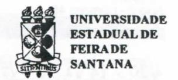
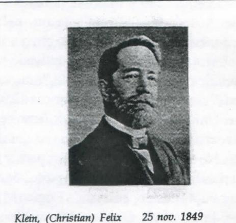

# FOLHETIM DE EDUCAÇÃO MATEMÁTICA

Ano 3 - número 46 - Folhetim de Educação Matemática - Departamento de Ciências Exatas

Janeiro/1996

#### **OBJETIVO**

Este Folhetim é um veículo de divulgação, circulação de idéias e de estímulo ao estudo e à curiosidade intelectual. Dirige-se a todos os interessados pelos aspectos pedagógicos, filosóficos e históricos da Matemática. Pretende construir uma ponte para unir os que estão próximos e os que estão distantes.

#### **EDITORIAL**

Neste ano de 1996 o NEMOC - Núcleo de Educação Matemática Omar Catunda - completa 10 anos de criação. Desde o número anterior do Folhetim, que é seu veículo de divulgação, melhoramos a apresentação gráfica e pretendemos continuar melhorando, objetivando sobretudo o leitor, que nos tem estimulado a continuar, mesmo com toda dificuldade que encontramos.

Neste primeiro número de 96 (que só agora conseguimos editar), além da coluna _Pergunte que o NEMOC Responde_, estamos incluindo uma coluna de notícias, visando divulgar acontecimentos importantes relacionados à Educação Matemática.

Esperamos diversificar cada vez mais, oportunizando uma maior participação do leitor.

## COMITÉ EDITORIAL

Carloman Carlos Borges (Doutor) Inácio de Sousa Fadigas (Mestre) Wilson Pereira de Jesus (Mestre)

# PERGUNTE QUE O NEMOC RESPONDE

Pergunta. Marcelo, da Rua Timóteo da Costa, 1033, Rio de Janeiro, pergunta: a) como calcular a expressão:

$\sqrt[3]{20 + 14\sqrt{2}} + \sqrt[3]{20 - 14\sqrt{2}}$ ? b) qual a natureza do mimero? c) como efetuar as suas extensões, a partir dos naturais até chegar aos complexos?

R. Antes de procurar resolver a questão (a) vejamos, primeiro a seguinte questão: Sejam a, b, a', b', quatro números tais que a e a' pertençam a Q, e b e b' pertençam a Q, (b e b' não quadrados perfeitos dentro de Q,). Demonstrar que: (i) a igualdade $a + \sqrt{b} = a' + \sqrt{g}$ implica (a = a' e b = b'); Demonstração: da hipótese $a + \sqrt{b} = a' + \sqrt{g}$ , ou $\sqrt{g} = a - a' + \sqrt{b}$ , vem $b' = (a - a' + \sqrt{b})^2 = (a - a')^2 + b + 2(a - a')\sqrt{b}$ , ou $b'-b-(a-a')^2=2(a-a')\sqrt{b}$ . O primeiro membro desta igualdade é um número racional (por hipótese), enquanto no segundo membro temos um produto de um racional por um irracional (ainda por hipótese); para que um número racional multiplicado por outro irracional seja um número racional, necessariamente o número racional deve ser zero; no caso acima, isto implica a - a' = 0, donde a = a'. Voltando à hipótese $a + \sqrt{b} = a' + \sqrt{b'}$ concluímos que $\sqrt{b} = \sqrt{b}$ , donde b = b. Finalmente, $a + \sqrt{b} =$ $= a' + \sqrt{b'} \Rightarrow a = a' e b = b'$ . Agora, Marcelo, vamos aplicar este resultado para demonstrar que existe n pertencente a N tal que $\sqrt[3]{20+14\sqrt{2}} = n+\sqrt{2}$ . Elevando ao cubo ambos os membros desta igualdade, temos: $20 + 4\sqrt{2} = (n^3 + 6n) + (3n^2 + 2)\sqrt{2}$ . Esta igualdade exige que se tenha simultaneamente $(n^3 + 6n) = 20$ e $3n^2 + 2 = 14$ , donde concluímos que n deve ser igual a 2. Desta forma podemos escrever as igualdades:

$\sqrt[3]{20 + 14\sqrt{2}} = 2 + \sqrt{2}$ (demonstrado) e $\sqrt[3]{20 - 14\sqrt{2}}$ =2 - $\sqrt{2}$ (por analogia); portanto, $\sqrt[3]{20 + 14\sqrt{2}}$ + $\sqrt[3]{20-14\sqrt{2}} = (2+\sqrt{2})+(2-\sqrt{2})=4$ . Quanto ao item (b) de sua pergunta: O número é um conceito e como todos os demais conceitos é um complexo de relações e ligações, não possuindo individualidade própria e existência isolada dos demais objetos com os quais ele se integra e interage. Exemplificando: considere os conceitos de raio, circunferência e círculo e observe que nenhum deles possui uma existência à parte dos demais. Assim, não há sentido em definir-se um número isolado, como se fora uma "coisa", com existência própria. Os matemáticos procuram definir conjuntos munidos de operações com as correspondentes propriedades, aos quais denominam de conjuntos de mimeros. Um número é um elemento de um conjunto A munido de uma estrutura algébrica conveniente. A famosa definição de número cardinal apresentada por Frege "classe de todas as classes semelhantes" possui mais um valor histórico do que mesmo matemático. Resumindo o que foi dito: o matemático não se preocupa com entidades, coisas, senão com relações, propriedades e o estabelecimento de novas conexões. Segundo o historiador Bell, em Development of Mathematics, o grande matemático Galois afirmara: "A Matemática se ocupa somente com a enumeração e comparação de relações". A idéia de correspondência biunívoca entre os elementos de duas estruturas algébricas que preserve as operações de ambas, mostra que a natureza dos entes sobre os quais as operações são efetuadas não possui nenhuma relevância. O que é relevante são as propriedades reveladas por ditas operações. Entretanto, se você tem tempo suficiente e aprecia especulações lógico-metafisicas, então, leia o livro Os Fundamentos da Aritmética, com subtítulo: uma investigação lógico-matemática sobre o conceito de número. O autor do livro é o famoso Johann Gottlob FREGE, lógico de reputação mundial. Outro livro interessante sobre o assunto é a Critica da Razão Pura do filósofo alemão Kant. Ele defende a tese de que o conceito de número está estreitamente ligado ao de tempo, ambos dependendo da impressão em nós provocada pela sucessão dos eventos que se verificam

tanto em nosso entorno como dentro de nós mesmos. De qualquer modo é uma questão ainda em aberto - a natureza do número - e como já foi dito, de menos importância para o matemático. Quanto às diversas extensões do conceito de número muitos manuais procedem do seguinte modo: seja a equação x + a = b, sendo $a \in b$ inteiros naturais ( $\geq 0$ ); quando b for menor que a não é possível resolvê-la dentro deste conjunto; deste modo, para assegurar-lhe solução quando a e b forem inteiros naturais quaisquer foram criados os números inteiros de sinal qualquer. Temos, aí, a extensão dos naturais para os inteiros com sinal mais ou com sinal menos. Surgem, assim, os números negativos, cujos descobridores para muitos historiadores, foram os indianos, aos quais devemos também o zero e o sistema de numeração decimal. A introdução dos números negativos mostra a interdependência entre a adição e a subtração, revelando a dependência desta em relação àquela. Na realidade, como bem observa Felix Klein: a adição e a subtração são refundidas em uma só operação. Apesar da evidência mencionada, muitos professores persistem no hábito de estudá-las separadamente. Seja agora a equação ax =b, a qual nem sempre possui solução inteira. Para que ax = b tenha solução em todos os casos, foram introduzidos os racionais não negativos. Para a equa- $\tilde{x}^2 = 2$ - considerada por muitos historiadores como a origem dos irracionais - mostra-se que ela não admite solução racional. A reunião dos racionais com os irracionais forma o conjunto denominado de números reais. O nome de real a tal espécie de número parece provir do fato de eles servirem à mensuração de grandezas fisicas e geométricas, como distância, temperatura, tempo, e outras; porém, como criação humana elaborada na tentativa de conhecer os fenômenos e ultrapassá-los em direção a sua essência - os números reais possuem elementos arbitrários (não esquecer que criação implica alguma liberdade para o criador...). Até aqui foi feito o seguinte: partindo da existência dos números naturais e na tentativa de superar as diversas impossibilidades algébricas, fizemos a sua ampliação aos números reais. Mesmo com todo esse enriquecimento estes números não respondem ao problema colocado por uma equação de aparência tão inocente como $x^2 + 1 = 0$ . Esta impossibilidade leva o matemático a criar um novo número i tal que $i^2 = -1$ e à construção do conjunto C dos complexos. A construção exposta nas linhas acima comporta alguns comentários. Nesta, o método empregado é denominado de método genético, o qual permite a elevação de conceitos simples os mais complexos. Neste, uma de suas normas básicas diz: ao generalizar-se um conceito se deve tratar de conservar o maior número de possibilidades, e ao novo conceito deve corresponder como caso particular o generalizado. A motivação apresentada acima para as diversas extensões dos números teve como eixo central impossibilidades algébricas: ora, não nos parece conveniente ou, pelo menos, suficiente, esta apresentação pois, em geral, o aluno já se encontra completamente desmotivado em relação à Matemática e, consequentemente, "motivações matemáticas" como dificuldades algébricas não lhe devem motivar. Uma alternativa para o professor é procurar motivos externos à matemática e que já sejam familiares ao aluno. No ensino, este princípio me parece válido para as demais disciplinas. Todavia, muitos de nós continuam, exemplificando, ensinando Lógica Matemática sem levá-lo em conta. Diariamente, ou quase, alunos me trazem questões tipo: "Se hoje é terça-feira, então 25 de dezembro é Natal", "Se o cão ladra, então ele estávivo". Quanto à última frase um aluno me falou que o professor lhe dissera, com uma "postura bem adequada":" prestem bem atenção: o cão pode estar vivo e, no entanto, não ladrar..." Penso que as diversas extensões mencionadas devem vir precedidas de outros conceitos tais como o de unidade, grandeza discreta (como uma biblioteca), grandeza contínua (como distância). Deve-se mostrar que os próprios números naturais se originaram da necessidade prática da contagem comparação de uma grandeza discreta com a unidade. Em seguida vem a necessidade demedida - comparação da grandeza contínua com a unidade. Contagem e medida sempre fizeram parte do cotidiano humano - o que mostra que na sua origem a Matemática é uma ciência experimental. As diversas extensões dos números - não apenas as já mencionadas como a criação de outros números como os quatérnios, os transfinitos, apenas para exemplificar - mostram que a Matemática

(isto vale para as demais ciências) se desenvolve a partir de problemas que lhe são externos (necessidades práticas) e de seus próprios problemas internos (um exemplo clássico e tão do gosto dos epistemólogos: a criação das geometrias não-euclidianas). Parece-me que no ensino a apresentação de um assunto pode vir acompanhada de seus diversos aspectos históricos, filosóficos e formais; o difícil aqui é possuir o discernimento quanto à dosagem mais conveniente de cada um desses aspectos. Porém, este é mais um desafio ao educador e que deve ser por ele solucionado sob pena de ver diminuída essa sua dimensão. •

Pergunte que o NEMOC Responde é uma coluna de autoria do prof. Dr. Carloman Carlos Borges e objetiva atingir ao público interessado em Matemática nos seus múltiplos aspectos.

Caso o leitor queira fazer alguma pergunta relacionada aos aspectos pedagógicos, filosóficos e hisóricos da Matemática, escreva-nos.

#### PRÓXIMO NÚMERO

Resposta para as perguntas: a) a indução matemática é um método dedutivo ou indutivo? b) poderia dar um exemplo de uma proposição verdadeira para os números naturais e que não possa ser demonstrada por esse método? Agora, uma pergunta diferente: como vocês, matemáticos, encaram a continuidade do movimento?

Aguardem!

## NOTÍCIAS

A Universidade Federal Rural de Pernambuco oferece o curso de Mestrado em Ensino das Ciências, com áreas de concentração em Ensino de Física, Educação Matemática e Educação Química.

O curso é coordenado pela profa Dra Cleide Farias de Medeiros (Centre for Studiens in Science and Mathematics Education - University of Leeds -Inglaterra).

O período de inscrições ocorre anualmente nos meses de agosto e setembro.

Para maiores informações, dirijam-se à Coordenação do Mestrado em Ensino das Ciências: Departamento de Física e Matemática - UFRPE Rua Dom Manoel de Medeiros s/n - Dois Irmãos Recife - PE CEP 52 171-900 Fone: (081) 441-4577 ramais 331; 227; 473.

Comunicamos com satisfação que o prof. Dr. Elon Lages Lima foi designado pelo presidente da República para integrar a Câmara de Educação Básica do Conselho Nacional de Educação, pelo período de dois anos. O NEMOC parabeniza o prof. Elon e deseja êxito na sua função.

O NEMOC promoverá, a partir do segundo semestre deste ano, cursos de curta duração para professores de 1° e 2° graus da rede pública de ensino da região de Feira de Santana.

O primeiro deles terá como título "Números -Uma Nova Abordagem".

Oportunamente daremos mais informações.

Frege, (Friedrich Ludwig) Gottlob 08 nov. 1848 26 jul. 1925 Matemático e Lógico Alemão

#### NÚMEROS ATRASADOS

Envie para cada folhetim um selo de postagem nacional de 1º porte. Dentro de no máximo quatro semanas, contadas a partir da data de recebimento do seu pedido, você estará recebendo os folhetins solicitados.

OBS.: É permitida a reprodução total ou parcial desse folhetim, desde que citado a fonte.

Klein, (Christian) Felix

22 jun. 1925

Matemático Alemão

#### NEMOC - NÚCLEO DE **EDUCAÇÃO MATEMÁTICA** OMAR CATUNDA

Folhetim de Educação Matemática Ano 3 n 46 Janeiro/96

Editores: Carloman e Inácio Editoração e Impressão: Núcleo de Editoração Gráfica - NUEG Tiragem: 1,400 exemplares Endereço: Av. Universitária, s/n-km 03 BR 116 - Campus Universitário Fax: (075)224-2284 - CEP 44031-460 Feira de Santana - BA - BRASIL
