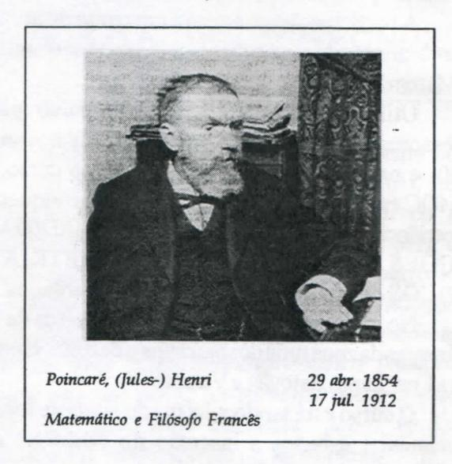
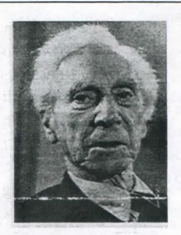

# FOLHETIM DE EDUCAÇÃO MATEMÁTICA

UNIVERSIDADE ESTADUAL DE FEIRA DE SANTANA

Ano 3 - número 47 - Folhetim de Educação Matemática - Departamento de Ciências Exatas

Fevereiro/1996

#### **OBJETIVO**

Este Folhetim é um veículo de divulgação, circulação de idéias e de estímulo ao estudo e à curiosidade intelectual. Dirige-se a todos os interessados pelos aspectos pedagógicos, filosóficos e históricos da Matemática. Pretende construir uma ponte para unir os que estão próximos e os que estão distantes.

#### **EDITORIAL**

No próximo mês de agosto o _Folhetim_ de Educação Matemática completa seu terceiro ano de circulação.

Ao longo desses anos temos distribuído gratuitamente o _Folhetim_ a todos aqueles que nos solicitam, seja através de cartas, seja através das divulgações feitas durante seminários, congressos, painéis, etc.

No nosso banco de dados já estão cadastrados cerca de 1.400 leitores, e cada dia este número está aumentando.

Como forma de avaliar o aceite do nosso trabalho, brevemente estaremos enviando aos leitores uma ficha na qual deverão expressar o desejo de continuar recebendo o _Folhetim_.

Nos próximos números daremos maiores informações.

## COMITÉ EDITORIAL

Carloman Carlos Borges (Doutor) Inácio de Sousa Fadigas (Mestre) Wilson Pereira de Jesus (Mestre)

### PERGUNTE QUE O NEMOC RESPONDE

Pergunta. Ronaldo M. Martins da Silva, residente no bairro Santana, São Paulo, escreve: Como sabemos, os argumentos são divididos em dois tipos: dedutivos e indutivos. No primeiro tipo o raciocínio vai do geral para o particular ou para o menos geral e neste o raciocínio parte do particular para o geral. Isto posto, pergunto: a) a Indução Matemática é um método dedutivo ou indutivo? b) poderia dar um exemplo de uma proposição verdadeira para os números naturais e que não possa ser demonstrada por esse método? Agora, uma pergunta diferente: como vocês, matemáticos, encaram a continuidade do movimento?

R. Muito obrigado pelas perguntas inteligentes. Seus comentários anteriores à pergunta (a) merecem outros comentários: os manuais de Metodologia Científica destinados aos nossos incautos alunos costumam definir a indução e a dedução como você o faz nas linhas acima. Em seu livro Lógica Indutiva e Probabilidade, o lógico brasileiro Newton D. A. da Costa, de reputação internacional e um dos criadores de lógicas paraconsistentes escreve: ... nada mais errado do que se afirmar que a indução, ao contrário da dedução, vai do particular ao geral ou, talvez, do menos geral ao mais geral. Seria ridículo, por exemplo, tentar enquadrar a inferência estatística nesse esquema; aliás, como é fácil de se constatar, nem a indução por simples enumeração se adapta a essa definição. Para um conceito mais fino sobre dedução aconselho a leitura de um desses livros: Elementos de Lógica Teórica, de D. Hilbert e W. Ackermann, Editorial Tecnos-Madrid, Introduccion a La Logica Simbolica, Patrick Suppes, C.E.C.S.A. ou, ainda, The Logical Foundations of Mathematics, William S. Hatcher, Pergamon Press. Em torno de sua pergunta (a) houve uma forte discussão entre o filósofo, lógico e matemático

inglês contemporâneo Bertrand Russell e o grande matemático francês Henri Poincaré. Deste você poderá ler A Ciência e a Hipótese e daquele Introdução à Filosofia da Matemática; o primeiro livro foi editado pela Editora Universidade de Brasília e o segundo por Zahar Editores. A Indução Matemática permite a prova de generalizações importantes da Aritmética. Antes de estudá-la lembremos que a lógica tradicional reconhecia como válidas duas formas de raciocínio hipotético pertencentes à lógica de proposições denominadas pelos lógicos medievais de modus ponens e modus tollens. Aqui, interessa a primeira daquelas formas. Todo mundo já observou que, se chove, a terra fica molhada; daí, quando está chovendo, é fácil concluir que a terra se encontra molhada. Este tipo de raciocínio é chamado de modus ponens. Se você chamar a proposição: chove de p e a proposição a terra se encontra molhada de q, então o modus ponens assume a forma:

$$
\begin{array}{c}
p \Rightarrow q \\
\hline
p
\end{array}
$$

Vejamos a Indução Matemática. Ela diz respeito àquelas proposições referentes aos números naturais. A idéia é a seguinte: queremos provar que uma dada proposição é verdadeira para todos os números naturais. Para isto, é suficiente provar o seguinte:

- 1. 1 (um) possui a propriedade em questão.
- 2. Para qualquer número n, se n tem essa propriedade, então o sucessor de n, isto é, n + 1, também a possui.

A condição (2) é equivalente à sequência infinita de enunciados condicionais abaixo:

Se 1 tem essa propriedade, então 2 também tem. Se 2 tem essa propriedade, então 3 também tem. Se 3 tem essa propriedade, então 4 também tem.

A condição (1) e o primeiro desses condicionais implica, por _modus ponens_, que 2 tem a propriedade. Porém, se 2 tem essa propriedade e empregando o segundo condicional, vem, novamente com a aplicação de _modus ponens_, que 3 também tem, e assim sucessivamente. Logo, por intermédio de infinitas aplicações de*modus ponens*, concluímos que todos os naturais possuem essa propriedade. O grande matemático Poincaré comparou essa seqüên-

cia de inferências lógicas a uma cascata. Claramente, é impossível escrever, por extenso, essa _cascata_, pois ela teria um _comprimento infinito_: desta forma, porém, como este raciocínio é válido, adotamos a seguinte regra de inferência: se forem válidas as condições (1) e (2), é permitido inferir:

(3) todo número natural tem essa propriedade.

De uma maneira resumida podemos escrever: associemos a cada natural n uma proposição P(n), que pode ser falsa ou verdadeira. Ao cumprir-se as duas condições (a) P(1) é verdadeira; (b) a suposta verdade de P(n) implica a de P(n + 1), então P(n)será verdadeira para todo número natural n. A Indução Matemática pode ser apresentada como axioma ou como teorema. Como axioma já o fizemos acima e, como este, é suficiente admitir o chamado princípio do menor inteiro, o qual estabelece que: todo conjunto C, não vazio, de números inteiros positivos contém um inteiro menor que todos os demais. Fundamentado nesse princípio demonstra-se a Indução Matemática, a qual passa a ser um teorema. No ensino do 2º grau costuma-se considerá-la como um axioma. Observe que ele fundamenta-se em duas características importantes dos naturais: (i) que todo natural n pode ser alcançado mediante um número finito de passos, a partir de 1 e (ii) depois de cada natural n existe um seguinte n + 1. Nesta altura e apenas para amenizar a leitura, quero partilhar com você e com os demais leitores fato ocorrido comigo há anos atrás quando participava de banca de concurso para selecionar professor ao cargo de auxiliar de ensino a uma de nossas universidades espalhadas por esse Brasil a fora. Após o candidato efetuar uma demonstração por Indução Matemática, exibindo grande auto-suficiência, e, apenas para deixá-lo mais solto no assunto que ia desenvolver em seguida, perguntei-lhe: Se essa proposição fosse referente aos mimeros reais, como você faria a demonstração? Sem pestanejar ele respondeu: Analogamente, empregando o mesmo princípio... Por tudo que foi exposto, colega Ronaldo, pode-se concluir que a Inducão Matemática é uma importante forma de raciocínio matemático dedutivo. O exemplo abaixo satisfaz a sua pergunta (b):

$$P(n)$$
: $\frac{1}{9} + \frac{1}{25} + \cdots + \frac{1}{(2n+1)^2} < \frac{1}{4}$

Experimente demonstrar essa proposição com base na Indução Matemática ... A sua indagação e afirmação acerca da continuidade do movimento merece os seguintes comentários, atualmente a Física nos oferece duas importantes visões da Natureza: A Teoria da Relatividade e a Mecânica Quântica. Segundo aquela, o movimento é contínuo, determinado causalmente e bem definido; nesta, o movimento é descontínuo, não causalmente determinado e não bem definido. Para entender o ponto de vista da Mecânica Quântica, pense em alguns de seus resultados fundamentais: _a indivisibilidade do quantum de ação,_ implicando em transições entre estados estacionários, de certa maneira, discretas (exemplificando: um elétron pode ir de um estado a outro sem passar por quaisquer estados intermediários). Um elétron pode comportar-se ora como uma partícula, ora como uma onda ou como algo intermediário e, finalmente, pense nas Relações de incerteza de Heisenberg. Esta dicotomia em tomo do movimento (continuidade e descontinuidade), aparece também em Matemática, naturalmente, assumindo formas diferentes. Os números **1,** 2, 3, **4,** ... levaram os matemáticos ao estabelecimento do conceito de descontínuo. **Ceando** se compara uma grandeza discreta (como uma coleção de lápis) com uma outra da mesma espécie, denominada de padrão, _estamos contando,_ o resultado pode ser encontrado entre os elementos do conjunto dos naturais. Quando a grandeza é continua (como o movimento na relatividade) sua comparação com o padrão denominada de medida, nos leva aos números reais, (guando a grandeza (contínua) é comensurável com o padrão, sua medida é um número racional e, quando é incomensurável, sua medida é um número irracional. A tensão entre o contínuo e o descontínuo atravessa toda a história da Matemática. O conjunto dos números reais é uma idealização de todos os valores assumidos por uma grandeza variando continuamente, como, exemplificando, o movimento na relatividade.

_Pergunte que o NEMOC Responde_ é uma coluna de autoria do prof Dr. Carloman Carlos Borges e objetiva atingir ao público interessado em Matemática nos seus múhiplos aspectos.

Caso o leitor queira fazer alguma pergunta relacionada aos aspectos pedagógicos, filosóficos e hisóricos da Matemática, escreva-nos.

## **PRÓXIMO NÚMERO**

Resposta para as perguntas: _a) que é uma estrutura matemática? b) por que a descoberta dos irracionais, na Grécia Antiga, provocou tanto alvoroço? c) você concorda que não se deve ensinar Matemática divorciada de sua história? d) qual o exato significado de, exemplificando_ 3 ^ ?

_Aguardem!_

## **NOTÍCIAS**

A Universidade Estadual de Feira de Santana sediará no mês de novembro do corrente ano a **4"** Reunião Especial da SBPC.

Está prevista na programação alguns minicursos na área de Matemática que serão divulgados nos próximos números do Folhetim.

O NEMOC integrou-se ao projeto CAT (Conhecer, Analisar, Transformar): extensão em educação rural no semi-árido. O Projeto CAT é a principal atividade do Convênio assinado entre a UEFS, o MOC (uma ONG) e quatro municípios baianos, sendo que três deles localizados no semi-árido.

A participação se refere a um curso de atualização à distância para professores de 1ª a 4ª séries em Matemática.

Utilizando a metodologia do curso para professores primários ministrado pelo INEP nos anos 80/90, e parte do material utilizado nesse curso, o NEMOC está criando novos módulos, para enriquecer a experiência, e temas como FRAÇÕES E MEDIDAS; NOÇÕES DE TOPOLOGIA; GEOMETRIA e TÓPICOS DE INFORMÁTICA serão abordados.

No momento participam do curso cerca de 85 professores da zona rural dos municípios de Retirolândia, Santa Luz, Santo Estevão e Valente.

O curso está sendo ministrado ainda de forma experimental e busca a inserção do NEMOC em atividades de educação à distância.

A equipe responsável por essa experiência é formada pelos professores Inácio de Sousa Fadigas, Josenildes Oliveira Venas e Wilson Pereira de Jesus.

A Universidade Federal Rural de Pernambuco oferece o curso de Mestrado em Ensino das Ciências, com áreas de concentração em Ensino de Física, Educação Matemática e Educação Química.

O curso é coordenado pela profa Dra Cleide Farias de Medeiros (Centre for Studies in Science and Mathematics Education - University of Leeds -Inglaterra).

O período de inscrições ocorre anualmente nos meses de agosto e setembro.

Para maiores informações, dirijam-se à Coordenação do Mestrado em Ensino das Ciências: Departamento de Física e Matemática - UFRPE Rua Dom Manoel de Medeiros s/n - Dois Irmãos Recife - PE CEP 52 171-900 Fone: (081) 441-4577 ramais 331; 227; 473.

#### **NÚMEROS ATRASADOS**

Envie para cada folhetim um selo de postagem nacional de 1º porte. Dentro de no máximo quatro semanas, contadas a partir da data de recebimento do seu pedido, você estará recebendo os folhetins solicitados.

OBS.: É permitida a reprodução total ou parcial desse folhetim, desde que citado a fonte.

Russel, Bertrand

18 mai. 1872 02 fev. 1970

Filósofo, Lógico e Matemático Inglês

#### NEMOC - NÚCLEO DE EDUCAÇÃO MATEMÁTICA OMAR CATUNDA

Folhetim de Educação Matemática Ano 3. n. 47 Fevereiro/96

Editores: Carloman e Inácio

Editoração e Impressão: Núcleo de

Editoração Gráfica - NUEG

Tiragem: 1.400 exemplares

Endereço: Av. Universitária, s/n-km 03 BR 116 - Campus Universitário Fax: (075)224-2284 - CEP 44031-460

Feira de Santana - BA - BRASIL
