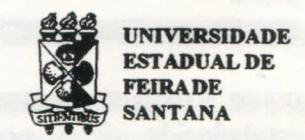
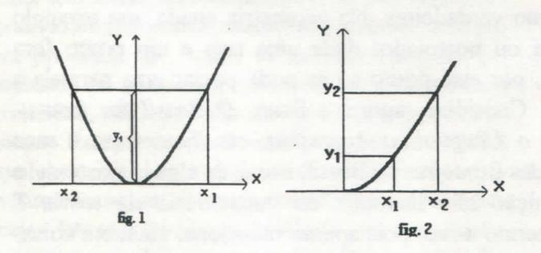

# FOLHETIM DE EDUCAÇÃO MATEMÁTICA

Ano 3 - número 49 - Folhetim de Educação Matemática - Departamento de Ciências Exatas

Abril/1996

#### **OBJETIVO**

Este Folhetim é um veículo de divulgação, circulação de idéias e de estímulo ao estudo e à curiosidade intelectual. Dirige-se a todos os interessados pelos aspectos pedagógicos, filosóficos e históricos da Matemática. Pretende construir uma ponte para unir os que estão próximos e os que estão distantes.

#### **EDITORIAL**

Juntamente com o Folhetim de nº 48 enviamos a você uma ficha de avaliação na qual algumas informações são solicitadas.

Gostaríamos de reforçar a necessidade do preenchimento e devolução da mesma, para que possamos, acima de tudo, introduzir novas "colunas" no _Folhetim_, que sejam de interesse geral.

Aproveitamos a oportunidade para agradecermos a todos vocês que nos enviaram correspondências com elogios ao nosso trabalho, destacando também a melhoria gráfica.

Chamamos a sua atenção para a coluna Educação e Ensino onde transcrevemos um artigo do professor Elon Lages Lima, sobre educação.

# COMITÊ EDITORIAL

Carloman Carlos Borges (Doutor) Inácio de Sousa Fadigas (Mestre) Wilson Pereira de Jesus (Mestre)

## PERGUNTE QUE O NEMOC RESPONDE

Pergunta. Nivaldo G. da Silva, de Aracaju - SE, escreve: a) porque a raiz quadrada de um número positivo não tem dois valores? Exemplificando: a raiz quadrada de 4 poderia muito bem ter os dois valores: menos 2 e mais 2, pois ambos elevados ao quadrado reproduzem o número 4.

R. Como o colega sabe, a Matemática organiza-se levando em consideração elementos tais como termos primitivos, axiomas ou postulados, definições e teoremas. Este tipo de organização denomina-se de axiomática. O saber matemático é organizado axiomaticamente, isto é, por intermédio daqueles quatro elementos citados acima. Termos primitivos são aqueles que serão empregados sem explicação de seu significado, isto é, eles não são definidos. Na Geometria que nós estudamos nas primeiras séries, exemplos de termos primitivos são ponto, reta, plano. Axiomas ou postulados são proposições que aceitaremos como verdadeiras. Na geometria citada, um exemplo de axioma ou postulado: dada uma reta e um ponto fora desta reta, por este ponto só se pode passar uma paralela à reta dada. Considere, agora, a frase: O Brasil faz fronteiras com o Uruguai, a Argentina, etc. Esta frase é uma definição das fronteiras do Brasil, isto é, de algo já existente; e esta definição não introduz no vocabulário da teoria T qualquer termo novo, pois apenas menciona, enumera coisas reais; definições deste tipo são designadas definições reais e não são empregadas em Matemática. As definições mais usuais em Matemática são: a) definições nominais ou explícitas; b) definições por abstração; c) definições por recorrência. Todos os três tipos acima possuem uma característica comum: introduzem no vocabulário da teoria T, em estudo, termos novos. Quando definimos circunferência (ou círculo) como o lugar geométrico dos pontos do plano equidistantes de um ponto fixo desse mesmo plano, a convenção está estabelecida: daqui por diante, empregaremos o termo novo circunferência em lugar de toda essa frase em itálico. Veja que, em primeiro lugar, uma definição é uma convenção e, em segundo lugar, ela economiza trabalho mental. A definição dada acima é do tipo (a). Sobre os outros tipos falaremos quando surgir oportunidade. Teoremas são proposições cuja validez deve ser demonstrada. Exemplo: dentro da mesma geometria: a soma dos ângulos internos de um triângulo é 180°. Você, para chegar a um teorema, tem que fundamentar-se unicamente nos axiomas, nas definições e naquelas proposições cuja validez já foi estabelecida. Nesta altura da exposição costumam surgir, por parte do alunado, duas perguntas: Porque não definimos todos os termos? Porque não demonstramos todas as proposições? No século IV a.C. o sábio Aristóteles já afirmava: Se tudo pudesse ser demonstrado. nada seria demonstrado. O mesmo vale para as definições: não se pode definir tudo sob pena de cair na regressão ao infinito ou na circularidade. Agora, voltemos a sua pergunta, tão comum nas salas de aula e, daí, a sua importância. Vamos definir a raiz quadrada de um número real x ( $x \ge 0$ , isto é, x ∈R+). Consideremos as figuras abaixo:

Suponhamos que elas representam a função tão conhecida $y = x^2$ . Na figura 1, x pode assumir qualquer valor real, ele _percorre_ todo o eixo horizontal, enquanto que na figura 2, x _percorre_ apenas a parte positiva (incluindo o zero) do mesmo eixo. Outra diferença: na figura 1, para dois valores distintos de x, $x_1$ e $x_2$ , correspondem um só valor

para y, no caso, y1, enquanto que, na figura 2, para valores distintos de x, correspondem valores distintos para y. Conclui-se, portanto, da figura 2, que você pode estabelecer tanto uma função f de x para y, como uma outra função de y para x (note que isto não pode ser feito na figura 1). Esta outra função, de y para x, conforme figura 2, alguns chamam de função reciproca, entre outros nomes (bijeção recíproca, etc); ela é simbolizada graficamente por √, que se lê: raiz quadrada de .... Então, podemos escrever a equivalência lógica: $y = \sqrt{x} \Leftrightarrow x = y^2$ . Duas conclusões importantes: i) só existe raiz quadrada de um número x pertencente a R+ (números reais positivos e o zero); ii) o resultado da raiz quadrada é zero ou um número real positivo (volte a figura 2). Com as restrições mencionadas, podemos escrever tranquilamente:

1.  $\sqrt{0} = 0$ ;
2.  $\sqrt{1} = 1$ ;
3.  $(\sqrt{A})^2 = A$ , $A > 0$ .

Consideremos, agora, uma conseqüência importante do que foi exposto acima. Seja A um número real positivo ou igual a zero; mostremos que existem dois números reais $x_1 = \sqrt{A}$ e $x_2 = -\sqrt{A}$ , tais que (1) $x^2 = A$ . Segundo o exposto (observe que A é zero ou real positivo) existe em $R_+$ um único número, $a = \sqrt{A}$ , tal que (2) $a^2 = A$ . É válida a equivalência (1) $\Leftrightarrow$ (2) ou $x^2 = a^2$ , donde (2) $x^2 - a^2 = 0$ , (2') (x - a)(x + a) = 0; logo, os números que verificam (1) são: $x_1 = \sqrt{A}$ e $x_2 = -\sqrt{A}$ .

É preciso notar que as convenções ou definições matemáticas - como a da raiz quadrada acabada de ser exposta - não são elaboradas aleatoriamente pelos matemáticos. Vamos tentar explicar isto. Seja a axiomática dos números reais na qual a propriedade distributiva é um de seus axiomas: a(b + c) = a.b + a.c, a, b e c são números reais quaisquer. Pois bem, a famosa e não menos misteriosa (pelo menos para os alunos) regra dos sinais pode ser considerada como uma conseqüência dessa propriedade. A outra convenção de que qualquer número real diferente de zero elevado a zero é igual a um é, também, uma consequência das outras propriedades dos reais. Assim acontece com todas as convenções ou definições matemáticas; elas deverão ser compatíveis dentro de sua axiomática.

Pergunte que o NEMOC Responde é uma coluna de autoria do prof. Dr. Carloman Carlos Borges e objetiva atingir ao público interessado em Matemática nos seus múltiplos aspectos.

Caso o leitor queira fazer alguma pergunta relacionada aos aspectos pedagógicos, filosóficos e hisóricos da Matemática, escreva-nos.

## PRÓXIMO NÚMERO

Resposta para a pergunta: é possível a existência de intervalos no conjunto dos naturais?

Aguardem!

# **EDUCAÇÃO E ENSINO**

É com grande prazer que transcrevemos o artigo abaixo, do Prof. Elon Lages Lima, tratando de assuntos relacionados à educação. O prof. Elon é uma figura bastante conhecida nos meios acadêmicos e um grande divulgador da Matemática em nosso país. Consideramos que ele seja uma das maiores referências nacionais sobre o assunto, pelo que - repetimos - é com prazer que transcrevemos o seu artigo, já publicado na DOCUMENTA nº 3 da SBPC, 1995.

#### Depoimento sobre Educação

Elon Lages Lima

Basta olhar em volta para ver que os povos que desfrutam de maior conforto, bem estar e saúde são os mais educados, os mais cultos, os que se situam na vanguarda do conhecimento e sabem transformar este conhecimento em riqueza.

No mundo de hoje sobressai a interdependência das nações e, neste relacionamento, a hegemonia pertence às que dominam a tecnologia, como consequência do seu desenvolvimento cultural. Recursos naturais sem dúvida ajudam mas não são necessários nem suficientes. O fator decisivo é a Educação.

Urge, pois, educar.

A Educação é necessária, vital e insubstituível como elemento gerador do progresso e da felicidade de um povo. Ela é um dos deveres maiores, se não o dever maior do estado.

Educar é um processo metódico, lento e cumulativo, que não mostra resultados sensacionais imediatamente. Por isso, não atrai a preocupação da maioria dos políticos, a não ser em manifestações retóricas, em anúncios de planos grandiosos jamais realizados, ou em pseudo-soluções mirabolantes, quer eletrônicas, quer arquitetônicas.

"Não há caminho real em Geometria", respondeu Euclides a um pedido do rei Ptolomeu para que lhe apontasse um jeito de aprender aquela ciência sem grande trabalho. De maneira análoga, não há milagres que substituam o esforço, a perseverança e a auto-disciplina como fundamentos do processo educativo. A adoção e o cultivo dessas virtudes como fatores de sucesso na escola conduzem à formação de hábitos que se mostrarão instrumentais para o sucesso depois dela. E o progresso de uma nação nada mais é do que a soma dos êxitos individuais dos seus cidadãos.

É preciso investir em Educação. Agora. É uma falácia argumentar que há outros problemas mais imediatos. Estes jamais serão resolvidos se cuidarmos somente deles. Há que estabelecer prioridades, não exclusividades.

Mas não basta investir. Um dos grandes problemas da Educação no Brasil é o baixo salário dos professores, principalmente no nível primário. Entretanto, ninguém pode acreditar que elevar esses a um nível adequado resolva alguma coisa. O aviltamento salarial provocou a evasão dos mais capazes e trouxe, conseqüentemente, uma degradação da qualidade média dos docentes no ensino público. Melhorar a remuneração, sim. Mas somente via reciclagem e prova de capacitação.

O ensino público deve ser valorizado, prestigiando seus docentes, equipando suas escolas, fazendo com que alunos, professores e a população em geral se orgulhem dele. Ensino público gratuito e eficiente é uma das maiores manifestações democráticas de uma nação.

A educação básica precisa ser diversificada. Não é sensato treinar os jovens como se todos tivessem o mesmo objetivo profissional. Depois de um ciclo básico comum de cinco ou seis anos, os alunos devem ter diferentes opções curriculares, de acordo com suas aptidões e suas preferências.

No que diz respeito ao ensino dito superior, a maioria das instituições deste nível são escolas de terceiro grau, particulares, que funcionam como empresas lucrativas e que, com raras exceções, se situam muito aquém das fronteiras do conhecimento sem ambições de pesquisa, sem contribuições a oferecer para o progresso. Isto é particularmente verdadeiro e lamentável nas faculdades que formam professores para o ensino médio.

Quanto às universidades públicas, em sua maioria federais, mas com um número crescente de estaduais, há nelas alguns núcleos que agrupam aqueles docentes que deveriam ser a regra geral, mas são uma minoria lutadora e bem dotada, que se debate contra as condições precárias de trabalho mas, mesmo assim, fazem o conhecimento avançar, contribuem para o progresso e dão algum renome científico e cultural ao país.

Infelizmente, num grande número de universidades públicas há um brutal desperdício que resulta de uma gigantesca ineficiência. O quadro predominante mostra professores incompetentes recebendo vencimentos bem razoáveis, lecionando, para alunos mal preparados e pior selecionados, assuntos obsoletos, mal compreendidos pelos primeiros e incompreensíveis para os últimos.

Uma das conseqüências desse estado de coisas é o fenômeno recente em que as universidades públicas que melhor selecionam seus docentes, por meio de concursos moralizados e de bom nível, estão tendo grandes dificuldades para preencher as vagas de que dispõem. Muitos candidatos em potencial preferem disputar lugares em universidade onde as provas são mais fáceis e o salário é o mesmo. Esta pretensa isonomia é certamente prejudicial à qualidade pois, com o tempo, as necessidades docentes pressionarão no sentido de nivelar por baixo todas essas escolas. Isto sem falar no escândalo da remuneração dos pesquisadores dos institutos ligados ao M.C.T., consideravelmente menor do que a dos professores universitários e freqüentemente inferior às bolsas dos seus próprios alunos de doutorado.

Esta é, em linhas gerais, a minha visão do quadro atual da Educação em nosso país. Há muito espaço para melhorar, há muitas iniciativas que podem ser tomadas, mas é necessário, antes de tudo, aquela motivação que hoje todo mundo chama de vontade política.

# NOTICIAS

A Coleção do Professor de Matemática, SBM acaba de publicar seu 12° volume: Isometrias do Prof. Elon Lages Lima. Este livro reproduz o texto básico de um curso para professores reunidos em La Cumbre, Província de Córdoba, Argentina, em novembro de 1995 e dado pelo autor. Ele trata desse tipo de transformação na reta, no plano e no espaço. Como o Prof. Elon Lages Lima dispensa apresentações, recomendamos fortemente o texto aos nossos professores de matemática.

## **NÚMEROS ATRASADOS**

Envie para cada folhetim um selo de postagem nacional de 1º porte. Dentro de no máximo quatro semanas, contadas a partir da data de recebimento do seu pedido, você estará recebendo os folhetins solicitados.

OBS.: É permitida a reprodução total ou parcial desse folhetim, desde que citada a fonte.

## NEMOC - NÚCLEO DE EDUCAÇÃO MATEMÁTICA OMAR CATUNDA

Folhetim de Educação Matemática Ano 3 n. 49 Abril/96

Editores: Carloman e Inácio

Editoração e Impressão: Núcleo de

Editoração Gráfica - NUEG

Tiragem: 1.400 exemplares

Endereço: Av. Universitária, s/n-km03 BR 116 - Campus Universitário Fax: (075)224-2284 - CEP 44031-460 Feira de Santana - BA - BRASIL