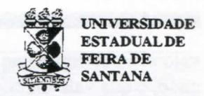

# FOLHETIM DE EDUCAÇÃO MATEMÁTICA

Ano 3 - número 50 - Folhetim de Educação Matemática - Departamento de Ciências Exatas

Maio/1996

#### **OBJETIVO**

Este Folhetim é um veículo de divulgação, circulação de idéias e de estímulo ao estudo e à curiosidade intelectual. Dirige-se a todos os interessados pelos aspectos pedagógicos, filosóficos e históricos da Matemática. Pretende construir uma ponte para unir os que estão próximos e os que estão distantes.

#### **EDITORIAL**

Concomitantemente com a publicação do nº 50 do nosso _Folhetim_, o que é uma vitória para nós, estamos recebendo, de toda parte do país, e também do exterior a ficha de avaliação que foi em anexo ao número 48.

As críticas e sugestões chegadas até agora vão nos ajudar bastante a responder aos anseios dos nossos leitores.

Agradecemos a todos aqueles que têm nos prestigiado, e estimulado a continuar divulgando conhecimento, de forma particular o conhecimento matemático nos seus múltiplos aspectos.

Se você ainda não nos enviou a ficha de avaliação preenchida, faça-o ainda hoje, para que possa continuar recebendo o nosso _Folhetim_.

### COMITÉ EDITORIAL

Carloman Carlos Borges (Doutor) Inácio de Sousa Fadigas (Mestre) Wilson Pereira de Jesus (Mestre)

#### PERGUNTE QUE O NEMOC RESPONDE

1º Pergunta. Alguns colegas nos indagam se é possível a existência de intervalos no conjunto dos naturais.

R. Sim, é possível. Esta pergunta é muito frequente em sala de aula. Ao manusearmos a maioria de nossos livros didáticos (o que é redundante, pois basta examinar um ...) no capítulo Conjuntos Numéricos a ordem na distribuição do assunto é sempre a mesma: 1. Conjunto dos Números Naturais, 2. Conjunto dos Números Inteiros, 3. Conjunto dos Números Racionais, 4.Os Números Irracionais e 5. Conjunto dos Números Reais. Em alguns livros modernos, geralmente coloridos e bem atraentes, os cinco itens mencionados costumam ser precedidos de um outro dedicado a História da Matemática. no qual são enxertados altissonantes ditos atribuídos a eminentes matemáticos. Em nenhum dos itens (1), (2), (3) e (4) a palavra intervalo é mencionada. No item (5) surge, então, um longo parágrafo dedicado aos Intervalos na reta real. Claramente, uma tal apresentação do assunto pode levar o leitor a pensar apenas na existência de intervalos na reta real, o que não é verdade. Podemos falar em intervalos nos conjuntos N, Z e Q. Vejamos isto mais de perto. Quando um conjunto é totalmente ordenado por uma relação binária R, então podemos falar em intervalos nesse conjunto. Sejam os conjuntos N, Z, Q, R munidos da relação menor ou igual. Observa-se que esta relação é reflexiva, (x ≤ x), anti-simétrica $(x \le y e y \le x \implies x = y) e transitiva (x \le y e y \le z \implies x \le z)$ . Estes axiomas, valendo para quaisquer números x, y e z, nos conjuntos mencionados, os tornam, consequentemente, totalmente ordenados. Pode-se concluir, portanto, que dado um conjunto E munido de uma determinada relação e sempre que esta satisfaz aos mencionados axiomas, então é legítimo afirmar que o conjunto E pode ser repartido em subconjuntos denominados de intervalos. Agora uma peninha sobre o 4º axioma acima ( $x \le y$ ou $y \le x$ ): quando isto acontece dizemos que os elementos de E são comparáveis. O conceito de inter-

valo acha-se ligado ao de conjunto totalmente ordenado, o que vale dizer, ao conceito de ordem. Vamos tentar aproximar-nos dele de um modo mais concreto. Sejam dois inteiros naturais x e y, distintos; como sabemos, eles são comparáveis; examinemos o intervalo aberto ] x, y [ : se y = x + I, este intervalo é vazio pois não existe nenhum inteiro natural entrexe seu sucessor x + I. Assim em N, o intervalo aberto ] 3,4 [ é vazio. Na hipótese de y maior que x + I, então o intervalo aberto] x,y [ é um subconjunto finito de N. Estamos, agora, em condições de definir ordem discreta: um conjunto totalmente ordenado possui uma ordem discreta se existe intervalos abertos (com extremos distintos) vazios. Já no conjunto dos números racionais, que também é totalmente ordenado, todo intervalo aberto (com extremos distintos) é um conjunto constituído de infinitos elementos pois, como sabemos, entre dois racionais há uma infinidade deles. Isto mostra que a ordem em Q não é a mesma que a ordem em N. A preocupação com o conceito de ordem vem desde -pelo menos - a antigüidade grega, o que não é de estranharse pois ele encontra-se ligado a conceitos como beleza, simplicidade e unidade. O homem busca sem cessar o padrão que liga todas as coisas. Para Aristóteles existia uma ordem eterna, na qual cada objeto temo seu lugar natural. Em seguida veio Descartes com a sua rede de coordenadas: a realidade física tinha de ser compreendida dentro desta ordem de coordenadas. A Relatividade, quebrando a linearidade do tempo oferecenos uma nova ordem que em seguida é alterada pela Mecânica Quântica. Ao contemplarmos as coisas ao nosso redor percebemos, inicialmente, as diferenças e, nestas, as semelhanças. As coisas são arrumadas em conjuntos constituídos de elementos semelhantes entresi, denominados pelos matemáticos de classe de equivalência. Assim, as diferenças inicialmente percebidas por nós são ordenadas pela relação de semelhança, formando diferentes classes de equivalência. Qualquer conceito nosso: cachorro, mãe, árvore, etc., é uma classe de equivalência. Desta forma, a articulação de nossos conceitos é operada por intermédio dessas classes, as quais constituem também uma ordem. A consequência disto é que, qualquer coisa que aconteça precisa ser colocado por nós em alguma ordem, pois a ausência total de ordem é apenas um jogo

de palavras ordenado por nós e sem qualquer significado real. A ordem é um conceito básico na Matemática, talvez, o mais importante dos conceitos matemáticos, pois ela se encontra em todas as partes da natureza. Veja o que escreve o eminente cientista Roger Penrose em A Mente Nova do Rei, com o subtítulo: Computadores, Mentes e as Leis da Física, Editora Campus, pág. 25: Se todo o conteúdo material de uma pessoa fosse trocado por partículas correspondentes existentes nos tijolos de sua casa, então, num sentido forte, nada teria acontecido. O que distingue a pessoa de sua casa é o padrão, a maneira pela qual seus constituinsão dispostos, e não a individualidade dos próprios constituintes. Há um livro estimulante sobre o assunto. Trata-se de: Ciência, Ordem e Criatividade, de David Bohm (físico bem conhecido) e F. David Peat, Editora Gradiva.

2ª Pergunta. Um leitor, de São Paulo, que não quis identificar-se, escreve: Quando estudamos

frações aprendemos que : $\frac{a}{b} + \frac{c}{d} = \frac{ad + bc}{bd}$ . Ora, não seria muito mais fácil somar assim:

$\frac{a}{b} + \frac{c}{d} = \frac{a+c}{b+d}$ ? Estarei errado em supor que os matemáticos adoram complicar as coisas?

R. As leis que regemas operações com os números racionais é uma criação humana; assim, pelo menos do ponto de vista lógico, pode conter elementos arbitrários. É claro que, logicamente, a segunda definição acima, proposta pelo leitor, poderia ser adotada pelos matemáticos - para alegria de nossos alunos. Aqui, porém, deve-se levar em conta - e os matemáticos o fizeram - a milenar experiência humana em contar e medir. Veja por exemplo, como

ficaria a sua definição: $\frac{1}{3} + \frac{1}{3} = \frac{2}{6}$ . Este resultado contraria formalmente essa experiência, e a matemática, neste caso, não seria um instrumento útil ao homem na luta pela compreensão do mundo. Passaria a ser um simples jogo intelectual. Tanto na conhecida Geometria Euclidiana - aquela do primeiro grau - como na

formulação das leis sobre as operações com os números racionais, o papel da experiência cotidiana foi determinante. Pode-se até avançar que essas leis são uma generalização dessa prática de vida. Porém, como escreve G. Chilov, em Análise Matemática (funções de uma variável, tomo I, pág. 13, em francês): A experiência não nos fornece axiomas matemáticos de uma maneira categórica; entre a experiência e a ciência, há uma etapa de formação de axiomas que, dentro do quadro de uma mesma experiência, podem variar de uma maneira radical. Para tentar ilustrar melhor a questão, consideremos o 5º Postulado de Euclides: Sendo dada uma reta e um ponto não pertencente a esta reta, por este ponto só podemos passar uma só paralela à reta dada. Pode-se negar este postulado de duas maneiras: a) considerando que pelo ponto dado passam várias paralelas à reta dada e b) considerando que pelo ponto dado não passa nenhuma paralela à reta dada. Destas duas negações os matemáticos construíram, grandes aplicações. Fica claro, que estas duas negações não foram inspiradas em nenhuma experiência cotidiana. Não acredito que os matemáticos gostem de complicar as coisas: se você, em lugar de matemáticos tivesse escrito muitos professores de matemática, então eu concordaria integralmente com o colega. •

Pergunte que o NEMOC Responde é uma coluna de autoria do prof. Dr. Carloman Carlos Borges e objetiva atingir ao público interessado em Matemática nos seus múltiplos aspectos.

Caso o leitor queira fazer alguma pergunta relacionada aos aspectos pedagógicos, filosóficos e históricos da Matemática, escreva-nos.

## PRÓXIMO NÚMERO

Respostas para as perguntas: a) ao dividirmos um segmento AB em 10 outros de mesmo comprimento, podemos afirmar que eles são iguais? b) muitos colegas estão, cada vez mais, perplexos ante aquilo que eles chamam de "crise no ensino da matemática" e desejam saber minha opinião a respeito.

Aguardem!

## **EDUCAÇÃO E ENSINO**

Aprendiz de Matemática - Reflexões e Sugestões\*

Wilson Pereira de Jesus\*\*

Quero escrever sobre as minhas experiências de aprendiz de Matemática. À guisa de esclarecimento, eu também faço poesia. Estudo Matemática e faço versos porque foi onde eu tive Mestres. Sorte minha.

Como aprendiz de Matemática, lentamente eu me vou realizando. Purificando meus métodos, refletindo sobre meus atos, intensificando meus sonhos.

Às vezes estanco ante meus bloqueios. Mas há momentos em que redescubro teoremas simples, ou medito sobre condições em que a criação matemática acontece. Ou sobre modos suficientes de abordagem deste ramo do conhecimento. E me alegro por saber que, mesmo saído de uma escola decadente, sou capaz de espantar-me ante fatos matemáticos. Prova de que minha consciência não se perdeu.

A Aritmética mesmo, e a Geometria Euclidiana, que conheço parcamente, me bastam neste mundo conturbado, para superar esta imagem decagente do Brasil subdesenvolvido nos setores mais elementares de utilização do conhecimento. A exemplo, o uso da terra, a agricultura voltada para a exportação, etc.

Tenho comigo a certeza de que a insanidade da vida nossa, nesse país nosso, ainda não arrancou de mim uma das maiores determinantes da preservação da dignidade humana: A capacidade de conhecer, de amar o conhecimento, enfim a sede e a busca do saber.

Optei pela Matemática, porque ela é, talvez, o segundo mais rico patrimônio da humanidade. E tive meu Mestre aí. Mas o que determina hoje em mim o sentir-me um neófito aprendiz, é o amor que dedico a esse ramo do conhecimento humano, tão profundamente abstrato, absoluto, e tão livre de marcas humanas.

Será a Matemática obra dos homens ou descoberta pelos homens? É que ela é algo de tão nobre e absolutamente imparcial, que eu duvido às vezes que seja obra de humanos. Também, onde há mão humana, há imperfeições. E nesta Ciência eu não as vejo. Eu não vejo imperfeições nessa pedra angular da evolução dos povos.

Mas eu gostaria de falar um pouco com os professores de matemática, mais precisamente os de 1° e 2° graus.

O ensino da Matemática, eu o considero um problema de contorno. Não pode ser atacado diretamente. E aqui eu gostaria de sugerir aos cologas que se ativessem aos três seguintes tópicos. Mas existem outros, que prefiro não citar, dado a exiguidade deste artigo:

Filosofia - Latim - Xadrez

Quanto à Filosofia, todos os Matemáticos de verdade são filósofos (matemáticos de mentira são outra coisa, menos matemáticos). Querem um exemplo bem do nosso pequeno universo? Omar Catunda, Carloman Carlos Borges. Que apesar de ocupadíssimos ainda dispõem de tempo para orientar pessoas como nós, neófitas em aprendizagem das bases da Matemática.

Outra opção para libertar-se dos estímulos negativos do "tempo global" e treinar a capacidade de concentração, é o estudo do Latim, nossa língua Mater. Fundamental para a disciplina mental. Principalmente num tempo em que as pessoas vivem muito mais em devaneios do que pensando de verdade. E com relação a esse estudo, caros colegas - supostos amantes da Matemática, comprem um Manual de Latim do Curso Ginasial, num Sebo, ou em algum bibliófilo.

Quanto ao Xadrez, também para concentração mental e estímulo do raciocínio lógico. Mas estude de verdade. Não jogue, estude! Pacientemente, regularmente.

Depois, chegue na sua classe, e diga aos seus alunos da grande importância do pensar. De o quanto é revolucionário, subversivo, "comunista" e bábaro o pensar, dentro da estrutura antropofágica de poder em que vivemos. Aí cite alguns pensadores. Se você não conhece nenhum, cite Sócrates. Santo Agostinho, Platão, Aristóteles, Thales, Anaximandro, ou então cite exemplos bem nordestinos: D. Hélder, José Jerônimo, Omar Catunda, Carloman, José Américo de Almeida. João Cabral de Melo Neto... E para consumar seu discurso, cite Descartes, e depois funde na sua classe um clube de Matemática, um Clube de Xadrez, um Clube de Leitura! Vamos, foi um matemático que sugeriu se introduzisse redação nas provas de nossos vestibulares. Seja Matemático, Colega!... Ou então, continue ligado na Globo, esta falácia, e receba no seu tubo de imagem o lixo escorrido do sul, e as esmolas para o Nordeste, e os problemas da América do Norte segundo as Colônias do Sul.

Boa noite, colegas.

## NOTÍCIAS

O Departamento de Ciências Exatas da Universidade Estadual de Feira de Santana oferecerá um cursos de extensão com o título "Curso de Geometria Euclidiana para Professores do 1º e 2º Graus". O curso tem inscrição prevista para o período de 23 a 27 de setembro próximo. Informações: Departamento de Ciências Exatas, fone (075) 224-8086.

O Centro de Aperfeiçoamento do Ensino de Matemática - CAEM, do IME/USP, estará promovendo no segundo semestre, vários cursos, dentre eles "Uma análise da geometria dos livros didáticos". O curso será realizado nos dias 10, 17 e 24 de outubro próximo e as inscrições estarão abertas a partir de 5 de setembro. Informações: IME/USP telefone e fax 818-6160.

## NÚMEROS ATRASADOS

Envie para cada folhetim um selo de postagem nacional de l'porte. Dentro de nomáximo quatro semanas, contadas a partir da data de recebimento do seu pedido, você estará recebendo os folhetins solicitados.

OBS.: É permitida a reprodução total ou parcial desse folhetim, desde que citada a fonte.

#### NEMOC - NÚCLEO DE EDUCAÇÃO MATEMÁTICA OMAR CATUNDA

Folhetim de Educação Matemática Ano 3. n. 50 Maio/96

Editores: Carloman e Inácio

Editoração e Impressão: Núcleo de

Editoração Gráfica - NUEG Tiragem: 1.500 exemplares

Endereco: Av. Universitária, s/n - km 03

BR 116 - Campus Universitário

Fax:(075)224-2284-CEP 44031-460

Feira de Santana - BA - BRASIL

\* Texto escrito em 1983, quando o autor se iniciava na carreira acadêmica

\*\* Mestre em Educação Matemática, professor assistente no Dep. de Educação/UEFS.
