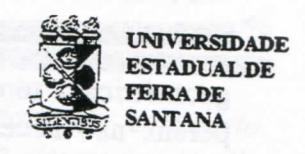

# FOLHETIM DE EDUCAÇÃO MATEMÁTICA

Ano 3 - número 51 - Folhetim de Educação Matemática - Departamento de Ciências Exatas

Junho/1996

#### **OBJETIVO**

Este Folhetim é um veículo de divulgação, circulação de idéias e de estímulo ao estudo e à curiosidade intelectual. Dirige-se a todos os interessados pelos aspectos pedagógicos, filosóficos e históricos da Matemática. Pretende construir uma ponte para unir os que estão próximos e os que estão distantes.

#### **EDITORIAL**

Continuamos recebendo de toda parte do país e do exterior a ficha de avaliação que foi em anexo ao número 48.

As críticas e sugestões chegadas até agora tem nos ajudado a fazer um perfil dos nossos leitores, visando a atender às suas necessidades.

A partir do número 53, do nosso Folhetim, estaremos dando início ao quarto ano de sua publicação e gostaríamos de tê-lo como nosso leitor. Se você ainda não nos enviou a ficha preenchida, insistimos para que o faça hoje mesmo.

Se você ou sua Instituição desejar publicar alguma notícia dentro do escopo do nosso Folhetim, escreva-nos.

## COMITÉ EDITORIAL

Carloman Carlos Borges (Doutor) Inácio de Sousa Fadigas (Mestre) Wilson Pereira de Jesus (Mestre)

# PERGUNTE QUE O NEMOC RESPONDE

Temos recebido diversas cartas exibindo dúvidas comuns sobre os assuntos tratados logo abaixo:

1º Pergunta. Ao dividirmos um segmento AB em 10 outros do mesmo comprimento, podemos afirmar que eles são iguais, isto é, que o segmento AB ficou dividido em 10 segmentos iguais?

R. Esta pergunta relaciona-se com conceitos tais como igualdade, congruência e semelhança. Comecemos pelo de igualdade, já abordado no Folhetim nº 26, Março/95. O sinal de igual (=) é empregado, em matemática, com dois ou mais sentidos diferentes e isto costuma ocasionar alguns mal-entendidos entre os alunos e professores... O primeiro sentido: A = B se e somente se A possui toda propriedade que B possui, e B possui toda propriedade que A possui. Este é o sentido de identidade lógica. Desta forma, a igualdade desfruta das propriedades de simetria (se A = B, então, B = A); reflexividade(A = A) etransitividade(se A = B e B = C, então, A = C). Frases tais como: A é idêntico a B, A é igual a B, segundo Tarski, grande lógico contemporâneo, possuem o mesmo sentido e podem ser substituídas simbolicamente por: A = B. Este é o primeiro sentido da igualdade. Na história da filosofia o conceito de identidade vem causando sempre, questionamentos pois, como escreveu o filósofo Wittgenstein: Dizer que duas coisas são idênticas é absurdo, e dizer que uma coisa é idêntica a si mesma não quer dizer nada. No Compêndio da Álgebra, escrito por J. Sebastião e Silva e J. D. da Silva Paulo, Livraria Cruz, lê-se: di se que dois segmentos de reta têm o mesmo comprimento quando são iguais, isto é, sobreponíveis. Aqui, cabe uma pequena discussão. Dada uma figura geométrica qualquer, nossa atenção é despertada pela sua forma e pelo seu tamanho. Pois bem, é mais usual escrever que duas figuras geométricas são congruentes quando têm, exatamente, a mesma forma e o mesmo tamanho. Quando elas (as figuras

geométricas) têm exatamente, a mesma forma, porém, não necesssariamente, o mesmo tamanho, dizemos que elas são semelhantes. Assim, 2 segmentos quaisquer são semelhantes, 2 circunferências quaisquer são semelhantes. Outros exemplos poderiam ser citados. Quando os autores portugueses acima citados falam em igualdade de 2 segmentos, quando eles têm o mesmo tamanho, é claro que o sentido de igual, neste caso, é diferente do de identidade lógica. Emtodo caso, é mais comum afirmar que os dois segmentos (mesmo tamanho e mesma forma) são congruentes e não iguais. Um segundo sentido para o sinal de igual (=): o empregamos em definições. Neste caso, a expressão à esquerda do sinal de igual deve ser tomada como uma abreviatura da expressão colocada à direita do mesmo. Quando escrevemos 3/11 = 0.2727... não queremos dizer que o número representado no segundo membro é o mesmo número representado no primeiro membro, pois, 0,2727... representa uma sequência infinita de frações decimais e as frações decimais 0,27: 0,2727; 0,272727; etc., são aproximações da fração ordinária 3/11. Recapitulando: duas figuras geométricas são congruentes quando têm exatamente a mesma forma e o mesmo tamanho. Ouando as duas figuras têm exatamente a mesma forma, porém, não necessariamente, o mesmo tamanho, dizemos que elas são semelhantes. Expliquemos o grifo: não necessariamente. A semelhança acha-se ligada a noção de proporcionalidade: quando duas figuras geométricas são semelhantes, uma é a reprodução fiel da outra em escala diferente, assim, as 2 figuras estão ligadas também, por um fator de proporcionalidade representado por um número real positivo. Ora, este número pode ser igual a 1 e, assim, toda figura geométrica é semelhante a si mesma (as figuras, aqui, possuem o mesmo tamanho). Existe até uma palayra para quando a razão de semelhanca for igual a 1: isometria. Logo, quando há uma isometria entre duas figuras geométricas - elas possuem, então, o mesmo tamanho e a mesma forma - e, portanto, são congruentes. A semelhança é uma correspondência tão importante que vamos, ainda, falar mais um pouco sobre ela. Devido as suas propriedades (reflexividade. simetria e transitividade), ela serve para classificar figuras geométricas em conjuntos cujos elementos são figuras semelhantes entre si. Assim podemos formar o

conjunto de todos os triângulos equiláteros; o conjunto de todos os segmentos, etc. Pela sua importância, estes conjuntos recebem o nome de classes de equivalência criada pela correspondente semelhança. Como nosso pensamento se elabora fundamentado em conceitos e como estes conceitos são classes de equivalência - não é difícil concluir que a semelhanca faz parte da racionalidade humana. Ainda mais: ela se liga intimamente com a função mais importante do pensamento, que é a abstração e a generalização. Se a pessoa que diz biblioteca levasse em consideração apenas uma determinada biblioteca e aquele que escuta, sem a devida experiência, não entendesse o sentido generalizado dessapalavra, a conclusão é óbvia: a comunicação humana seria radicalmente afetada. Este enfoque da semelhança e seu poder de criar classes de equivalência na linguagem humana é citado em Pensamento e Linguagem de A. R. Luria. Editora Artes Médicas. Para fechar este tópico lembramos que a proporcionalidade pode ser percebida em todos os setores da vida. Assim, os especialistas afirmam, fundamentados em pesquisas sérias e conclusivas, que tudo o que aprendemos fazemo-lo mediante determinada forma de proporção. Vide, exemplificando, a forma fundamental da proporção conhecida pelo nome de analogia. Segundo David Bohm e F. David Peat na obra: Ciência, Ordem e Criatividade, Editora Gradiva, página 198: O fato de haver um tal relacionamento íntimo entre a inteligência humana e a inteligibilidade do universo pode ser entendido em termos de uma noção, comum durante a Idade Média, de que cada pessoa é um microcosmo e serve, portanto, como analogia de todo o cosmo. Isso explicará como tal pessoa, através da percepção inteligente da proporção, é capaz de produzir analogias com tudo o que existe no uni verso e o mesmo com o próprio universo. Porque, se essa pessoa já é uma analogia com tudo isso, então, olhar para fora e olhar para dentro serão os dois lados do ciclo de atividade em que qualquer aspecto da totalidade pode em princípio ser revelado. Realmente, esta linha de pensamento é consistente com o fato da existência de uma convergência bastante acentuada entre a natureza e o espírito humano.

2ª Pergunta. Muitos colegas estão, cada vez mais, perplexos ante aquilo que eles chamam de crise na matemática e desejam minha opinião a respeito.

R. Este é o assunto mais solicitado nas palestras e seminários e outras atividades afins sobre o ensino dessa ciência - pelo menos quando deles participamos. Inúmeros congressos internacionais são realizados com temática girando em torno dele. Novas sociedades são fundadas com o fimespecífico para tratar desse assunto. Construções epistemológicas são ensinadas em cursos de reciclagem de professores (ah! Esses cursos de reciclagem...). Contudo, a crise persiste e se agrava. Estamos perante uma situação paradoxal? Ou será que o ensino da matemática é diferente do ensino de outras disciplinas como Português, Química, Historia, etc? Diferente aqui no sentido de exigir pendores especiais por parte do alunado. A resposta é negativa. A aprendizagem de todas as matérias ensinadas no 1º grau - o chamado ginásio de antigamente - não apresenta graus de dificuldades diferenciados: quem for capaz de aprender, exemplificando, Português, também aprenderá Matemática e isto poderá ser generalizado para as demais matérias. Ah! Mas ela étão abstrata! O tipo de abstração exigido do aluno nesse nível é, possivelmente, o mesmo que o faz reconhecer uma pessoa familiar numa foto.3/4. E esta abstração foi cons truída possivelmente através da confecção de potes, ainda no período neolítico (milhares de anos a. C.). Veja o que escreve Vere Gordon Childe um dos mais famosos e destacados arqueólogos contemporâneos, em sua obra A Evolução Cultural do Homem, Zahar Editores, acerca da fabricação da cerâmica: A nova indústria teve grande significação para o pensamento humano e para o início da ciência. A confecção de potes talvez seja a mais antiga utilização consciente, pelo homem, de uma transformação química. ... O caráter construtivo da arte da cerâmica reagiu sobre o pensamento humano. Fazer um pote era um exemplo supremo da criação pelo homem. A argila era perfeitamente plástica: o homem podia modelá-la à sua vontade. Ao fazer uma ferramenta de pedra ou osso, ele estava sempre limitado pelo tamanho e forma do material original; podia, apenas, tirar algumas lascas desse material. Nenhuma dessas

limitações restringe a atividade do ceramista. Ele dá a cerâmica a forma desejada, faz-lhe acréscimos sem ter dúvidas quanto à resistência das junções. Ao pensar na criação, a atividade livre do ceramista fazendo a forma onde não havia forma ocorre constantemente à mente do homem. A transcrição do trecho se justifica - a meu ver - pois ela evidencia uma das origens humildes daquela que é a função mais importante do pensamento humano: a abstração e a generalização. O fato de os conceitos e métodos empregados na matemática serem todos abstratos não pode ser usado para explicar, mesmo parcialmente, a crise em seu ensino. Cabe ao professor levar o aluno a atualizar sua abstração, pois a matemática é, talvez, o melhor campo para esse treinamento. Porém não se deve esquecer que é necessário, às vezes ou quase sempre (nesse nível) procurar resolver problemas abstratos através de concretizações. Estas podem servir para ilustrar o fato de que, quanto mais abstrato um conceito, maiores as aplicações. Torna-se importante entender a diferença entre motivação e compreensão. Aquela pode ser feita através de concretizações do abstrato, pois, assim, estará aberto o caminho à compreensão deste. O concreto deve estar próximo ao familiar, ao conhecido do aluno. A compeensão está ligada à criatividade. Compreender algo é saber explicá-lo claramente, primeiro a si mesmo e depois aos outros. Por que compreende-se melhor o abstrato do que o concreto? Porque o concreto de um objeto é um agregado de partes, de componentes superficiais e essenciais, enquanto naquele se reflete apenas o que é essencial neste. E os salários dos professores? São aviltantes, porém, não são os responsáveis principais por essa crise. Como bem diz o Prof. Elon Lages Lima, na RPM n°28, sobre o Ensino da Matemática: Os baixos salários não são, em si, a causa primordial do problema. São antes uma conseqüência de não ter o nosso povo a noção exata do valor da educação e daí seus representantes eleitos padecerem do mesmo mal. Se houvesse entre nós a concientização a que me referi acima, haveria o reconhecimento da importância dos professores e isso se refleteria nos seus salários, como ocorre nos países civilizados. E chegamos,

assim, ao conceito de cidadania: cada cidadão deve ter uma consciência profunda do seu direito e dever, considerando-os como o próprio sentido de sua vida. Mas o assunto em tela - a crise no ensino da matemática possui uma tal complexidade que não se exaure no já exposto. Países há, do primeiro mundo, nos quais a cidadania é desenvolvida e, todavia, persiste a mesma crise. A ilustração desse ponto de vista está mostrada na página 244, do livro Penso, logo me engano, do jornalista francês Jean-Pierre Lentin, Editora Ática. Sob o título Errologia, ele escreve: Em 1980, no Instituto de Pesquisas sob o Ensino de Matemática em Grenoble (França), um grupo de professores se entrega a uma série de experiências tão maquiavélicas quanto edificantes. Em quinze turmas do curso primário e secundário eles propõem problemas do gênero: Num barco estão 26 carneiros e 10 cabras. Qual a idade do capitão? Ou então: Numa classe há doze meninas e 13 meninos, qual a idade da professora? Eles esperam que a maioria dos alunos perceba imediatamente o absurdo das perguntas. Os resultados são estarrecedores. No curso primário, apenas 10% dos alunos responderam que o problema era impossível; todos os demais combinaram sem pensar os dois números para dar uma solução. No curso secundário, a coisa melhora, mas sobram, assim mesmo, um bom terco dos alunos que somam tolamente os números do enunciado. Discutindo estes resultados constrangedores durante um estágio de pedagogia, os professores decidem ir ainda mais longe: propõem a outros professores de matemática, em estágio numa sala vizinha, um questionário composto de quinze problemas, dos quais treze são matematicamente estúpidos, ou seja, qualquer resposta só pode ser absurda ou inexata. E a maioria dos professores cai como um patinho. É claro que a condição necessária para um bom ensino é a competência do professor naquilo que ele se propõe ensinar. Competência em dominar o chamado conteúdo programático. Outras condições devem ser buscadas na área de Educação: resultados, exemplificando, de várias teorias de aprendizagem, não devem ser subestimados. Devido a grande abrangência da matemática, o professor dessa ciência possui uma

responsabilidade intelectual possivelmente maior do que a de seus colegas de outras ciências. Exemplificando: não se entende um professor de Cálculo que ignore alguns resultados fundamentais de Física. Hoje em dia o que mais se escuta é a palavra modernidade; fala-se até mesmo numa suposta pós-modernidade - baseada em interpretações equívocas de alguns resultados surpreendentes da ciência moderna. É claro que os manuais de matemática - tanto os nossos como alguns estrangeiros - não podiam deixar também, de se modernizarem. A nosso ver o pecado maior do que padecem esses manuais didáticos é a falta completa de unidade metodológica e, consequentemente, ausência de desenvolvimento sistemático de um assunto fundamental. Os tópicos são tratados sem qualquer interconexões, e muitos deles são arcaicos, já ultrapassados por outros pontos de vista. No entanto, eles se apresentam modernos. Modernos em quê? Talvez assim sejam por usarem recursos tecnológicos modernos, como figuras coloridas, apenas para exemplificar. Na RPM nº 23, o conhecido Prof. Geraldo Ávila, com a sua já conhecida competência, faz a listagem de coisas antigas preservadas pelas sucessivas reformas do ensino e que ainda constituem o recheio principal de nossos manuais didáticos. Transcrevemos alguns trechos do autor mencionado: Fala-se muito em modernizar o ensino, mas essas modernizações não se livram de verdadeiros esqueletos cuidadosamente preservados intactos nos novos programas ... Um exemplo disso é tópico razões e proporções, que continua sendo apresentado hoje como era há cem anos ou duzentos anos. Em seguida, continua: Regra de extração da raiz quadrada, sistemas lineares e equações de um modo geral são tópicos cujo ensino não se modernizou e que continua sendo feito de maneira anacrônica e desatenta para a realidade das calculadoras de bolso, já bastante disseminadas e acessíveis. Aconselhamos, fortemente. a leitura e estudo desse importante artigo. É urgente a reformulação tanto do conteúdo como da parte metodológica desses manuais. E como elaborar esta reformulação? De maneira bastante concreta, esta

reformulação deve levar em consideração - a nosso ver - o que vai ser exposto de modo palpável. Suas diretrizes básicas podem ser buscadas no material editado pela Sociedade Brasileira de Matemática (SBM). Quais são estas? Resposta: a Revista do Professor de Matemática e a Coleção do Professor de Matemática. Assim, no tópico Razões e Proporções, aconselhamos os artigos de Geraldo Ávila (RPM n° 8 e 9) e mais o de Elon Lages Lima, _Grandezas Proporcionais_ já inserido em seu livro _Meu Professor de Matemática e outras histórias:_ aliás, esta obra é de leitura obrigatória. O tópico Logaritmos, considerado pelos nossos alunos como verdadeiro _bicho papão,_ foi muito bem exposto pelo Prof. Elon Lages Lima no hvro _Logaritmos,_ publicado pela SBM. Um outro livro que aconselhamos é o de _Matemática Aplicada,_ de Fernando Trotta, Luiz Márcio Pereira Imenes e José Jakubovic, Editora Moderna Limitada. Ele apresenta uma série de aplicações e uma exposição clara e atraente. É incrível que este hvro não tenha sido reeditado! Nos folhetins n" 42, 43 e 44, publicações do N^MOC - Núcleo de Educação Matemática Omar Catunda, listamos outras obras para uma mini-biblioteca do professor de matemática de 1° e 2° graus. É nossa convicção que os nossos colegas ideahstas relegarão ao seu devido lugar algumas receitas contidas em alguns manuais de Didática Especial de Matemática. Relembrando o seu tempo de alunos nas séries iniciais, tomarão consciência de quanto foi xiolada a sua dignidade; como foram vítimas dessa espécie penosa de autoritarismo: recordarão, então, das inúmeras vezes que tiveram de decorar uma demonstração. Finalmente, tomarão consciência de uma coisa espantosa: como foi possível uma manifestação tão grandiosa do espírito humano, que é o conhecimento matemático, ter sido tão deformado, apresentado de modo tão caricamral e, por isso mesmo, ter criado tantos inimigos, justamente entre os jovens de espírito pleno de curiosidade. Como foi possível que este conhecimento indispensável à leitura do mundo venha causando tanta rejeição e ansiedade. Que desta consciência nasça, dentro de cada professor de matemática a vontade inquebrantável de levá-lo ao maior número possível de indivíduos de uma maneira

mais humana, mais agradável e mais digna. •

_Pergunte que o NEMOC Responde_ é uma coluna de autoria do prof. Carloman Carlos Borges e objetiva atingir ao público interessado em Matemática nos seus múltiplos aspectos.

Caso o leitor queira fazer alguma pergunta relacionada aos aspectos pedagógicos, filosóficos e históricos da Matemática, escreva-nos.

### PRÓXIMO NÚMERO

_Folhetim Especial sobre as Olimpíadas de Matemática. Perguntas de matemática usando os Jogos Olímpicos como tema._

_Aguardem!_

### NOTÍCIAS

O NTMOC está recebendo o ç^mw t «Ic O^atheroáricn £iementar, uma pubhcação mensal de Lisboa-Portugal. Dispomos dos números 118(1992); 138,139,140,141,143 (1994); 145 a 151 (1995); 158 e 159 (1996).

O informativo traz artigos, jogos, problemas, galeria de Matemáticos, Olimpíadas Portuguesas de Matemática, etc.

> Para maiores informações, escrever para: Sérgio Macias Marques - Diretor Rua António Saúde, 16 - 4° E 1500 Lisboa-Portugal Tel (01) 7783107

O Centro de Aperfeiçoamento do Ensino de Matemática - CAEM, do IME/USP, estará promovendo no segundo semestre, vários cursos, dentre eles "Uma análise da geometria dos livros didáticos". O curso será realizado nos dias 10, 17 e 24 de outubro próximo e as inscrições estarão abertas a partir de 5 de setembro. Informações: IME/USP telefone e fax 818-6160.

A Universidade Estadual de Feira de Santana sediará no mês de novembro do corrente ano a 4ª Reunião Especial da Sociedade Brasileira para o Progresso da Ciência (SBPC).

Está prevista na programação alguns minicursos na área de Matemática que serão divulgados nos próximos números do Folhetim.

O CAEM possui sete **publicações** destinadas ao ensino de matemática, com ênfase em atividades para sala de aula.

- 1. Materiais didáticos para as quatro operações. Virgínia Cardia Cardoso.
- 2 O uso de quadriculados no ensino de Geometria. Fusako H. Ochi, Rosa M. Paulo, João K. Ikegami e Joana H. Yokoya.
- 3.0 conceito de ângulo e o ensino de geometria. Maria Ignez de S. V. Diniz e Kátia C. S. Smole.
- 4. Era uma vez a matemática: uma conexão com a literatura infantil. Kátia C. S. Smole, Gluace H. R.Rocha, Patrícia T. Cândido e Renata Stancanelli.
- 5. Álgebra: das variáveis às equações e funções. Eliane Reame de Souza e Maria Ignez S. V. Diniz.
- 6. Jogos e Resoluções de Problemas: uma estratégia para as aulas de matemática. Júlia Borin.
- 7. A matemática das sete peças do Tangram. Eliane R. Souza, Maria Ignez S. V. Diniz, Rosa M. Paulo e Fusako H. Ochi.

O Departamento de Ciências Exatas da Universidade Estadual de Feira de Santana oferecerá um curso de extensão com o título "Curso de Geometria Euclidiana para Professores do 1º e 2º Graus". O curso tem inscrição prevista para o período de 23 a 27 de setembro próximo. Informações: Departamento de Ciências Exatas, fone (075) 224-8086.

### **NÚMEROS ATRASADOS**

Envie para cada folhetim um selo de postagem nacional de 1º porte. Dentro de no máximo quatro semanas, contadas a partir da data de recebimento do seu pedido, você estará recebendo os folhetins solicitados.

OBS.: É permitida a reprodução total ou parcial desse folhetim, desde que citada a fonte.

### NEMOC - NÚCLEO DE EDUCAÇÃO MATEMÁTICA OMAR CATUNDA

Folhetim de Educação Matemática Ano 3. n. 51 Junho/96

Editores: Carloman e Inácio
Editoração e Impressão: Núcleo de
Editoração Gráfica - NUEG
Tiragem: 1.500 exemplares
Endereço: Av. Universitária, s/n - km 03
BR 116 - Campus Universitário
Fax:(075)224-2284 - CEP 44031-460
Feira de Santana - BA - BRASIL
