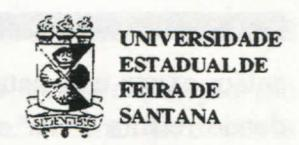
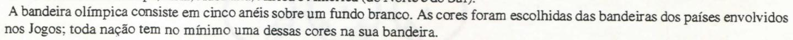
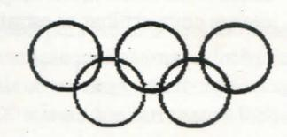
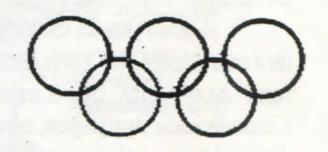
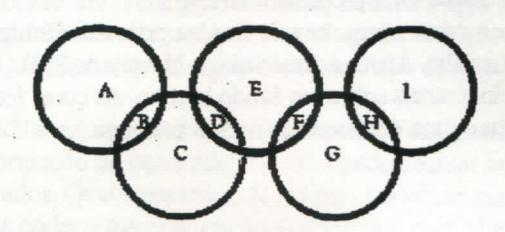
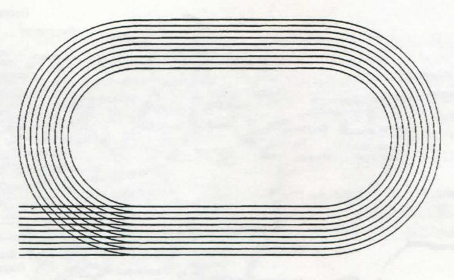

# FOLHETIM DE EDUCAÇÃO MATEMÁTICA

Ano 3 - número 52 - Folhetim de Educação Matemática - Departamento de Ciências Exatas

Julho/1996

### **OBJETIVO**

Este Folhetim é um veículo de divulgação, circulação de idéias e de estímulo ao estudo e à curiosidade intelectual. Dirige-se a todos os interessados pelos aspectos pedagógicos, filosóficos e históricos da Matemática. Pretende construir uma ponte para unir os que estão próximos e os que estão distantes.

### **EDITORIAL**

Neste mês de julho, as atenções mundiais estão voltadas para os Jogos Olímpicos, que neste ano acontecem nos Estados Unidos.

Aproveitando o evento, o Folhetim publica neste número a tradução de um artigo do NCTM (National Council of Teachers of Mathematics), órgão responsável pela promoção das Olimpíadas Internacionais de Matemática, que teve como tema principal das atividades preparatórias os Jogos Olímpicos.

Lembramos também a você que a partir do número 54, apenas aqueles que nos devolveram a ficha de avaliação anexa ao número 48, receberão o *Folhetim*. Isso vale apenas para os leitores cadastrados até setembro de 1996.

# COMITÉ EDITORIAL

Carloman Carlos Borges (Doutor) Inácio de Sousa Fadigas (Mestre) Wilson Pereira de Jesus (Mestre)

# PERGUNTE QUE O NEMOC RESPONDE

**Pergunta.** Mariângela H. Silva de Curitiba nos pergunta: Qual a sua opinião a respeito da demonstração seguinte de que qualquer número real a elevado a zero igual a  $1? a^m : a^m = 1$  (divisão comum) (I);  $a^m : a^m = a^{m-m} = a^0$  (divisão de potência de mesma base) (II). Ora, de (I) e (II) é fácil concluir que  $a^0 = 1$ . Peço-lhe sua opinião porque um colega daqui - sem me convencer - diz que se trata de uma demonstração errada.

R. Realmente, já vimos esta demonstração em alguns manuais didáticos usados ingenuamente por nossos incautos alunos. Seu colega tem razão; esperamos que nossos argumentos lhe convençam. Recordemos, juntos, a pequena teoria sobre potências inteiras. Definição: para todo número real <u>a</u> e para todo inteiro natural <u>m</u> diferente de zero, a potência m-ésima de a, representada por am, é definida por recorrência sobre m, por:

$$a^1 = a$$
$$a^{n+1} = a^n \cdot a$$

O número real <u>a</u> é a base da potência e o inteiro natural <u>m</u>, o expoente. Para <u>m</u> igual ou maior que 2 - e como resultado dessa definição - am é igual ao produto de <u>m</u> fatores iguais a<u>a</u>:

$$a^{m} = a \times a \times a \times a \times \dots$$

m fatores

De passagem, observe que:  $(a^m)^p = a^{m p}$  (m e p naturais  $\neq 0$  e <u>a</u> real).

Ainda do exposto, decorrem as seguintes regras de cálculo:  $(ab)^m = a^m \cdot b^m$  (a, b reais e m natural  $\neq 0$ );

 $(a/b)^m = a^m / b^m$ ; (a real qualquer e <u>b</u> real  $\neq 0$  e m, natural  $\neq 0$ ),  $a^m \cdot a^n = a^{m+n}$  (<u>m</u> e <u>n</u> naturais  $\neq 0$  e <u>a</u> real qualquer).

Vejamos agora de mais perto como procedemos com duas potências de mesma base:  $a^m$ :  $a^n$ . Sejam  $\underline{m}$  e  $\underline{n}$  dois naturais diferentes de zero e  $\underline{a}$  um real igualmente diferente de zero. Temos os seguintes casos: Primeiro: se  $\underline{m}$  =  $\underline{n}$ , então  $\underline{a}^m$ :  $\underline{a}^n$  =  $\underline{a}^m$ :  $\underline{a}^m$  = 1. Segundo: se  $\underline{m}$  maior que  $\underline{n}$ ,

então existe um natural p, tal que: m = n + p, donde resulta  $a^m : a^n = a^{n+p} : a^n = (a^n : a^n) \cdot a^p$  donde  $a^m : a^n = a^p = a^{m-n}$  com p = m - n. Terceiro: se for menor que n, então existe um natural q (claramente diferente de zero), tal que n = m + q. Desta forma:  $a^m : a^n = (a^m : a^m) \cdot (1 : a^q)$  que é igual a (1 : aq), com q = n - m. Do exposto você já possui elementos suficientes para ver que a passagem (II) de sua exposição acima não é válida e, por via de consequência, a demonstração apresentada, também. Uma divisão, no caso, de potência de mesma base, deve apresentar um resultado bem definido; ela não pode apresentar como resultado, nesta altura da exposição, ao, pois ao não significa nada para nós, ainda. Examinando os três casos acima, aparentemente diferentes, somos levados à tentação de querer unificá-los em torno do segundo caso apontado acima, isto é, se m > n, então  $a^{m}: a^{n} = a^{m-n}$ . É justamente isto o que fizeram os matemáticos com as três definições abaixo: Definição 1: qualquer que seja o número real a, não nulo, por definição  $a^0 = 1$ . Definição 2: qualquer que seja o número reala, não nulo, e para todo inteiro positivo p, por definição:  $a^p = 1$ :  $a^p$ . Definição 3: qualquer que seja o número real a, diferente de zero e qualquer que seja  $\underline{n}$ , número inteiro:  $a^{-n} = 1$ :  $a^{n}$ . Com estas três definições podemos, agora, afirmar: na divisão de potências de base iguais os expoentes se subtraem prevalecendo a fórmula do segundo caso, acima, isto é:  $a^{m} / b^{m} = a^{m-n}$  mesmo quando m = n ou m < n. Ilustremos nossa afirmação:

(i) 
$$a^{0}: a^{n} = 1: a^{n} = a^{-n}, a^{0}: a^{n} = a^{0-n} = a^{-n};$$
  
(ii)  $a^{0}: a^{-n} = 1: \underline{1} = a^{n}, a^{0}: a^{-n} = a^{0-(-n)} = a^{n};$   
(iii)  $a^{-n}: a^{-m} = (1:a^{n}): (1:a^{m}) = a^{m}: a^{n} = a^{n}$ 

 $= a^{m-n}, a^{-n}; a^{-m} = a^{-n-(-m)} = a^{-n+m} = a^{m-n}$ 

Isto mostra serem as definições dadas compatíveis comesta lei que rege divisão de potências de mesma base com expoentes inteiros relativos. A colega poderá comprovar essa compatibilidade também com as demais leis formais da potenciação. Este Princípio de Compatibilidade Lógica entre as

novas definições e os teoremas previamente estabelecidos em uma determinada teoria matemática deve sempre ser respeitado. Vejamos um contra-exemplo: suponhamos que  $a^0 = 1$  mesmo para a = 0. Suponhamos  $0^{\circ} = 1$  (por "definição"). Logo:  $0:0=0^{\circ} = 1$  e  $4 = 4.1 = 4.0^{\circ} = 4.(0:0) = (4.0):0 = 0:0 = 0^{\circ} = 1.$ Isto mostra que tanto o símbolo 0º como como a divisão por zero devem ficar indefinidos, pelo menos neste contexto. Não se pode dar uma definição para tudo e nem tudo pode ser demonstrado. O exposto nas linhas acima envolve idéias básicas, as quais tentaremos explicitar. A primeira delas diz respeito ao que seja uma definição matemática. Vejamos isso com algum detalhe. As definições mais usuais nessa ciência são: (a) definicões nominais ou explícitas: (b) definições por abstração; (c) definições por recorrência. Todos os três tipos acima possuem a característica comum: introduzem no vocabulário da teoria T. em estudo, termos novos: a conhecida definição de círculo como lugar geométrico dos pontos do plano equidistantes de um ponto fixo desse mesmo plano é uma definição nominal ou explícita. este tipo de definição assume uma das três formas: (I) A é igual por definição a B. Nesta, o sinal de igualdade é empregado em um sentido diferente do de identidade e, por conseguinte, é preciso cuidado no seu manejo. Assim, se você diferenciar em relação a x ambos os membros da igualdade: cos(x + a) = cos x cos a - sen x sen b, obtemos como resultado outra identidade mas, se fizer o mesmo com a equação 2x = 4 obterá um resultado extravagante; (II): A é o único objeto a possuir a propriedade B. Exemplo: 7 = o maior número primo de um algarismo: (III): A se verifica para todo x se e somente se B se verifica para todo x. Exemplo:  $x: y = z \ll x = z. y.$  As definições por abstração, talvez as mais importantes em matemática, foram tratadas muito bem pelo matemático H. Weyl em sua obra Filosofia das Matemáticas (em espanhol), Centro de Estudos Filosóficos. Nas primeiras páginas, sob o título: A definição construtiva, esse brilhante matemático desenvolve o assunto. Exemplos desse tipo de definição: (i):a definição de número cardinal; dois conjuntos determinam o mesmo cardinal se e somente se são numericamente equivalentes;

(ii): a definição de vetor como um conjunto infinito de segmentos orientados; (iii): definição de direção é o outro exemplo de uma definição por abstração. Mais minuciosamente: seja a conhecida relação de paralelismo entre as retas do plano euclidiano E, trata-se de uma relação de equivalência. Sabemos que numa tal relação de equivalência dois elementos são equivalentes se, e somente se, eles determinam a mesma classe de equivalência; logo, o que duas retas possuem em comum é a classe de equivalência, definindo-se a direção de uma reta x como sendo sua classe de equivalência x no conjunto das retas de E. Aliás. formar classes de equivalência é a atividade por excelência da racionalidade humana. Veja, exemplificando, a nocão de verde. Como ela é construída pela razão humana? Esta noção é uma qualidade que nos permite estabelecer uma relação de equivalência entre elementos por assim dizer. desiguais: a grama de um campo de futebol, a pintura de uma parede, as folhas de uma amendoeira e. também, os olhos da bem amada: ela é criada quando "deixamos de lado" tudo menos a cor. E. de onde surge o conceito de cor? Da mesma forma, por intermédio de relações de equivalência. Nossos sentidos trabalham efetuando seleções de semelhanças e diferenças: partindo desta eles constróem aquelas. Nosso pensamento opera de maneira análoga. Provavelmente centenas de anos se passaram para o homem fixar-se na propriedade comum aos conjuntos: parelha de cavalo, junta de bois, par de sapatos, casal de coelhos e, desta forma, atingir a noção de dois. Por último vêm as definições recursivas ou por recorrência. Ela serve para introduzir ou definir funções como o fizemos mais acima ao definir  $a^1 = a e a^{n+1} = a^n$ , a. Ela exibe uma das características básicas dos números naturais: dado um número natural n qualquer existe sempre o seguinte, isto é, o número natural n + 1. Quando os matemáticos definem aº=1, o fazem levando em consideração sua compatibilidade lógica com os teoremas previamente estabelecidos. Em uma teoria matemática existem o que se chama: leis formais. Elas exibem as diversas formas pelas quais os dados podem ser arranjados sem que os resultados sofram alterações. As regras de cálculo

mostradas logo no início de nossa exposição são leis formais da potenciação. Assim, as diversas definições constantes do corpo dessa teoria devem ser dadas de modo a que essas leis permanecam válidas. Um outro exemplo elementar: a conhecida e misteriosa regra dos sinais: na multiplicação ordinária define-se a multiplicação de um número inteiro negativo por outro inteiro negativo dando como resultado um inteiro positivo. Qual o porquê dessa definição? É porque ela é compatível com a regra da distributividade: a.(b + c) = ab + ac. Assim acontece com todas as demais definicões referentes aos inteiros negativos e as frações, na aritmética elementar. Elas não podem ser demonstradas: comoassinalam os matemáticos R. Courant e H. Robbins, em sua obra Que é a Matemática? (leitura obrigatória para os professores de matemática) o que se pode - e deve - é ur camente mostrar é o fato de que com tais c inições as leis comutativa, associativa e distriutiva da aritmética se conservam. E logo en seguida acrescentam: O grande matemático Eul: deu um argumento pouco convincente para me trar que (-1)(-1) deve ser igual a + 1. Di ia: dito produto deve ser +1 ou -1, porém, não pode ser -1, posto que -1 = (+1)(-1). Cabe perguntar: e porque -1 = (+1)(-1)?... A idéia de que as leis formais de uma teoria matemática devam ser conservadas na generalização de novos conceitos é conhecido como Princípio de Permanência das Leis Formais, enunciado assim por Hankel: Ao generalizar um conceito se deve tratar de conservar o maior número de propriedades, e ao novo conceito deve corresponder como caso particular ao anterior. Na extensão de uma definição (como a de aº = 1) devemos considerar o Princípio logo acima mencionado. Alguns autores de livros sobre matemática costumam, contudo, exagerar sua importância mesmo quando o desenvolvimento moderno dessa ciência e de outras se dirigem em sentido contrário a essa postulação. Basta lembrar o surgimento de novas geometrias a partir, inicialmente, da negação do postulado das paralelas de Euclides; a criação de novas álgebras com a negação da lei comutativa da multiplicação; a emergência

de novas lógicas denominadas lógicas multivalentes. Em 1931 foi considerada a plausibilidade de uma lógica trivalente na qual uma proposição pode assumir três valores lógicos possíveis; em 1932, H. Reichenbach criou uma lógica infinitovalente na qual uma proposição p pode assumir um qualquer de infinitos valores lógicos possíveis. a qual deveria servir, segundo ele, como base para a teoria matemática das probabilidades. Contestação! Esta é a palavra chave subjacente ao progresso científico. Transcrevemos o trecho de Howard Eves. em sua obra Introdução à História da Matemática. tradução Hygino H. Domingues, Editora da Unicamo: Quando se perguntou a Einstein como havia feito para descobrir a teoria da relatividade ele respondeu, 'Contestando um axioma'. Lobachevsky e Bolyai contestaram o postulado das paralelas de Euclides; Hamilton e Cayley contestaram a lei comutativa da multiplicação; Lukasiewicz e Post contestaram a lei do terceiro excluído da lógica aristotélica. Analogamente no campo das ciências naturais Copérnico contestou o axioma que punha a Terra no centro do Sistema Solar; Galileu contestou o axioma da proporcionalidade direta entre o peso de um corpo e a rapidez de sua queda; Einstein contestou o axioma segundo o qual de dois instantes distintos um deveria preceder o outro. Esta contestação construtiva de axiomas tornou-se uma das maneiras mais comuns de produzir avanços na matemática e certamente esse desafio se enquadra no âmago do aforismo de Georg Cantor: 'A essência da matemática reside em sua liberdade'.

Pergunte que o NEMOC Responde é uma coluna de autoria do prof. Dr. Carloman Carlos Borges e objetiva atingir ao público interessado em Matemática nos seus múltiplos aspectos.

Caso o leitor queira fazer alguma pergunta relacionada aos aspectos pedagógicos, filosóficos e históricos da Matemática, escreva-nos.

# PRÓXIMO NÚMERO

Resposta para a pergunta: Sendo a Matemática basicamente uma linguagem, acho que os pedagogos modernos estão com razão quando afirmam que em seu ensino (isto vale, também, para outros campos) deve prevalecer o diálogo. Aulas dialogadas em lugar de aulas expositivas. Outra lição: o ensino deve ser mais formativo do que informativo. O que você pensa disto tudo?

Aguardem!

# **NÚMEROS ATRASADOS**

Envie para cada folhetim um selo de postagem nacional de 1° porte. Dentro de no máximo quatro semanas, contadas a partir da data de recebimento do seu pedido, você estará recebendo os folhetins solicitados.

OBS.: É permitida a reprodução total ou parcial desse folhetim, desde que citada a fonte.

### NEMOC - NÚCLEO DE EDUCAÇÃO MATEMÁTICA OMAR CATUNDA

Folhetim de Educação Matemática Ano 3. n. 52 Julho/96

Editores: Carloman e Inácio

Editoração e Impressão: Núcleo de

Editoração Gráfica - NUEG

Tiragem: 1.500 exemplares

Endereço: Av. Universitária, s/n - km 03

BR 116 - Campus Universitário

Fax:(075)224-2284-CEP 44031-460

Feira de Santana - BA - BRASIL

e-mail: nemoc@uefs.br

# OLIMPÍADAS DE MATEMÁTICA(\*)

Quando promoveu a 2a. Olimpíada Internacional de Matemática, em abril de 1996, o NCTM (Conselho Nacional de Professores de Matemática) dos EEUU, publicou um folheto onde sugeriu algumas atividades preparatórias que os professores deveriam desenvolver com os seus alunos acerca do tema do evento, que foi Os Jogos Olímpicos. Transcrevemos aqui parte desse folheto interessante.

### Parte I. A Bandeira Olímpica e seus anéis

O logotipo oficial para os Jogos Olímpicos consiste de cinco círculos entrelaçados, ou anéis, nas cores preta, azul, verde, vermelha e amarela. Este símbolo foi desenvolvido pelo Barão Pierre de Coubertin, que foi o fundador dos Jogos Olímpicos Modernos.

Os cinco anéis representam os cinco continentes envolvidos na primeira Olimpíada moderna, ocorrida em 1896: Europa, Ásia, Austrália, África e América (do Norte e do Sul).

### Atividades

### Desenhos da Bandeira

Partilhe com a sua classe algumas das tradições da bandeira olímpica. Desenhe uma versão grande da bandeira olímpica para a classe ver, mas não pinte os anéis. Os alunos considerarão as cores dos anéis nas seguintes atividades

1. Colorir a Bandeira. Peça a cada aluno que desenhe uma bandeira e pinte os anéis de preto, azul, verde, vermelho e amarelo, usando cada cor uma vez em qualquer ordem que eles escolherem. Peçalhes também para comparar suas bandeiras para ver se há duas exatamente iguais. Mostre-lhes uma foto da bandeira olímpica real. Alguns dos anéis da bandeira deles foram coloridos exatamente como aqueles da bandeira real?

Quantas bandeiras diferentes podem ser feitas com as cinco cores escolhidas para os anéis?

- 2.Repita depois de mim. Peça aos alunos para escolher um par e sentarem-se de costas, de modo que não possam os pares se olharem. Cada aluno desenha sua própria bandeira com cinco anéis, numa folha de papel. Em seguida peça-lhes para descreverem cuidadosamente suas bandeiras de modo que o par possa desenhá-la sem ver o desenho. Depois então comparam os desenhos. A bandeira que um parceiro desenhou parece com a que o outro fez? Peça-lhes para explicar porque as dicas foram eficazes ou não.
- **3.**As possibilidades são. Sugira aos alunos considerar o problema de desenhar a bandeira olímpica de memória, a partir de um relato bem sucedido quando eles conhecem as cinco cores mas tenham esquecido a ordem das cores. Qual é a probabilidade de que eles desenhem suas bandeiras corretamente? Como seria a mudança de probabilidade se eles lembrassem somente que um dos anéis superiores é vermelho? Mudaria a probabilidade se eles lembrassem a cor de um dos anéis inferiores em vez de um dos anéis superiores? Se catorze estudantes aleatoriamente usassem as cinco cores para desenhar os anéis, qual seria a probabilidade de que pelo menos dois dos desenhos fossem coloridos de forma idêntica? Peça aos alunos para testarem suas análises realizando um experimento na classe.

### A Lógica da Bandeira

- **4. Logicolor.** Mostre aos alunos um quadro da bandeira com os anéis não coloridos; peça-lhes para trabalhar em grupos e use as seguintes dicas para descobrir as cores dos anéis. Sugira que eles comecem com um diagrama ou desenhando e eliminando possibilidades. a) O anel preto toca dois outros anéis.
- b) O anel vermelho está à direita, diretamente ou diagonalmente, do anel amarelo.
- c) O anel verde, que não toca o anel azul, está à esquerda do anel vermelho.
- d) Os anéis azul e verde não estão no mesmo nível.
- e) O anel amarelo, que não está no centro, está à esquerda do verde, no mesmo nível.

Após um grupo ter finalizado seu trabalho, com sucesso ou insucesso, sugira aos seus membros considerarem questões tais como estas: Todas as dicas são claras? Todas as dicas são necessárias? A resposta é única? Se não, você pode criar outra dica para torná-la única?

**5.Seu próprio quebra-cabeça.** Sugira aos alunos para escreverem um problema de lógica para descrever a posição dos anéis olímpicos. Eles devem tentar as dicas com vários amigos ou familiares, e então analizá-las para ver se elas produzem sempre a mesma disposição dos anéis. Pode alguma dica ser eliminada e o quebra-cabeça ainda ser resolvido?

### Quebra-cabeças de anéis

**6.Olimpiadir.** Peça aos alunos para desenhar cinco anéis que se interceptam como na bandeira olímpica. Desafie-os a, trabalhando em grupos, usar cada um dos dígitos de 1 a 9, exatamente uma vez, para preencher as nove regiões formadas pelo entrelaçamento dos anéis, como mostrado no diagrama abaixo. A soma dos números em qualquer par de dois anéis entrelaçados deve ser igual a 20. Os alunos devem compartilhar as estratégias utilizadas enquanto trabalham.

### Parte II. A Tocha Olímpica

A tradição da Tocha Olímpica vem dos antigos Jogos Olímpicos, que começaram na Grécia há aproximadamente três mil anos atrás. A tocha simboliza paz entre os povos. A um sinal, rapazes escolhidos corriam cerca de 200 metros para capturar uma tocha pela honra de acender uma pira. Assim a própria tocha servia como uma medalha para esses primeiros Jogos Olímpicos.

A tradição da tocha foi reintroduzida em 1936 e desde então tem sido mantida. Quatro semanas antes da Cerimônia de Abertura de cada olimpíada, os membros do Comitê Olímpico se reúnem na Grécia e usam um espelho para concentrar os raios do sol sobre um ramo de oliveira, que é usado para acender a tocha. A tocha é então passada de corredor para corredor em uma corrida de Atenas até a cidade sede dos jogos, onde ela acende a pira no estádio olímpico. Esta pira queima por todos os jogos como um símbolo do espírito das nações participantes dos Jogos.

Este ano a tocha foi acesa em Olympia, Grécia, e então voou para os Estados Unidos. Lá, a corrida da tocha começou em Los Angeles, em 27 de abril e terminou no estádio Olímpico em Atlamta, na Geórgia, em 19 de julho. Cerca de 10000 corredores conduziram a tocha por 1200 cidades, com cerimônias oficiais nas duas paradas a cada dia. A rota foi escolhida para que a tocha num período de umas duas horas fosse vista por mais de 85% da população dos Estados Unidos.

### ATIVIDADES

### Trajeto da Tocha na Escola

- 7. Uma rota escolar. Descreva para a classe algo da história da tocha olímpica e como ela fez seu percurso através dos EEUU. Sugira aos alunos imaginarem que o Comitê Olímpico decidiu levar os atletas que conduzem a tocha a fazer um desvio por uma escola ao longo da rota e que a escola deles pode ser escolhida. Se um mapa da escola não está disponível, devem eles trabalhar em grupo para fazer um e desenhar um percurso da tocha através da escola. Assegure-se de que a tocha visita todas as salas exatamente uma vez. Proponha questões como as seguintes para os grupos considerarem:
- a) Onde seu percurso começará e onde findará? Em acréscimo a cada sala, o percurso deveria incluir os principais setores? O Ginásio? A enfermaria? Que outras salas deveriam ser incluídas?
- b) Pode o percurso ir por cada sala sem repetir o trajeto?
- c) Que distância irá a tocha percorrer na escola? Quanto tempo será preciso?
- d) Se o seu grupo fosse selecionado para conduzir a tocha através da escola, quanto cada aluno teria que percorrer se o percurso fosse dividido equitativamente entre vocês?

Deve cada grupo traçar seu "melhor percurso" sobre uma transparência colocada sobre o mapa (planta) da escola. Compare os percursos dos grupos, discutindo os prós e os contras de cada um. Ponha vários percursos juntos num projetor e discuta as diferenças. A classe deve determinar qual o percurso recomendado como principal e acompanhar a recomendação de uma explicação de porque este percurso é o melhor.

### A Corrida da Tocha

8. Análise do percurso. O percurso da corrida da tocha olímpica em 1996 é mostrado no mapa. Copie o mapa para uso dos alunos. A classe deve analisar o percurso elaborando uma lista de questões para responder. Esperar questões tais como estas: Por quantos estados irá passar a tocha? Quais são alguns meios que a tocha irá percorrer? Em que parte do país a tocha viajará a maior distância? Quantos dias a viajem durará? A nossa escola está dentro do trajeto de duas horas do percurso? Podemos prever em qual dia a tocha estará o mais próximo de nós?

9. Estabelecendo uma escala. Nenhuma escala aparece sobre o mapa, mas a distância aérea de Los Angeles para Atlanta é em torno de 3000 Kilômetros. Os estudantes devem sugerir modos de encontrar uma escala para o mapa; use essa informação para estimar a distância que a tocha irá realmente percorrer ao longo do percurso designado. Estenda a discussão para questões tais como estas: se a tocha viajou a mesma distância a cada dia, em torno de quantos kilômetros viajaria a cada dia? Se cada um dos 10000 atletas que carregam a tocha a conduzirão na mesma distância, quanto cada atleta conduz a tocha?

# Olympia Santita Portlant Eugene San Pousser Chayers Coder Rantita Descript San Chayers Coder Rantita Descript San Chayers Coder Rantita Descript San Chayers Coder Rantita Descript San Chayers Coder Rantita Descript San Chayers Coder Rantita Descript San Diego Tallahassee File San Diego Tallahassee Tallahassee Tallahassee Tallahassee Tallahassee Tallahassee Tallahassee Tallahassee Tallahassee Tallahassee Tallahassee Tallahassee Tallahassee Tallahassee Tallahassee Tallahassee Tallahassee Tallahassee Tallahassee Tallahassee Tallahassee Tallahassee Tallahassee Tallahassee Tallahassee Tallahassee Tallahassee Tallahassee Tallahassee Tallahassee Tallahassee Tallahassee Tallahassee Tallahassee Tallahassee Tallahassee Tallahassee Tallahassee Tallahassee Tallahassee Tallahassee Tallahassee Tallahassee Tallahassee Tallahassee Tallahassee Tallahassee Tallahassee Tallahassee Tallahassee Tallahassee Tallahassee Tallahassee Tallahassee Tallahassee Tallahassee Tallahassee Tallahassee Tallahassee Tallahassee Tallahassee Tallahassee Tallahassee Tallahassee Tallahassee Tallahassee Tallahassee Tallahassee Tallahassee Tallahassee Tallahassee Tallahassee Tallahassee Tallahassee Tallahassee Tallahassee Tallahassee Tallahassee Tallahassee Tallahassee Tallahassee Tallahassee Tallahassee Tallahassee Tallahassee Tallahassee Tallahassee Tallahassee Tallahassee Tallahassee Tallahassee Tallahassee Tallahassee Tallahassee Tallahassee Tallahassee Tallahassee Tallahassee Tallahassee Tallahassee Tallahassee Tallahassee Tallahassee Tallahassee Tallahassee Tallahassee Tallahassee Tallahassee Tallahassee Tallahassee Tallahassee Tallahassee Tallahassee Tallahassee Tallahassee Tallahassee Tallahassee Tallahassee Tallahassee Tallahassee Tallahassee Tallahassee Tallahassee Tallahassee Tallahassee Tallahassee Tallahassee Tallahassee Tallahassee Tallahassee Tallahassee Tallahassee Tallahassee Tallahassee

10. Traçando um percurso. Em pequenos grupos, devem os alunos traçar uma rota que passe por todos os quarenta e oito estados mostrados sobre o mapa e traçar o percurso sobre uma transparência. Professores canadenses podem pedir a seus alunos que modifiquem o mapa para incluir todas as províncias em vez dos estados. Os alunos devem comparar o comprimento de seus percursos com o do percurso oficial. Todos os grupos escolhem o mesmo percurso? Qual é o percurso mais longo? Qual o menor? Quanto do percurso está no Leste? Quanto no Oeste? No Norte? No Sul?

### PARTEIII A Cerimônia de Abertura

A primeira realização dos Jogos Olímpicos modernos aconteceu em Atenas, Grécia, em 1896. Foram 311 atletas representando 13 nações participantes destes jogos. Estimativas oficiais dizem que mais de 10000 atletas de mais de 190 países participarão na XXVI Olimpíada. A Cerimônia de Abertura terá lugar em 19 de julho de 1996. O primeiro evento na Cerimônia de Abertura será o (desfile) das Nações, no qual mais de 10000 atletas irá marchar no estádio. A Grécia, como o país sede dos antigos Jogos Olímpicos e da primeira Olimpíada moderna, desfilará primeiro; os EEUU, como o país sede deste ano, desfilará por último; todas as outras nações desfilarão em ordem alfabética. Cada equipe conduzirá um cartaz com o nome do seu país, e um membro da equipe conduz a bandeira do país.

### Atividades

### Tome o seu lugar na fila

- 11. Marchando em fila. A classe deve imaginar que é uma equipe olímpica e a sala é um estádio. Mova a "equipe" no "estádio". Começando fora da sala, marche em uma fila simples e calcule quanto tempo é gasto para toda a classe entrar na sala, marchar uma vez em volta, e sentar-se. Faça estimativa de quanto tempo é gasto para marcharem dois-a-dois, três-a-três. Você pode querer ler o livro 100 Formigas Famintas de Elinor Pinczes (Boston: Houghton Mifflin, 1993) para a classe e ver como 100 formigas marcharam para um pic-nic. Sugira aos alunos que façam uma estimativa de quanto tempo gastarão os 10000 atletas olímpicos para desfilar no estádio perfilados oito-emoito e entrar em forma no campo.
- 12. Equipe de retângulos de. A "equipe" deve formar um "retângulo humano" na sala. Pergunte se os estudantes podem formar um retângulo diferente; se assim, quantos retângulos diferentes eles podem fazer? Sugira a eles que considerem a partir de que tamanhos de equipes teriam muitos retângulos a escolher. Que tamanhos de equipes podem fazer apenas um ou dois retângulos?
- 13. Marchando em quadrados. No sentido de desfilar em uma formação de quadrado, a equipe necessitaria de ter um número quadrado de membros. Sua turma pode desfilar em uma formação de quadrado? Se não, pode desfilar como dois quadrados? Sugira à turma considerar uma equipe marchando em dois quadrados. Quais tamanhos de equipes poderiam marchar em uma tal formação? Por exemplo, se uma equipe tem 130 membros, ela poderia marchar em dois quadrados, com 81 em um quadrado e 49 no outro ou com 121 em um quadrado e 9 no outro. Podem quaisquer números formarem dois quadrados em dois modos?

A Pista de atletismo

### Desenhando a Pista e a área interna

- 14. A Pista. Sugira aos pares de alunos desenharem uma pista olímpica. A pista deve ter oito raias com cerca de um metro de largura; o perímetro daraia interna deve ter 400 metros. O campo dentro da pista é em forma de um retângulo com um semi círculo em cada extremo como mostrado no diagrama. A parte reta da pista é em torno de 90 metros em cada lado. Sugira que o grupo responda questões tais como estas: Qual é a escala de seu desenho? Quais são as dimensões de sua pista? Quanto é maior o lado externo da raia que o lado interno? Qual é a área do campo interno à pista?
- 15. Em pé somente. Faça com que os alunos se envolvam na discussão da área da pista e da área interna e o tamanho das equipes quando elas desfilam dentro e se reunem para a cerimônia. Se possível, sugira que usem a pista da escola e modelem fisicamente a situação para responder questões tais como estas: Quantos atletas poderiam desfilar de uma vez em torno da pista? Quantos poderiam estar confortavelmente de pé na pista quando não desfilando? Quantos poderiam estar de pé no campo? Quantas filas e colunas podem ser dispostas na pista e no campo a fim de que haja bastante lugar para todos os 10000 atletas estarem de pé confortavelmente? Como seriam as mudanças de distribuições se a cada equipe fosse dado uma área para estar de pé, proporcional à área de seu país? Ou à população de seu país?
- (\*) Tradução de Wilson Pereira de Jesus (Dep. de Educação), com revisão do Prof. Geraldo Ferreira (Dep. de Letras)

  Traduzido com permissão do World's Larges: Math Event 2, "Math Olympics". National Courcil of Techers of Mathematics, 1996.