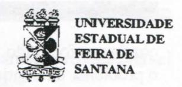
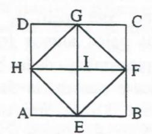

# FOLHETIM DE EDUCAÇÃO MATEMÁTICA

Ano 4 - número 53 - Folhetim de Educação Matemática - Departamento de Ciências Exatas

Ago-Dez/1996

#### **OBJETIVO**

Este Folhetim é um veículo de divulgação, circulação de idéias e de estímulo ao estudo e à curiosidade intelectual. Dirige-se a todos os interessados pelos aspectos pedagógicos, filosóficos e históricos da Matemática. Pretende construir uma ponte para unir os que estão próximos e os que estão distantes.

#### **EDITORIAL**

Os meses de agosto e setembro são particularmente especiais para o NEMOC, por serem marcos de três fatos: a) aniversário do folhetim (o 1º número foi publicado em agosto de 1993); b) aniversário de morte de Omar Catunda, que se deu em 12 de agosto de 1986, em Salvador-Ba portanto, completando 10 anos; c) aniversário de nascimento de Omar Catunda (03 de setembro de 1906, em Santos-SP). Estaria portanto completando 90 anos.

Para marcar estas datas significativas, publicamos novamente neste número, um artigo do professor Omar Catunda intitulado "O ENSINO DE MATEMÁTICA: Conceito e Caricatura" já publicado no Folhetim do NEMOC nº 1, ano 1.

O leitor pode perceber que este número corresponde aos meses de agosto a dezembro. Tal iniciativa foi necessária para que pudéssemos atualizar nosso Folhetim. O próximo número (54) corresponderá aos meses de janeiro a maio. Pedimos desculpas aos nosos leitores.

# COMITÉ EDITORIAL

Carloman Carlos Borges (Doutor) Inácio de Sousa Fadigas (Mestre) Wilson Pereira de Jesus (Mestre)

# PERGUNTE QUE O NEMOC RESPONDE

Pergunta. Abaixo a transcrição de um trecho da carta enviada por Marta R. L. Borges, residente na Tijuca, Rio de Janeiro: Sendo a Matemática basicamente uma linguagem, acho que os pedagogos modernos estão com razão quando afirmam que em seu ensino (isto vale, também, para outros campos) deve prevalecer o diálogo. Aulas dialogadas em lugar de aulas expositivas. Outra lição: o ensino deve ser mais formativo do que informativo. O que pensa você disto tudo?

R. Não estou convencido de que a Matemática é (no sentido de identidade) basicamente uma linguagem, pois sendo assim, seria uma linguagem formal. Ora, os trabalhos de Kurt Gödel, publicados na década de 30. respondem negativamente ao projeto de formalização completa dessa ciência - sonho acalentado por Hilbert. Penso ser melhor falar em linguagem matemática. Realmente, esta ciência possui uma linguagem que lhe é peculiar e, a esta, chamemos de linguagem matemática. Exemplificando: na definição de continuidade de uma função em um ponto x, começa-se falando em uma grandeza arbitrariamente pequena em relação a outra suficientemente pequena, porém, como entender estas duas frases sem ambiguidade? A Matemática, através de sua própria linguagem, responde por meio de uma dupla desigualdade, tão conhecida pelos alunos iniciantes de cálculo elementar, sem qualquer ambiguidade. Naturalmente que a linguagem científica é parasitária da linguagem natural mas, como diz René Thom, um dos grandes topólogos contemporâneos (Vide Parábolas e Catástrofes, Publicações Dom Quixote) o que existe de específico (ele refere-se à linguagem matemática) creio, é a possibilidade de definir variações contínuas que não são descritíveis lingüisticamente. Um exemplo de variações

contínuas foi dado por nós quando mencionamos o problema da continuidade, logo acima. Você deve observar que um dos elementos básicos da linguagem natural é a frase e, esta, é formada por elementos discretos que são as palavras, as quais, por sua vez, são formados também por elementos discretos. que são as letras. Isto pode significar a impossibilidade de uma linguagem natural trabalhar bem com processos contínuos como, citando mais uma vez, o processo de continuidadede de uma função em um determinado ponto. Isto, por si só, no meu entendimento, justifica a linguagem matemática. O diálogo, como recurso pedagógico data de pelo menos, do século IV a.C. no qual viveu o grande filósofo Sócrates, que fez dele o método de sua filosofia. Como está escrito nos livros de filosofia, o diálogo socrático abrange três momentos: a ironia, a maiêutica e a indução. O primeiro momento consistia em levar o interlocutor a tomar consciência da própria ignorância e a assumí-la. Isto era feito por intermédio de perguntas judiciosas. Em seguida (no segundo momento) procura-se extrair de seu espírito o conhecimento desejado, o qual, segundo Sócrates, consistia numa simples reminiscência de vidas passadas. Era como se fora o trabalho das parteiras que ajudam as crianças a nascer. No diálogo Ménon, de seu discípulo Platão, este mostra como Sócrates procedia. Dialogando com um escravo ignorante em relação à Geometria. Sócrates levá-o a descobrir que o quadrado contruído sobre a diagonal de um quadrado dado tem o dobro da área deste. Inicialmente, o filósofo, provavelmente na areia, desenha a figura:

Através de perguntas habilmente conduzidas, onde surge bem claro a ironia socrática, o filósofo

passa a maiêutica quando o escravo afirma: a) o quadrado dado ABCD é quatro vezes maior que o quadrado dado EBFI; b) cada uma das linhas do quadrado EFGH corta e divide em duas partes iguais o quadrado menor, como, exemplificando, o quadrado IGDH; c) que o quadrado EFGH é, assim, a metade do quadrado ABCD: d) que EFGH tem a área que é o dobro da área de EBFI. Conclusão final: a área do quadrado (EFGH) construído sobre a diagonal do quadrado dado (EBFI) é duas vezes a área deste. Uma vez mostrado que conhecer é recordar - isto acaba de ser feito na matemática - Sócrates generaliza e acrescenta que seu método vale para qualquer outro ramo do conhecimento humano. Este momento é o último momento do diálogo socrático e é chamado, como foi dito acima, de indução. Podemos, agora, formular duas contestações ao método socrático. A primeira: Sócrates já conhecia o resultado final e a ele conduziu o escravo através de perguntas judiciosas; como seria, por exemplo, um diálogo desta natureza entre dois escravos desconhecedores dos princípios da Geometria?; a segunda: como Sócrates - mesmo estando de posse desse conhecimento - faria para o escravo recordar um conhecimento que não fosse lógico, como por exemplo, a posição geográfica da ilha de Samos? Como vê, Marta, o diálogo como recurso pedagógico é empregado desde a antiguidade grega. Aliás se você ler PAIDÉIA, com o subtítulo: A Formação do Homem Grego, monumental obra de Werner Jaeger, editada por Martins Fontes/Editora Universidade de Brasília, constatará que muita coisa dita moderna já era praticada pelos gregos. A determinação. a auto-disciplina e a perseverança por parte de quem deseja aprender algo com certa verticalidade são insubstituíveis. O professor deve conhecer os diversos processos cognitivos empregados na aprendizagem; deve, também, resguardar-se ante alguns modismos pedagógicos e sua consequência imediata: a superficialidade: deve ater-se mais às modernas pesquisas em áreas, exemplificando, como a neurologia, como a psico-neurologia, à

antropologia, à sociologia, etc. Esta preocupação o deixará - espero - imune às pseudo teorias pedagógicas. Evidentimente: o ensino deve ser basicamente formativo, porém, jamais o será se não possuir uma componente informativa. Aqui, podemos discutir aquilo que é costume designar-se por dicotomia. De maneira formal, uma dicotomia é uma partição de um conjunto em dois subconjuntos DeE, disjuntos, isto é: D  $\cup$  E = C e D  $\cap$  E =  $\emptyset$ . Imediatamente desta definição conclui-se pela falsidade da dicotomia informativo-formativo. As falsas dicotomias se espalham por todas as áreas. Em Matemática podemos alinhar algumas: matemática pura-matemática aplicada; adestramentocompreensão; informativo-formativo; práticateoria; ensino-criatividade. Alguns comentários sobre elas: em agosto de 1990, em Tóquio. na abertura do Congresso Internacional de Matemáticos, foram proclamados os vencedores da medalha Fields, a mais alta distinção internacional na área de matemática: Vladimir Drinfeld. Vaughan Jones, Shigefumi Mari e Edward Witten. O último mencionado é professor de física no Institute for Advanced Study of Princeton. Isto deve mostrar a falsidade da dicotomia matemática puramatemática aplicada. Há um ramo da matemática denominado de Análise Funcional de importância considerável e, sem medo de errar, acrescentamos que foram as necessidades da Física que o criaram. No ensino, o fazer deve preceder o compreender: um pouco de adestrameno deve facilitar a compreensão, da mesma forma que, sem informação não deve haver alguma formação. É preciso, em discussões desse tipo, não substituir o real pelo imaginário. O real foi muito bem retratado por um estudo do Educational Testing Service, Princeton, N.J. cf. Time, 18 de junho de 1956 quando conclui: ... a Matemática tem a duvidosa honra de ser a matéria menos apreciada do curso ... Os futuros professores passam pelas escolas elementares a aprender a detestar a Matemática. Depois, voltam à escola elementar para ensinar uma nova geração a detestá-la. Esta citação tirei-a do livro Arte de Resolver Problemas, de G. Polya,

Editora Interciência, obra altamente recomendável aos professores de matemática.

Pergunte que o NEMOC Responde é uma coluna de autoria do prof. Dr.Carloman Carlos Borges e objetiva atingir ao público interessado em Matemática nos seus múltiplos aspectos.

Caso o leitor queira fazer alguma pergunta relacionada aos aspectos pedagógicos, filosóficos e históricos da Matemática, escreva-nos.

#### PRÓXIMO NÚMERO

Resposta para a pergunta: Que entende você sobre Educação Matemática?

Aguardem!

# **EDUCAÇÃO E ENSINO**

# O ENSINO DA MATEMÁTICA \* Conceito e Caricatura

Omar Catunda \*\*

No mundo civilizado, duas coisas se exigem de cada indivíduo, como base para a convivência com os seus semelhantes:

a) que seja capaz de se comunicar, tanto oralmente como por escrito; b) que saiba raciocinar para compreender o mundo que o rodeia. Sobre essas bases, pode o indivíduo apreender outras coisas igualmente indispensáveis em qualquerramo de atividade a que se dedique: a posição que ocupa a sua comunidade no espaço (geografia) e no tempo (história); a estrutura física e química do mundo em que vive, os múltiplos aspectos da matéria viva, a organização da sociedade, e assim por diante.

A primeira dessas exigências básicas é possibilitada pelo aprendizado da língua comum, processo que tem início quando a criança aprende a falar, geralmente entre 1 e 2 anos; depois, lá

pelos 5 a 7 anos, a criança aprende a ler e escrever. o que amplia consideravelmente o espaço atingido pela comunicação. Esse processo é completado pelo estudo da gramática, que permite à criança e ao adolescente adquirir o completo domínio do idioma natal.

No presente artigo, pretendo focalizar a segunda das exigências mencionadas acima, que é o objeto da Matemática.

É sabido e facilmente comprovado, que aos 2 ou 3 anos a criança começa a aprender a contar; pouco a pouco vai ampliando o campo dos números conhecidos e quando for capaz de escrever, aprenderá também o sistema decimal de numeração. Durante o curso primário, é possível ensinar, progressivamente, as quatro operações, com muitas aplicações, bem como as principais figuras geométricas e suas medidas.

Mas muito cedo desponta na criança uma nova curiosidade, um rudimento deraciocínio de que étípica a pergunta "por que?", com que muitas crianças azucrinam a paciência dos pais. É que o cérebro humano, desde a infância, não se contenta em receber e arquivar na memória as informações fornecidas pelos sentidos; ele tem exigências dinâmicas, precisa conhecer a razão dos fatos que presencia, a concatenação dos fenômenos e das idéias. Essa exigência da mente humana é que constitui a função essencial do ensino da Matemática, ao longo da infância e da adolescência. Esse treinamento do raciocínio, essa formaçãodo ser racional, é muitíssimo mais importante do que o conhecimento de fórmulas e regras decoradas para resolver problemas padronizados.

Como a formação da mentalidade se processa ao longo de vários anos, é preciso que o ensino de cada tópico seja adaptado ao estágio de desenvolvimento intelectual dos alunos. Por isso, o planejamento de um ensino formativo, com os sucessivos processos racionais - experimentação, justificação intuitiva , comparação com resultados conhecidos , prova e demonstração -só pode resultar de uma colaboração de matemáticos e pedagogos especializados.

Convém ainda assinalar o seguinte:

1. Como o desenvolvimento do raciocínio exige o uso da fala ou da escrita, o ensino da matemática pressupõe o uso correto da língua; assim para eficiência desse ensino é indispensável o aperfeiçoamento do ensino da língua pátria.

2. O ensino da matemática é cumulativo em todas as etapas, isto é, o estudo de cada teoria exige o conhecimento das noções e teorias que lhe servem de base. O ensino de álgebra exige o pleno conhecimento do campo racional e das propriedades das operações, a geometria analítica pressupõe o conhecimento do campo real, da álgebra e da geometria elementar, e assim por diante.

3. Sendo a matemática uma disciplina formativa, seu aprendizado requer do aluno um permanente esforço intelectual (assim como o aprendizado de qualquer esporte exige um esforço físico para o desenvolvimento dos músculos). É inútil e contraproducente a preocupação de facilitar ao máximo esse estudo.

As considerações anteriores, que refletem as concepções dominantes nos congressos internacionais de ensino da matemática, podem ser confrontadas com as a caricatura desse ensino, que predomina desse ensino, que predomina no Brasil. Nosso atraso nessa questão é devido a um sem número de fatores históricos, mas atualmente predomina a exiguidade das verbas destinadas à educação, a calamitosa maximização levada a efeito sem a melhoria da estrutura existente e enorme deficiência do ensino superior. Nestas condições só aprende matemática a ínfima minoria dos que têm decidida vocação e que a rigor poderiam estudar sozinhos, dispensando o professor. De nada adiantam reformas de ensino, se não se muda da mentalidade, se as autoridades não se compenetram da verdade aceita no mundo civilizado, tanto capitalista como socialista: "O maior capital de que dispõe uma nação é o homem e todo investimento destinado ao seu aperfeiçoamento rende mais do que qualquer outro".

- \* Artigo publicado no Jornal da Universidade, nº 4, outubro/1980 UFBA.
- \*\* Omar Catunda foi professor na UFBA de 1963 a 1986, quando faleceu.

### **NÚMEROS ATRASADOS**

Envie para cada folhetim um selo de postagem nacional de 1º porte. Dentro de nomáximo quatro semanas, contadas a partir da data de recebimento do seu pedido, você estará recebendo os folhetins solicitados.

OBS.: É permitida a reprodução total ou parcial desse folhetim, desde que citada a fonte.

#### NEMOC - NÚCLEO DE EDUCAÇÃO MATEMÁTICA OMAR CATUNDA

Folhetim de Educação Matemática Ano 4. n. 53 Agosto-Dezembro/96

Editores: Carloman e Inácio

Editoração e Impressão: Núcleo de

Editoração Gráfica - NUEG

Tiragem: 1.500 exemplares

Endereço: Av. Universitária, s/n - km 03

BR 116 - Campus Universitário

Fax:(075)224-2284-CEP 44031-460

Feira de Santana - BA - BRASIL

e-mail: nemoc@uefs.br