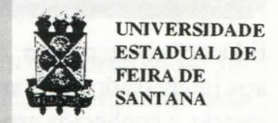

# FOLHETIM DE EDUCAÇÃO MATEMÁTICA

Ano 4 - número 54 - Folhetim de Educação Matemática - Departamento de Ciências Exatas

Jan-Mai/1997

#### **OBJETIVO**

Este Folhetim é um veículo de divulgação, circulação de idéias e de estímulo ao estudo e à curiosidade intelectual. Dirige-se a todos os interessados pelos aspectos pedagógicos, filosóficos e históricos da Matemática. Pretende construir uma ponte para unir os que estão próximos e os que estão distantes.

#### **EDITORIAL**

Queremos agradecer aos leitores que nos enviaram a ficha de avaliação anexa ao _Folhetim_ nº 48. Certamente você é um deles, pois conforme anunciado em números anteriores, a devolução da ficha preenchida condicionaria o recebimento dos próximos números.

Neste número, que é o primeiro de 1997, incluimos uma coluna nova intitulada "Divertimentos Matemáticos". Esta coluna é uma colaboração do Prof. Thomaz de Jesus Ramos.

Esperamos com isto atender a um considerável percentual de leitores que nos sugeriram tal abordagem, em suas avaliações.

# COMITÉ EDITORIAL

Carloman Carlos Borges (Doutor) Inácio de Sousa Fadigas (Mestre)

# PERGUNTE QUE O NEMOC RESPONDE

Pergunta. Muitos colegas têm indagado: mas, que é mesmo Educação Matemática?

R. A Educação Matemática é considerada pelos seus especialistas uma disciplina própria, pois possui seus próprios problemas. Trata-se, porém, de uma disciplina ainda em construção e, nos estudos promovidos pela UNESCO acerca das tendências atuais do ensino nas diversas ciências, a educação matemática começa a desenvolver-se a partir de 1973. De lá para cá, muitos cursos de pós-graduação a nível de mestrado e mesmo de doutorado foram criados e já produziram seus mestres e doutores. Embora seja uma disciplina bem recente, ela apresenta alguns objetivos e metas, entre os quais pode-se destacar quatro pontos: a) as pessoas deveriam ter oportunidades para adquirir uma competência matemática adequada a suas potencialidades e interesses; b) os educadores, durante o processo de estudos escolares, deveriam reconhecer que a futura necessidade de instrução matemática difere muito de uma pessoa para outra; c) a basilar importância da matemática em nossa ciência, e mesmo na sociedade hodierna, deveria ser discutida para poder, em consequência, ser reconhecida e fomentada; d) a habilidade para usar matemática deveria ser desenvolvida, tanto em seu aspecto utilitário como especulativo, porém voltada sempre para a melhoria qualitativa da vida (UNESCO, 979:209). Estes quatro pontos foram copiados do livro: Professor e Pesquisador, de José Valdir Floriani, Editora da FURB, Blumenau, 1994. A sua leitura (leitura do livro) é proveitosa àqueles desejosos de se aprofundarem no assunto em tela. Segundo a Profa Amélia Maria Noronha Pessoa de Queiroz, uma das principais atividades da educação matemática é determinar o conteúdo do currículo. Que matemática deveria ser estudada nas escolas? Por quem? Todos ou alguns estudantes?... Boletimjunho/ 80-9-GEPEM, Grupo de Estudos e Pesquisa em

Educação Matemática. Aconselhamos a leitura do artigo aos interessados. No artigo: Sobre o Ensino da Geometria, a conhecida especialista Maria Laura M. Leite Lopes, transcreve as seguintes afirmações de Richard Courant sobre a atuação do professor: Em Educação Matemática é verdade que o método dedutivo, começando com axiomas aparentemente dogmáticos, proporciona um atalho para a travessia de um extenso território. Entretanto, o método socrático. construtivo, partindo do particular para o geral e que evita o impulso dogmático, conduz com mais segurança à formação do pensamento produtivo independente... (Vide Boletim-junho/83-15-GEPEM). Ouanto ao método socrático mencionado pelo ilustre matemático, nosso leitor poderá consultar o Folhetim nº 53. Ainda sobre o mesmo assunto, há o livro Educação Matemática: da teoria à pratica, Ubiratan D'Ambrosio - Campinas - SP: Papirus, 1996 - Coleção Perspectivas em Educação Matemática. O autor é muito conhecido entre aqueles que se dedicam a educação matemática.

Para o nosso entendimento, a educação matemática se insere em um contexto maior, mais abrangente: o conceito de educação. Esta; para nós, deve ser uma estratégia da sociedade visando à atualização das potencialidades de todos os seres humanos, objetivando, fortemente, a torná-los cidadãos, isto é, pessoas conscientes de seus deveres e direitos. Mais ainda, não basta possuir uma consciência: é imprescindível, a partir desta, lutar por esses deveres e direitos sem qualquer pusilanimidade. Assentada esta premissa, educação matemática, para nós, é a pesquisa sobre o ensino de Matemática e, por via de consequência, a sua socialização. Devemos contar com o auxílio da Psicologia Cognitiva e da Psicologia Social bem como de outras ciências - como, exemplificando, a neurologia - capazes de iluminarem o cérebro humano, levando-nos a compreensão do que seja o processo da compreensão. Naturalmente, é possível aumentar o elenco dos problemas pertinentes a disciplina em questão: deixamos de fazê-lo pois estamos firmes no convencimento de que as teses básicas foram já apresentadas acima. Por uma questão de honestidade, é preciso acrescentar que ainda estamos no terreno do imaginário. O real, isto é, o que se passa nas salas de

aulas, o que aí se ensina, como se avalia, enfim, toda a prática pedagógica encontra-se muito distante da nobreza dos propósitos da educação matemática. Em primeiro lugar o mais importante: conhecer muito bem o que é ensinado. Quanto a este aspecto, qual é o real? O professor de matemática poderia participar, como personagem central do livro Humilhados e Ofendidos do escritor russo Dostoievski. Ele se acha em tal situação que o próprio nome de professor já vem sendo substituído pelo de tio, tia e, até mesmo, em algumas disciplinas, pelo duvidoso nome de facilitador.

Nunca é demais ressaltar que a condição mais importante para se falar com proveito sobre matemática, é conhecê-la suficientemente. A ausência dessa condição ou a sua presença bem pálida nos faz lembrar o trecho abaixo extraído do livro Matemática Elementar, a partir de um ponto de vista superior, Felix Klein: Aritmetica y Algebra. Ibero-Americana, Buenos Aires: O professor Thomae, qualificava, àqueles que se ocupam quase exclusivamente de investigações abstratas e lógicas sobre entes que nada significam e princípios que nada dizem ... com a feliz denominação de pensadores sem pensamento. Pensadores sem pensamento, repetimos, caracteriza muito bem uma pleiade que, neste Brasil oceânico, fala e escreve sobre tudo sem qualquer compromisso com a competência. Quando se trata de Matemática, isto étão evidente, que nos faz voltar aos tempos de Euclides (século III a.C.) e acreditar em coisas evidentes por si mesmas. Vejamos mais de perto a questão. Que se nota, imediatamente, quando folheamos um desses manuais de matemática?

Resposta: ausência completa de unidade metodológica e, por via de conseqüência, desenvolvimentos desorganizados dos assuntos alí tratados. Alguns exemplos ilustrarão a tese. Emprimeiro lugar, os autores desses manuais fizeramuma partição no saber matemático; assim, são apresentadas, de modo dicotômico, as disciplinas: Álgebra Linear, Geometria Analítica, Equações Diferenciais Lineares; no segundo grau, só para ficar em um exemplo, Trigonometria e Números Complexos. Tais partições servem, entre outras coisas, para criar o grande hiato entre o ensino secundário e o ministado em nossas universidades.

Este descompasso poderia ser suavizado com Introdução de Álgebra Linear e o retorno do Cálculo no segundo grau. A primeira, sendo uma das estruturas fundamentais da Matemática, poderia servir de papel unificador entre diversas disciplinas. Desesperados com tal situação, alguns (poucos) competentes e honestos escritores de manuais apelam para alguns recursos válidos na aprendizagem: os recursos audiovisuais; porém, estão exagerando na dose: alguns desses livros assemelham-se mais a histórias em quadrinhos, agora, coloridas e atraentes. Criticamos o exagero, quando modernas pesquisas indicam ser o abuso de recursos audio-visuais prejudiciais ao desenvolvimento da abstração, à habilidade de trabalhar com o geral, que é uma das metas de qualquer ensino teórico e, sobretudo da Matemática, Um probelma central entre tantos outros: as relações entre forma e conteúdo. Isto parece não ser levado em conta quando se trata de matemática. exemplifico: o aluno aprende que ab = 0 sendo $a \in b$ reais, implica na nulidade de a ou de b. Pois bem, em seguida pedimos-lhe para mostrar: se abc = 0, então a = 0 ou b = 0 ou c = 0. Além de surpreso ele se mostra incapaz de resolver a questão. Muitas vezes alguns professores nos procuram a fim de lhes tirarmos dúvidas pertinentes às operações com outros sistemas de bases diferentes da base dez. Tudo isto evidencia que o entendimento dos processos empregados - isto é, o conteúdo - não foi suficientemente "passado" ao aluno. Algum tempo atrás tivemos a oportunidade de ler em uma prestigiosa revista estrangeira artigo de uma especialista defendendo a louvável tese da inserção do ensino na cultura popular. Para tal, ela exibe o hábito de alguns camponeses nordestinos medirem área assim: a área de um triângulo é a média aritmética de 2 dos lados vezes a metade do terceiro lado. Após a exibição, a autora do artigo critica a maneira como a escola aborda o problema, uma maneira, segundo ela, incompatível com a cultura da região! Vejam bem: seguindo este método, podemos atribuir a uma mesma figura plana (numa mesma escala) dois números diferentes dependendo da escolha do primeiro par de lados! Isto é realmente surpreendente!

Mais ainda: a sua publicação em uma prestigiosa revista estrangeira! Evidentemente, a autora em questão ouviu cantar o galo e procurou-o num sentido oposto onde ele se encontrava. Ainda nesta década de 90. foi realizado em um país desse infeliz terceiro mundo Seminário Internacional sobre Aprendizagem ao qual compareceram milhares de participantes - na maioria, professores do 1º e 2º graus. Foi uma louvável iniciativa de um poder público realmente preocupado com o descalabro da educação. Muita coisa boa foi dita nesse seminário referente à pauta. Porém. uma especialista em educação matemática, entre outras tolices, afirmou: a geometria é uma espécie em extinção; se desejarmos ensiná-la não temos mais a quem recorrer, pois. acrescenta, os matemáticos não se dedicam mais à geometria. Frases como estas apresentadas por pessoas rotuladas de especialistas e proferidas com sotaque estrangeiro e sem maiores explicitamentos só podem causar prejuízos aos milhares de incautos ouvintes.

Pergunte que o NEMOC Responde é uma coluna de autoria do prof. Dr. Carloman Carlos Borges e objetiva atingir ao público interessado em Matemática nos seus múltiplos aspectos.

Caso o leitor queira fazer alguma pergunta relacionada aos aspectos pedagógicos, filosóficos e históricos da Matemática, escreva-nos.

### PRÓXIMO NÚMERO

Resposta para a pergunta:

Qual a sua opinião a respeito do Construtivismo e a Matemática?

Aguardem!

### **DIVERTIMENTOS MATEMÁTICOS**

A partir deste número vamos contar com a colaboração do Prof. Thomaz de Jesus Ramos, responsável pela coluna _Divertimentos Matemáticos_. Os problemas propostos nesta coluna serão respondidos no número 56. Qualquer leitor poderá enviar suas soluções.

# Divertimentos Matemáticos Thomaz de Jesus Ramos

1. Números _Palíndromos_ são aqueles que não mudam de valor quando lidos da esquerda para a direita ou da direita para a esquerda, como, exemplificando 123456787654321.

A palavra _palíndromo_ é de origem grega: _palin_ (voltar, retornar) e _dromo_ (pista, caminho). Assim, etimologicamente, _palíndromo_ quer dizer: _voltar pelo mesmo caminho_.

Observemos o quadro abaixo onde aparecem alguns desses números:

$1 = 1^{2}$ $121 = 11^{2}$ $12321 = 111^{2}$ $1234321 = 1111^{2}$ $123454321 = 11111^{2}$ $12345654321 = 111111^{2}$ $1234567654321 = 11111111^{2}$ $12345678987654321 = 111111111^{2}$ $12345678987654321 = 111111111^{2}$

$12345678987654321 = 123456789 \times 999999999$

Veja os números famosos: 666 (número da Besta do Apocalipse - livro que encerra as revelações de São João Evangelista sobre o fim do mundo), 33 (idade de Jesus), 1001 (que aparece no título da famosa obra literária: O Livro das Mil e Uma Noites, cuja leitura serviu para embalar o sono de muitas crianças).

- 2. O número representado por 121 representa um quadrado perfeito em qualquer sistema de numeração de base b maior que 2. (Porque a base não pode ser igual a 2?) Verifique a proposição acima!
  - 3. Considere o número representado por

12345679. Multiplique-o por 7 e, em seguida por 9. Qual o resultado? Claramente: 77777777. Com o mesmo número dado, multiplique-o por qualquer outro (de um só algarismo) e em seguida por 9. Uma surpresa estará esperando por você.

12345680. O valor da expressão:

$$(x^4 + x^3 + x^2 + x + 1 + 2)(x^4 - x^3 + x^2 - x + 1 - 2)$$

$(x^4 + x^3 + x^2 + x + 1 + 2)(x^4 - x^3 + x^2 - x + 1 - 2)$

não se altera se eliminarmos ambas as frações, isto é, é igual ao valor da expressão:

$$(x^4 + x^3 + x^2 + x + 1) (x^4 - x^3 + x^2 - x + 1)$$
. Por quê?  
5. "Há aqui três afirmações falsas. Identifique-as:

a) $2 \times 3 = 6$

b) 2 + 7 = 3

c) $3 \times 5 = 15$

d) $5 \times 6 = 30$

e) $6 \times 7 = 47$ "

Resposta: Claramente, as afirmações (b) e (e) são falsas. E a terceira afirmação falsa? A afirmação inicial de que há três afirmações falsas é, ela própria, falsa, o que a transforma na terceira afirmação. Ou será que não?

#### NÚMEROS ATRASADOS

Envie para cada folhetim um selo de postagem nacional de 1º porte. Dentro de no máximo quatro semanas, contadas a partir da data de recebimento do seu pedido, você estará recebendo os folhetins solicitados. OBS.: É permitida a reprodução total ou parcial desse folhetim, desde que citada a fonte.

#### NEMOC-NÚCLEODE EDUCAÇÃOMATEMÁTICAOMAR CATUNDA

Folhetim de Educação Matemática Ano 4. n. 54 Janeiro-Maio/97

Editores: Carloman e Inácio

Editoração e Impressão: Núcleo de Editoração

Gráfica-NUEG

Tiragem: 1.000 exemplares

Endereço: Av. Universitária, s/n-km 03

BR 116 - Campus Universitário Fax:(075)224-2284-CEP44031-460 Feira de Santana - BA - BR ASIL

e-mail: nemoc@uefs.br
