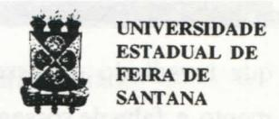
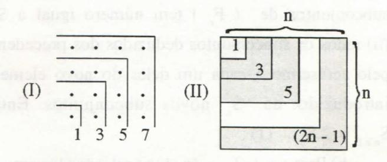
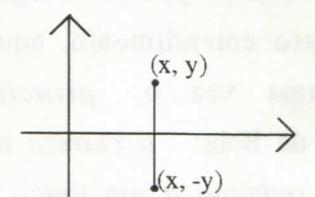
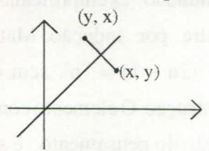

# FOLHETIM DE EDUCAÇÃO MATEMÁTICA

Ano 4 - número 55 - Folhetim de Educação Matemática - Departamento de Ciências Exatas

Junho/1997

#### **OBJETIVO**

Este Folhetim é um veículo de divulgação, circulação de idéias e de estímulo ao estudo e à curiosidade intelectual. Dirige-se a todos os interessados pelos aspectos pedagógicos, filosóficos e históricos da Matemática. Pretende construir uma ponte para unir os que estão próximos e os que estão distantes.

#### **EDITORIAL**

A partir deste número estaremos retornando a periodicidade mensal, e esperamos não ocupar mais esta coluna com explicações ao leitor sobre mudanças dessa periodicidade.

Com isso, voltamos também a publicar a coluna "Notícias". Esta coluna é aberta àqueles que desejam ver divulgadas através do nosso *Folhetim*, notícias referentes a eventos em matemática, especialmente em Educação Matemática.

Neste número, o professor Carloman Carlos Borges nos dá a sua experiente visão sobre o Construtivismo e a Matemática, ilustrada com alguns exemplos práticos, que podem servir, principalmente aos nossos colegas professores de 2º grau.

Queremos agradecer a participação do professor Thomaz de Jesus Ramos no número anterior, e lembrar que a coluna "Divertimentos Matemáticos" estará de volta no próximo número, onde publicaremos também soluções dos problemas, enviadas pelos leitores.

# COMITÉ EDITORIAL

Carloman Carlos Borges (Doutor) Inácio de Sousa Fadigas (Mestre)

## PERGUNTE QUE O NEMOC RESPONDE

Pergunta. Recebemos diversas cartas nas quais os leitores pedem nossa opinião a respeito do Construtivismo e a Matemática.

R. Vejamos, inicialmente, alguns postulados do Construtivismo. Observemos um aprendiz de oleiro que pode muito bem ser representado por uma criança trabalhando com o barro: com esse material nas mãos ela constroi formas, as destroi, as reconstroi e nesse movimento circular ela desenvolve sua capacidade de abstração, sua tolerância ante situações novas. Os construtivistas admitem ser o pensamento uma construção, uma desconstrução, uma reconstrução; penso que às vezes ele, o pensamento, é circular nesses movimentos de construção, destruição e reconstrução e, outras vezes é helicoidal e, consequentemente, criativo. A analogia com o nosso aprendiz de cerâmica é muito grande. Dessa dinâmica do pensamento, os adeptos dessa corrente concluem que, no ensino, é fundamental a ação e, por via de consequência, o erro. Outro postulado: nascemos com potencialidades e, entre elas, a de julgar, pensar e argumentar. Ao ensino cabe atualizá-las. O ser humano é, portanto, um ser racional por excelência. Ao privilegiar a razão, os construtivistas parecem chocar-se com os freudianos, que privilegiam a afetividade e reservam ao inconsciente um papel fundamental na vida do ser humano. Este pode e deve conter as pulsões, geralmente inconscientes,

que invadindo o nosso consciente, trazem-nos tor mento e falta de sossego, afirmam os construtivistas. E quanto ao aspecto ético, de qual maneira pensa o Construtivismo? A criança, afirmam seus adeptos, nasce amoral, sem bondade e sem maldade. Este pressuposto construtivista choca-se com a chamada culpa inata, advogada pelo cristianismo e também contra os ensinamentos de Rousseau que definia a natureza humana como sendo basicamente sem maldade; quem a deforma, chegando mesmo a destruí-la, é a sociedade com todos os seus aparelhos de repressão, entre eles a escola, acrescenta Rousseau. Por outro lado o Construtivismo, com essa tese de amoralismo faz lembrar algumas correntes existencia-listas quando elas afirmam que o homem se faz homem, isto é, a denominada natureza humana é uma construção social. Das teses já apresentadas e defendidas pelo Construtivismo, uma coisa já podemos concluir: ele é extraordinariamente plástico, isto é, nunca se apresenta como algo acabado, pronto a ser digerido. Sua palavra chave talvez seja: autorenovação. Para os construtivistas é a criança, com todas suas potencialidades que age sobre o mundo; não este agindo sobre aquela, pois sem ação não é possível atualizar potencialidades básicas já mencionadas acima tais como pensar, julgar e argumentar. Resumindo: sem a ação desenvolvida pela criança ela seria incapaz de construir seu próprio pensamento. Eu penso que aqui alguns construtivistas mais afoitos deveriam ter mais cautela pois qual é o significado dessa afirmativa: a criança age sobre o mundo e não o mundo sobre a criança? Não seria mais equilibrado dizer: a criança age sobre o mundo e este sobre a criança? Os criadores de qualquer teoria, inclusive os

criadores do Construtivismo, deveriam, penso eu, ter como postulado o seguinte: qualquer boa teoria, qualquer bom modelo é apenas um recorte de uma parte do real. Com isto quero dizer que não apenas podem como devem haver duas teorias boas uma tendo até postulados que entram em contradição com postulados da outra; neste caso, o real seria melhor simulado através da conjunção dessas teorias e. empregando a linguagem tão do agrado do cientista Bohr, uma dessas teorias complementa a outra. Nós combatemos esses privilégios epistemológicos. Quando uma teoria começa a privilegiar apenas uma dimensão do real (na Psicanálise, a dimensão privilegiada é a afetividade, enquanto no Construtivismo, é o consciente, a razão e na ideologia marxista. a dimensão privilegiada é o social, isto é, o indivíduo é moldado pela classe social a qual pertence e pela educação) podemos, consequentemente, aceitá-la como modelo de uma parte bem pequena da realidade - isto na melhor das hipóteses. O trecho transcrito abaixo talvez possa ilustrar nosso ponto de vista exposto acima. Ele foi extraído do livro: O Mecanismo da Natureza, de Paul R. Ehrlich, Editora Campus: Na linguagem resumida dos geneticistas, um tipo genético é chamado genótipo. Isso se distingue do fenótipo, que é simplesmente a aparência física e funcionamento de um organismo individual. O fenótipo é resultado da interação do genótipo com o seu ambiente. Por exemplo, as crianças têm a tendência herdada de crescer até uma certa altura, mas essa altura dependerá tanto dessa tendência genética (hereditária), como de fatores ambientais, como a dieta. O homem que tem gene alto, porém

é mal alimentado enquanto criança pode acabar com um pouco mais de um metro e meio - a interação entre seu genótipo alto e um ambiente pobre pode produzir um fenótipo baixo. E, então, qual devemos privilegiar: o biológo ou o social? Penso que se trata de uma pergunta sem significado. De acordo com nosso entendimento, aqui, deve prevalecer mais uma vez o princípio da complementariedade de Bohr: a clareza não está na simplificação e redução a um único modelo diretamente compreensível, mas na superposição exaustiva de diferentes descrições que incorporam noções visivelmente contraditórias. No ensino da Matemática, o Construtivismo pode ser empregado com algum proveito, desde que considere (a) que agir, significa resolver problemas e (b) um problema é uma dificuldade perante a qual o aluno sente necessidade de resolver e (c) a compreensão vai do particular para o geral, do local para o global. O estudo da Indução Finita pode servir de exemplo para ilustrar o dito acima. A maioria dos livros propõem ao alunado, exemplificando, questões como esta: Mostre por Indução Matemática:  $1 + 3 + 5 + 7 + ... + (2n - 1) = n^2$ , sem qualquer preocupação com a construção. O elemento construtivo, fundamental na formação do pensamento, é subtraído ao aluno; para este, a matemática se apresenta tal qual uma sacola mágica donde o matemático vai tirando as suas fórmulas mágicas. Para o exemplo acima, apresentamos as alternativas abaixo: dentro do nosso entendimento, somente após esgotado o momento da construção, deve-se passar ao aluno o método da Indução Matemática. É fácil notar, no momento construtivo, uma componente lúdica.

Analisemos as figuras abaixo:

Em (I) temos um quadrado de lado igual a 4, donde é fácil concluir que:  $1 + 3 + 5 + 7 = 4^2 = 16$ ; já em (II) a apresentação é mais geral, mais teórica; continuando, aí, temos um quadrado de lado igual a n, preenchido pela soma : 1 + 3 + 5 + ... + (2n - 1); também é fácil chegar à conclusão que esta soma é igual a n2. Outras opções existem e, geralmente, quando essas construções são mostradas ao aluno, ele mesmo, no processo de assimilação, acaba sempre inventando-as e, assim, acaba por ensinar ao professor. Mostre, por Indução Matemática, que se X é um conjunto com n elementos, então P(X) possui 2n, elementos. Este problema poderia, talvez, ser reformulado assim: Sendo dado um conjunto finito (Fn) contendo n elementos e sendo Sn o número de seus subconjuntos - aí incluídos o próprio Fn e o conjunto vazio Ø, demonstre:

- a) ao juntar-se um elemento a  $(F_n)$ , é dobrado o número de subconjuntos, isto é:  $S_{n+1} = 2 S_n$ ;
  - b) calcular Sn em função de n;
- c) aplicar a Indução Matemática (IM) ao resultado construído em (b).

Uma alternativa para esta questão, dentro do espírito construtivista, talvez seja a seguinte:

a) Seja  $F_2 = \{a,b\}$ , então,  $S_2 = 2^2 = 4$ . Após mais alguns exemplos particulares, é fácil perceber

que o número  $S_{n+1}$  compreende: (i) todos os subconjuntos de  $(F_n)$  tem número igual a  $S_n$ ; (ii) todos os subconjuntos deduzidos dos precedentes pelo acréscimo a cada um deles do novo elemento introduzido, dá  $S_n$  novos subconjuntos. Então:  $S_{n+1} = 2 S_n$  (1);

b) Para 
$$n = 1, 2, ..., (n-1)$$
 na relação (1) vem:

$$S_2 = 2 S_1$$

$$S_3 = 2 S_2 = 2^2 S_1$$

$$S_4 = 2 S_3 = 2^3 S_1$$

$$S_{p-1} = 2^{p-2} S_1$$

.....

$$S_{n-1} = 2^{n-2} S_1$$

$$S_n = 2^{n-1}S_n$$

Ora o conjunto  $F_1$  (cujo número de elementos é dado por  $S_1$ ) tem dois subconjuntos: ele mesmo e  $\emptyset$ , donde  $S_1 = 2$  e  $S_n = 2^n$ .

Observar os elementos construtivos nas passagens (a) e (b). A partir do particular, o geral vai sendo constuído paulatinamente. Esta é a maneira natural de aprendizagem: do particular para o geral, pois não se nasce com conceitos para em seguida aplicá-los às coisas; ao contrário, nascemos dentro de um mundo cheio de coisas e, em contato com elas vamos elaborando aqueles. Em casos muito mais eleborados é que esse processo é invertido: temos, às vezes, o conceito e não conseguimos recheiá-lo com qualquer conteúdo físico. É o caso, por exemplo, de alguns ramos da Física Teórica. Mas isto é outra história ... Um recurso didático importante: apresentar diversas alternativas na resolução de um mesmo problema. Representações diferentes para uma mesma situação ajudam na aprendizagem, evitando partições desnecessárias no saber matemático. Assim:

a) define-se reflexão em torno do eixo x (no plano) como uma função ou transformação de pontos no plano que associa a cada par ordenado (x,y) o ponto (x, - y), (representação escrita) ou

(representação gráfica); ou

$$\begin{pmatrix} 1 & 0 \\ 0 & -1 \end{pmatrix} \begin{pmatrix} x \\ y \end{pmatrix} = \begin{pmatrix} x \\ -y \end{pmatrix}$$

(representação matricial); ou

$$f: \mathbb{R}^2 \longrightarrow \mathbb{R}^2$$
  
 $(x, y) \longrightarrow (x, -y)$ 

(representação simbólica)

b) define-se reflexão em torno da reta y = x (no plano), como uma função ou transformação de pontos no plano que associa a cada par ordenado (x,y) o ponto (y, x), (representação escrita) ou

(representação gráfica); ou

$$\begin{pmatrix} 0 & 1 \\ 1 & 0 \end{pmatrix} \begin{pmatrix} x \\ y \end{pmatrix} = \begin{pmatrix} y \\ x \end{pmatrix}$$

(representação matricial); ou

$$f: \mathbb{R}^2 \longrightarrow \mathbb{R}^2$$

$$(x, y) \rightarrow (y, x)$$

(representação simbólica)

c) define-se cisalhamento na direção x, de um fator k, uma trnasformação no plano que leva cada ponto (x,y) paralelamente ao eixo x num valor ky até sua nova posição (x + ky, y), (representação escrita), ou

$$(x,y) \qquad (x+ky,y) \qquad (x+ky,y)$$
(representação gráfica); ou

$$\begin{pmatrix} 1 & k \\ 0 & 1 \end{pmatrix} \begin{pmatrix} x \\ y \end{pmatrix} = \begin{pmatrix} x + ky \\ y \end{pmatrix}$$

(representação matricial); ou

$$f: \mathbb{R}^2 \longrightarrow \mathbb{R}^2$$
  
(x, y)  $\longrightarrow$  (x + ky, y)

(representação simbólica)

Estas diferentes representações servem para reforçar a percepção do aluno pois, como se sabe, este importante processo cognitivo só atua sobre a diferença e, primariamente, ele é uma necessidade biológica. Os professores de matemática teriam muito a ganhar se refletissem sobre o trecho abaixo, extraído de Natureza e Espírito, de Gregory Bateson, publicações Dom Quixote. O trecho gira em torno da frase "o padrão que liga" (C.G. Jung, Septem Sermones ad Mortous, Londres, Stuart & Watkins, 1967). Veja como Bateson a desenvolve: "O padrão que liga". Porque é que as escolas não ensinam quase nada acerca do padrão que liga? Será que os professores sabem que trazem consigo o beijo da morte, o qual tornará insípido tudo o que eles tocarem, e que por isso eles são sensatamente relutantes em abordar ou ensinar qualquer coisa de importância vital? Ou será que eles trazem consigo o beijo da morte porque não ousam ensinar coisas tão importantes? O que é que está errado com eles? Que padrão liga o caranguejo à lagosta, a orquídea ao narciso e todos os quatro a mim? E a mim a vocês? E a nós os seis e à ameba por um lado e ao mais escondido esquizofrênico por outro?... Qual é o padrão que liga todas as coisas vivas? A descoberta de padrões deve merecer especial atenção no ensino. Ilustremos o ponto de vista. Estou lendo, agora, em um manual o seguinte: Mostre por IM que:

$$S_n = 1 + 2 + 3 + 4 + 5 + ... + n = \underline{n(n+1)}$$
 (I)

$$S'_n = 2 + 4 + 6 + 8 + 10 + ... + (2n) = n(n+1)$$
 (II)  
 $S''_n = 1 + 3 + 5 + 7 + 9 + ... + (2n-1) = n^2$  (III)

Ora, se por IM você provou (I) ela poderá servir de padrão para (II) e esta de padrão para (III), pois, com um pequeno esforço se observa que:

i) 
$$S'_{n} = 2 S_{n} = 2 \left[ \frac{n (n+1)}{2} \right] = n (n+1)$$
\nii)  $2 = 1 + 1$ 
 $4 = 3 + 1$ 
 $6 = 5 + 1$ 
 $\vdots$ 
 $2n = (2 n + 1) + 1$ 
 $n (n+1) = S''_{n} + n$ , donde,
 $S''_{n} = n (n+1) - n = n^{2} + n - n = n^{2}$ 

A apresentação do manual induz o aluno a pensar que se trata de três exercícios completamente diferentes e a aplicação (mecânica) da IM neles é, na melhor das hipóteses, um simples exercício de adestramento. O Construtivismo é mais uma teoria; não é, naturalmente, a teoria definitiva. Isto simplesmente não existe. Sempre quando surge uma teoria nova, seus adeptos parecem ficar por ela

enfeitiçados, defendendo com unhas e dentes seus postulados; eles esquecem a grande lição constantemente apresentada pela História da Ciência a qual pode ser resumida em apenas uma palavra: contestação. Contestação àquilo até então tido como sagrado, pois, como escreveu o filósofo Popper: A história das ciências, como a de todas as idéias humanas, é uma história de sonhos irresponsáveis, de teimosias e de erros. Porém é uma das mais raras atividades humanas, talvez a única, na qual os erros são sistematicamente assinalados e, com o tempo, constantemente corrigidos.

Pergunte que o NEMOC Responde é uma coluna de autoria do prof. Dr. Carloman Carlos Borges e objetiva atingir ao público interessado em Matemática nos seus múltiplos aspectos.

Caso o leitor queira fazer alguma pergunta relacionada aos aspectos pedagógicos, filosóficos e históricos da Matemática, escreva-nos.

# PRÓXIMO NÚMERO

Resposta para a pergunta:

Que vem a ser um problema?

Aguardem!

## NOTÍCIAS

## 1ª SEMANA DE MATEMÁTICA DA UEFS

Tema: "Matemática Pura & Educação Matemática:

Uma União Necessária"

Período: 25 à 29 de agosto de 1997 Local: Campus Universitário da UEFS

Promoção: Diretório Acadêmico de Matemática

Colegiado de Matemática

Informações: D.A. de Matemática - UEFS

Módulo V - MT 51

Av. Universitária, s/n-km 03 - BR 116

Campus Universitário

CEP: 44031-460 Feira de Santana - Ba

Telefone: (075)224-8093 e-mail: colmat@uefs.br

## **NÚMEROS ATRASADOS**

Envie para cada folhetim um selo de postagem nacional de 1º porte. Dentro de nomáximo quatro semanas, contadas a partir da data de recebimento do seu pedido, você estará recebendo os folhetins solicitados.

OBS.: É permitida a reprodução total ou parcial desse folhetim, desde que citada a fonte.

## NEMOC - NÚCLEO DE EDUCAÇÃO MATEMÁTICA OMAR CATUNDA

Folhetim de Educação Matemática Ano 4. n. 55 Junho/97

Editores: Carloman e Inácio

Editoração e Impressão: Núcleo de

Editoração Gráfica - NUEG Tiragem: 1.000 exemplares

Endereço: Av. Universitária, s/n - km 03

BR 116 - Campus Universitário Fax:(075)224-2284-CEP 44031-460

Feira de Santana - BA - BRASIL

e-mail: nemoc@uefs.br