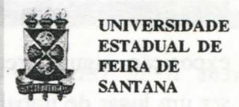

# FOLHETIM DE EDUCAÇÃO MATEMÁTICA

Ano 4 - número 56 - Folhetim de Educação Matemática - Departamento de Ciências Exatas

Julho/1997

## **OBJETIVO**

Este Folhetim é um veículo de divulgação, circulação de idéias e de estímulo ao estudo e à curiosidade intelectual. Dirige-se a todos os interessados pelos aspectos pedagógicos, filosóficos e históricos da Matemática. Pretende construir uma ponte para unir os que estão próximos e os que estão distantes.

## **EDITORIAL**

Neste número, estamos colocando em prática o nosso propósito de que o leitor participe mais diretamente do nosso _Folhetim_. Na coluna Divertimentos Matemáticos, recebemos a contribuição de Jean Fernandes Barros com uma solução do problema proposto na mesma coluna do _Folhetim_ nº 54.

O leitor poderá participar fazendo perguntas para a coluna _Pergunte que o NEMOC Responde_ ou mandando soluções para os problemas propostos na coluna Divertimentos Matemáticos.

# **COMITÊ EDITORIAL**

Carloman Carlos Borges (Doutor) Inácio de Sousa Fadigas (Mestre)

## PERGUNTE QUE O NEMOC RESPONDE

Pergunta. Muitos colegas estão interessados em saber o significado da palavra problema.

R. Realmente a procupação é legítima e uma resposta adequada faz-se necessária. Porém, como e onde encontrar tal resposta adequada? Inicialmente, que nos diz a literatura já escrita? Bem, para alguns, há uma diferenca básica entre problema e questão. Ótimo, pois já iniciamos a pesquisa por intermédio de uma diferença e não por uma identidade... Andemos: qual é essa diferença? Bom: uma questão é apenas uma dificuldade como, exemplificando, abrir uma porta que se apresenta com fechadura defeituosa; perante essa questão. podemos experimentar o seguinte: a abertura da porta ou o seu estado atual de encontrar-se fechada nos são indiferentes; aqui, estamos perante apenas uma dificuldade, uma questão. O problema surge quando há necessidade, por parte do agente, em abrir a porta; então, esse é um problema. isto é, uma dificuldade à qual é associada uma necessidade, a qual, por sua vez gera aquilo tão do gosto dos educadores: a motivação. Apesar do forte ingrediente subjetivo. esta resposta aplica-se a alguns casos práticos. E em Matemática? Acontece a mesma coisa, respondem os especialistas. Com o pouco do que já foi dito, já dá para sentir a dificuldade na qual estamos mergulhados. Talvez seja mais prático, neste contexto, recorrer à praxis, dela extraindo algumas conclusões legítimas. Admitimos, na exposição, alguns pressupostos: a sala de aula deve ser um lugar de trabalho coletivo, o professor deve preocupar-se mais em passar ao alunado uma orientação motivadora pois, desta forma, surge a possibilidade de transformar dificuldades em verdadeiros problemas - no sentido já esclarecido. Inicialmente, é interessante dirigir esforços para problematizar as situações. Que quer dizerproblematizar uma situação? É encará-la com ceticismo, com o espírito da dúvida. Não escrevo qualquer novidade: os antigos gregos, principalmente a partir do século VI a.C. eram mestres na problematização. Suas perguntas iniciais e preferidas ante novas situações eram apenas duas: como? e porque? Eles se tornaram famosos mais pelos problemas que formularam do que pelas suas soluções. Eles formularam problemas somente resolvidos mais de 2000 anos depois com a criação de novos instrumentos metodológicos como, exemplificando, os três problemas clássicos: a quadratura do círculo, a trissecção do ângulo e a duplicação do cubo. Claramente: formular "bons" problemas exige criatividade, enquanto resolvê-los - em muitos casos - exige apenas a aplicação de uma determinada metodologia e esta ainda é ensinada em algumas boas escolas. Alguns exemplos talvez possam ser mais claros.

I) Problematização através de conflitos:

Mostremos que dois números reais quaisquer <u>a</u> e <u>b</u> são iguais entre si.

vem:

$x^2 = a^2 - 2ab + b^2$ (3)  

De (2) e (3) vem:  
 $(ax - bx = a^2 - 2ab + b^2) \le (ax - bx)$
$(ax - bx = a^2 - 2ab + b^2) <=> (ax - a^2 + ab = bx - ab + b^2) <=> [a(x - a + b) = b(x - a + b)] (4)$ donde resulta, ao dividirmos a última expressão por (x - a + b), temos: a = b.

ii) Analise as falácias abaixo:

$(1/2 > 1/4) <=> (1/2) > (1/2)^2 =>$

$=> \log_{1/2} 1/2 > \log_{1/2} (1/2)^2 =>$  
 $=> \log_{1/2} 1/2 > 2 \log_{1/2} 1/2 =>$  
 $=> 1 > 2$ ;

iii) (Neste exercício log significa
$\log_{10}$
) $(1/2 > 1/4) <=> (1/2) > (1/2)^2 =>$ $=> \log 1/2 > \log (1/2)^2 =>$ $=> \log 1/2 > 2 \log 1/2 =>$ $=> 1 > 2$ .

A prática vem demonstrando que esse tipo de problematização - por causar alguma perturbação no aluno - deixa-o naturalmente motivado. Os exemplos acima deverão esclarecer porque não se deve "dividir por zero", aclarar o conceito de função decrescente e lembrar porque deve-se inverter o sentido de uma desigualdade toda vez que a mesma é multiplicada por um número negativo.

II) Problematização através de contra-exemplos Aqui, uma pergunta: porque os manuais escolares trazem tão poucos contra-exemplos? Geralmente, o contraste entre situações diversas atua mais em nossa percepção do que a uniformidade. A invenção ou a descoberta de relações, o palpite ou a conjectura; a análise cuidadosa de casos particulares; o estabelecimento entre a nova situação, desconhecida, e uma já familiar; o estudo de exemplos e contra-exemplos; isso tudo constitue elementos participativos da problematização. Quando se trata da resolução de um problema, é salutar ao raciocínio procurar contra-exemplos, isto é, situações opostas à solução procurada. A ausência quase total dessa pedagogia pode expor o aluno a alguns constrangimentos. Lembro-me bem do seguinte: em uma palestra sobre os três problemas clássicos já mencionados que proferi em uma de nossas universidades federais, vários alunos, professores do 2º grau, estranharam as "soluções negativas" apresentadas aos 3 famosos problemas. Para eles, a demonstração de uma impossibilidade não deveria ser solução de coisa alguma ... e, quase todos eles afirmaram que se sentiam "chocados psicologicamente" com tal "solução"... Já presenciei irritação por parte do professor pelo fato de um aluno aplicar a fórmula $a^2 + b^2 = c^2$ a um triângulo não retângulo. Certamente, esse professor nunca apresentou ao aluno um contraexemplo.

Em qualquer tipo de problematização (há outras além das citadas que o professor deverá inventar...) o fundamental é: A BUSCA DO PADRÃO. Veja o que escreve um dos grandes vultos deste século, Gregory Bateson em seu livro Natureza e Espírito, publicações Dom Quixote, (já fizemos menção a ele no Folhetim nº 55) "O padrão que liga". Porque é que as escolas não ensinam quase nada acerca do padrão que liga? Será que os professores sabem que trazem consigo o beijo da morte, o qual tornará insípido tudo o que eles tocarem, e que por isso eles são sensatamente relutantes em abordar ou a ensinar qualquer coisa de importância vital? Ou será que eles trazem consigo o beijo da morte porque não ousam ensinar coisas tão importantes? O que é que está errado com eles? Que padrão liga o caranguejo à lagosta, a orquídea ao narciso e todos os quatro a mim? E a mim e a vocês? E a nós os seis e à ameba por um lado, e ao mais escondido esquizofrênico por outro? E quando se trata de matemática, como fica: o padrão que liga? Nos exercícios mais elementares, o professor deve insistir junto ao aluno para que procure descobrir um padrão de comportamento. Deve lembrar-lhe que do fato de uma propriedade ser comum a vários objetos não se deve deduzir que lhe seja essencial pois, como assinala S. L. Rubinsstein: (El Pensamiento y los Caminos de su Investigacion): cabe achar algo comum entre os objetos de natureza heterogênea... sem que se obtenha disso, nenhuma generalização científica. Se uma propriedade determinada é essencial para certos fenômenos, há de ser necessariamente comum aos mesmos. De sua essencialidade depende o outro caráter: o de comum. E mais adiante: o geral pode ser utilizado como procedimento heurístico e objetivando servir de indicador do essencial (tradução nossa). Veja um exemplo: da comprovação empírica de que os números 24, 48, 80, 120, 168 e 224 são divisíveis por 8, podemos chegar a um padrão? Falando de outra maneira: da essencialidade desses números - serem divisíveis por 8 - podemos chegar a uma generalização? Basta observar o seguinte:

$24 = 5^2 - 1$ ; $48 = 7^2 - 1$ ; $80 = 9^2 - 1$ ;

$120 = 11^2 - 1$ ; $168 = 13^2 - 1$ ; $224 = 15^2 - 1$ ;

Após essa primeira análise vemos que os números apreciados são escritos por intermédio de duas parcelas, as quais exibem duas características: a primeira, um número ímpar elevado ao quadrado e a segunda a repetição monótona do número 1. Agora, o salto rumo ao padrão, à generalização: a primeira característica apontada acima pode ser representada pela expressão (2n - 1)2, donde se conclui a outra expressão mais geral: $(2n-1)^2$ - 1 para expressar cada um dos números acima. Este tipo de generalização - é bom destacar é muito empregada, também, pelos naturalistas e não apenas pelos matemáticos. Convém acrescentar ainda que o matemático não termina seu trabalho nessa generalização que podemos chamar de empírica; para ele se coloca a questão: para n um número natural, a expressão P(n): (2n - 1)2 - 1 representa sempre um número divisível por 8? Essa comprovação pode ser feita através da Indução Matemática. Deixamos ao cuidado do leitor verificar se a recíproca dessa proposição é falsa ou verdadeira. (Dica: comece examinando o número 16). É típico da Matemática - em nível avançado-trabalhar sobre generalizações. Descobrindo conexões cada vez mais profundas o pensamento matemático atinge a generalização de relações e talvez, a partir disso, se possa falar sobre a Estética da Matemática. No seu livro A Matemática e o Raciocínio Plausível (ainda não traduzido em Português), o matemático e pedagogo (não de formação) Polya escreve: Deve-se descobrir um teorema matemático, antes de o ter demonstrado, deve-se estabelecer o plano da sua demonstração, antes de elaborar os detalhes; combinar observações, e a seguir analogias; voltar, sempre e sempre às provas. O resultado da atividade criadora do matemático é a conclusão demonstrativa, ou seja, é uma demonstração: mas esta é a descoberta, através do raciocínio plausível, através da descoberta. Se a aprendizagem da Matemática, refletisse, suficientemente bem a sua elaboração, deveria, nela, haver lugar para a descoberta, para o raciocínio plausível (tradução nossa). Nunca é demais insistir no seguinte princípio, para mimtalvez um dos mais importantes dos princípios metodológicos: As coisas elementares devem ser bem ensinadas e, consequentemente, bem sabidas. Desta forma, fico chocado quando leio, em revistas especializadas e editadas por universidades respeitáveis, recomendações deste tipo: Para tanto (isto é: para uma boa aprendizagem em matemática - observação nossa) os estudantes deverão: revelar uma perfeita compreensão dos conceitos e princípios matemáticos ... (o grifo é nosso). Além do caráter religioso dessa recomendação, ela contém, em si mesma, uma impossibilidade: a exaustão das categorias matemáticas. Em virtude de sua historicidade, elas vão se refinando cada vez mais. A história do conceito de função exemplifica muito a inclinação dos matemáticos para a generalização e ampliação dos conceitos. Introduzida por Leibniz em 1694 ela expressava qualquer quantidade associada a uma curva como, por exemplo, o raio da curvatura ou a inclinação de uma curva; em seguida, em 1718 (estamos seguindo Howard Eves: Introdução à História da Matemática, Editora UNICAMP, tradução muito boa de Hygino H. Domingues) Johann Bernoulli considerava uma função como uma expressão qualquer formada de uma variável e algumas constantes; em seguida Euler considerou uma função como uma equação ou fórmula qualquer, desde que envolvesse variáveis e constantes. Ainda segundo o historiador citado, o conceito de Euler se manteve inalterado até que Joseph Fourier considerou as chamadas séries trigonométricas, as quais, segundo H. Eves, envolvem uma forma de relação mais geral entre as variáveis que as que já haviam sido estudadas anteriomente. Enfim, agora segundo o erudito matemático francês conteporâneo Jean Dieudonné Formação da Matemática Contemporânea, publicações Dom Quixote), o matemático Dirichlet apresenta finalmente uma definição geral: tudo aquilo que é necessário supor é que, para cada sistema de valores das variáveis tem um processo qualquer que lhe associa, um número bem determinado (os grifos são de Dieudonné). Aqueles que fizeram a graduação em matemática devem lembrar-se da famosa função de Dirichlet: a função é definida pela condição de que f(x) = 0 se (x) for um número racional, f(x) = 1 se (x) for um número irracional. (Como ficaria o gráfico dessa função?...). Esta é uma das lições da História da Matemática que os recomendadores de princípios metodológicos deveriam seguir à risca... Finalmente, penso ser interessante mencionar algo mais familiar e que serve bem para ilustrar o que queremos dizer ao advogar o princípio: as coisas simples devem ser bem ensinadas e, consequentemente, bem sabidas. Há algum tempo, ao examinar um candidato a professor universitário (nós escrevemos professor universitário) que termina de fazer uma demonstração por Indução Matemática lhe perguntamos se esse princípio poderia demonstrar fatos relativos aos números reais... A resposta pronta e categórica: evidentemente que sim! Como fui voto vencido na banca examinadora desse candidato, ele foi aprovado e, hoje, com a devida estabilidade assegurada pela Lei, é professor concursado dessa infeliz universidade. O princípio metodológico que privilegia de início, a ênfase no ensino das coisas simples deve valer também para as demais ciências. Assim, é inconcebível, em curso de pós-graduação, que um aluno de física não saiba o que é vapor, que vapor não é um gás. Isso não é piada. Foi dito pelo grande físico Mário Schenberg numa entrevista à revista Ciência Hoje (julho/agosto de 1984 - vol. 3 nº13), ao narrar o resultado de um exame oral.

Pergunte que o NEMOC Responde é uma coluna de autoria do prof. Dr. Carloman Carlos Borges e objetiva atingir ao público interessado em Matemática nos seus múltiplos aspectos.

Caso o leitor queira fazer alguma pergunta relacionada aos aspectos pedagógicos, filosóficos e históricos da Matemática, escreva-nos.

# PRÓXIMO NÚMERO

Resposta para a pergunta: Como se verifica a criatividade matemática?

Aguardem!

## **DIVERTIMENTOS MATEMÁTICOS**

### Thomaz de Jesus Ramos

Lembram-se de Tartaglia? É o mesmo que esteve envolvido no ramance da equação do 3° grau, no século XVI. Esse algebrista italiano propôs o seguinte problema: Três lindas jovens, chegaram ao rio, acompanhadas por seus ciumentos maridos. O pequeno barco que os tem de transportar só comporta duas pessoas (porque fazem barcos tão pequenos?). Para evitar situações constrangedoras, as viagens têm de ser feitas de tal forma que nenhuma mulher fique com um homem sem que seu marido este ja presente. Onze travessias serão necessaárias. Você poderia es que matizá-las? Nas condições estabelecidas, com quatro casais a viagem ainda é possível?

Os problemas propostos nesta coluna serão respondidos no _Folhetim_ nº 58. Qualquer leitor poderá enviar soluções.

Como resposta ao problema nº 4, da coluna Divertimentos Matemáticos, publicado no Folhetim nº 54, recebemos do leitor Jean Fernandes Barros a seguinte solução:

Mostre que:
$x \ne 1$
ou $x \ne -1$ . 

 $(x^4 + x^3 + x^2 + x + 1 + 2)(x^4 - x^3 + x^2 - x + 1 - 2) = x - 1$  

 $= (x^4 + x^3 + x^2 + x + 1)(x^4 - x^3 + x^2 - x + 1)$ .

<u>Preliminares</u>.Lembremos de alguns fatos que utilizaremos na prova do exercício. Primeiramemente, as seguintes identidades em R:

(1)
$(x-1)(x^{n-1}+x^{n-2}+...+x^2+x+1)=x^n-1$

(2) $(x+1)(x^{n-1}-x^{n-2}+...+x^2-x+1)=x^n+1$

Vejamos alguns exemplos oportunos.

Exempo 1.
$(x-1)(x^4+x^3+x^2+x+1)=x^5-1$
(E1)

Exempo 2.
$(x+1)(x^4-x^3+x^2-x+1)=x^5+1$
(E2)

Por último, do teorema de D'Alembert (1717-1783) que afirma o seguinte: a éraiz do polinômio P(x), grau de P(x) maior ou igual a 1, se, somente se x - a divide P(x).

Revendo os exemplos (E1) e (E2), temos que:

$$x - 1$$
divide $x^5 - 1$ , pois 1 é raiz de $P(x) = x^5 - 1$ (E3)

$$x + 1$$
divide $x^5 + 1$ , pois -1 éraiz de $P(x) = x^5 + 1$ (E4)

Agora passemos ao exercício.

Prova. Chamemos

$$A = (x^4 + x^3 + x^2 + x + 1 + \underline{2}) e B = (x^4 - x^3 + x^2 + x + 1 - \underline{2})$$

$x - 1$

Observemos que:

$$A = \frac{(x-1)(x^4 + x^3 + x^2 + x + 1) + 2}{(x-1)}$$

$$B = \frac{(x+1)(x^4 - x^3 + x^2 - x + 1) - 2}{(x+1)}$$

Agora utilizando (E1) e (E2), temos:

$$A = \frac{(x^5 - 1) + 2}{x - 1} = \frac{x^5 + 1}{x - 1} \quad e \quad B = \frac{(x^5 + 1) - 2}{x + 1} = \frac{x^5 - 1}{x + 1}$$

Desta forma, fazendo-se uso da comutatividade, temos que:

$$A.B = \left(\frac{x+1}{x+1}\right)\left(\frac{x-1}{x-1}\right)$$

Logo, por (E3) e (E4) e lembrando de (E1) e (E2) chegamos a A . B = $(x^4 + x^3 + x^2 + x + 1)(x^4 - x^3 + x^2 - x + 1)$ Com isso temos o resultado desejado.

## NOTICIAS

#### A 1ª Semana de Matemática da UEFS - 1ª SEMAT -

divulgada no folhetim anterior, teve seu período alterado para 15 a 19 de setembro de 1997. Maiores informações: DAMAT (075) 224-8093 ou colmat@uefs.br

## NÚMEROS ATRASADOS

Envie para cada folhetim um selo de postagem nacional de 1º porte. Dentro de no máximo quatro semanas, contadas a partir da data de recebimento do seu pedido, você estará recebendo os folhetins solicitados.

OBS.: É permitida a reprodução total ou parcial desse folhetim, desde que citada a fonte.

## NEMOC - NÚCLEO DE EDUCAÇÃO MATEMÁTICA , OMAR CATUNDA

Folhetim de Educação Matemática Ano 4. n. 56 Julho/97

Editores: Carloman e Inácio

Editoração e Impressão: Núcleo de

Editoração Gráfica - NUEG

Tiragem: 1.000 exemplares

Endereço: Av. Universitária, s/n - km 03

BR 116 - Campus Universitário

Fax:(075)224-2284-CEP 44031-460

Feira de Santana - BA - BRASIL

e-mail: nemoc@uefs.br
