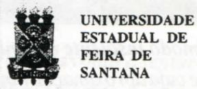

# FOLHETIM DE EDUCAÇÃO MATEMÁTICA

Ano 5 - número 57 - Folhetim de Educação Matemática - Departamento de Ciências Exatas

Agosto/1997

#### **OBJETIVO**

Este Folhetim é um veículo de divulgação, circulação de idéias e de estímulo ao estudo e à curiosidade intelectual. Dirige-se a todos os interessados pelos aspectos pedagógicos, filosóficos e históricos da Matemática. Pretende construir uma ponte para unir os que estão próximos e os que estão distantes.

#### **EDITORIAL**

Estamos no mês de agosto, e para nós isto tem uma importância fundamental, porque é o marco de mais um ano completado de publicação do Folhetim de Educação Matemática. Pois é, a partir deste mês estamos começando o ano 5. Não podemos esquecer também que neste mês rememoramos 11 anos de falecimento do professor Omar Catunda.

Neste início do quinto ano, é com satisfação que informamos ao leitor a realização pela Universidade Estadual de Feira de Santana do Curso de Especialização em Educação Matemática (ver quadro de notícias). Trata-se de um projeto elaborado pelo NEMOC, e recentemente recomendado pela CAPES, com início previsto para 1998. O curso terá a coordenação do Prof. Dr. Carlomam Carlos Borges, editor da coluna Pergunte que o NEMOC Responde, deste Folhetim.

# **COMITÉ EDITORIAL**

Carloman Carlos Borges (Doutor) Inácio de Sousa Fadigas (Mestre)

#### PERGUNTE QUE O NEMOC RESPONDE

**Pergunta.** Solange Garibalde A. de Menezes, do Rio Grande do Sul, indaga: _Como se verifica a criatividade matemática?_

R. Infelizmente pouco sabemos a esse respeito - uma vez que não temos relatos suficientes da maior parte dos grandes criadores nesse campo. Uma das obras mais mencionadas nessa direção foi escrita pelo matemático francês J. Hadamard: An Essay on the Psychology of Inventionn in the Mathematicall Field, Dover Publications Inc., 1954, a qual poderá ser lida com algum proveito, embora não esclareca muita coisa sobre essa criatividade - o que é óbvio, dado o conhecimento atual da ciência sobre o assunto. Liminarmente, nos deparamos logo com o problema: que é a criatividade? Há algumas definições - importantes como ponto de partida para discussões. Para Laplace (astrônomo, físico e matemático francês do século XVIII), a invenção, em todos os domínios, consiste precisamente nisto: na aproximação de idéias suscetíveis de se combinarem e que até então estavam isoladas. Qual o significado de idéias suscetíveis de se combinarem? Será que através do famoso método muito empregado por Freud, qual seja a livre associação das idéias poderemos entrar em contato com elas - essas idéias isoladas mas que, graças ao toque mágico do criador, se podem juntar-se, detonando o processo criativo? O notável poeta francês Jean Cocteau (1889-1963) no seu discurso de recepção na Academia Francesa disse: A exemplo das crianças e dos poetas, nossos jovens sábios se exercitam no esquecimento voluntário das relações normais, a combinar de um

modo insolente organismos distantes uns dos outros e cuja aproximação ninguém teria ousado. Para muitos especialistas no assunto, a criatividade tem muito que ver com as associações livres inconscientes e seu predomínio às restrições formalistas do pensamento lógico. Há uma unanimidade entre eles: dificilmente haverá criatividade à margem de uma forte motivação, de um trabalho diuturno e de muita concentração mental. Quando se fala na aproximação entre idéias aparentemente distintas - no processo criativo - devemos nos lembrar do ensinamento de mestres como A. R. Luria (Veja: Pensamento e Linguagem, Artes Médicas, Porto Alegre, 1987) ... a palavra não se esgota em uma referência objetal fixa unissignificativa que o conceito de campo semântico, evocado por cada palavra, é completamente real. A existência de um campo semântico associado a um determinado conceito (o qual é a sua classe de equivalência) deveria servir de alerta para alguns professores teimosos em exigirem dos alunos decisões para frases como esta, exemplificando: Se dois mais dois são quatro, então 25 de dezembro é natal. Desejar do aluno adolescente a aquiescência ao enlace de campos semânticos tão disjuntos é querer provocar-lhe distúrbios psíquicos ou menosprezo por parte dele. Felizmente, aumenta o número de alunos que optam por essa segunda alternativa, apesar da avaliação autoritária do professor. Como vê você Solange, o assunto é tortuoso; a fim de não nos perdermos em suas inúmeras bifurcações, vamos nos limitar ao testemunho de Henri Poincaré - matemático francês (1854-1912) e um dos últimos universalistas em matemática, com notáveis contribuições em diversos ramos dessa ciência. O que se vai ler é a sua famosa conferência A invenção matemática, pronunciada em 23 de maio de 1908 no Instituto Geral de Psicologia de Paris e reproduzida mais tarde em seu livro Science et Méthode. Ele inicia sua conferência postulando o grande interesse que envolve o processo da invenção matemática:

A origem da invenção matemática é um problema que deve inspirar o maior interesse do psicólogo. É o ato no qual o espírio humano parece prescindir em maior grau do mundo exterior, no qual somente atua ou somente parece atuar por si mesmo e sobre si mesmo, de modo que ao estudar o processo do pensamento geométrico podemos ter esperança de chegar a captar o mais essencial do espírito humano. Em seguida, esse eminente sábio investe contra alguns mitos que ainda hoje cercam o matemático:

Quanto a mim, devo confessar, sou absolutamente incapaz de realizar uma soma sem errar. Seria também um jogador de xadrez bastante medíocre; saberia calcular que fazendo tal jogada me exporia a tal perigo, estudaria muitas possibilidades que iria incluindo por diversos motivos, e acabaria por realizar a jogada anteriormente repelida, ao ter esquecido, durante este intervalo, o perigo que antes havia previsto. Resumindo, minha memória não é má, porém, é insuficiente para converter-me num bom jogador de xadrez. A que se deve pois, que esta mesma memória não me falhe num raciocínio matemático complicado no qual se perderia a maioria dos jogadores de xadrez? Se deve, evidentemente, que neste caso ela apareça guiada pela marcha geral do raciocínio. Uma demonstração matemática não é uma justaposição de silogismos, consiste em silogismos colocados em certa ordem, (o grifo é dele), e esta ordem em que estão colocados os diversos elementos é muito mais importante que os próprios elementos. Se possuo o sentimento, de certo a intuição desta ordem, de modo que, a partir de uma simples olhadela, compreendo o raciocínio em seu conjunto, então não devo temer esquecer um de seus elementos, já que cada um deles virá a colocar-se em seu lugar correspondente sem que deva realizar nenhum esforço mnemônico. Assim sendo, ao repetir um raciocínio apreendido, parece que eu mesmo poderia tê-lo inventado; frequentemente não é mais que uma ilusão, porém, até neste caso, isto é, mesmo quando não tenho a força para criar por mim mesmo, à medida que o repito, eu o estou na realidade reinventando. Compreende-se então que este sentimento, esta intuição da ordem matemática, que nos faz advinhar harmonias e relações ocultas, não possa pertencer a todo o mundo. Após algumas considerações sobre a diferença entre compreender e aplicar a matemática e criá-la, esse extraordinário sábio procura caracterizar o legítimo criador:

Os outros, finalmente, os que possuem em maior ou menor grau a intuição especial de que tenho falado, não somente poderão compreender as matemáticas, embora sua memória nada tenha de extraordinário, senão que poderão converter-se em criadores e procurar inventar com maior ou menor êxito, segundo possuam esta intuição em um grau mais ou menos desenvolvido. Agora, segue-se sua tão celebrada definição da invenção matemática:

Em que consiste, na realidade, a invenção matemática? Não se trata de realizarnovas combinações com os valores matemáticos já existentes. Isto qualquer um poderia fazer, porém desta forma poder-se-ia fazer combinações infinitas e a maioria delas não teria o menor interesse. Inventar, consiste, precisamente, em não construir combinações inutéis, senão aquelas que são úteis (e que representam uma ínfima minoria). Inventar consiste em discernir, em escolher. Em sua obra Science et Méthode, Paris, Flammarion, 1908, págs. 50 e seguintes, Poincaré relata:

Frequentemente, quando se trabalha numa questão difícil, ao iniciar o estudo não se obtém nada claro; prontamente se interrompe o estudo durante um

tempo mais ou menos longo, para voltar a sentar-se diante da mesa de trabalho. Durante a primeira hora continua-se sem encontrar nada, e logo de repente, a idéia decisiva aparece. Poderia dizer-se que o trabalho consciente tornou-se mais proveitoso devido à interrupção e que o repouso devolveu ao espírito sua forma e capacidade de trabalho. Porém é mais provável que este repouso se tenha empregado num labor inconsciente e que seu resultado se haja revelado logo ao geômetra, exatamente como nos exemplos que tenha citado. Só que esta revelação, em lugar de produzir-se durante um passeio ou durante uma viagem se tenha produzido num momento de trabalho consciente, porém independentemente deste trabalho, no qual desempenha ao máximo o papel de propulsor, como se se tratasse do aguilhão que houvesse excitado os resultados já adquiridos durante o repouso, mas que haviam ficado em estado inconsciente e tende revestir-se de forma consciente. Mais adiante, na mesma obra citada. escreve:

As combinações úteis - acrescenta - são precisamente as mais belas; isto é, as que podem impressionar melhor esta sensibilidade especial tão bem conhecida por todos os matemáticos, mas que os profanos desconhecem até o ponto que frequentemente lhes faz sorrir. Depreende-se desse brilhante testemunho, feito por um eminente matemático, físico e filósofo que a criação matemática atravessa quatro fases. Inicialmente, há um problema sobre o qual o matemático reflete profundamente sem, contudo, resolvê-lo, em virtude de sua complexidade. Após algum tempo de infrutífera reflexão, o problema é abandonado, esquecido, escorrega para o inconsciente e lá permanece por algum tempo. Quando menos se espera, surge uma iluminação súbita que é a solução procurada. Aí, então, a mente efetua a elaboração final.

Alguns psicólogos inspirados provavelmente por Poincaré resumem os quatro estágios do pensamento criativo, denominando-os de: preparação, incubação, iluminação e verificação. Supõem-se que a preparação e a verificação sejam operações lógicas pertencentes predominantemente ao consciente. Feliz ou infelizmente, para a maioria das pessoas o processo criativo se detém na incubação - para o resto de suas vidas. Embora as normas acima possam ser consideradas de caráter geral, não devemos esquecer a observação feita por Hadamard: não existe uma aptidão única para as matemáticas: existem diversas classes de cérebros matemáticos, que apresentam entre eles diferenças consideráveis. Talvez seja ilustrativo - para o propósito de mostrar as diversas classes de cérebros matemáticos - mencionar o matemático Srinivasa Ramanujan, nascido na Índia. Ramanujan foi um matemático de características bem particulares. Nasceu na Índia em 22 de dezembro de 1887 e morreu em 26 de abril de 1920, aos trinta e três anos de idade. Apesar de sua pouca educação formal, ele já era um notável matemático quando foi à Inglaterra em 1914, para estudar; além de espantosa memória, era dotado de extraordinária capacidade de perceber complexas relações numéricas; descobriu propriedades na Teoria dos Números (a propósito: quando essa disciplina será obrigatória na Licenciatura em Matemática?) que assombraram os mais espertos teóricos. Dois exemplos talvez possam ilustrar melhor o perfil desse extraordinário matemático possivelmente o mais importante da Índia nos tempos modernos. Quando de sua estada na Inglaterra, doente e internado em um hospital, recebeu a visita do maior matemático inglês do século XX (e também seu admirador e protetor) Hardy (1877-1947) que ali chegara num táxi de número de placa, 1729. Hardy, ao comentar que não vislumbrava nada de interessante nesse número, foi imediatamente contestado por Ramanujan que lhe disse: ao contrário, é um número bem interessante, visto que se trata do menor inteiro que se pode expressar, de duas

maneiras como soma de dois cubos: 13 + 123 = 1729 = = $9^3 + 10^3$ ; doutra vez, observou que: $e^{\pi\sqrt{163}}$ estava muito próximo de um número inteiro: realmente, ele é um inteiro seguido de doze zeros antes do surgimento de qualquer outro algarismo. Ramanujan dizia que a deusa Namakkal aparecia em seus sonhos, inspirando-o. Não deixa de ser extraordinário que, ao levantar-se da cama, escrevia seus resultados sem contudo dar-lhes uma demonstração rigorosa. Segundo o matemático e historiador James R. Newman (Veja: El Mundo de las Matemáticas, vol.1, Ediciones Grijalbo, S.A., Barcelona-México D.F., 1968) este processo se repetiu durante toda sua vida. Embora isso pareça realmente assombroso, vejamos o testemunho de seu amigo Hardy: Muitas vezes me perguntei se Ramunujan possuia algum segredo especial, se seus métodos eram melhores do que os empregados pelo rastante dos matemáticos ou se havia alguma coisa realmente extraordinária em sua maneira de pensar. Não posso contestar estàs perguntas com segurança e convicção; porém, não creio. Minha opinião é que todos os matemáticos pensam, no fundo, com o mesmo método e que Ramanujan não era uma exceção. Afirmar que todos os matemáticos pensam, no fundo, com o mesmo método - é uma afirmativa muito forte, porque não encontra qualquer respaldo científico. As evidências quando se estuda a história dessa ciência - mostram que essa uniformidade metodológica não se sustenta. Mas, como mesmo Hardy declara, é apenas uma crença...e, em sendo assim. não cabe maiores discussões. Porém, achamos necesssário, mais uma vez, recorrer a Poincaré. Vejam a seguinte descrição extraída de sua obra da ciência, Contraponto, logo em seu capítulo inicial: I. É impossível estudar as obras dos grandes matemáticos, e mesmo as dos pequenos, sem notar e sem distinguir duas tendências opostas, ou antes, dois tipos de espíritos inteiramente diferentes. Uns

estão, antes de tudo, preocupados com a lógica; ao ler suas obras, somos tentados a crer que só avançaram passo a passo, com o método de Vauban, que investe com seus trabalhos de abordagem, contra uma praça forte, sem abandonar o que quer que seja ao acaso. Outros se deixam guiar pela intuição, e na primeira investida fazem conquistas rápidas, mas algumas vezes precárias, como se fossem ousados cavaleiros na linha de frente. Não é a matéria de que tratam que lhes impõe um ou outro método. Se dos primeiros dizemos amiude que são analistas, e se chamamos os outros de geômetras, isso não impede que uns permaneçam analistas mesmo quando fazem geometria, enquanto os outros continuam a ser geômetras, mesmo quando se ocupam de análise pura. É a própria natureza de seu espírito que nos faz lógicos ou intuitivos, e dela não se podem desvincular quando abordam um assunto novo. Em seguida, Poincaré cita vários exemplos de matemáticos, uns, intuitivos, outros, lógicos. Assim, para esse eminente sábio, estão entre os lógicos Méray (matemático francês, 1836-1911), Hermite (idem, idem, 1822-1901), Weierstrass (alemão) e Sofia Kowalevski (russa); como intuitivos, Klein (alemão), Bertrand (francês), Riemann (alemão) e Sophus Lie (norueguês). Veja o que escreve um dos maiores físicos brasileiros de todos os tempos e de reputação internacional, Mário Schenberg (Pensando a Física, Editora Brasiliense): A criação científica é uma coisa bastante interessante. Se fosse simplesmente raciocinar logicamente seria uma coisa fácil, mas não é (o grifo é nosso). Às vezes, é preciso raciocinar errado para chegar ao resultado certo. Agora, qual o método para raciocinar errado e chegar a uma solução correta, é uma grande incógnita. Do que se depreende do exposto, a criação científica e, dentro dela, a criação matemática, não é somente uma combinatória (combinar idéias) mas, sobretudo, discernimento para desenvolver as mais frutíferas combinaçõese, aqui, já entra um elemento semântico altamente criativo e longe do alcance de qualquer

computador. Depreende-se, também, uma analogia com a atividade artística, onde o aspecto mais racional não é fundamental. Vamos tentar, através de dois exemplos, um da matemática e outro da arte, tornar mais concreta essa analogia. Historiadores da Matemática sentem-se, muito justamente, encantados com a seguinte fórmula, criação do gênio brilhante de Euler: $e^{i\pi} + 1 = 0$ . Esta bela igualdade une numa só fórmula os 5 mais famosos números da Matemática: zero, 1, π, e e i. Esta é uma combinação extraordinária pelas consequências dela derivadas. Números que, antes de Euler, por assim dizer, andavam cada um em seus caminhos diferentes sem mostrarem entre si, aparentemente, maiores relações, são agora exibidos unidos. A invenção de relações entre universos que, na aparência, se mostram distantes uns dos outros é um traço marcante nas grandes criações. Isso corresponde, na Arte, ao estebelecimento de relações entre idéias semanticamente disjuntas. exemplificando: para nós, pobres mortais, que relação pode existir entre essas duas palavras pertencentes a campos semânticos tão distintos: carinho e espinho? Nenhuma! Pois bem, vem o poeta, no caso Crisanto Borges, um dos grandes fazedores de hai-cai (poema de origem japonesa constituído de três versos) e nos comove com essa gema preciosa:

Oespinho
protege a rosa
comcarinho.

Pergunte que o NEMOC Responde é uma coluna de autoria do prof. Dr. Carloman Carlos Borges e objetiva atingir ao público interessado em Matemática nos seus múltiplos aspectos.

Caso o leitor queira fazer alguma pergunta relacionada aos aspectos pedagógicos, filosóficos e históricos da Matemática, escreva-nos.

## PRÓXIMO NÚMERO

Resposta para a pergunta: É verdade que o raio não cai duas vezes no mesmo lugar? Caso afirmativo, o lugar mais seguro para a gente resguardar-se de um raio é permanecer em algum lugar onde a pouco tempo caiu um raio? Há uma maneira matemática de abordar o assunto?

Aguardem!

## **DIVERTIMENTOS MATEMÁTICOS**

Thomaz de Jesus Ramos

1. Sabe-se que $\sqrt{a} \cdot \sqrt{b} = \sqrt{ab}$ . Exemplificando: $\sqrt{5} \cdot \sqrt{7} = \sqrt{35}$ . Consequentemente: $\sqrt{-1} \cdot \sqrt{-1} = \sqrt{(-1) \cdot (-1)} = \sqrt{1} = 1$ Mas, sabemos que:

$$\sqrt{-1} = i$$
e $\sqrt{-1} \cdot \sqrt{-1} = i^2 = -1$ . Assim, $-1 = 1$ .

2. Suponhamos que: $\log(-1) = x$ . Então, devido uma conhecida propriedade dos logaritmos, podemos escrever: $\log(-1)^2 = 2 \cdot \log(-1) = 2x$ . Porém, por outro lado, temos: $\log(-1)^2 = \log(1)$ , o qual é igual a zero. Portanto, 2x = 0, donde, $\log(-1) = 0$ , o que claramente não é o valor apropriado.

# NOTÍCIAS

No último dia 29/07/97 a CAPES emitiu parecer recomendando o CURSO DE ESPECIALIZAÇÃO EM EDUCAÇÃO MATEMÁTICA. O projeto elaborado pelo NEMOC será coordenado pelo Prof. Dr. Carlomam Carlos Borges, e tem início previsto para janeiro de 1998.

Trata-se de um curso de 495 horas, com 09

disciplinas dividas em 04 módulos.

Maiores informações sobre o curso serão divulgadas tão logo o mesmo conclua os trâmites regimentais internos da UEFS.

A Sociedade Brasileira de Educação Matemática (SBEM-SP) realizará V ENCONTRO PAULISTA DE EDUCAÇÃO MATEMÁTICA (V EPEM) em São José do Rio Preto, no período de 15 a 18 de janeiro de 1998.

Para maiores informações, escrever para: SBEM-SP

Faculdades Integradas Riopretense (FIRP) Rua Yvette Gabriel Atique, 45 - Boa Vista 15025-400 São José do Rio Preto - SP Tel (017) 234 5355

e-mail: POSTMASTER@UNIRPNET.COM.BR

## NÚMEROS ATRASADOS

Envie para cada folhetim um selo de postagem nacional de 1º porte. Dentro de no máximo quatro semanas, contadas a partir da data de recebimento do seu pedido, você estará recebendo os folhetins solicitados.

OBS.: É permitida a reprodução total ou parcial desse folhetim, desde que citada a fonte.

#### NEMOC - NÚCLEO DE EDUCAÇÃO MATEMÁTICA OMAR CATUNDA

Folhetim de Educação Matemática Ano 5. n. 57 Agosto/97

Editores: Carloman e Inácio

Editoração e Impressão: Núcleo de

Editoração Gráfica - NUEG Tiragem: 1.000 exemplares

Endereço: Av. Universitária, s/n - km 03

BR 116 - Campus Universitário Fax:(075)224-2284 - CEP 44031-460 Feira de Santana - BA - BRASIL

e-mail: nemoc@uefs.br
