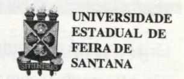

# **FOLHETIM DE EDUCAÇÃO MATEMÁTICA**

**Ano 5 - número 58 - Folhetim d e Educação Matemátic o - Departamento d e Ciências Exotas** 

#### **OBJETIVO**

Este *Folhetim é* um veículo de divulgação, circulação de ideias e de estímulo ao estudo e à curiosidade intelectual. Dirige-se a todos os interessados pelos aspectos pedagógicos, filosóficos e históricos da Matemática. Pretende construir uma ponte para unir os que estão próximos e os que estão distantes.

#### **EDITORIAL**

Se estivesse vivo, neste mês de setembro o saudoso prof. Omar Catunda estaria completando mais um ano. Para registrar, encontramos numa coletânea do Instituto de Física da Universidade Federal da Bahia, publicada no ano passado, uma homenagem feita ao professor Catunda quando lhe foi outorgado o título de Professor Emérito daquela Instituição. No discurso de entrega do diploma, o prof Dionicarlos S. de Vasconcelos lembra que "A unanimidade em verificar o seu extremo amor pela ciência, a sua grande consciência crítica diante dos problemas bem como seu elevado espírito ético, conduziu a todos os seus alunos e contemporâneos a vê-lo como um exemplo raro de mestre sensível, competente, porém jamais dotado de paternalismo.".

#### **COMITÉ EDITORIAL**

Carloman Carlos Borges (Doutor) Inácio de Sousa Fadigas (Mestre)

## **PERGUNTE QUE O NEMOC RESPONDE**

**Pergunta.** Clarisse A. S. dos Santos, de Recife, escreve: *É verdade que o raio não cai duas vezes no mesmo lugar? Caso afirmativo, o lugar mais seguro para a gente resguardar-se de um raio é permanecer em algum lugar onde a pouco tempo caiu um raio? Há uma maneira matemática de abordar o assunto?* 

R. Em um mesmo lugar L, se já caiu o raio A, outro raio B, logo depois poderá cair. Essa história de que o raio não cai duas vezes no mesmo lugar não passa de lenda. Isso pode ser ilustrado por um velho cajueiro, aqui, em nosso sítio e sobre o qual já cairam três raios, dois deles em um mesmo dia... A ciência da ProbabiUdade é o ramo da matemática onde o assunto de sua carta pode ser tratado. Ela tem hoje dentro da Teoria da Medida um tratamento específico. Ela estuda, exempUficando, processos Estocásticos (uma sequência de experimentos na qual o resultado de cada experimento particular depende de algum elemento de azar). Estocástico provém do grego *stochos* que significa *conjectura.* A Teoria das Probabilidades estuda, também, o comportamento de seqiiências de variáveis Aleatórias (aquelas variáveis que dependem do acaso). Para o que vem a seguir, precisamos da *noção de independência:* dois *acontecimentos* são denominados *independentes* se não têm *nada a ver um com o outro,* isto é, a ocorrência de um não afeta, em média, a ocorrência do outro. Exemplificando: em uma primeira aproximação, as trajetórias de duas moléculas de gás afastadas uma da outra não influem uma sobre a outra; assim, as variáveis aleatórias que descrevem suas trajetórias são independentes. Podemos, agora, dar a seguinte defmição**:<ioÍ5** *eventos A e B são independentes* se a Probabilidade de que eles ocorram simultaneamente é igual ao produto de suas respectivas probabilidades:

$$P(A \cap B) = P(A) \cdot P(B) \qquad (I)$$

Esta fórmula mostra que a probabilidade de ocorrência de A em presença de B é a mesma de B não ocorrer: a ocorrência de B não modifica a probabilidade de A. Pela simplificação que ela introduz nos cálculos, a noção de independência tem um papel central na Teoria da Probabilidade (TP). Claramente, é preciso tomar alguns cuidados na sua postulação; quando jogamos cartas, exemplificando, é preciso embaraUiar bem as cartas, do mesmo modo que devemos chacoalhar bem os dados, no jogo de dados, entre lances consecutivos, a fim de que os mesmos sejam considerados independentes. A fórmula (I) - para o assunto de que estamos tratando pode ser aproximada pela fórmula:

> Se A e B são independentes, então P(B, sabendo que A ocorreu) = P(B) (H)

Ao fazermos um grande número N de experiências independentes e considerando N(A) o número de ocorrências do acontecimento A e N(A n B) o número de ocorências de A e B, então, a probabilidade de B, sabendo-se que A ocorreu, deve ser aproximadamente:

$$\frac{N(A \cap B)}{N(A)} = \frac{N(A \cap B)}{N} : \frac{N(A)}{N}$$

ou aproximadamente:

P(A n B): P(A). Consequentemente, podemos definir

P(B, sabendo-se que A ocoreu)=P(An B): P(A) Sendo "A" e "B" independentes, (I) implica que o membro à direita é:

$$\frac{P(A) \cdot P(B)}{P(A)} = P(B);$$

P(A)

logo: P(B, sabendo-se que A ocorreu) = P(B) Assim, Clarisse, a ocorrência de "A" (aquedado raio A em L) não nos informa nada sobre "B" (a queda do raio B sobre L), cuja probabilidade permanece igual a P(B), pois os físicos nos ensianm que "A" e "B" são eventos independentes. Você poderá concluir que L (onde já caiu um raio) não é lugar mais seguro para reaguardar-se do perigo da queda de outro raio. A fórmula (II) é apUcável, igualmente, aos horóscopos pedra central da astrologia. Os astrólogos costumam avahzar afirmativas como esta: *Se você é de Peixes, esta semana você encontrará o grande amor de sua vida.* Temos , aí, dois eventos: *ser de Peixes* e *encontrará esta semana o grande amor de sua vida.* Claramente são dois eventos independentes; o primeiro nada tem a ver com o segundo e vice-versa; logo, podemos apUcar a fórmula (II) e dela inferir que a probabilidade de uma pessoa, que é de Peixes, encontrar esta semana o grande amor de sua vida (por que essa mania de se estar sempre à espera de um grande amor?) é a mesma que a pessoa seja de Peixes, de Câncer, ou de nenhum deles. Agora, a conclusão é óbvia: o lugar apropriado aos horóscopos é a lata de lixo. Mas, cahna! *Se eles fossem uma inutilidade, como explicar que astrónomos notáveis, entre eles, Kepler, fossem seus ardorosos defensores?* Ora, o fato mostra, apenas, que nem os melhores pensadores de uma época conseguem libertar-se inteiramente dos limites sócio-culturais nos quais estão

megulhados. Porém, como bem assinala o notável físico contemporâneo David Ruelle, em sua obra: *Acaso e Caos,* Editora UNESP: *há algo de poesia nessas predições de viagens distantes, de encontros românticos, de heranças fabulosas ... e essas profecias são bastante inocentes se não acreditarmos demais nelas.* Este eminente físico contemporâneo, encerra o último capítulo dessa obra com o seguinte trecho: guando *se trata de consciência e de certezas introspectivas, devemos sempre nos lembrar de quanta força e de quanta habilidade a nossa mente usa para se enganar a si mesma. Dentre os ensinamentos da psicanálise, este pelo menos merece não ser rejeitado levianamente.*  Um pequeno esclarecimento: o ensinamento acima sempre foi a procupação maior dos místicos orientais, centenas de anos antes danossaerae, consequentemente, antes da criação da psicanáUse. •

*Pergunte que o NEMOC Responde é* uma coluna de autoria do prof. Dr. Carloman Carlos Borges e objetiva atingir ao púbUco interessado em Matemática nos seus múltiplos aspectos.

Caso o leitor queira fazer alguma pergunta escreva-nos.

## **PRÓXIMO NÚMERO**

*Uma abordagem sobre Piaget e a Matemática.* 

*Aguardem!* 

#### **DIVERTIMENTOS MATEMÁTICOS**

*Thomaz de Jesus Ramos* 

- 1. Um problema bem antigo e popular, consiste no seguinte: efetuar ligações, para três casas, de água, de luz e telefone, a partir de três centrais diferentes. Casas, centrais e Ugações estão no mesmo plano. Não são permitidas ligações cruzadas.
- 2. Um dos problemas bem antigos é aquele do árabe milionário que ao morrer deixa de herança para seus três fiUios dezessete camelos, especificando que a partilha deveria obedecer o seguinte: ao filho mais velho, caberá a metade dos camelos, ao seguinte, um terço e, finalmente, ao de menor idade a nona parte. Os jovens herdeiros ficaram desesperados, pois, claramente, tal partilha é impossível a partir dos 17 camelos. Ao procurarem a ajuda de um velho sábio, esterespondeu-Uies: meus filhos, dou-lhes de presente mais um camelo e, agora, repartiremos com vocês 18 camelos. Ao mais velho coube a metade de 18, isto é, 9 camelos; ao seguinte, coube um terço de 18, isto é, 6 camelos e, ao mais jovem, um nono, ou seja, 2 camelos. Como 9 + 6 + 2 = 17, o camelo restante voltou às mãos do sábio e os três irmãos ficaram satisfeitos sem, contudo, entenderem o cálculo envolvido nesta distribuição. Você quer explicar esse truque?

Como resposta ao problema da coluna *Divertimentos Matemáticos,* publicado no *Folhetim* n°56, recebemos da leitora Halley Barreto Azevedo a seguinte solução:

**Casais: A, a, B, b, C, c => maiúsculo=homem => minúsculo=mulher A, B, C, c a,b - > b A,a,B,C, c**< **a B,C, c A, a b.a A,B,C, c < A A,B C e , C,c A, a, B, b a,b B,b A, a . C,c,A a,B,b &lt; a a B,b ^ B,b,C,c, A A, a < A A, a A, a,B,b, C, c** 

## **NOTÍCIAS**

Será realizada no período de 01 a 03 de outubro de 1997 a I SEMANA DE FÍSICA DA UEFS, com mini-cursos; palestras; painéis e mesa redonda.

Inscrição: gratuita/vagas limitadas

Período: 15 de setembro a 01 de outubro

Local: sala MP-46 / módulo IV / UEFS

Público alvo: professores e estudantes uiúversitários e do segundo grau.

Promoção: Área de Física - Departamento de Ciências Exatas-UEFS

Informações:

Tel: (075) 224-8206 FAX: (075) 224-1926 e-mail: fisica@uefs.br ou telemaire@uefs.br página web: viww.uefs.br/uefs/semfis.html

Conforme divulgado no número anterior do nosso Folhetim, a UEFS, através do NEMOC vai oferecer um CURSO DE ESPECIALIZAÇÃO EM EDUCAÇÃO MATEMÁTICA. As discipUnas que serão oferecidas, são:

- \* Ideias Fundamentais da Matemática
- \* Introdução à Teoria dos Grafos
- \* Didática da Matemática
- \* Álgebra Linear e Geometria Analítica
- \* Geometria Euclidiana
- \* Teoria dos Números
- \* Psicogênese do Conhecimento
- \* Epistemologia e Metodologia da Pesquisa
- \* Seminários sobre Tópicos Gerais de Matemática

Este Curso tem aprovação da Capes, e em breve daremos informações mais precisas.

#### **NÚMEROS ATRASADOS**

Envie para cada folhetim um selo de postagem nacional de 1° porte. Dentro de no máximo quatro semanas, contadas a partir da data de recebimento do seu pedido, você estará recebendo os folhetins soUcitados. OBS.: E permitida a reprodução total ou parcial desse folhetim, desde que citada a fonte.

#### **NEMOC - NÚCLEO D E EDUCAÇÃO MATEMÁTICA OMAR CATUNDA**

**Folhetim de Educação Matemática Ano 5. n. 58 Setembro/97** 

**Editores: Carloman e Inácio** 

**Editoração e Impressão:Núcleo de Editoração** 

**Gráfica-NUEG** 

**Tiragem: 1.000exemplares** 

**Endereço: Av. Universitária, s/n - km 03** 

**BR 116 - Campus Universitário** 

**Telefone: (075)224-8115** 

**Fax: (075)224-2284-CEP44031-460 Feira de Santana - BA - BRASIL** 

**e-mail: nemoc@uefs.br**