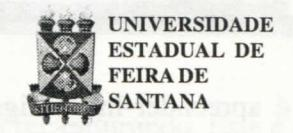
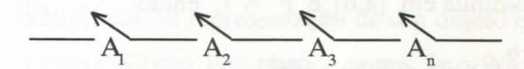
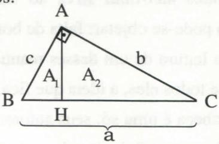
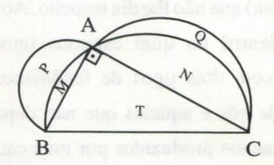

# FOLHETIM DE EDUCAÇÃO MATEMÁTICA

Ano 5 - número 59 - Folhetim de Educação Matemática - Departamento de Ciências Exatas

Outubro/1997

#### **OBJETIVO**

Este Folhetim é um veículo de divulgação, circulação de idéias e de estímulo ao estudo e à curiosidade intelectual. Dirige-se a todos os interessados pelos aspectos pedagógicos, filosóficos e históricos da Matemática. Pretende construir uma ponte para unir os que estão próximos e os que estão distantes.

#### **EDITORIAL**

No número anterior do Folhetim (nº 58), anunciamos que no presente número, o professsor Carloman Carlos Borges iria escrever ao leitor sobre Piaget e a Matemática, na coluna Pergunte que o NEMOC Responde . Porém, devido à constantes perguntas sobre o Construtivismo, entre outros assuntos, resolvemos priorizar o leitor, respondendo aos seus questionamentos.

Oportunamente, falare-mos sobre Piaget e a Matemática.

Queremos chamar a atenção também do nosso leitor sobre o interessante artigo do professor Ernesto Rosa Neto, publicado no número 34 da Revista do Professor de Matemática.

Não menos intessante é a abordagem do professor Carloman sobre estrutura curricular e ensino de matemática.

## COMITÊ EDITORIAL

Carloman Carlos Borges (Doutor) Inácio de Sousa Fadigas (Mestre)

#### PERGUNTE QUE O NEMOC RESPONDE

Pergunta. Flávia C. de Souza, de Belo Horizonte escreve: Você não acha a hora de mudar a estrutura curricular no que diz respeito ao ensino de Matemática?

R. Acho e, desde que tenho consciência do problema venho lutando por isso. No meu entendimento estes são alguns pecados salientes nessa estrutura: e bem visíveis na maioria de nossos manuais didáticos: a) ausência completa de unidade metodológica: os diversos assuntos são apresentados sem entrelaçamento natural que deve existir entre eles; a ideologia predominante é aquela que postula o estabelecimento, a priori de uma ordem necessária na apresentação dos assuntos. Essa aprendizagem linear se constitui numa verdadeira camisa de força e, como consequência, surgem os famosos pré-requisitos. Essa linearidade pode ser ilustrada metaforicamente pelo circuito em série empregado em Eletricidade e ilustrado na figura abaixo:

A condição para a corrente passar através do circuito $\acute{e} A_1 \wedge A_2 \wedge A_3 \wedge ... \wedge A_n$

Em nossa metáfora a corrente é o conhecimento e os pré-requisitos são os diversos A; assim, o aluno somente alcançará o estágio A, se, necessariamente, passar pelo A, e, analogamente, acontecerá o mesmo com os demais estágios. Ninguém-criança ou animal superior-aprende desta maneira. O modo usual de compreender o que é um determinado objeto é apreender-lhe o significado e este é apreendido quando o objeto é contextualizado, quando ele é visto imerso numa verdadeira teia de aranha, isto é, com o maior número de ligações possíveis; o contrário desse ponto de vista é apresentado ao aluno de matemática: assim, lhe é apresentada a aritmética, depois a álgebra, a trigonometria, geometria analítica como compartimentos bem separados uns dos outros. Você só aprende quando se enrola numa rede de contradições e, no meio delas, consegue discernir a contradição fundamental, a qual servirá de bússola para conduzí-lo a uma vizinhança do conhecimento desejado; b) emprego de uma linguagem confusa e quase sempre errada. Será que é preciso salientar coisa tão óbvia: nada se aprende corretamente fora do quadro da Língua Materna? Assistir a uma aula de matemática a partir desse ponto de vista é um verdadeiro suplício. Estou me referindo à Língua Materna e não a linguagem técnica empregada nessa ciência. Aqui, o desastre é total ou como diria o grande poeta Pablo Neruda: tudo ... foi naufrágio. Lembro-me bem de um concurso de Cálculo Diferencial e Integral, a nível elementar. O ponto sorteado foi o chamado teorema fundamental do cálculo integral (TFCI): se f é contínua em [a,b] e F' = f, então:

$$\int_{a}^{b} f(x)dx = F(b) - F(a)$$

O candidato era um rapaz graduado em Matemática, inteligente, jovem, inexperiente e, consequentemente, auto-suficiente. Lembro-me muito de suas primeiras palavras na aula didática: Procurarei passar ao senhores da Banca uma apresentação desse interessante teorema não muito encontrada em nossos livros de cálculo. Com o giz na mão e virando-se para o quadro negro enunciou

o TFCI: seja f uma função qualquer; então:

$$\int_{a}^{b} f(x)dx = F(b) - F(a)$$

Alertado pela Banca de que o enunciado do TFCI estava incompleto, retrucou o candidato a professor universitário: eu sei disso; estou querendo apenas ser pedagógico; mas, atendendo ao seu aparte vou completá-lo: a e b são constantes. Daí seguiu-se uma demorada discussão com a Banca e, após os cinqüenta minutos regimentais reservados à aula e com o candidato ainda cada vez mais enrolado, esta deu por encerrados os trabalhos reprovando o candidato que saiu da sala vomitando desaforos, dizendo-se perseguido e que iria recorrer às instâncias superiores.

A existência de um bom programa organizado conforme as mais conceituadas normas pedagógicas, epistemológicas, etc não é suficiente para a qualidade do ensino e isso me leva a mais uma lembrança do passado. Há alguns anos atrás, do Departamento de Ciências Exatas de uma dessas Universidades interioranas, recebemos a grade curricular do seu incipiente Curso de Matemática para análise e possíveis sugestões. Qual não foi nossa surpresa ao contestar uma identidade entre os programas enviados e os há bastante tempo adotados na melhor universidade do País, na qual, diga-se de passagem, o doutorado é uma condição sine qua non para o ingresso em seu quadro docente enquanto na outra universidade cem por cento dos professores possuiam apenas a graduação. Neste momento estou a folhear um desses manuais destinados aos nossos infelizes e inocentes alunos. Na capa - em cores diferentes e agradáveis aparecem os títulos: Teoria dos Conjuntos, Funções, além do "chavão": uma abordagem construtivista.

Abro-o e fico correndo as páginas encantado com o seu colorido e a abundância de figuras e figurinhas. Na parte relativa à Teoria dos Conjuntos - aparecem apenas os rudimentos da linguagem e da notação dos conjuntos, prática, aliás, bem vinda. Porém, é preciso salientar que isso não caracteriza uma teoria, no caso a Teoria dos Conjuntos, cujo objeto é o estudo do infinito matemático; aliás, convém destacar que, para alguns desses manuais, parece que o objeto desse ensino é levar mais confusão para a cabeça dos alunos com problemas envolvendo o conjunto vazio. Na parte reservada ao estudo das Funções, há a seguinte classificação: função constante, função do 1º grau, função do 2º grau. Ora, desde quando função possui grau? A idéia de função é uma das mais fundamentais de toda a Matemática; não deve ser embrulhada em um conceito (grau) que não lhe diz respeito. Ao olharmos o mundo dentro do qual estamos imersos, nos deparamos com dois tipos de fenômenos: os que dependem de nós e aqueles que não dependem da gente; fenômenos produzidos por uma causa, como a dor, por exemplo. Causa e efeito - ambos ligados numa relação necessária. Como idealização dessa situação, os matemáticos criaram o conceito de função. Ele traduz variação, fluência, dinamismo e por isso traz consigo a idéia de variável, de transformação. Contudo, os manuais distribuídos aos nossos infelizes alunos definem função como uma coleção de pares ordenados; esta é uma definição estática, a qual não traduz a vitalidade daquele conceito. Agora, folheio outro exemplar dessa coleção na parte onde é explicada a operação inversa, isto é, destinada a crianças entrando na adolescência. Primeiro, uma página inteira com presidiários uniformizados fugindo de uma prisão e, logo em

seguida, guardas armados os recapiturando. Este é o exemplo para levar as crianças ao conceito da operação inversa da subtração nos números relativos. Não estou convencido que a fuga e imediata captura dos irmãos metralha sirva ao fim desejado. No mínimo pode-se objetar: falta de bom gosto. Ao término da leitura de um desses manuais - generalizo, de quase todos eles, a idéia que fica, persistente, em nossa cabeça é uma só: seus autores não possuem o discernimento suficiente sobre o que é e o que não é importante. Mais outro exemplo para ilustrar a tese: o conceito de semelhança. Aqui, mais uma vez funciona a unanimidade livresca observada nos manuais escolares: escreve-se uma ou duas linhas explicando o que é semelhança e logo em seguida aquela chatice dos vários casos de semelhança de triângulo. A chatice está na apresentação seca, insossa de um dos assuntos mais belos da geometria elementar. Belo e importante. A semelhança estando ligada à proporção, à razão - sobreleva a Matemática. Em todas as áreas da vida ela se apresenta constituindo-se um capítulo obrigatório da Estética. Ela faz parte do nosso pensamento, da estrutura intelectual do ser humano: como reconhecer, identificar na representação de um objeto o próprio objeto? Como reconhecer numa foto 3/4 da bem amada a própria bem amada? Como reconhecer as diversas formas sob as quais os fenômenos da Natureza se escondem? Nada aprendemos fora da moldura da proporcionalidade. Vejamos esse assunto mais de perto na matemática: o Teorema de Pitágoras, talvez o mais famoso teorema dessa ciência, e, certamente, um dos mais incompreendidos pelos alunos. Apresentamos logo um teorema: as áreas de duas figuras semelhantes estão entre si como o quadrado da razão de semelhança. Agora o Teorema de Pitágoras (TP) em uma de suas formas mais simples: a área do quadrado construído sobre a hipotenusa é igual a soma das áreas dos quadrados construídos sobre os catetos.

Em símbolos: $a^2 = b^2 + c^2$ . Na figura acima há três triângulos, dois a dois semelhantes: BAH (de área $A_1$ ), AHC (de área $A_2$ ) e ABC (de área A). A razão de semelhança do 1° para o 2° triângulo é dada por: $\frac{c}{b}$ e o segundo AHC para ABC é dada

por:
$$\frac{b}{a}$$
. Ambas ao quadrado dão: $\frac{c^2}{b^2}$ e $\frac{b^2}{a^2}$ .

Logo aplicando o primeiro teorema acima citado, vem:

$$\frac{A_1}{A_2} = \frac{c^2}{b^2}$$
ou $\frac{A_1}{c^2} = \frac{A_2}{b^2}$ ;

$$\frac{A_2}{A} = \frac{b^2}{a^2}$$
ou $\frac{A_2}{b^2} = \frac{A}{a^2}$

Devido a uma conhecida propriedade das proporções, podemos escrever:

$$\frac{A_1}{c^2} = \frac{A_2}{b^2} = \frac{A}{a^2} \iff \frac{A_1 + A_2}{c^2 + b^2} = \frac{A}{a^2}$$

Como, por hipótese: $A = A_1 + A_2$ , concluímos que: $a^2 = b^2 + c^2$ . Se considerarmos $A_1$ , $A_2$ e A como áreas de figuras semelhantes construídas sobre os catetos e a hipotenusa - na ordem indicada acima - então: $A_1 + A_2 = A$ (TP generalizado).

É claro que o privilégio do quadrado não se funda em qualquer suporte técnico. O Teorema de

Pitágoras, generalizado, é o seguinte: Se figuras semelhantes são construídas sobre a hipotenusa e sobre os catetos de um triângulo retângulo, então a área da figura maior é igual à soma das áreas das outras duas. Sabemos que dois círculos quaiquer são figuras semelhantes e a razão de semelhança é a razão entre seus raios. Uma aplicação simples de TP é a quadratura das _luas_ de Hipócrates de Chio (matemático grego do século IV a.C.). Sobre os lados de um triângulo retângulo, tomados como diâmetro, são traçados semi-círculos; as figuras curvilíneas P e Q, formadas pelos semi-círculos são chamadas luas de Hipócrates de Chio. A área T do triângulo é igual à soma das áreas das duas luas P e Q, conforme figura e explicação abaixo:

T + M + N (área do semi-círculo construído sobre a hipotenusa) = (M + P) + (Q + N) (soma das áreas construídas sobre os catetos). Simplificando: T = P + Q.

A demosntração generalizada do TP lhe revela a causa profunda: a semelhança. O aluno deve ser orientado a construir - exemplificando - triângulos equiláteros, semi-círculos, etc, - sobre os três lados de um triângulo retângulo a fim de atingir um melhor convencimento sobre a veracidade do TP, sentindo que o privilégio histórico do quadrado é imerecido, talvez, devido ao misticismo de algum matemático da Escola Pitagórica.

Pergunte que o NEMOC Responde é uma coluna de autoria do prof. Dr. Carloman Carlos Borges e objetiva atingir ao público interessado em Matemática nos seus múltiplos aspectos.

Caso o leitor queira fazer alguma pergunta escreva-nos.

#### PRÓXIMO NÚMERO

Ainda sobre o Construtivismo.

Aguardem!

## **EDUCAÇÃO E ENSINO**

Com a autorização do colega professor Ernesto Rosa Neto, em recente estada em nossa Instituição, vamos transcrever o artigo _A Lógica nas Embalagens_, publicado na Revista do Professor de Matemática (RPM) da Sociedade Brasileira de Matemática n° 34, página 21.

## A Lógica nas Embalagens

Ernesto Rosa Neto\*

Comprei um sorvete Misty e ia lendo a mensagens da caixinha, enquanto saboreava a iguaria. Assim, tratava simultaneamente da mente e do corpo. Estava escrito: _Temperatura de conservação: -15°C_ (ou mais). Não é interessante? O fabricante resolveu inverter a orientação da reta real, o que é muito bom para quebrar a rotina! Segundo esse modo, ficamos, por exemplo, com -20>-15. Espero que ele aumente o preço do sorvete!

No supermercado comprei um pão diet da

Wick Bold e lá está escrito: Sem adição de açúcar e gorduras. O que está escrito é que não foi adicionado "açúcar e gorduras". Os dois juntos, não, portanto pode ter sido adicionado açúcar ou gorduras (ou exclusivo).

A frase é do tipo: $\sim$ (p $\wedge$ q), que é equivalente a $\sim$ p $\vee$ $\sim$ q, o que significa sem adição de açúcar ou sem adição de gorduras, podendo ser: ou açúcar sem gorduras ou gorduras sem açúcar, ou nem açúcar nem gorduras. Depois fiquei pensando: pode ser que tenha açúcar e gorduras sem ter sido adicionados. A afirmação sem adição de açúcar e gorduras não é equivalente a não contém açúcar e gorduras. Do mesmo modo, nas balas _No Sugar_, e em vários outros produtos, está escrito: sem adição de açúcar.

O mau uso do e e do ou é muito comum. No restaurante estava escrito: _Proibido fumar charuto e cachimbo_. Mas quem vai fumar charuto e cachimbo?

Veja um exemplo simples do uso do e e do ou na Matemática:

$$x^{2} + 5x + 6 = 0 \Rightarrow x = 2$$
ou $x = 3$  
 $\Rightarrow x_{1} = 2$ e $x_{2} = 3$ .

Dizendo de outra maneira: podemos substituir x por 2 **ou** 3, isto é, as raízes são 2 **e** 3.

Na embalagem do pão Pullman está: _Pão de forma_ (sic) _para sanduíche com semolina_. Devo entender que o pão não serve para sanduíche sem semolina? Isso me lembra do pente para cabelo de plástico.

Nas garrafas de água aparece escrito: Água mineral natural. Se é água, é mineral e não animal ou vegetal. Água de torneira é mineral e natural. Água mineral natural é pleonasmo duplo.

Ai! É cansativo ser matemático ...

\* Professor Titular de Prática de Ensino, História da Ciência e Álgebra da Universidade Mackenzie. Consultor de Matemática do Colégio Santa Cruz - São Paulo.

## **DIVERTIMENTOS MATEMÁTICOS**

Thomaz de Jesus Ramos

Um milionário americano convencionou com seu banqueiro um determinado código telegráfico que seria empregado toda vez que ele solicitasse dinheiro ao Banco. Cada algarismo 0, 1, 2, 3, 4, ..., 9, seria representado por uma letra do alfabeto e, ainda, o telegrama deveria conter sempre três grupos de letras, as quais quando traduzidas dariam três números, sendo o último igual à soma dos dois primeiros. Exemplificando: se o milionário telegrafasse: 120 355 475 estaria, então. pedindo a remessa de 475 dólares. Após dois meses de celebrado o acordo exposto acima, o banqueiro recebeu de seu cliente o seguinte telegrama Send more money cuja tradução é mande mais dinheiro. Aturdido, o banqueiro pensou que seu privilegiado cliente houvera esquecido o código combinado e, sem saber qual quantia deveria mandar, solicitou mais explicações. Como resposta, o cliente confirmou que houvera empregado o código combinado. Qual a quantia que o banqueiro deveria enviar?

As respostas ao problema proposto nesta coluna serão publicadas no _Folhetim_ nº 61. Qualquer leitor poderá enviar soluções.

### NOTÍCIAS

Será realizado de 11 a 13 de dezembro de 1997, em Ouro Preto, o I ENCONTRO MINEIRO DE EDUCAÇÃO MATEMÁTICA - I EMEM, com minicursos, conferências e mesas-redondas.

Informações e inscrições:

DEMAT / ICEB / UFOP

Campus Morro do Cruzeiro

35400-000 Ouro Preto - MG

Tel.: (031)559-1700 Telefax: (031)559-1692

E-mail: demat@iceb.ufop.br

O professor Clóvis Pereira da Silva lançou a 2ª edição do livro _A Matemática no Brasil. Uma história de seu desenvolvimento_ (versão em disquete 3.5′-Windows Word 2.0), 145 páginas.

Pedidos e envio de cheque nominal a:

Clóvis Pereira da Silva

Rua Guaratuba, 662 - Apt°201/Tel.:(041)2522950

80540-260 Curitiba -PR

## NÚMEROS ATRASADOS

Envie para cada folhetim um selo de postagem nacional de 1º porte. Dentro de no máximo quatro semanas, contadas a partir da data de recebimento do seu pedido, você estará recebendo os folhetins solicitados. OBS.: É permitida a reprodução total ou parcial desse folhetim, desde que citada a fonte.

#### NEMOC - NÚCLEO DE EDUCAÇÃO MATEMÁTICA OMAR CATUNDA

Folhetim de Educação Matemática Ano 5. n. 59 Outubro/97

Editores: Carloman e Inácio

Editoração e Impressão: Núcleo de Editoração

Gráfica-NUEG

Tiragem: 1.000 exemplares

Endereço: Av. Universitária, s/n - km 03

BR 116-Campus Universitário

Telefone: (075)224-8115

Fax: (075)224-2284-CEP44031-460

Feira de Santana - BA - BRASIL

e-mail: nemoc@uefs.br
