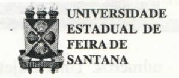
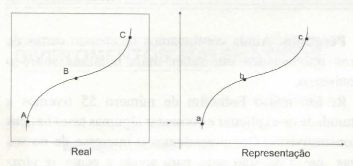

# FOLHETIM DE EDUCAÇÃO MATEMÁTICA

Ano 5 - número 60 - Folhetim de Educação Matemática - Departamento de Ciências Exatas

Novembro/1997

#### **OBJETIVO**

Este Folhetim é um veículo de divulgação, circulação de idéias e de estímulo ao estudo e à curiosidade intelectual. Dirige-se a todos os interessados pelos aspectos pedagógicos, filosóficos e históricos da Matemática. Pretende construir uma ponte para unir os que estão próximos e os que estão distantes.

#### **EDITORIAL**

Neste número, o professor Carloman Carlos Borges em sua coluna _Pergunte que o NEMOC Responde_, volta a fazer sérias reflexões sobre Construtivismo (veja abordagem anterior no Folhetim n° 55).

Chama a atenção para a rotulação de livros didáticos com "abordagem construtivista", que em seu conteúdo porém, apresenta os assuntos de forma linear.

Também o leitor encontrará na coluna Divertimentos Matemáticos um interessante problema desafiador.

Passou despercebido ...

No editorial do número 59 do Folhetim, onde se lê "falare-mos", leia-se "falaremos".

Pedimos desculpas ao leitor.

# COMITÊ EDITORIAL

Carloman Carlos Borges (Doutor) Inácio de Sousa Fadigas (Mestre)

### PERGUNTE QUE O NEMOC RESPONDE

**Pergunta.** Ainda continuamos recebendo cartas de leitores interessados em saber mais detalhes sobre o Constutivismo.

R. Em nosso Folhetim de número 55 tivemos a oportunidade de explicitar e comentar algumas teses básicas do Construtivismo. Compreendemos o interesse de nossos colegas nessa questão pois, para aonde a gente se virar dentro do meio acadêmico, as questões pedagógicas giram em torno desse assunto. Alguns manuais escolares trazem, na capa principal, uma tarjeta de múltiplas cores com a divisa: UMA ABORDAGEM CONSTRUTIVISTA. A metáfora do conhecimento como uma contrução é mais antiga, numa primeira aproximação, do que o descobrimento do Brasil. Assim, nos causa estranheza quando - em seminários ou mesmo congressos - ouvimos alguém, geralmente, circunspectro, repetir: o conhecimento é uma construção que deve ser feita a partir da realidade do aluno; ou, ainda, após a menção de alguns postulados construtivistas apresentados sempre como as últimas conquistas da moderna epistemologia: devemos agarrar esses postulados com unhas e dentes ... esquecendo-se de que, desta forma, qualquer discussão fecunda está liminarmente, bloqueada e, consequentemente, os alvos a serem alcançados pelo ensino, em qualquer área, que são as autonomias intelectual e moral, também ficam prejudicados. Lendo um desses livros a primeira coisa a nos chocar é o dogmatismo, a prontidão nas respostas a problemas perturbadores desde os tempos antigos e o emprego de uma linguagem dúbia. Exemplificando: o conhecimento é uma representação mental. O termo representação está sendo empregado em qual significado? Tornemos as coisas mais claras e recorramos aos nossos amigos físicos. A Teoria da Relatividade confirma: a descrição de um evento, uma ocorrência, um acontecimento qualquer é organizado em uma ordem espaço-temporal. Isso quer dizer que tal descrição necessita de um conjunto de quatro números. Uma trajetória, exemplificando, deve ser representado por uma seqüência de pontos, a qual determina uma curva no espaço-tempo. A representação desse real é feita por intermédio de uma correspondência biunívoca: a cada ponto do real (no caso a trajetória) corresponde um ponto na curva representativa e viceversa. As duas figuras abaixo pretendem esclarecer melhor o assunto.

Nessa representação estamos refletindo um mundo que existe independentemente? Trata-se da representação ou da criação de um mundo? Para os físicos o cerne da representação é a correspondência bi-unívoca. É calro que o conhecimento - pelo menos o humano não é elaborado dessa maneira. Recordemos como a criança chega a conhecer o sabonete: vê o objeto, procurando integrá-lo ao seu mundo sensorial e logo quer saber para que serve; é convivendo com o objeto, interagindo com ele: assim, a criança constrói as diversas aproximações cognitivas acerca do objeto. Isso nos leva a estabelecer a seguinte cadeia: conhecimento é compreensão do significado e este é explicitado quando contextualizado. A contextualização do significado emerge quando o objeto é imerso numa teia de ligações. Salta à vista, então, o seguinte: o conhecimento é uma construção (isso não era novidade nem para os gregos antigos contemporâneos de Platão ...), porém não é uma construção linear. Se o conhecimento é ou não uma construção - é uma discussão bizantina. O elemento básico a partir do qual se justifica qualquer seminário repousa na linearidade, provavelmente. Pois bem: os livros, cujos autores se auto-denominam de construtivistas - desenvolvem seus assuntos de modo linear. Veja um livro sobre matemática. Se ele for moderno terá na capa principal uma terjeta com a divisa: UMA ABORDAGEM

CONSTRUTIVISTA; porém, o assunto é següencial. linear. Claramente, no ensino dessa ciência há que respeitar algumas cadeias lineares. Não se deve ensinar determinados algoritmos a pessoas desprovidas de qualquer compreensão sobre os elementos simbólicos neles empregados. Estabelecer, porém, uma sequência, uma linearidade entre, exemplificando, o ensino de derivada e da integral, isto é, afirmar a necessidade da precedência do ensino de derivada para a compreensão da integral, como se verifica na maioria esmagadora de nossos manuais escolares, é defender um princípio sem justificativa lógica e mesmo sem apoio histórico. Somente a unanimidade livresca isto é, o hábito da maior parte dos autores desses manuais escolares reproduzirem o que outros que lhe antecederam escreveram sobre o mesmo assunto justificaria tal apresentação. Lembramos que o maior livro sobre Cálculo Diferencial e Integral escrito no século XX (estamos nos referindo ao Cálculo Diferencial e Integral de Richard Courant) mostra muito bem alternativas para o desenvolvimento do assunto. Nessa mesma linha, mencionamos o excelente Cálculo de Tom M. Apostol. São exemplos de autores criativos. A grade curricular do ensino de matemática desde o fundamental exibe uma linearidade que deve ser urgentemente discutida. Fora raras exceções, a ordem na distribuição dos assuntos não é uma ordem necessária. Uma discussão a esse respeito poderia, talvez, enriquecer, em muito, a pedagogia da matemática. Ainda mais um exemplo: o ensino da Geometria Analítica; aqui, problemas há de mais fácil resolução com o emprego dos métodos algébricos sem qualquer menção aos recursos de métodos vetoriais e vice-versa, outras vezes torna-se bem mais fácil o emprego desses objetos. Uma metodologia para essa disciplina deve considerar tais alternativas. Veja como isso é feito de modo sério e competente lendo Coordenadas no Plano, de Elon Lages Lima, com a colaboração de Paulo Cezar Pinto Carvalho, Coleção do Professor de Matemática, Sociedade Brasileira de Matemática. O Construtivismo em matemática liga-se ao problema de existência. Como se prova a existência de um objeto? Os matemáticos o fazem, pelo menos, de dois modos distintos: a) através da construção de um exemplo bem claro do dito objeto e b) através de uma demonstração puramente lógica, isto é, mostra-se que a não existência do objeto conduziria a uma contradição. Vejamos dois exemplos elucidativos, respectivamente, de (a) e (b). Mostremos que há uma infinidade de números primos:

- 1 Sejam $p_1, p_2, ..., p_n$ elementos de um conjunto finito qualquer de números primos.
- 2 Vamos construir o número: $p_1 \cdot p_2 \cdot \dots \cdot p_n + 1$ , o qual não é claramente divisível por nenhum dos números $p_1, p_2, \dots, p_n$ . Logo, esse número é primo ou é divisível por outro número primo p.
- 3-Em qualquer uma das hipóteses mencionadas, deve existir um número primo que não pertence ao conjunto, $p_1, p_2, \dots, p_n$ ; conseqüentemente, o conjunto dos números primos é infinito. De uma maneira mais tangível e, exemplificando, tem-se: a seguinte construção:

$N_1 = 2.3 + 1 = 7$ (novo número primo)

$N_2 = 2.3.7 + 1 = 43$ (novo número primo)

Quando N, não for primo, evidentemente ele conterá entre seus divisores, pelo menos um número primo não encontrado anteriormente. A conhecida demonstração por absurdo - uma das mais importantes contribuições metodológicas dos gregos à matemática - é fundamentada no princípio lógico clássico denominado de terceiro excluído: dada a proposição p, ou p ou sua negação não p é verdadeira; não há, quanto ao valor de p uma terceira alternativa. Na arrumação de uma demonstração por absurdo nós substituímos o teorema: $(H \Rightarrow T)$ , por $[(H \land \neg T) \Rightarrow f]$ , estabelecendo, assim a tautologia: $[(H \Rightarrow T) \Leftrightarrow (H \land \sim T) \Rightarrow f]$ na qual HeT representam, respectivamente, a hipótese e a tese do teorema, e f significa falsidade. Vejamos a seguinte demonstração, por esse método, do teorema: existem números irracionais a e b tais que o número: ab é racional. Abaixo a demonstração:

- i) o número $\sqrt{2}$ é irracional e o número $(\sqrt{2})^{\sqrt{2}}$ é racional ou irracional (aplicação do terceiro excluído);
- ii) se $(\sqrt{2})^{\sqrt{2}}$ é racional a demonstração está terminada;

iii) se $(\sqrt{2})^{\sqrt{2}}$ é irracional nós consideramos: $a = (\sqrt{2})^{\sqrt{2}}$ e $b = \sqrt{2}$ , quando, então, vem: $((\sqrt{2})^{\sqrt{2}})^{\sqrt{2}}$ = 2 e a demonstração aqui termina.

Ela não é aceita pelos contrutivistas em virtude do item i) (aplicação do _terceiro excluído_). Seria aceita pelos construtivistas se existisse um modo construtivo de afirmar que $(\sqrt{2})^{\sqrt{2}}$ é racional ou irracional. Finalmente, do exposto, surgem algumas questões para discussão:

- 1a) Discutir se o conhecimento é uma construção ou não é irrelevante. O problema a ser esclarecido é: _como_ é construído o conhecimento?
- 2ª) Aprendemos de maneira linear? As mais recentes pesquisas apontam numa direção diferente à linearidade. Então, como fica o ensino de matemática?
- 3ª) O conhecimento é uma representação mental? No significado já discutido acima, as recentes pesquisas apontam em outra direção.
- 4ª) É provável que toda a estrutura de nosso ensino esteja fundamentada, talvez, em pressupostos cognitivos ou já ultrapassados ou suficientemente incompletos; é necessária uma urgente avaliação.
- 5ª) Nós não apreendemos o mundo linearmente. Aliás, a maioriados fenômenos naturais são não lineares. A idéia de linearização, com o subproduto chamado de aproximação, parece esgotar-se. Esclarecemos: as aproximações no processo do conhecimento são necessárias: o conhecimento sempre será uma aproximação; questionamos aproximações como subproduto da linearização e excluisivamente quantitativas. •

Pergunte que o NEMOC Responde é uma coluna de autoria do prof. Dr. Carloman Carlos Borges e objetiva atingir ao público interessado em Matemática nos seus múltiplos aspectos.

Caso o leitor queira fazer alguma pergunta escreva-nos.

## PRÓXIMO NÚMERO

Alguns modelos Matemáticos e sua fecundidade.

Aguardem!

## **DIVERTIMENTOS MATEMÁTICOS**

Thomaz de Jesus Ramos

Explique os "porquês" de:

- i) do número 3862567 terminar em 6;
- ii) do número 815723 terminar em 5;
- iii) do número 4911732 terminar em 1.

As respostas ao problema proposto nesta coluna serão publicadas no _Folhetim_ nº 62. Qualquer leitor poderá enviar soluções.

# NOTÍCIAS

Nos próximos dias 02 a 05 de dezembro, a Universidade Federal Rural de Pernambuco estará realizando o Simpósio "Paulo Freire: Educação e Transformação".

O evento faz parte da programação do VII Congresso de Iniciação Científica da UFRPE, que conta com o apoio da CAPES/CNPq.

Informações:

Curso de Mestrado em Ensino das Ciências

Departamento de Física e Matemática / UFRPE

Fone: 081 - 4414577 Ramal 331

Fax: 081 - 4411711 (Pró-Reitoria de Pesquisa e

Pós-Graduação)

e-mail: cmec-dfm@truenet.com.br

Acontecerá no período de 14 a 17 de janeiro de 1998 o V EPEM - Quinto Encontro Paulista de Educação Matemática. A promoção é da SBEM-SP.

Informações:

Comissão Organizadora do VEPEM/SBEM-SP. Rua Yvette Gabriel Atique, 45 - Boa Vista 15025-400, São José do Rio Preto, S.P.

A Universidade do Vale do Rio dos Sinos -UNISINOS estará sediando o VI Encontro Nacional de Educação Matemática - ENEM, promovido pela SBEM, nos próximos dias 19 a 24 de julho de 1998, no Novo Campus da UNISINOS, em São Leopoldo, RS.

Informações:

Pró-Reitoria Comunitária e de Extensão Av. UNISINOS, 950 - Caixa Postal 275 92022-000 - São Leopoldo - RS http://www.unisinos.tche.br

## NÚMEROS ATRASADOS

Envie para cada folhetim um selo de postagem nacional de 1° porte. Dentro de no máximo quatro semanas, contadas a partir da data de recebimento do seu pedido, você estará recebendo os folhetins solicitados. OBS.: É permitida a reprodução total ou parcial desse folhetim, desde que citada a fonte.

#### NEMOC - NÚCLEO DE EDUCAÇÃO MATEMÁTICA OMAR CATUNDA

Folhetim de Educação Matemática Ano 5. n. 60 Novembro/97

Editores: Carloman e Inácio

Editoração e Impressão: Núcleo de Editoração

Gráfica-NUEG

Tiragem: 1.000 exemplares

Endereço: Av. Universitária, s/n - km 03

BR 116 - Campus Universitário

Telefone: (075)224-8115

Fax: (075)224-2284-CEP44031-460

Feira de Santana - BA - BRASIL

e-mail: nemoc@uefs.br
