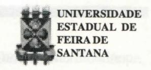
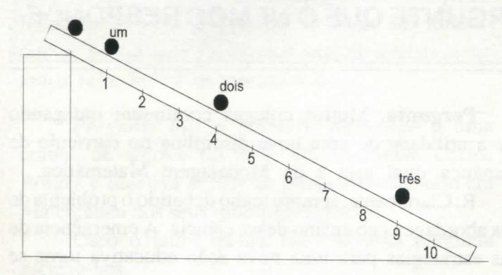
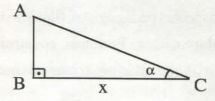

# FOLHETIM DE EDUCAÇÃO MATEMÁTICA

Ano 5 - número 61 - Folhetim de Educação Matemática - Departamento de Ciências Exatas

Dezembro/1997

#### **OBJETIVO**

Este Folhetim é um veículo de divulgação, circulação de idéias e de estímulo ao estudo e à curiosidade intelectual. Dirige-se a todos os interessados pelos aspectos pedagógicos, filosóficos e históricos da Matemática. Pretende construir uma ponte para unir os que estão próximos e os que estão distantes.

#### **EDITORIAL**

Estamos encerrando mais um ano civil, no qual tivemos o desafio de manter, apesar das dificuldades, a periodicidade mensal do _Folhetim_.

Para o próximo ano, a nossa perspectiva é de continuar mantendo o ritmo de trabalho, sempre visando ao leitor. Além disso, estamos com um projeto de construção da nossa "home-page", dando assim mais um passo em direção à universalização do conhecimento.

No ano de 97, demos um passo nessa direção, através da disponibilização do nosso "e-mail", por intermédio do qual temos recebido (e respondido) com mais eficácia, às constantes correspondências dos nossos leitores.

Carloman, Inácio e Josenildes

# COMITÊ EDITORIAL

Carloman Carlos Borges (Doutor) Inácio de Sousa Fadigas (Mestre)

### PERGUNTE QUE O NEMOC RESPONDE

Pergunta. Muitos colegas continuam indagando sobre a utilidade de uma nova disciplina no currículo de matemática, qual seja a de Modelagem Matemática.

R. Claramente, sempre tenho debatido o problema de novas abordagens no ensino dessa ciência. A emergência de novas estratégias para uma nova ação educativa torna-se necessária não apenas no respeitante à Matemática; ela pode e deveria ser ampliada a outros setores do conhecimento humano. Não deixa de ser interessante, para não dizer paradoxal, que o ensino de matemática deixe de lado atividades básicas do cérebro humano: a simulação e a resolução de problemas. Aliás, tais atividades são inerentes ao ser vivo, pois viver significa competência e conhecimento os quais se manifestam por intermédio daquelas atividades. Nossos manuais escolares - na sua maioria - não apresentam problemas e sim meras questões identificáveis a simples algoritmos. Daí a completa falta de motivação do aluno perante elas. É pouco provável a existência de outro domínio do saber humano que possa competir com a Matemática quando se trata de ilustrar e desenvolver faculdades mentais do cérebro humano, como a análise, a síntese, a abstração e a generalização. No entanto, o que vemos na realidade? Que vemos numa sala de aula de matemática? Um persistente esforço do professor em transformar o aluno em simples reprodutor de outro reprodutor (no caso o próprio professor). Que vemos até nos cursos de capacitação para alunos-professor? Em primeiro lugar - na sua grande maioria - são ministrados por pessoas que deveriam estar nos bancos escolares a fim de se submeterem igualmente à capacitação; em segundo lugar são desenvolvidos dentro de uma metodologia industrial, cuja divisa mór é: tempo é dinheiro; em terceiro lugar, quarto, quinto lugares, bem, deixe isso prá lá ... Saber modelar situações do dia a dia: eis, aí, uma tarefa altamente educativa, a qual pode e deve ser introduzida no ensino de Matemática. Mesmo porque, que é

conhecimento científico senão uma rede de idéias e de modelos? Comecemos nossos exemplos ilustrativos com o estudo do movimento feito por Galileu há mais de 350 anos. Ele procedeu da seguinte maneira: fez uma bola rodar para baixo em um plano inclinado e observou o movimento.

Antes de Galileu, já era conhecida a maneira de medição de uma distância, porém não existia um modo rigoroso para a medição do tempo, particularmente tempos de breve duração. Esse grande sábio usou seu próprio pulso para contar intervalos de tempos iguais chegando à conclusão: a distância é proporcional ao quadrado do tempo, isto é: $D \propto t^2$ . Assim, considerando g aproximadamente igual a 9,81 m/s², Galileu chegou à fórmula conhecida de nossos estudantes do

2° grau: $D = \frac{1}{2} gt^2(I)$ . Neste ponto a professora faria muito bem em esclarecer que a resistência do ar foi desprezada; assim, a fórmula (I) apresenta uma primeira aproximação do fenômeno em questão. Para uma segunda aproximação a fórmula (I) receberia mais um termo correspondente à resistência do ar; porém como esta depende da temperatura e da pressão do ar, a professora poderia apresentar uma terceira aproximação, tornando claro para o aluno a importância do conceito de aproximação, tão relegado nos manuais escolares. Deixaria bem evidenciado que todo nosso conhecimento é elaborado não de modo exaustivo, porém, através de aproximações cada vez mais finas, as quais jamais esgotarão o objeto ou fenômeno estudado. Talvez com isso o aluno recebesse mais uma lição não só de física e de matemática, mais também, de humildade ante a impossibilidade de uma última aproximação ...

Estabelecido o modelo acima, pode-se colocar

a seguinte pergunta: existem outros fenômenos análogos? A resposta é positiva:

a) considere um ser celular de forma esférica: a superfície S da célula é dada por $S = 4\pi r^2$ (sendo r o raio da esfera);

b) considerando E a energia de um corpo que cai e m e v sua massa e velocidade, respecti-

vamente, então: $E = \frac{1}{2} mv^2$ ;

c) seja o triângulo ABC

Sua área A é expressa por $A = \frac{1}{2}x^2 tg\alpha$ .

Nesta altura a professora poderia colocar a pergunta: existirá uma fórmula que sirva de síntese para todas as anteriores? A resposta ainda é positiva e

ela é dada por: $y = \frac{1}{2}ax^2$ (II). Como interpretá-la em relação as anteriores?

Nas anteriores as variáveis D, t; S, r; E, v; A, x; dizem respeito a casos particulares: um corpo em queda livre, superfície de uma célula esférica. energia de um corpo caindo, área de um triângulo. Aqui, o aluno já deve ser informado que ele está na presença de uma generalização, isto é, da análise de casos particulares (quatro) elaborou uma fórmula mais abrangente. Veja que a fórmula (II) não faz menção a nenhuma das grandezas envolvidas nas quatro fómulas anteriores; é como se elas tivessem sido eliminadas passando a serem representadas por y e x. Temos aí exemplo de uma simples abstração acompanhada da respectiva generalização. Para enfatizar uma das matrizes mais fecundas da criatividade matemática (a generalização), a professora poderia perguntar aos alunos: que outras funções vocês conhecem? Eles provavelmente responderiam: bem, já estudamos as funções $y = ax^2$ , $y = a^x$ , $y = \log x$ , $y = \lg x$ , etc.

Prosseguindo: como generalizá-las? Com um pouco de atenção, os alunos chegariam a mais uma generalização: y = f(x). Penso que a exposição acima poderia servir de modelo para quase todos os tópicos de matemática, principalmente nos 1° e 2° graus. O explicitamento dos mecanismos básicos do

cérebro humano por intermédio do ensino da Matemática, certamente se constituiria em um poderoso recurso pedagógico capaz de desenvolver atualizando - as potencialidades mentais de nossos alunos. Vejam bem: tal atualização, claramente, serviria de instrumental metodológico para o aluno empregá-lo em situações não matemáticas, de seu cotidiano. As funções afim e linear, respectivamente: y = mx + k e y = mx também podem ser modelos de situações já conhecidas do dia a dia do aluno. Assim, a função afim serve de modelo para:

a) preço de uma corrida de táxi em função da distância percorrida; neste caso basta considerar: m = preço de km rodado; k = bandeirada (taxa inicial), x = número de quilômetros percorridos e y = preço da corrida;

b) trajeto percorrido com velocidade uniforme emfunção do tempo: v = velocidade uniforme (constante), $s_0 = p$ osição inicial, t = tempo de percurso e s = espaço percorrido; logo podemos escrever $s = vt + s_0$ ;

c) consumo de energia elétrica: m = preço quilowatt-hora, k = preço do aluguel do relógio, x = número de kWh consumidos e y = total da conta;

d) as funções lineares representadas por y = mx servem para modelar questões envolvendo proporcionalidade. Exemplos: dizemos que os conjuntos numéricos X e Y são proporcionais quando existem: i) uma bijeção $f: x \in X \rightarrow y \in Y$ e ii) um número m tal que y = mx. A bijeção f é denominada de proporcionalidade e o número m é chamado de razão de coeficiente de proporcionalidade. Exemplos:

a) $\frac{X}{Y} \begin{vmatrix} 1 & 2 & 3 & 4 & 5 \\ 4 & 8 & 12 & 16 & 20 \end{vmatrix}$

$m = 4$  
$y = 4x$  

b) $\frac{X}{Y} \begin{vmatrix} 0,1 & 0,01 & 0,001 & 0,0001... \\ 0,05 & 0,005 & 0,0005 & 0,00005... \end{vmatrix}$

$m = 0,5$  
$y = 0,5x$

c) Consideremos uma mola resistente à compressão e à extensão e que se encontra suspensa verticalmente. Na extremidade inferior da mola é pendurado um corpo de massa m tão grande em relação à massa da mola que esta pode ser desprezada. Se o corpo é puxado para baixo de uma certa distância e em seguida liberado, ele passa a movimentar-se. Neste caso, a força da mola, que é exercida por esta quando deformada é proporcional à deformação, isto é:

F=ks (Lei de Hooke, físico inglês, 1635-1703). Aqui, s é o alongamento e k é a constante de proporcionalidade, também conhecida como _módulo da mola_.

d) Considere um ferro elétrico de "passar roupa" e sejam $q_1$ e $q_2$ as quantidades de calor desprendidas na sua resistência ao ser atravessada por uma corrente elétrica durante $t_1$ e $t_2$ segundos, respectivamente. Verifica-se que a quantidade de calor produzida durante $t_1$ + $t_2$ segundos é a soma $q_1$ + $q_2$ . Deste modo a quantidade de calor é proporcional ao tempo em que é produzida.

e) Agora, um contra-exemplo: as tarifas postais não são proporcionais aos pesos das encomendas. Realmente, se uma encomenda com peso x paga y centavos de tarifa e outra com peso x' paga y' centavos, a encomenda com peso x + x' não pagará y + y' centavos para quaisquer x e x'.

f) Em uma reação química, a rapidez de variação de uma substância pode ser proporcional a quantidade dessa substância presente em um momento dado. Tal tipo de reação é conhecida como um _processo de primeira ordem_. Sendo x a quantidade de substância presente no tempo t e $\Delta(x)_t$ a rapidez de variação mencionada, vem: $\Delta(x)_t = kx$ .

Em nosso próximo Folhetim continuaremos estendendo o mesmo assunto, isto é, modelagem matemática. Agora, desejamos tecer algumas considerações gerais sobre o ensino de alguns tópicos de matemática. Os manuais escolares, em sua maioria, continuam falando em conjunto-verdade de uma equação, definem relação e função através de pares ordenados e outros, mais "salientes", chegam mesmo a definir par ordenado; ora, se é enunciada a propriedade básica desse objeto, qual seja: se (a, b) = (c, d), então a = c e b = d, não vemos necessidade dessa definição para alunos que se iniciam em matemática. É preciso compreender o seguinte: ao empregar essa linguagem, mesmo em situações como as apontadas acima, o professor obscurece seus ensinamentos e afasta a matemática do cotidiano do aluno. A única justificativa para apresentar tópicos de Matemática

empregando a linguagem de conjuntos, repousa na esperança de alguns matemáticos em encontrar o "fio de Ariadne" - capaz de unificar e fundamentar a Matemática.

Para outros especialistas, trata-se de uma esperança vã. De fato, nenhuma ciência pode fundamentar-se a si mesma. Convém até refletir que a Teoria dos Conjuntos possui apenas uma única relação - a de pertinência ...

Pergunte que o NEMOC Responde é uma coluna de autoria do prof. Dr. Carloman Carlos Borges e objetiva atingir ao público interessado em Matemática nos seus múltiplos aspectos.

Caso o leitor queira fazer alguma pergunta escreva-nos.

## PRÓXIMO NÚMERO

Modelagem Matemática (continuação) Aguardem!

# **DIVERTIMENTOS MATEMÁTICOS**

Thomaz de Jesus Ramos

São postuladas as seguintes condições para atribuição de uma medida a uma superfície (são semelhantes às fixadas para a medida de figuras em um plano): 1) a mesma medida deve ser dada a superfície congruentes; 2) a soma das medidas dadas a cada uma das partes componentes de uma superfície deve ser igual à medida atribuída à superfície original; 3) se S indica a superfície total de uma esfera de raio r, a medida de S deve ser 4πr2. Hausdorff, matemático alemão, provou que apenas uma medida não pode ser atribuída às partes da superfície de uma esfera de tal maneira que sejam preenchidas as condições mencionadas. Assim, suponhamos que a superfície de uma esfera fosse repartida em três partes distintas e separadas A, B e C, satisfazendo as seguintes condições: i) A é congruente a B; ii) e B é congruente a C. Estabelecidas tais condições, Hausdorff demonstrou que não só A é congruente a C (caso trivial), mas também que A é congruente a B + C. Se se atribui uma medida a A, a mesma medida deve ser dada a B e a C, porque A é congruente a B, e B é congruente a C, e A é congruente a C. Mas, por outro lado, como A

é congruente a B + C, a medida dada a A, teria, também, de ser igual à soma das medidas dadas a B e C. Obviamente, isto só seria possível, se as medidas atribuídas a A, B e C fossem todas iguais a 0. Mas isso é impossível pela condição (3), de acordo com a qual a soma das medidas das partes da superfície de uma esfera deve ser igual a 4πr². Então, como é possível atribuir uma medida? Sob o ponto de vista ligeiramente diferente, vemos que, se A, B, e C são congruentes a cada um dos outros e, juntos, constituem a superfície total da esfera, a medida de cada um deles deve ser a medida de um terço da medida total da esfera. Mas, se A é não só congruente a B e a C mas, também a B + C (tal como Hausdorff provou), a medida atribuída a A e a B + C devem, cada uma, ser iguais à metade da superfície da esfera. Assim, qualquer que seja o ponto de vista, a atribuição de medidas a partes da superfície de uma esfera nos envolve em contradição sem esperança. (Trecho extraído do livro Matemática e Imaginação, de Edward Kasner e James Newman, Zahar Editores).

## **NÚMEROS ATRASADOS**

Envie para cada folhetim um selo de postagem nacional de 1º porte. Dentro de no máximo quatro semanas, contadas a partir da data de recebimento do seu pedido, você estará recebendo os folhetins solicitados.

OBS.: É permitida a reprodução total ou parcial desse folhetim, desde que citada a fonte.

#### NEMOC - NÚCLEO DE EDUCAÇÃO MATEMÁTICA OMAR CATUNDA

Folhetim de Educação Matemática Ano 5. n. 61 Dezembro/97

Editores: Carloman e Inácio

Secretária: Josenildes Oliveira Venas

Editoração e Impressão: Núcleo de Editoração

Gráfica-NUEG

Tiragem: 1.000 exemplares

Endereço: Av. Universitária, s/n - km 03

BR 116-Campus Universitário

Telefone: (075)224-8115

Fax: (075)224-2284-CEP44031-460

Feira de Santana - BA - BRASIL

e-mail: nemoc@uefs.br
