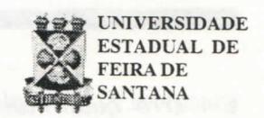
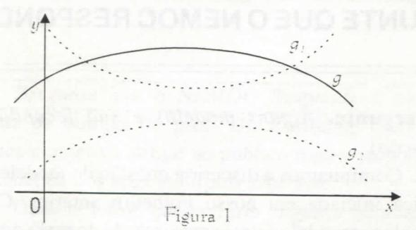
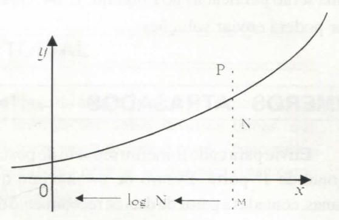

# **- FOLHETIM DE EDUCAÇÃO MATEMÁTICA**

**Ano 5 - número 62 - Folhetim** de Educação Matemática - Departamento **de Ciências Exotas**

**Janeiro/1998**

### **OBJETIVO**

Este _Folhetim é_ um veículo de divulgação, circulação de ideias e de estímulo ao estudo e à curiosidade intelectual. Dirige-se a todos os interessados pelos aspectos pedagógicos, filosóficos e históricos da Matemática. Pretende construir uma ponte para unir os que estão próximos e os que estão distantes.

## **EDITORIAL**

Ao longo do ano de 1997, procuramos levar ao leitor informações sobre diversos temas, que acreditamos, terem sido de proveito, tanto para o enriquecimento pessoal, quanto para o uso como material didático.

Procuramos também despertar a curiosidade do leitor através da columa "Divertimentos Matemáticos". As soluções dos problemas propostos que chegaram até nós, foram prontamente divulgadas. ,

Para este ano de 1998, esperamos continuar com essa linha de trabalho, contando sempre com a colaboração do leitor, com o envio de perguntas, sugestões e respostas aos problemas propostos.

Neste _Folhetim_ (Jan/98) o prof. Carioman Carlos Borges retoma a questão dos Modelos Matemáticos, iniciada no _Folhetim_ n° 61.

## **COMITÊ EDITORIAL**

Carloman Carlos Borges (Doutor) Inácio de Sousa Fadigas (Mestre)

#### **PERGUNTE QUE O NEMOC RESPONDE**

**Pergunta.** _Alguns modelos e sua fecundidade (continuação)._

R. Continuamos a discutir a questão de modelos em matemática iniciada em nosso Folhetim anterior. Claramente, qualquer modelo é uma aproximação do real e quando aquele for traduzido por uma função matemática, toma-se mister examinar o _domínio de sua validade._ Exemplificando, a dependência da área do círculo em função do raio r é dada por A = $\pi.r²$, cujo _domínio natural de definição_ (conjunto de valores assumidos pela variável independente para os quais A(r) apresenta um determinado valor) é o intervalo $-\infty < r < +\infty$, enquanto como modelo da área do círculo real, deve ser considerado uma parte desse intervalo, ou seja, $O < r < \infty$ Como se vê, essa "generosidade" matemática às vezes atrapalha ... Como é sabido, até os fins da Idade Média, aproximadamente, predominava na ciência o aspecto qualitativo, enquanto que, apartirprincipalmente de Galileu, assumiu predominância o aspecto quantitativo. Alguns ramos hoje em dia, começam a salientar o aspecto qualitativo embora nenhuma dessas duas categorias possa surgir sozinha, pois se encontramintrinsecamenteligadas.Emsuaobra5toèz7ító**'5ímcíííre**//e _et morphogénese,_ 2^ edição, o grande topólogo contemporâneo René Thom escreve: _suponhamos que o estudo experimental de um fenómeno_ 0 _apresenta uma curva experimental g, de equação_ y = g(x). _Para explicar o fenómeno_ 0 , _o teórico tem a sua disposição duas teorias_ 0j _e_ 0, ; _cada uma dessas teorias prevê respectivamente as curvas_ y = gj (x), y = g, (x); _nenhuma delas adaptando-se bem à curva experimental_ (vide figura 1) y = g(x),- _a curva_ y = gj (x), _se adapta melhor quantitativamente, no sentido de que sobre o intervalo considerado a integral da diferença_ **J |g - g j** jdx _é menor que_ **J jg - g** 2 jdx ,• _porém a curva_ y = g, (x) _tem a mesma forma, mesmo comportamento que a curva experimental g; numa tal situação o teórico irá preferir a teoria_ **6,** _em lugar da teoria ; a despeito deum erro quantitativo maior, pode-se com efeito pensar que a teoria a qual apresenta uma curva tendo mesmo comportamento que a curva experimental pode revelar mais os mecanismos subjacentes ao fenómeno, que a teoria quantitativamente mais exata.

Na interessante obra: _Introdução à Matemática para Biocientistas,_ E. Batschelet (Editora Interciência, Editora da Universidade de São Paulo) o autor estuda alguns modelos matemáticos apresentados por biocientistas. Ali é salientada a lei de Weber-Fechner, a qual estabelece relação entre intensidade do estímulo e intensidade da sensação. Vamos tentar esclarecer o assunto. Experimentalmente foi mostrado que uma pessoa não é capaz de discriminar entre 20g e 20,5g, mas que, na maioria das vezes, ela acha 21g mais pesado do que 20g. Iniciando-se com um peso de 30g a pessoa não sabe discriminar entre 30,5g e 30g. O aumento deveria ser de l,5g adicionado às 30g para que fosse verificada a discriminação. Igualmente, a experiência mostra discriminações entre um peso de 50 e 52,5g , entre 60 e 63g , entre 70 e 73,5g. Resumindo: essa discriminação somente é ativada quando o tamanho dela é aumentada de 5% do valor original. Segundo, ainda, E. Batschelet, resultados análogos foram achados para as percepções de som, luz, olfato, gustação. Assim, dados os três tons igualmente espaçados 200Hz 400Hz 600Hz as pessoas percebem auditivamente um intervalo bem menor entre o 2° e o 3° tom que entre o 1° e o 2°. Isso significa que _não escutamos linearmente._ Para termos dois intervalos consecutivos percebidos como iguais em magnitude, eles devem ser dados numa progressão geométrica: 200Hz 400Hz 800Hz. Isso significa que nossos ouvidos trabalham (aproximadamente) logaritmicamente. Basta examinar um aparelho

eletrônico, como um televisor e experimentar ajustar o volume: esse ajuste é feito por um _potenciômetro_ (resistor ajustável) _logarítmico,_ enquanto que os sons graves e agudos são ajustados através de outro _potenciômetro,_ porém, _linear._ As dicriminações mencionadas acima podem ser expressas pelas seguintes relações: A = B,B=C , A<C , pois, levando em consideração a lei de Weber-Fechner, podemos escrever: 40g=41 g (não há discriminação, logo, A=B), 41g = 42g (não há discriminação, logo, B = C), porém 40g < 42g (há discriminação, donde A < C). Um dos últimos matemáticos universalistas, Jules-Henri Poincaré, em seu livro _A Ciência e a Hipótese,_ Editora Universidade de Brasília, a esse respeito escreveu: _Existe aí uma intolerável discordância com o princípio de contradição e foi a necessidade de eliminá-la que nos forçou a inventar o contínuo matemático._ Fica o trecho aí para reflexão de nossos colegas leitores. Achamos bastante sugestivo o trecho abaixo extraído do livro citado _Introdução à Matemática para Biocientistas:_ "Exemplo 6.6.4. Talvez a aphcação da lei de Weber-Fechner, especialmente importante para os biocientistas (e para nós outros, acrescentamos nós) seja a relação dose-resposta em ensaios biológicos. Quando uma certa dose de uma substância química (droga, veneno, vitamina, hormônio, etc.) é administrada a um animal (o grifo é nosso), _a resposta ou reação, seja qualitativa ou quantitativa não pode ser relacionada linearmente à dose._ Se, por exemplo, uma dose de lOmg é aumentada de 5mg, é lógico que a resposta variará. Se, entretanto, uma dose de lOOmg é aumentada de 5mg, dificilmente a resposta mudará. Em ambos os casos o aumento é de 5mg, mas no primeiro caso temos 50% da dose original, e no segundo caso somente 5%. O que é relevante é a taxa de aumento. Portanto, a lei de Weber-Fechner é aplicável. Embora a resposta seja usualmente de natureza qualitativa e não possa ser medida, admite-se que _a resposta é diretamente dependente do logaritmo da dose._ Como conseqiiência, quando animais são testados para suas respostas a doses de diferentes m'veis, as doses devem formar uma seqiiênciageométricaou exponencial.... Uma seqiiência tal como lOmg, 20mg, 30mg, 40mg, etc. não é

apropriada para as doses. Começando com os mesmos termos, ela deveria ser de lOmg, 20mg, 40mg, 80mg, etc." Claramente, há várias linhas de reflexão a serem feitas sobre o trecho acima; uma delas nos leva a pensar sobre o parentesco entre nossa espécie e outras espécies, consideradas pelo filósofo Descartes como simples máquina... É difícil escapar as indagações metafísicas: há racionalidade fora da mente humana? Como pode a idealidade matemática - no caso a função exponencial - apresentar-se nos estímulos-respostas desses animais? A racionalidade humana parece ainda debater-se em explicar essa convergência... O texto nos exige agora que falemos sobre essa tão famosa função exponencial y = a" , com a positivo e maior que 1. Vejamos a sua representação gráfica:

Veja como no gráfico a logaritmação equivale a encontrar, partindo da curva exponencial, a abscissa de um ponto P correspondente a uma ordenada M. Já vimos que falar em função exponencial é falar, de certo modo, em função logarítmica, o que nos leva a falar em progressão geométrica. Aqui, deve-se louvar o livrinho (apenas cem páginas) _Progressões e Matemática Fianceira_ escrito por Augusto Cesar Morgado, Eduardo Wagner e Sheila C. Zani, Coleção do Professor de Matemática, Sociedade Brasileira de Matemática. E um dos poucos exemplos de um livro didático apresentando uma consistente linha metodológica; a Matemática Financeira é tratada como mera aplicação de Progressão Geométrica, um tópico já sabido do estudante colegial. No capítulo 2 é definida a taxa de crescimento de uma grandeza, que do valor a passa para

o valor b, como o quociente ——-. Para uma grandeza G^ (por exemplo uma população no ano n) com taxa de crescimento constante e igual a i é elementar mostrar

que G\_^^ j = (1 + i)G^ para qualquer n. A recíproca também é verdadeira. (Convém o leitor fazer a demonstração, uma simples manipulação algébrica). Ora, consideremos, para exemplificar, uma particular progressão geométrica 3, 6, 12, 24, 48 (cada termo igual ao dobro do anterior) e na qual a taxa i de crescimento igual a 1, donde sua razão igual a 1 -i- i . Assim devido o teorema mencionado pode-se definir Progressão Geométrica (PG) de razão 1+ i como sendo a seqiiência cuja taxa de crescimento é constante e igual a i . Agora é fácil trabalhar com PG; suas conhecidas propriedades são facilmente deduzidas como a = a\_.q". Daí em diante os autores apresentam uma porção de modelos matemáticos sobre crescimentos de grandezas; talvez seja conveniente alertar que nesses modelos uma premissa é básica: a continuidade desses crescimentos e a existência de condições ideais (no caso de crescimento de população humana, embora ela não seja contínua, faz-se abstração de epidemias e outros mecanismos auto-reguladores). Esse livro que apresenta a Matemática Financeira como uma aplicação simples de um assunto (Progressões Geométricas) estudado no segundo grau - é um exemplo bastante ilustrativo daquilo por nós denominado de unidade metodológica: o desenvolvimento da matemática a partir de umas poucas ideias, o aproveitamento de tópicos já estudados para servirem de desenvolvimento a novos tópicos. O que se presencia atualmente é um hiato profundo entre o segundo grau e o terceiro grau. Colocado o problema, surge a inevitável pergunta: quais as ideias básicas para o estabelecimento dessa unidade metodológica? O Boletim do GEPEM (Grupo de Estudos e Pesquisas em Educação Matemática) número 5, abriI/78 transcreve um artigo da especialista Maria Laura Mouzinho Leite Lopes intitulado: As Três Ideias Básicas no Ensino da Matemática. Recomendamos a sua leitura. Ele é ancorado no que foi postulado por Jean Dieudonné na IV Conferência Interamericana sobre Educação Matemática, realizada em Caracas em dezembro de 1975. Que diz esse erudito matemático contemporâneo? Eis a transcrição copiada do Boletim do GEPEM já mencionado: "...Qual deve, então, ser o cerne do ensino das

Matemáticas para os estudantes desses dois anos tão importantes para a formação de futuros cientistas? A meu ver, resume-se a três temas fundamentais: a **ideia** de Aproximação, a **ideia** de Linearidade e a de Probabilidade". O desenvolvimento dessas três **ideias** básicas será tema de nosso próximo Folhetim.»

_Pergunte que o NEMOC Responde_ é uma coluna de autoria do prof. Dr. Carloman Carlos Borges e objetiva atingir ao público interessado em Matemática nos seus múltiplos aspectos.

Caso o leitor queira fazer alguma pergunta escreva-nos.

## **PRÓXIMO NÚMERO**

_As três ideias básicas no Ensino da Matemática._

_Aguardem.' '_

## **DIVERTIMENTOS MATEMÁTICOS**

_Thomaz de Jesus Ramos_

1. É possível que dois homens, sem nenhum parentesco entre si, tenham a mesma irmã?

2. Se
   $$\frac{p}{q} = \frac{r}{s}$$
   , temos (demonstre):

$$(A)\frac{p-q}{q} = \frac{r-s}{s}$$
$(B)\frac{p}{q-p} = \frac{r}{s-r}$

Consideremos que:

$$\frac{x+1}{a+b+1} = \frac{x-1}{a+b-1}; \text{ aplicando (A)}:$$

$$\frac{x+1-(a+b+1)}{a+b+1} = \frac{x-1-(a+b-1)}{a+b-1},$$

istoé, . •

$$(I)\frac{x-a-b}{a+b+1} = \frac{x-a-b}{a+b-1}$$
, e conforme (B):

$$\frac{x+1}{a+b+1-(x+1)} = \frac{x-1}{a+b-1-(x-1)},$$

donde:
$$\frac{x+1}{a+b-x} = \frac{x-1}{a+b-x}$$
(II)

No primeiro caso (I) os numeradores iguais implicam na igualdade entre os denominadores: a + b + l = a + b-1 , donde 1 = -1 ; no segundo caso (II) os denominadores são iguais, logo: x + 1 = x - 1, ou seja: 1 = -1

As respostas aos problemas propostos nesta coluna serão publicadas no _Folhetim n°_ 64. Qualquer leitor poderá enviar soluções.

## **NÚMEROS ATRASADOS**

Envie para cada folhetim um selo de postagem nacional de 1° porte. Dentro de no máximo quatro semanas, contadas apartir da data de recebimento do seu pedido, você estará recebendo os folhetins solicitados. OBS.: É permitida a reprodução total ou parcial desse folhetim, desde que citada a fonte.

#### **I NEMOC -NÚCLEO DE ' EDUCAÇÃO MATEMÁTICA OMAR CATUNDA**

**i** j Folhetim de Educação Matemática Ano 5. n. 62 Janeiro/98

**Editores:** Carloman e Inácio

**Secretária:** Josenildes Oliveira Venas

**Editoração:** NEMOC

**\:** Imprensa Gráfica Universitária

**Tiragem:** 1.000 exemplares

**Endereço:** Av. Universitária, s/n - km 03

BR 116 - Campus Universitário

Telefone: (075)224-8115

Fax: (075)224-2284- CEP44031 -460

Feira de Santana - BA - BRASIL

e-mail: nemoc@uefs.br
