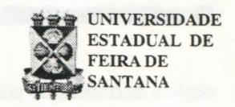

# **FOLHETIM DE EDUCAÇÃO MATEMÁTICA**

Ano 5 - número 63 - Folhetim de Educação Matemática - Departamento de Ciências Exatas

**Fevereiro/1998**

#### OBJETIVO

Este Folhetim é um veículo de divulgação, circulação de ideias e de estímulo ao estudo e à curiosidade intelectual. Dirige-se a todos os interessados pelos aspectos pedagógicos, filosóficos e históricos da Matemática. Pretende construir uma ponte para unir os que estão próximos e os que estão distantes.

### EDITORIAL

Nos Folhetins n°' 57 e 58 começamos a divulgar o Curso de Especialização em Educação Matemática, que tinha seu início previsto para Junho de 1998.

Devido a questões intemas da Universidade, o curso passará a ser desenvolvido em Regime de Tempo Integral, e terá seu início no próximo mês de março, com seu término previsto para o mês de dezembro de 1998.

Continuando a temática do Folhetim anterior, a coluna "Pergunte que o NEMOC responde" traz uma importante abordagem sobre as três ideias básicas do ensino da Matemática.

## COMITÊ EDITORIAL

Carloman Carlos Borges (Doutor) Inácio de Sousa Fadigas (Mestre)

#### PERGUNTE QUE O NEMOC RESPONDE

**Pergunta.** Retomando a discussão do número anterior, quais as três ideias básicas no Ensino da Matemática?

R. Iniciamos, agora, a discussão levantada no Folhetim anterior: três ideias básica no ensino de Matemática, sugeridas na IV Conferência Interamericana sobre Educação Matemática, pelo erudito matemático contemporâneo Jean Dieudonné. Essa conferência foi realizada em Caracas de 01 a 06 de dezembro de 1975. Veja o que proclamou esse matemático francês: "...Qual deve, então, ser o cerne do ensino de Matemática para os estudantes desses dois anos tão importantes para a formação de futuros cientistas? A meu ver, resume-sea três temas fundamentais: a ideia de Aproximação, a ideia de Linearidade e a de Probabilidade". Vejamos mais de perto em que consiste essas três ideias:

a) Aproximação. Cada fenómeno do nosso entorno acha-se enlaçado com um conjunto infinito de outros eventos. Problema: se partirmos da premissa de que tudo está ligado com tudo o mais, de que nada existe isolado, porém imerso numa teia infinita de relações e co-reiações, como sustentar a crença tão amplamente aceita de que podemos entender alguma coisa? Onde colocar a propalada certeza cartesiana do conhecimento científico? A resposta é: aproximação. Todo conhecimento científico é uma aproximação do objeto a ser conhecido. Não há conhecimento científico acabado, exato e definitivo. Ciências Exatas é apenas mais uma retórica constante no nome de departamentos para distinguir, em nossas universidades, um lugar académico de outro. Palavras tais como exatidão, perfeição, quando se trata de conhecimento científico, não devem ser levadas a sério; elas pertencem ao reino da ideologia - aquele conjunto de ideias que objetiva aumentar a alienação do ser humano. Alienação de si mesmo.

de seu semelhante e da mãe Natureza. Um bom livro de física como Mecânica Racional, Synge & Griffith ilustra muito bem o que seja aproximação. O estudo do movimento de um móvel é bastante ilustrativo. Numa primeira aproximação é desprezada a resistência do ar; numa segunda aproximação ela é levada em consideração e, neste caso, será obtido um resultado mais preciso do que o primeiro. Como a resistência do ar depende de variáveis como temperatura e pressão, ao considerá-las teremos uma terceira aproximação mais "exata" do que as duas anteriores. Contudo, ainda podemos considerar a resistência do ar também dependente da circulação de inúmeras partículas de ar no ambiente da experiência e, aí, teremos uma quarta aproximação. Porém, levando-se em conta que há ainda a própria respiração de quem efe tua a experiência e de quem a assiste influenciando o resultado, teremos uma quinta aproximação e, assim, sucessivamente ... Falar em aproximação é, também, falar em erro e o aluno deve ser alertado para uma etapa importante na resolução de um problema: a sua verificação, quando, então, avahará o erro cometido. Nessa busca infinita de precisão devemos ficar alertas. Um simples exemplo ilustrará o que quero dizer: o cálculo do número **7i,** o qual possui infinitas decimais. Na prática, geralmente, basta considerar quatro algarismos decimais, isto é:

**71** = 3,1415

Com 16 decimais obtém-se, a menos da espessura dum cabelo, o comprimento de uma circunferência de raio igual à distância média da Terra ao Sol! Convém, aqui, citar a seguinte observação extraída do livro Equações Diferenciais Aplicadas de Djairo Guedes de Figueiredo e Aloísio Freiria Neves, Coleção do Professor de Matemática Universitária, IMPA: "Enfatizamos o aspecto, extremamente importante, da interpretação das soluções obtidas e de seu significado dentro do contexto do problema em estudo. A propósito, retiramos as seguintes observações de R. Hooke e D. Shaffer, em Math and

Aftermath, Walker & Co. Westinghouse Books, 1975: 'Muito se fala sobre problemas, em cursos de Matemática. Muito pouco se diz sobre a origem desses problemas e do que fazer com as respostas.' Parece-nos importante, contar esta parte omitida da história. Isto é particularmente importante para aqueles que desejam ser matemáticos, pois explica porque o computador não os vai deixar desempregados. E também importante para aqueles que vão para outras ciências exatas, pois explica porque o computador não lhes retirará o privilégio (ou o dever) de estudar bastante matemática". Lamentavelmente, os manuais escolares privilegiam a igualdade e o fazendo, privilegiam o Princípio da Identidade da lógica aristotélica - uma idealização da Aproximação e que carrega consigo uma forte carga ideológica.

b) Linearidade. É inconcebível que as primeiras noções de Álgebra Linear não sejam discutidas com os alunos logo no 2° grau. Ela está muito ligada à ideia de Aproximação e ambas poderiam ser estudadas simultaneamente. Mesmo no 3° grau, lugar onde é estudada aquela disciplina, uma de suas importantes aplicações, a programação linear não é desenvolvida suficientemente. A linearidade é um conceito unificador - e isso basta para justificar o seu estudo. Com a criação da Geometria Analítica, os sistemas de equações lineares assumiram mais importância. Uma das maiores revoluções científicas do século XX, a Mecânica Quântica, é tributária do conceito de linearidade: aqui, a cada grandeza física faz-se corresponder um operador bem determinado. A grande importância desse fato pode ser resumida assim: os valores próprios do operador que se encontram relacionado com uma dada grandeza mecânica - são os valores que essa grandeza pode tomar nas direções criadas pela sua medição. Veja o que escreve o grande cientista V. A.Fockem Princípios de Mecânica Quântica, Editora MIR, Moscou:

Podemos resumir o significado dos valores próprios de um operador do seguinte modo: os valores próprios de um operador são os valores próprios da grandeza física correspondente. Daqui se deduz a seguinte limitação que deve ser imposta à forma a tomar pelo operador correspondente a uma grandeza física real. Uma vez que todos os valores observados dessa grandeza são valores reais, o operador que lhe corresponde deverá unicamente assumir valores próprios reais; isso significa que o operador deverá ser auto-adjunto. Uma grandeza física real é descrita por um operador linear auto-adjunto. Agora, basta acrescentar: noções básicas de duas das revoluções científicas mais importantes do século XX, a Relatividade e a Mecânica Quântica, são ensinadas no 2° grau em países realmente preocupados com a educação não com constantes reformas pedagógicas desastrosas em seus resultados práticos...

c) Probabilidade. A ciência das probabilidades foi, historicamente, motivada pelo estudo de jogos de azar e nasce no século XVII sob a influência predominante de Pascal. Há professores contrários a sua introdução logo nos primeiros anos escolares, alegando, para isso, sua alta complexidade. A esses mestres recomendamos a leitura atenta de A Evolução da Física, Zahar Editores e escrita pelo grande sábio e humanista Albert Einstein, com a colaboração de Leopoldo Infeld. Em primeiro lugar, os autores nos dão uma lição de metodologia: clareza na exposição sem perda de rigor; numa linguagem clara eles nos colocam a par do desenvolvimento dessa ciência - por muito tempo considerada como a melhor descrição da realidade. Noções fundamentais sobre as duas maiores revoluções científicas deste século, a Relatividade e a Física Quântica, são expostas de um modo acessível para jovens em nível de 2° grau. Diante disso, a alegação do argumento de complexidade para a não introdução de Probabilidade logo

nos primeiros anos escolares não se sustenta. Como escreve Maria Laura Mouzinho Leite Lopes: As dificuldades surgem como resultado de uma escolha não apropriada de situações a explorar. Se em vez de uma simples aquisição de conteúdo, visa-se a exercitar e a desenvolver esquemas de pensamento, dando-se organicidade às experiências já vivenciadas, então com situações adequadas e no momento oportuno, a probabilidade toma-se acessível a crianças a partir de 6 e 7 anos. Comentários Finais. O Ensino de Matemática pelo menos até o 2° grau, celebra o culto do determinismo. Os problemas devem ser resolvidos com exatidão, até qualquer algarismo decimal. Quando surge um resultado fora do universo dos inteiros, o aluno estremece e, quando é demonstrada a impossibilidade da solução, no sentido rotineiro com o qual ele está familiarizado, então o impacto psicológico é maior ainda. Será que não é chegada a hora de substituir esse pensar determinísco pelo pensar probabilístico? Entre outras vantagens, essa substituição diminuiria o grande hiato existente entre o ensino no 3° grau e nos graus anteriores. Outra: como as situações não determinísticas aparecem na vida diária com maior freqiiência em relaç ão as determiní stic as, is so serviria para aproximar a escola da vida, da realidade. Aqui nos parece oportuno um aviso: a mecânica clássica, na qual predomina a necessidade, sempre proclamou a exclusão do azar no comportamento de um determinado corpo. O seu rígido determinismo foi inclusive, transladado para outros domínios e pasmem! até para o social! Por outro lado a física quântica insiste em mostrar os vínculos entre o necessário e o contingente (possível, porém incerto); por conseguinte, não é científico defender, isoladamente, uma das posições, a determinística ou a aleatória, isto é, a posição que afirma ser tudo obra do acaso. A oportunidade leva-nos a levantar a questão: qual a matemática que deve ser ensinada a todos os cidadãos, isto é, a pessoas entre

5 e 12 anos de idade? Em um próximo Folhetim de Educação Matemática, tentaremos debater essa questão.»

Pergunte que o NEMOC Responde é uma coluna de autoria do prof. Dr. Carloman Carlos Borges e objetiva atingir ao público interessado em Matemática nos seus múltiplos aspectos.

Caso o leitor queira fazer alguma pergunta escreva-nos.

## PRÓXIMO NÚMERO

As três ideias básica da Matemática (continuação).

Aguardem!

## NOTÍCIAS

o Curso de Especialização em Educação Matemática será desenvolvido na modalidade Regular com Tempo Integral, totalizando 495 horas.

Corpo docente:

- Adelmo Ribeiro de Jesus Mestre (UFBa)
- Arlete Cerqueira Lima Mestra (UEFS)
- Carloman Carlos Borges (Coordenador) Doutor (UEFS)
- Danilo Felizardo Barbosa Doutor (UFSE)
- Haroldo Gonçalves Benatti Doutorando (UEFS)
- Jandira Maria Ribeiro dos Santos Doutora (UFBa)
- Marco Antonio Nogueira Fernandes Doutor (UFBa)
- Maria Luiza Lapa dos Santos Doutora (UFBa)
- Robinson Moreira Tenório Doutor (UEFS)
- Valdenberg Araújo da Silva Doutor (UFSE)
- Vicente Deocleciano Moreira Mestre (UEFS)
- Wilson Pereira de Jesus Doutorando (UEFS)

Inscrição: 02 a 16 de março de 1998 Seleção: 18 a 20 de março de 1998

Início: 30 de março de 1998

Informações:

**PRÓ-REITORIA DE PESQUISA E PÓS-GRADUAÇÀO**

**Telefone: (075)224-8028**

**E-mail: pppg@uefs.br**

**DEPARTAMENTO DE CIÊNCIAS EXATAS**

**Telefone: (075)224-8086**

**E-mail: exa@uefs.br**

**-NEMOC - Núcleo de Educação Matemática Omar Catunda**

**Telefone: (075)224-8115 E-mail: nemoc@uefs.br**

## NÚMEROS ATRASADOS

Envie para cada folhetim um selo de postagem nacional de 1° porte. Dentro de no máximo quatro semanas, contadas a partir da data de recebimento do seu pedido, você estará recebendo os folhetins solicitados. OBS.: É permitida a reprodução total ou parcial desse folhetim, desde que citada a fonte.

#### **NEMOC -NÚCLEO DE EDUCAÇÃO MATEMÁTICA OMAR CATUNDA**

Folhetim de Educação Matemática Ano 5. n. 63 Fevereiro/98

**Editores:** Carloman e Inácio

**I Secretária:** Josenildes Oliveira Venas

**Editoração:** NEMOC

**Impressão:** Imprensa Gráfica Universitária

**Tiragem:** 1.000 exemplares

**Endereço:** Av. Universitária, s/n - km 03

BR 116 - Campus Universitário

Telefone: (075)224-8115

Fax:(075)224-2284-CEP4403I-460 Feira de Santana - BA - BRASIL

e-mail: nemoc@uefs.br
