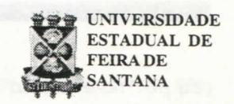

# **FOLHETIM DE EDUCAÇÃO MATEMÁTICA**

Ano 5 - número 64 - Folhetinn de Educação Motennática - Departamento de Ciências Exatas Março/1998

#### **OBJETIVO**

Este *Folhetim é* um veículo de divulgação, circulação de ideias e de estímulo ao estudo e à curiosidade intelectual. Dirige-se a todos os interessados pelos aspectos pedagógicos, filosóficos e históricos da Matemática. Pretende construir uma ponte para unir os que estão próximos e os que estão distantes.

#### **EDITORIAL**

Como já divulgamos no *Folhetim n°* 63, o Curso de Especialização em Educação Matemática, recomendado pela CAPES, terá seu início no próximo dia 30 de março. Tratando-se de um Curso em Educação Matemática, reservamos neste *Folhetim* um espaço para publicar os diversos temas que poderão ser objeto de monografias para a conclusão do referido Curso.

Na coluna "Pergunte que o NEMOC Responde", encontramos algumas notas sobre Evariste Galois, onde o prof. Carloman Carlos Borges destaca a preocupação deste célebre matemático com a maneira pela qual esta ciência era ministrada, fazendo um paralelo com o nosso ensino de hoje.

## **COMITÉ EDITORIAL**

Carloman Carlos Borges (Doutor) Inácio de Sousa Fadigas (Mestre)

#### **PERGUNTE QUE O NEMOC RESPONDE**

**Pergunta.** Gertrudes A. dos Santos de Natal, Rio Gran-de do Norte, escreve: AJorana *receber mais informações sobre a vida do matemático francês Evariste Galois.* 

R. **Evariste** Galois nasceu no dia 25 de outubro de 1811, na cidade de Bourg-la-Reine, a 10 quilómetros de Paris, no seio de uma família culta e liberal. Em 1 ° de abril de 1829 publicou, nos Annales de Gergonne seu primeiro *dxúgo: Demonstração de um teorema sobre as frações contínuas periódicas.*  Antes dos 18 anos já realizara descobertas importantes naquilo que faria sua glória póstuma: a Teoria dos Grupos. Na realidade, seu talento matemático fora do comum começou a manifestar-se ao redor de seus quinze anos de idade. Aluno da famosa Escola Normal, dela **foi** expulso devido as suas convicções democráticas. Partícipe ativo da Revolução de 1830, passou vários meses na prisão. Logo após a sua libertação, em 1832, com vinte e um anos incompletos, envolveu-se em questões amorosas que o arrastaram a um duelo com pistola, no qual **foi** morto. O estudo sistemático da teoria dos grupos começou com Galois que **foi** o primeiro a utilizar (1830) tecnicamente o vocábulo *grupo.* A Teoria dos Grupos, criação desse jovem e genial matemático, tem um grande papel unificador na Matemática Contemporânea, com diversas aplicações em Geometria, Teoria das Equações, Cristalografia, Física Nuclear, etc. Vamos transcrever, inicialmente, uma mensagem de despedida escrita por ele na noite de 29 de maio de 1932, véspera do duelo, que o levaria à morte. *Carta a todos os replubicanos. Eu rogo a meus amigos patriotas que não me reprovem por morrer de outra forma que não pelo meu país. Eu morro vítima de uma infame leviana e de dois tolos dessa leviana. É dentro de um miserável mexerico que se extingue minha vida. Oh! Por que morrer por tão pouca coisa, morrer por algo tão desprezível! Eu tomo o* 

*céu por testemunha que foi constrangido e forçado que eu cedi a uma provocação que evitei de todas as formas. Eu me arrependo de haver dito uma verdade funesta, a dois homens sem condições de entendê-la a sangue frio. Mas, enfim, eu disse a verdade. Eu levo para meu túmulo uma consciência limpa de mentira, limpa de sangue-patriótico. Adeus! Eu tinha muita vida para o bem público. Perdão para aqueles que me mataram, eles são de boa fé. É. Galois.* 

A Auguste Chevalier, seu grande amigo, escreve: *Meu querido amigo: eu fiz em análise várias coisas novas. Umas concernentes à teoria das equações; outras concernentes às funções integrais. Na teoria das equações, eu pesquisei em que casos elas eram resolúveis por radicais, o que me deu a oportunidade de aprofundar esta teoria e de descrever todas as transformações possíveis sobre uma equação mesmo quando ela não é resolúvel por radicais.* Pela validade de seus conceitos, finalmente, transcrevemos abaixo uma carta escrita por esse génio precoce e já publicada no Boletim 5 abril/78, GEPEM.

Inicialmente, essa carta foi transcrita no *Bulletin de L'Association des Professeurs de Mathematiques*  (de L'Enseignement Public), em dezembro de 1977, Paris, França. Todos os grifos são nossos. Ei-la:

> *Sobre o Ensino das Ciências, Professores, Compêndios, Examinadores*

*Senhor Redator:* 

*Muito agradeceria a sua acolhida às seguintes ponderações referentes ao ensino de Matemática nos colégios de Paris.* 

*Pouco importa às Ciências a maneira de pensar de cada um; os postos não devem ser uma recompensa de opiniões políticas e religiosas.* 

*Eu, particularmente, procuro saber se um professor é bom ou ruim, pouco me interessando as* 

*suas ideias sobre assuntos alheios a seus estudos científicos. Foi com mágoa e indignação que se viu, durante o governo da restauração transformarem-se os empregos em objeto de conquista dos que partilhavam das ideias monárquicas e religiosas. Esse estado de coisas não mudou; a mediocridade continua sendo privilegiada, mesmo tendo demonstrado sua repugnância pela nova ordem das coisas. Entretanto, as opiniões não deveriam ser levadas em consideração quando se trata de avaliar o mérito científico das pessoas.* 

*Comecemos pelos colégios, onde os alunos de Matemática, na sua maioria se destinam à Escola Politécnica. O que se faz para prepará-los para esse fim? Procura-se fazê-los compreender o verdadeiro espírito da ciência pela exposição dos métodos mais simples?* 

*Faz-se de tal maneira que seu raciocínio se tome uma segunda memória?* 

*Não haverá, ao contrário, alguma semelhança entre a maneira pela qual aprendem Matemática, e a maneira por que aprendem as lições de Francês e Latim?* 

*Antigamente os alunos aprendiam com um único professor tudo aquilo de que precisavam; hoje em dia há necesssidade de se suplementar com mais um ou dois repetidores para se preparar um candidato à Escola Politécnica.* 

*Até onde serão os pobres jovens obrigados a escutar e repetir durante o dia inteiro ?* 

*Quando lhes será dado tempo para meditar sobre esse amontoado de informações, para coordenar essa quantidade de teoremas sem concatenação. de cálculos sem conexão?* 

*Não seria mais vantajoso exigir-se dos alunos métodos, cálculos, formas de raciocínio, que fossem ao mesmo tempo, os mais simples e os mais fecundos ?* 

*Mas, não; ensinam-se minuciosamente teorias truncadas e cheias de reflexões inúteis, enquanto se omitem as proposições mais simples e brilhantes da*  *Álgebra; em vez disso, demonstram-se, à custa de muitos cálculos e raciocínios sempre longos, às vezes falsos, corolários cuja demonstração se faz por si mesma.* 

*De onde vem o mal? Certamente não é dos professores dos colégios. Todos eles demonstram um zelo bem louvável; são eles os primeiros a sofrer por se ter feito do ensino de Matemática um verdadeiro comércio. A causa do mal deve ser procurada entre as editoras dos senhores examinadores. Essas editoras querem livros volumosos: quanto mais coisas contiverem os livros dos examinadores, mais certas estarão elas de vendas lucrativas; aí está porque vemos aparecer todos os anos essas volumosas compilações, onde os trabalhos desfigurados dos grandes mestres aparecem ao lado de ensaios de nível escolar.* 

*Por outro lado, porque os examinadores só formulam questões enroladas? Parece que temem ser compreendidos pelos examinadores; de onde vem esse infeliz hábito de complicar artificialmente as questões? Julga-se por acaso ser a Ciência fácil demais? A que leva isso?* 

*A que o aluno se preocupe menos com se instruir do que com o passar no exame. Sendo necessária uma repetição de cada teoria para um dos quatro examinadores, torna-se preciso aprender o método de cada um deles e saber, antecipadamente, para cada questão e cada examinador, quais devem ser suas respostas, e mesmo sua atitude. Chega-se a conclusão de que se funda assim uma ciência nova, que cresce dia a dia, e que consiste no conhecimento das idiosincracias e das preferências científicas, das manias e do humor dos senhores examinadores.* 

*A conquista da vitória em um tal exame lhe traz muita felicidade ? Foi, enfim designado como um dos duzentos geómetras a quem se prestam homenagens em Paris?* 

*Acredita ter alcançado os seus fins?* 

*Engana-se. É o que pretendo lhes mostrar em minha próxima carta. É. Galois.* 

Comparando o exposto nessa carta com a situação em nosso país, a conclusão é uma só: temos diversos pontos de contato com as mazelas ali apontadas. Veja-mos isso mais de perto. Ninguém, honesto, poderá contestar os privilégios assumidos pela mediocridade, sempre a par com o Poder. A atividade da memória, em nosso ensino, ultrapassa, de muito, a do raciocínio e, ainda, aprendemos Matemática como aprendíamos as lições de Latim da década de 40; aliás, de passagem, lembremos a motivação maior, naquela época, para os infelizes alunos estudarem as declinações de Latim: ele desenvolve a inteligência, isto é, quanto mais declinações soubéssemos *de cor e salteado,* maior desenvolvimento da inteligência e, consequentemente, auxilia na aprendizagem da matemática. Hoje em dia a *moda é* outra. Alega-se ser o jogo de xadrez o substituto do Latim. A justificativa é feita por intermédio, quase sempre, de frases altiossonantes: *o xadrez desenvolve o raciocínio, a memória, o autocontrole, a capacidade de planejar e também a criatividade e, consequentemente, auxilia na aprendizagem da matemática.* Isso é uma falsidade e será estudada com mais detalhes em um dos próximos Folhetins. O estudo de Limite, em Cálculo, atesta muito bem ser o nosso ensino de Matemática um amontoado de informações truncadas, as quais levam o aluno à reflexões inúteis: após a resolução de algumas dezenas e, às vezes centenas de exercícios sobre Limite o aluno continua sem entender-lhe o significado. Anos e anos a fio, nos 7° e 8° semestres da Licenciatura em Matemática, após praticarem inúmeras demonstrações *por absurdo o* aluno, quando indagado, não possui qualquer justificativa lógica para esse monumento criado pelos gregos antigos. Estarrecido, o professor constata: as próprias demonstrações matemáticas, similares às declinações de Latim, são decoradas por nossos infelizes alunos, tudo isso graças a um ensino insosso e povoado de truques que devem

ser aplicados à resoluções de questões complicadas artificialmente.»

*Pergunte que o NEMOC Responde* é uma coluna de autoria do prof. Dr. Carloman Carlos Borges e objetiva atingir ao público interessado em Matemádca nos seus múltiplos aspectos.

Caso o leitor queira fazer alguma pergunta escreva-nos.

### **PRÓXIMO NÚMERO**

Resposta para a pergunta:

*Quais as diferenças básicas entre a Linguagem Natural e a Linguagem Matemática?* 

### **NOTÍCIAS**

**Temas Sugeridos para a Elaboração de Monografias no Curso de Especialização em Educação Matemática:** 

- I . Linguísticae Matemática: das Categorias Gramaticais às Categorias Algébricas.
- I 2. A Psicogênese das Estruturas Algébricas.
  - 3.0 Desenvolvimento Histórico da Geometria.
  - 4. Epistemologia dos Números Relativos.
- 5. A importância da obra do Prof. Elon Lages Lima na Educação Matemática do Brasil.
- 6. O Conhecimento como "rede" na Elaboração do Curriculo Escolar de Matemática.
- 7. A Lógica na Matemática: a construção da negação, da conjunção, da disjunção, da implicação e da equivalência a partir da Matemática. Relações com a Teoria dos Conjuntos.
- 8. As Ciências Formais: as transformações profundas da matemática nos séculos **XIX** e **XX:** o surgimento das geometrias não-euclidianas. a evolução da álgebra, a aritmetização da análise, o método axiomático, a evolução da lógica.
  - 9. As **Ideias** fundamentais da Matemática.
  - 10. A Heurística no Ensino da Matemática.
  - I I . A Educação Matemática na Perspectiva Piagetiana.
  - 12. Avaliação dos Manuais Escolares Sobre Matemática.
- 13. O Ensino do Cálculo no 2° Grau. O hiato entre a Matemática ensinada no 2° e no 3° Graus: é possível uma superação?

- 14. A Importância das Diversas Sociedades Brasileiras de Matemática na Educação Matemática.
- 15. Os Principais Erros da Pedagogia Matemática: a) abuso da dedução; b) celebração das "verdades absolutas"; c) tecnicismo; d) desconhecimento da natureza experimental desta ciência e de seu papel social.
- 16. As Falsas Dicotomias no Ensino da Matemática: a) informativo-formativo; b) adestramento-compreensão; c) matemática Pura-matemática Aplicada; e) matemática Antigamatemática Moderna.
- 17. Significado do Computador no ensino da Matemática: esta volta a ser uma ciência experimental?
- 18. Diferenças entre o saber matemático e outros saberes. Aproximações e diferenças entre o "pensar Matemático" e o "pensar cotidiano".
- 19. Diferenças básicas entre as linguagens naturais e a linguagem matemática. Consequências pedagógicas dessas diferenças. ,

A coordenação do Curso

#### **NÚMEROS ATRASADOS**

Envie para cada folhetim um selo de postagem nacional de 1 ° porte. Dentro de no máximo quatro semanas, contadas a partir da data de recebimento do seu pedido, você estará recebendo os folhetins solicitados.

OBS.: É permitida a reprodução total ou parcial desse folhetim, desde que citada a fonte.

#### **NEMOC -NÚCLEO D E EDUCAÇÃO MATEMÁTICA OMAR CATUNDA**

Folhetim de Educação Matemática Ano 5. n. 64 Março/98

**Editores:** Carloman e Inácio

**Secretária:** Josenildes Oliveira Venas

**Editoração:** Evandro Vaz e Nivaldo de Assis **Impressão**: Imprensa Gráfica Universitária

**Tiragem:** 1.000 exemplares

**Endereço:** Av. Universitária, s/n - km 03

BR 116 - Campus Universitário

Telefone: (075)224-8115

Fax: (075)224-2284-CEP44031-460

Feira de Santana - BA - BRASIL

e-mail: nemoc@uefs.br