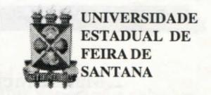

# FOLHETIM DE EDUCAÇÃO MATEMÁTICA

Ano 5 - número 65 - Folhetim de Educação Matemática - Departamento de Ciências Exatas

Abril/1998

#### **OBJETIVO**

Este Folhetim é um veículo de divulgação, circulação de idéias e de estímulo ao estudo e à curiosidade intelectual. Dirige-se a todos os interessados pelos aspectos pedagógicos, filosóficos e históricos da Matemática. Pretende construir uma ponte para unir os que estão próximos e os que estão distantes.

#### **EDITORIAL**

Recentemente recebemos um exemplar do Livro Introdução à História de Educação Matemática no Brasil da profa. Dra. Maria Ângela Miorim. Neste livro, encontramos com satisfação referência ao grupo coordenado pelo prof. Omar Catunda na década, na Universidade Federal da Bahia.

Cita a autora a posição do prof. Omar Catunda em relação ao que se chamou de Matemática Moderna. Já naquela época, acertadamente o prof. Catunda alerta para "os riscos de um enfoque centralizado apenas na linguagem".

No presente Folhetim, o prof. Carloman Borges, retoma, numa abordagem atual, o problema envolvendo a linguagem natural e a linguagem simbólica, em resposta a uma aluna do curso de Pedagogia.

É gratificante saber que nosso Folhetim desperta o interesse também de pessoas de outras áreas.

# COMITÉ EDITORIAL

Carloman Carlos Borges (Doutor) Inácio de Sousa Fadigas (Mestre)

### PERGUNTE QUE O NEMOC RESPONDE

Pergunta. Elizângela Maria de Lucena, formanda do Curso de Pedagogia desta Universidade, escreve: Gostaria de saber a respeito de algumas diferenças básicas entre a linguagem natural e a linguagem matemática.

R. Agradecendo a pergunta inteligente, vamos tentar respondê-la da maneira a mais simples possível. Comecemos com alguns exemplos: a) Quando escrevemos cão = chien = dog sabemos, com clareza, que essas três palavras fazem referência (denotam) a um mesmo animal, para muitas pessoas, de estimação, e seu estudo pertence à Zoologia e não à Linguística. Nesse contexto, conseqüentemente, cão não é um objeto linguístico. Porém, se escrevéssemos:

"Cão" tem uma sílaba, aí, então estaríamos na presença de um objeto linguístico. Isso, também, acontece em matemática:

3 = 2 + 1 não é a mesma coisa que:

$"3" \neq "2 + 1"$ .

Na primeira fórmula estão símbolos designativos de certos números e nela não figuram nomes de tais símbolos; na segunda empregamos os nomes de tais símbolos e é claro que o símbolo "3" é diferente do símbolo "2+1". Salientamos: na primeira fórmula 3 = 2 + 1 fazemos referência ao número inteiro 3, enquanto na segunda expressão fazemos referência aos símbolos "3" e "2 + 1". Conclusão do exposto: é importante distinguir entre a identidade de objetos da identidade de suas designações. Um mesmo objeto pode ser designado de maneiras diferentes. Mais um exemplo:

1. Maria é uma mulher.

- 2. Maria tem cinco letras.
- 3. "Maria" é uma mulher.
- 4. "Maria" tem cinco letras.
- 5. "Maria" é o nome de Maria.
- 6. "Maria" é o nome de um nome de Maria.

As orações (1), (4), (5) e (6) são verdadeiras, enquanto, (2) e (3) são falsas. Nas orações (3), (4) e (5) a palavra "Maria" está sendo mencionada. Agora, a primeira grande diferença, Elizângela: quando escrevemos:

cão = chien = dog, temos três palavras (em Português, em Francês e em Inglês) denotando o mesmo objeto: um animal de estimação (que não é um objeto linguístico); quando escrevemos:

$$\frac{1}{5} = \frac{2}{10} = \frac{3}{15}$$

Temos três termos matemáticos para o mesmo objeto matemático (aqui, diferentemente do exemplo anterior, o símbolo matemático faz referência a um objeto também matemático) que é o número racional $\frac{1}{5}$ . Ainda, quando escrevemos:

polinômio = polynôme = polynomial, empregamos três termos da Matemática denotando um mesmo objeto matemático que é o polinômio. Quando eu vou aprender uma nova língua, o Inglês, por exemplo, vou aprender novas palavras que denotem objetos cujos significados são por mim conhecidos. Eu aprendo uma língua mergulhado em um mundo de significados já aprendidos com a língua moderna. Aprendo símbolos novos (exemplo, chien) para significados que já conheço (no caso, cão). Na aprendizagem da Matemática temos uma tarefa dupla: aprender novos símbolos (novas palavras) com significados completamente diferentes não pertencentes ao meu mundo. Apesar disso, a maioria dos professores continua

ensinando essa ciência como se fora uma língua nova... Outra grande diferença, diz respeito à univocidade, à qualidade daquilo que é unívoco, que só admite uma forma de interpretação. Interpretação! Eis a grande questão! Quem ainda não se envolveu em problemas por causa de interpretações conflitantes para um mesmo texto? Isso é muito comum principalmente quando este se refere ao mundo afetivo... Um simples exemplo poderá aclarar a questão. Como definir processos contínuos por intermédio da linguagem natural? Duas das características básicas desta são a descontinuidade e a linearidade. Veja, exemplificando, uma "descrição linguística" da continuidade de uma função f para um valor x' de seu domínio: dizemos que f(x) difere arbitrariamente pouco do valor f(x') quando x está suficientemente perto de x'. Ora, as expressões "direfe arbitrariamente pouco" e "suficientemente perto" são vagas; há, pois, necessidade de uma explicação precisa e matemática, a qual consiste nas duas conhecidas desigualdades estudadas já no cálculo elementar. Embora do ponto de vista pedagógico o conceito de continuidade deva ser explicado a partir daquelas duas expressões (difere arbitrariamente pouco e suficientemente perto) o próprio desenvolvimento dessa teoria não seria possível sem o emprego da linguagem matemática. Lendo a História da Matemática, contatamos que para alguns matemáticos as palavras parecem quase inúteis ao seu pensamento matemático. Um simples exercício de si mesmo através da introspecção nos fará recordar as inúmeras vezes nas quais nos embaraçamos para encontrar as palavras adequadas aos nossos pensamentos. Essa observação leva, consequentemente à uma postulação de grande alcance: grande parte do pensamento consciente não

tem caráter verbal. Veja o que escreve Albert Einstein, um dos mais celebrados sábios do século XX: "As palavras da língua, tal como escritas ou faladas, não parecem desempenhar qualquer papel em meu mecanismo de pensamento. As entidades psíquicas que parecem servir como elementos do pensamento são certos sinais e imagens mais ou menos claros que podem ser reproduzidos e combinados 'voluntariamente'. Os elementos mencionados são, no meu caso, do tipo visual e outros do tipo muscular. As palavras convencionais ou outros sinais têm de ser procurados laboriosamente apenas numa segunda etapa, quando o jogo associativo de que falei já está bem estabelecido e pode ser reproduzido à vontade". Apesar de tudo, há alguns anos atrás, nas salas de aulas (sempre nas salas de aulas...) muitos professores "ensinavam" aos seus alunos uma conhecida teoria psicológica que defendia a identidade entre o pensamento e a linguagem; por sinal trata-se de uma teoria mecanicista e positivista, hoje já ultrapassada, pelo menos nos aspectos citados. O que foi exposto acima a respeito da linguagem matemática faz referência a uma etapa dessa ciência: uma etapa final na qual há necessidade de formalização a partir de uma axiomática. Antes disso, existem os momentos de inspiração, intuição e extraordinária originalidade - o que se encontra bem retratado nas palavras de A. Einstein, transcritas acima. Uma das características do desenvolvimento científico de nossa época é a invasão do formalismo nas mais diversas ciências; embora isso lhes dê um caráter científico - o que é louvável - apresenta uma contrapartida dolorosa: cada vez mais o conhecimento científico torna-se um privilégio de uns poucos especialistas. Como a maioria dos cientistas não socializa seus conhecimentos, essa

tarefa é deixada a cargo de alguns espertos e sabidos, divulgadores de tolices, de verdadeiras caricaturas do que seja realmente o conhecimento científico. Felizmente ainda não formalizaram (talvez isto seja impossível) a linguagem natural. Aproveitemos essa impossibilidade para aumentar nossas comunicações mesmo correndo o risco das interpretações enganosas... Finalmente e como resumo. As duas grandes diferenças entre a linguagem natural e a linguagem matemática são as seguintes:

1ª diferença: quando aprendo um idioma estrangeiro, o Francês, por exemplo, eu já tenho um mundo de significados; sei, exemplificando, o que é uma mesa e devo aprender que ela é simbolizada como table. Quando o aluno aprende Matemática, ele necessita de dominar símbolos novos (exemplos: função, logaritmo, etc.) como, também, seus significados;

<u>2ª diferença:</u> dado o caráter discreto e combinatório da linguagem natural, ela é incapaz de descrever processos que apresentem _gradações contínuas_; o lugar certo para esse tipo de descrições é a linguagem matemática.

Resta agora, tirar as conclusões pedagógicas de tudo isso, uma vez que nossos professores continuam ensinando a Matemática como é ensinado um idioma estrangeiro. Isso, fica para o próximo Folhetim...

Pergunte que o NEMOC Responde é uma coluna de autoria do prof. Dr. Carloman Carlos Borges e objetiva atingir ao público interessado em Matemática nos seus múltiplos aspectos.

Caso o leitor queira fazer alguma pergunta escreva-nos.

# PRÓXIMO NÚMERO

Resposta para a pergunta:

Quais as diferenças básicas entre a Linguagem Natural e a Linguagem Matemática? (continuação)

Aguardem!

### NOTÍCIAS

Será realizado de 18 de maio a 18 de junho, no CEFET-Ba, o Curso de Educação Matemática - Conteúdos no Contexto Histórico.

Apoio: Instituto de Matemática da UFBa Faculdade de Educação da UFBa Informações: (071)242-0522 - ramal 189

Acontecerá no período de 12 à 13 de junho de 1998 a **I Jornada Olimpíada de Matemática - Bahia**. O evento é promovido pela UFBa/Instituto de Matemática. Os interessados devem entrar em contato com:

SECRETARIA DO EVENTO FAPEX/COACE

Rua Caetano Moura,140 - Federação 40210-340 Salvador - Ba Telefone: (071) 331-7033

Fax: (071) 237-7035

A Universidade do Vale do Rio dos Sinos - UNISINOS estará sediando o VI Encontro Nacional de Educação Matemática - ENEM, promovido pela SBEM, nos próximos dias 19 a 24 de julho de 1998, no Novo Campus da UNISINOS, em São Leopoldo, RS.

Informações:

Pró-Reitoria Comunitária e de Extensão

Av. UNISINOS, 950

Caixa Postal 275

92022-000 São Leopoldo - RS

http://www.unisinos.tche.br

O III CIBEM - Congresso Ibero-Americano

de Educação Matemática ocorrerá no período de 26 a 31 de julho de 1998, em Caracas, na Venezuela.

Informações:

Fax: 693-0629

E-Mail: cruz@sagi.ucv.edu.ve

## NÚMEROS ATRASADOS

Envie para cada folhetim um selo de postagem nacional de 1º porte. Dentro de no máximo quatro semanas, contadas a partir da data de recebimento do seu pedido, você estará recebendo os folhetins solicitados. OBS.: É permitida a reprodução total ou parcial desse folhetim, desde que citada a fonte.

#### NEMOC -NÚCLEO DE EDUCAÇÃO MATEMÁTICA OMAR CATUNDA

Folhetim de Educação Matemática Ano 5. n. 65 Abril/98

Editores: Carloman e Inácio

Secretária: Josenildes Oliveira Venas Editoração: Evandro Vaze Nivaldo de Assis

Impressão: Imprensa Gráfica Universitária

Tiragem: 1.200 exemplares

Endereço: Av. Universitária, s/n - km 03

BR 116-Campus Universitário

Telefone: (075)224-8115

Fax: (075)224-2284-CEP44031-460

Feira de Santana - BA - BRASIL

e-mail: nemoc@uefs.br
