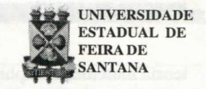

# **FOLHETIM DE EDUCAÇÃO MATEMÁTICA**

Ano 5 - número 66 - Folhetim de Educação Matemática - Departamento de Ciências Exatas Maio/1998

## **OBJETIVO**

Este _Folhetim é_ um veículo de divulgação, circulação de ideias e de estímulo ao estudo e à curiosidade intelectual. Dirige-se a todos os interessados pelos aspectos pedagógicos, filosóficos e históricos da Matemática. Pretende construir uma ponte para unir os que estão próximos e os que estão distantes.

### **EDITORIAL**

A coluna Pergunte que o NEMOC Responde deste Folhetim, continua com a abordagem sobre linguagem natural e linguagem matemática, discussão iniciada no Folhetim anterior.

Retomando a coluna Educação e Ensino, apresentamos uma justa homenagem ao professor Manfredo Perdigão do Carmo, este alagoano que no próximo mês completa 70 anos de vida, grande parte dela dedicada a matemática.

Na transcrição feita da RPM n° 10, 1° semestre de 1987, revista da Sociedade Brasileira de Matemática, o professor Manfredo Perdigão do Carmo contano-nos um pouco da contribuição dos matemáticos brasileiros, e faz uma distinção precisa entre uma pessoa interessada em matemática e um matemático propriamente dito.

# **COMITÉ EDITORIAL**

Carloman Carlos Borges (Doutor) Inácio de Sousa Fadigas (Mestre)

## **PERGUNTE QUE O NEMOC RESPONDE**

**Pergunta.** _Quais as diferenças básicas entre a linguagem natural e a linguagem matemática? (continuação)_

R. Continuamos desenvolvendo a pergunta elaborada pela formanda em Pedagogia, desta Universidade, Elizângela Maria de Lucena, acerca das diferenças básicas entre a linguagem natural e a linguagem matemática. Quais as conseqiiências pedagógicas provenientes do fato de o professor ensinar matemática como se fora um idioma estrangeiro? Ensiná-la como se não existissem aquelas diferenças básicas já apontada no Folhetim anterior, de n° 65? A pior delas é a seguinte: o ensino toma-se verbal, predominando o verbalismo e, consequentemente, também a memorização e o rigor linguístico, em detrimento daquilo que é o mais importante no ensino dessa ciência: _o significado dos objetos matemáticos._ Em qualquer ensino, o progresso é medido pelo treinamento de todas as capacidades cognitivas, das quais a linguagem é tão somente um dos aspectos. A linguagem não é responsável pelo desenvolvimento cognitivo: toma-se necessário que o professor não fique em sala de aula simplesmente reproduzindo frases de outros reprodutores (no caso, a maioria dos autores de nossos manuais escolares, excetuando-se, é claro, alguns poucos profissionais realmente competentes). Para que a criança progrida do ponto de vista cognitivo temos que enfatizar o desenvolvimento das suas estruturas mentais e da sua capacidade de enfrentar novas situações. É preciso repetir que o pensamento precede a linguagem e tem raízes independentes desta. Quando se fala sobre o assunto levantado por você Elizângela, inevitavelmente surge a pergunta: a Matemática é uma linguagem? Como vimos no Folhetim anterior e no qual iniciamos essa discussão, uma das características de nosso século vem sendo a crescente formalização das diversas ciências. Na Matemática ela assume a seguinte forma: começa-se com o estabelecimento de um conjunto de axiomas - que são proposições aceitas como ponto de partida para o desenvolvimento de uma

teoria matemática; sobre os axiomas são aplicadas regras de inferência, as quais permitem uma derivação puramente formal (isto é, mecânica) de outras proposições denominadas de teoremas. Nesta constituição, os teoremas podem ser considerados as sentenças de uma linguagem, e o conjunto de axiomas, juntamente com as regras de inferência, sua gramática. Para aqueles que confundem a Matemática com tal tipo de organização, essa ciência é simplesmente uma linguagem; porém, nesse tipo de confusão está implícita a falácia da identidade da parte com o todo, pois esse aspecto formal é apenas uma parte do que seja a totalidade da Matemática. Impossível reduzir a matemática a uma linguagem formal. As limitações de uma tal linguagem já foram objeto de famosos teoremas cujo significado profundo é mostrar a impossibilidade da identidade entre matemática e linguagem formal. Transcrevemos, abaixo, alguns trechos do livro _O Valor da Ciência,_ Contraponto, escrito pelo eminente matemático francês Jules-Henri Poincaré (1854-1912): _"É impossível estudar as obras dos grandes matemáticos, e mesmo a dos pequenos, sem notar e sem distinguir duas tendências opostas, ou antes, dois tipos de espíritos inteiramente diferentes. Uns estão, antes de tudo, preocupados com a lógica; ao ler suas obras somos tentados a crer que só avançaram passo a passo, com o método de um Vauban que investe com seus trabalhos de abordagem contra uma praça forte, sem abandonar o que quer que seja ao acaso. Outros se deixam guiar pela intuição, e na primeira investida fazem conquistas rápidas,mas algumas vezes precárias, como se fossem ousados cavaleiros na linha de frente._

_Não é a matéria de que tratam que lhes impõe um ou outro método. Se dos primeiros dizemos amiúde que são analistas, e se chamamos os outros de geómetras. isso não impede que uns permaneçam analistas mesmo quando fazem geometria, enquanto os outros continuam a ser geómetras, mesmo que se ocupem de análise pura. É a própria natureza de seu espirito que os faz lógicos ou intuitivos, e dela não se podem desvencilhar quando abrodam um assunto novo. Também não foi a educação que desenvolveu neles uma das duas tendências._ _abafando a outra. O indivíduo nasce matemático, não se torna matemático, e parece tembém que nasce geômetra ou nasce analista... A lógica inteiramente pura só nos leveria sempre a tautologias; não poderia criar coisas novas; não é dela sozinha que se pode originar qualquer ciência."_

O trecho transcrito acima e escrito por um eminente sábio que foi igualmente matemático, leva-nos à reflexões em tomo das relações entre a intuição e a lógica na matemática. Se, por um lado, um resultado matemático só pode ser aceito pela comunidade científica após a sua cabal demonstração ("Falar em matemática é falar em demonstração"- já dizia o eminente matemático contemporâneo André Weil) a intuição joga relevante papel na criatividade e costuma, quase sempre, preceder a parte formal que é a sua demonstração, revestida da denominada linguagem matemática. •

_Pergunte que o NEMOC Responde é_ uma coluna de autoria do prof. Dr. Carloman Carlos Borges e objetiva atingir ao público interessado em Matemática nos seus múltiplos aspectos.

Caso o leitor queira fazer alguma pergunta escreva-nos.

## **PRÓXIMO NÚMERO**

A resposta para a pergunta: _Em que consiste a Prova de Gõdel?_

_Aguardem!_

## **EDUCAÇÃO E ENSINO**

o Folhetim de Educação Matemática, por ocasião do 70° aniversário do Professor Manfredo Perdigão do Carmo, presta-lhe uma homenagem e transcreve abaixo sua bela mensagem contida na RPM n°10.

O Professor Manfredo foi um pioneiro, no Brasil, na pesquisa em Geometria. Seus livros - traduzidos para o inglês e alemão - são uma referência para o estudo dessa área. Orientou cerca de 25 teses de doutorado e diversas de mestrado. Foi pioneiro, no Brasil, no estudo de superfícies mínimas, com importantes trabalhos publicados em importantes revistas especializadas, nacionais e estrangeiras. Desde 1966 é pesquisador Titular do IMPA.

#### Da Matemática, dos jovens e da pesquisa(\*)

Manfredo Perdigão do Carmo IMPA/CNPq - Rio de Janeiro, RJ

O professor João Bosco Pitombeira convocou-me para saudar os jovens vencedores das _Olimpíadas de Matemática_ e para lhes dizer algumas palavras sobre a Matemática, em particular sobre a Matemática brasileira.

É com prazer que faço isto. Diz-se que a Matemática é uma velha ciência cultivada por jovens. Se bem que eu não concorde inteiramente com esta afirmação, devo reconhecer que as velhas sabedorias sempre contêm um elemento de verdade. De modo que, falando a jovens interessados em Matemática, arrisco-me a falar a futuros matemáticos brasileiros. E aí aparece uma questão sobre a qual gostaria de apresentar algumas idéias.

O que é que distingue uma pessoa interessada em Matemática de um matemático propriamente dito?

A questão é a seguinte: O que é que distingue uma pessoa interessada em Matemática de um matemático propriamente dito? Em ambos os casos, há a mesma paixão em resolver problemas, o mesmo gosto pelo desafio de coisas abstratas, o mesmo sentimento, às vezes difuso, de estar participando de uma tarefa milenar e premanente.

Creio que a distinção reside precisamente na natureza dos problemas tratados. Sem um treinamento efetivo que o leve à fronteira do que é conhecido, o interessado em Matemática ficará resolvendo problemas que são essencialmente conhecidos, ou, que é muito freqüente, cujas soluções não contibuem para o desenvolvimento da Matemática. Os problemas de Matemática que contibuem para o seu desenvolvimento são aqueles que forçam a criação de novas técnicas, relacionam idéias aparentemente distintas e iluminam a nossa compreensão da Matemática como um todo. É a dedicação à solução de tais problemas (nem sempre bem sucedida) que caracteriza e distingue um matemático propriamente dito.

Há dois pontos que gostaria de deixar bem claro no que acabo de dizer.

Primeiro, que o que caracteriza um matemático é a sua vivência e fidelidade à idéia da pesquisa relevante em Matemática, e não o seu sucesso. Existem matemáticos mais ou menos bem sucedidos, mas pertencem todos à comunidade matemática internacional. Em verdade, a questão do sucesso individual de cada matemático é na minha opinião, um problema que pertence mais à história que aos contemporâneos.

Mesmo em plena atividade de pesquisa, o olhar e reolhar situações simples é um método poderoso para compreender o essencial de situações complicadas.

Segundo, que não decorra de minhas palavras que só os grandes problemas da Matemática devam merecer a nossa atenção e que a solução de problemas elementares e conhecidos seja uma atividade a desprezar. Pelo contrário, tal atividade, convenientemente dosada, é parte essencial do treinamento de um matemático. Mesmo em plena atividade de pesquisa, o olhar e reolhar situações simples é um método poderoso para compreender o essencial de situações complicadas.

Estabelecida a caracterização de um matemático, põe-se a pergunta: E como pode um interessado em Matemática se transformar em um matemático? É preciso, como vimos, que tal interessado seja levado às fronteiras do conhecimento matemático para que o seu talento (se houver) não seja desperdiçado. A experiência mostrou que a melhor maneira de chegar a este objetivo é colocar o interessado em contato com matemáticos ativos em pesquisas. Isto requer a existência de uma comunidade matemática ampla e razoavelmente bem estruturada.

Há poucas décadas atrás, a existência de uma tal comunidade no Brasil era quase impensável. Só para dar uma idéia das dificuldades existentes, permitam-me apresentar um relato pessoal.

Em 1957 compareci ao Primeiro Colóquio Brasileiro de Matemática, organizado pelo IMPA, que reuniu por três semanas cerca de 40 pessoas na cidade de Poços de Caldas, Minas Gerais. Uma minoria dos participantes havia tido alguma experiência em pesquisa matemática no exterior, e procurava transmitir parte dessa experiência a uma maioria de interessados (eu incluído) recrutada em várias regiões do Brasil.

Para mim não estava sequer clara a viabilidade de uma carreira matemática no Brasil. Eu havia me formado em engenharia civil no Recife, vindo das Alagoas. Engenharia era, naqueles tempos e lugares, a única opção possível para alguém interessado em Física e Matemática. Mas a prática de Engenharia estava muito distante de meus interesses iniciais. Deixei o emprego de engenheiro e fiquei como Assistente contratado da Universidade do Recife. O salário dava para manter alma e corpo unidos e me deixava as tardes inteiramente livres para estudar. Em virtude de razões que não vêm ao caso agora, decidi interessar-me por Geometria Diferencial, também conhecida como Aplicações da Análise à Geometria. Comecei então aprender o que era possível de Análise.

Neste ponto, o Colóquio de 1957 teve uma influência

decisiva. Por um lado, descobri que precisava aprender muito mais coisas do que eu imaginava, se quisesse dar alguma contribuição ao que estava acontecendo em Geometria Diferencial no resto do mundo. Por outro lado, ficou claro para mim que existia no Brasil o gérmen de uma comunidade matemática, que o que havia desejado era possível e, mais do que isso, que era o caminho do futuro.

De volta para Recife, iniciei o penoso processo de tentar aprender coisas inteiramente novas nas quais nem eu, nem pessoas que me eram acessíveis, tinham qualquer experiência. Não quero entrar em detalhes, mas é óbvio que o processo teria sido abandonado, por frustração e desânimo. Felizmente, decidi em 1959 fazer um estágio no IMPA, onde encontrei de novo um ambiente matematicamente estimulante, e de onde saí em 1960 para fazer um Doutorado no exterior.

Quis apresentar este relato simplesmente para dar uma idéia dos descaminhos que se apresentavam a um interessado em matemática na década dos '50. Espero não ter exagerado nas cores. Em verdade, qualquer matemático brasileiro da minha geração poderia contar uma história semelhante.

Na década de 60 aumentou consideravelmente o número de brasileiros que foram fazer um Doutorado de Matemática no exterior. Os cursos de Mestrado começaram a se espalhar pelo Brasil. Os Colóquio de matemática continuaram a se reunir a cada dois anos, criando uma tradição singular e influenciando fortemente os rumos da Matemática brasileira. No 7º Colóquio, em 1969, é criada a Sociedade Brasileira de Matemática, e o 8º Colóquio em 1971 já contava com 400 participantes.

Já é possível a um jovem interessado em Matemática chegar rapidamente à fronteira e contribuir, enquanto jovem, para o desenvolvimento da Matemática.

Na década de 70, nota-se nitidamente um salto qualitativo, conseqüência do esforço e entuasiasmo das décadas anteriores. Pesquisa de boa qualidade começa a ser produzida dentro do Brasil. O IMPA monta um bem sucedido Programa de Doutorado que em 15 anos produz mais de 600 doutores, a maior parte dos quais se espalha pelo Brasil, do Amazonas ao Rio Grande do Sul. Vários matemáticos brasileiros são convidados a expor seus trabalhos no Congresso Internacional de Matemáticos, que se reúne a cada quatro anos para discutir a nata do que foi feito neste intervalo. O Brasil passa da posição 1 para a posição 3, em uma classificação de 1 a 5, na união Matemática Internacional.

A situação atual é radicalmente diferente daquela da década de 50. Hoje existe uma comunidade matemática

brasileira que embora pequena em termos de necessidade do Brasil, é ativa e possui um nível de qualidade e seriedade respeitado aqui e no exterior. Já é posível a um jovem interessado em Matemática chegar rapidamente à fronteira e contribuir, enquanto jovem, para o desenvolvimento da Matemática. Esta é a herança que iremos transmitir às futuras gerações de matemáticos brasileiros.

Quando mencionei, no início, que não concordava inteiramente com a afirmação que a Matemática é uma velha ciência cultivada por jovens, eu tinha em mente as realizações da atual geração de matemáticos brasileiros. À luz do exposto, permitam-me modificar ligeiramente a afirmação para uma com a qual concordo sem restrições: A Matemática é uma velha ciência que precisa de jovens.

A Matemática é uma velha ciência que precisa de jovens.

Os jovens vencedores que ora saudamos poderão fazer parte da futura geração dos matemáticos brasileiros. Eles demonstram possuir uma qualidade que é fundamental para um matemático, ou seja, a habilidade e o interesse em resolver problemas. Jovens desse calibre são necessários à Matemática aqui e alhures, e nada nos daria mais prazer do que ver a nossa Matemática cercada dos jovens que ela precisa. Em nome da comunidade matemática brasileira, congratulo-me com estes jovens e espero reencontrá-los em breve.

(\*) Discurso pronunciado no dia 28/11/86, na Academia Brasileira de Ciências, por ocasião da solenidade da entrega de prêmios aos participantes da 8\* Olimpíada Brasileira de Matemática.

#### NEMOC - NÚCLEO DE EDUCAÇÃO MATEMÁTICA OMAR CATUNDA

Folhetim de Educação Matemática Ano 5. n. 66 Maio/98

Editores: Carloman e Inácio

Secretária: Josenildes Oliveira Venas

Editoração: Evandro Vaz e Nivaldo de Assis

Impressão: Imprensa Gráfica Universitária

Tiragem: 1.200 exemplares

Endereço: Av. Universitária, s/n - km 03

BR 116-Campus Universitário

Telefone: (075)224-8115

Fax: (075)224-2284-CEP44031-460

Feira de Santana - BA - BRASIL

e-mail: nemoc@uefs.br
