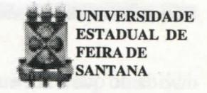
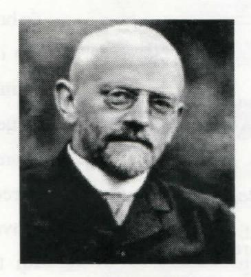
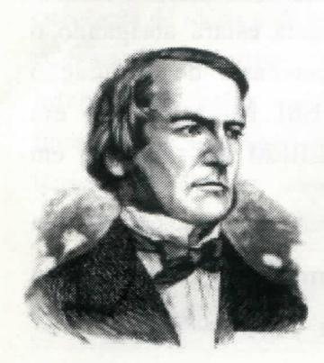

# FOLHETIM DE EDUCAÇÃO MATEMÁTICA

Ano 5 - número 67 - Folhetim de Educação Matemática - Departamento de Ciências Exatas

Junho/1998

#### **OBJETIVO**

Este Folhetim é um veículo de divulgação, circulação de idéias e de estímulo ao estudo e à curiosidade intelectual. Dirige-se a todos os interessados pelos aspectos pedagógicos, filosóficos e históricos da Matemática. Pretende construir uma ponte para unir os que estão próximos e os que estão distantes.

### **EDITORIAL**

Neste número, voltamos a apresentar a coluna "DIVERTIMENTOS MATEMÁTICOS", como forma de despertar a curiosidade do leitor para algumas preciosidades de matemática.

Já no número 62, apresentamos como desafios dois problemas. Não recebemos até o momento soluções satisfátorias. Continuamos no aguardo de que algum leitor, levado pelo desejo de vencer os desafios, encontre as soluções adequadas. Tão logo recebamos, publicaremos a sua resposta.

Ficamos gratificados ao lermos na revista "Educação Matemática em Revista", nº 6, ano 5, nota a respeito do nosso _Folhetim_ na seção "Eventos, notícias e outras coisas". Agradecemos aos editores a gentileza.

# COMITÉ EDITORIAL

Carloman Carlos Borges (Doutor) Inácio de Sousa Fadigas (Mestre)

## PERGUNTE QUE O NEMOC RESPONDE

Pergunta. Temos recebido algumas cartas nas quais são postas questões assim apresentadas: Qual o significado do Teorema de Gödel? Que pensam os matemáticos sobre ele?

R. Desde tempos imemoriais, a luta mais importante do homem parece resumir-se numa só palavra: sobrevivência. No início, a preocupação centrava-se em sua forma mais primitiva: a sobrevivência material. Apesar das imensas riquezas produzidas pela humanidade - o problema da sobrevivência material, do qual depende todos os demais, parece agravar-se, atualmente, com o desemprego provavelmente uma das questões cruciais que a humanidade vai ter de resolver. A par com as incertezas materiais, surgem as "incertezas psicológicas": o medo, a dor, a ansiedade, e outras mazelas. Não tendo ainda resolvido nenhum desses problemas, o homem cria suas utopias e, empolgado por elas, tenta substituir a realidade dolorosa na qual se encontra imerso - pelo imaginário. Nessa tarefa emprega um instrumento valioso que é a sua própria mente; e esta, de maneira astuciosa, gasta suas preciosas energias em enganar-se a si mesma. Finalmente, onde estão a certeza e a verdade? Encontrá-las, torna-se uma tarefa capital para a humanidade. Finalmente, elas foram "encontradas" através de um instrumento infalível no século III a.C. por Aristóteles, criador daquilo conhecido como Lógica, instrumento infalível da razão humana. Pronto! Doravante, entra no conhecimento humano a palavra mágica denominada de demonstração. Você tem

dúvida do que é afirmado? Então, o afirmado lhe será demonstrado impecavelmente pela Lógica, de tal maneira que, no final da demonstração cessam todas as dúvidas e discussões e se instala o reino da certeza sempre associada a verdade. Através da Lógica, produtora da certeza e da verdade, o homem, finalmente, encontrou a segurança desejada. Aliás, duas seguranças: a psicológica - pois uma demonstração, por um lado, tem a finalidade de convencer pela razão e através desse conhecimento, as dúvidas serem suprimidas; e por outro lado há uma "seguranca objetiva", isto é, a demonstração serve para organizar, de modo impecável, o próprio conhecimento humano. Criado o maravilhoso instrumento (A Lógica), ele foi exercitado exaustivamente pelo matemático Euclides, da famosa Escola de Alexandria: ele procurou organizar o saber matemático produzido por várias gerações, conforme as regras da nova ferramenta. Durante o século XIII, o Príncipe da Igreja, Tomás de Aquino empregou em matéria de Fé, raciocínios lógicos, sem tomar consciência da insuperável contradição que ele estava produzindo. Até mesmo na Filosofia, por intermédio do filósofo holandês Spinoza, esse método produziu seus frutos. Nos séculos XVII e XVIII, o saber matemático experimentou um grande desenvolvimento que levou os matemáticos, a partir do século XIX, a organizá-lo de modo sistemático. Foi durante essa organização, que se estende até o presente século, que surgiram os primeiros buracos na Lógica de Aristóteles: os modernos desenvolvimentos matemáticos não cabiam dentro da moldura dessa Lógica. Então, os lógicos e matemáticos criaram novos resultados lógicos, todos eles com a finalidade de fundamentar a Matemática em bases sólidas. E Euclides, já

não atingira essa finalidade? Como todo pioneiro, Euclides praticara alguns equívocos os quais deveriam ser urgentemente sanados. Atenção: os equívocos euclidianos não colocavam em dúvida o principal: o método euclidiano, isto é, a demonstração. A comunidade científica aceitava, por unanimidade aquilo que ela mesma já houvera decretado: todas as verdades matemáticas devem ser demonstradas baseadas em outras afirmativas aceitas como " proposições de partida" e denominadas de axiomas. Nesse empreendimento, coube ao matemático e logicista alemão _David Hilbert_ (1862-1943)

papel de destaque. Em sua obra "Fundamentos de Geometria", Hilbert estudou com extraordinário vigor a geometria de Euclides, trazendo ao método inaugurado por aquele alexandrino, valiosas

contribuições. Passado o primeiro susto com a exibição de algumas falhas de Euclides, o mundo matemático recobrou a serenidade. Finalmente, o homem houvera dominado o método axiomático, método infalível de demonstrar todas as verdades matemáticas. Como a verdade é a meta final e suprema do conhecimento, quem sabe se esse mesmo método tão bem empregado em Matemática não poderia estender-se a outra áreas? Pelo menos, repetimos, uma coisa fora estabelecida: toda verdade matemática pode e deve ser demonstrada. Essa Ciência é o reino da certeza, da segurança e, assim, pode olhar para as demais com um certo ar de superioridade (observem a

postura de um professor dessa Ciência em sala de aula...).

Vamos apresentar o seguinte panorama: durante séculos que sucederam a Copérnico, uma boa parte da Lógica de Aristóteles fora ultrapassada. O matemático inglês _George Boole_ (1815-1864)

deu contribuições significativas na Lógica Simbólica. Publicou em 1847 "A Análise Matemática da Lógica"; daí surge a Álgebra Booleana, hoje utilizada na programação de computadores e circuitos

eletrônicos. O sistema criado por Boole foi ampliado e aperfeiçoado por Gottlob Frege (1848-1925), matemático e lógico alemão. Depois dele muitos outros lógicos e matemáticos tentaram fundamentar a Matemática em bases lógicas impecáveis. Não custa nada repetir: todos esses esforços, que produziram tantos frutos valiosos, giravam em torno daquilo que se conhece como Fundamentos da Matemática. A pretensão era a seguinte: a matemática deve fundamentar-se em si mesma, ela deve encontrar em si própria ou na lógica os seus fundamentos, transformando-se num oasis da certeza e da verdade. Entre esses gigantes pretensiosos sobressai o já mencionado David Hilbert. Em começos do século XX, por intermédio de vários artigos, ele apresentou um novo modo de concepção sobre a fundamentação dessa ciência, a qual originou uma corrente de pensamento conhecida como Formalismo. Através das idéias dessa corrente, pretendia-se criar uma técnica matemática capaz de mostrar que a matemática está livre de contradições. Ao substituir um importante ramo do conhecimento humano (o saber matemático) por uma linguagem artificial, com a manipulação de símbolos sem sentido, os formalistas não tinham dúvidas: verdade matemática quer dizer demonstração e deve-se demonstrar que uma "boa" axiomática não leva à contradições. Será que nunca passou pelas cabeças desses formalistas que, vitorioso o seu esquema, a matemática seria o único ramo do conhecimento a ostentar o privilégio de fundamentar-se em si mesmo? Veremos, no próximo Folhetim, como esse sonho foi destruído por um jovem de 25 anos de idade. Então, tomaremos consciência de que a matemática não se assenta em bases tão firmes assim, e portanto, não se distingue dos demais ramos do conhecimento.

Pergunte que o NEMOC Responde é uma coluna de autoria do prof. Dr. Carloman Carlos Borges e objetiva atingir ao público interessado em Matemática nos seus múltiplos aspectos.

Caso o leitor queira fazer alguma pergunta escreva-nos.

# PRÓXIMO NÚMERO

A resposta para a pergunta:

Em que consiste a Prova de Gödel? (Continuação)

Aguardem!

# **DIVERTIMENTOS MATEMÁTICOS**

Thomaz de Jesus Ramos

Justificar as curios as igualdades:

$12345679 \times 9 = 1111111111$

$12345679 \times 18 = 222222222$

$12345679 \times 27 = 3333333333$

$12345679 \times 36 = 444444444$

$12345679 \times 45 = 555555555$

$12345679 \times 54 = 666666666$

12345679 x 63 = 777777777

$12345679 \times 72 = 8888888888$

$12345679 \times 81 = 9999999999$

As respostas ao problema proposto nesta coluna, serão publicadas tão logo recebamos soluções satisfatórias por parte do leitor. Qualquer leitor poderá enviar soluções.

## NOTÍCIAS

Acontecerá em São Leopoldo - RS, o VI Encontro Nacional de Educação Matemática (ENEM), entre os dias 21 e 24 de julho de 1998. O VI ENEM é um encontro da SBEM, organizado pela Universidade do Vale do Rio dos Sinos (UNISINOS).

O VI ENEM terá conferências plenárias e semi-plenárias, debates, minicursos, comunicações orais e posters, além de espaço para reuniões especiais.

Para maiores informações, você pode consultar a página do VI ENEM na Internet:

http://www.unisinos.tche.br/c6/matema/vienem2.htm

Caso não tenha acesso à Internet, pode escrever ou telefonar, pedindo informações para:

VI ENEM (a/c Armindo Cassol)

**UNISINOS**

Av. Unisinos, 950

93022-000 São Leopoldo - RS

Telefone: (051) 591-1122 ou 590-3333

Entre os dias 26 e 27 de julho, a Universidade Central da Venezuela estará abrigando o III Congresso Iberoamericano de Educação Matemática. O I CEBEM foi realizado em Sevilha (1990) e o II CEBEM foi realizado em Blumenau (1994).

Informações:

E-Mail: cruzc@merlin.rect.ucv.ve ou iiicibem@sagi.ucv.edu.ve

## **NÚMEROS ATRASADOS**

Envie para cada folhetim um selo de postagem nacional de 1º porte. Dentro de no máximo quatro semanas, contadas a partir da data de recebimento do seu pedido, você estará recebendo os folhetins solicitados. OBS.: É permitida a reprodução total ou parcial desse folhetim, desde que citada a fonte.

#### NEMOC -NÚCLEO DE EDUCAÇÃO MATEMÁTICA OMAR CATUNDA

Folhetim de Educação Matemática Ano 5. n. 67 Junho/98

Editores: Carloman e Inácio

Secretária: Josenildes Oliveira Venas

Editoração: Evandro Vaz e Nivaldo de Assis Impressão: Imprensa Gráfica Universitária

Tiragem: 1.200 exemplares

Endereço: Av. Universitária, s/n - km 03

BR 116-Campus Universitário

Telefone: (075)224-8115

Fax: (075)224-2284-CEP44031-460

Feira de Santana - BA - BRASIL

e-mail: nemoc@uefs.br
