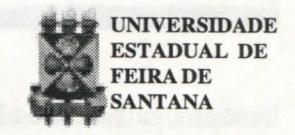
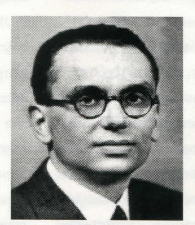
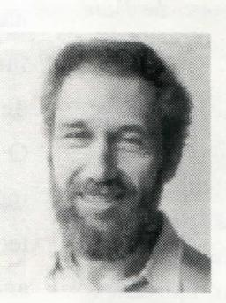

# FOLHETIM DE EDUCAÇÃO MATEMÁTICA

Ano 5 - número 68 - Folhetim de Educação Matemática - Departamento de Ciências Exatas

Julho/1998

### **OBJETIVO**

Este Folhetim é um veículo de divulgação, circulação de idéias e de estímulo ao estudo e à curiosidade intelectual. Dirige-se a todos os interessados pelos aspectos pedagógicos, filosóficos e históricos da Matemática. Pretende construir uma ponte para unir os que estão próximos e os que estão distantes.

# **EDITORIAL**

Dando continuidade ao Folhetim anterior, a coluna Pergunte que o NEMOC Responde, traz como tema principal uma abordagem sobre o Teorema de Gödel, no que diz respeito aos seus principais resultados. Um ponto importante que o leitor poderá observar, é a relação do citado Teorema com a Educação Matemática.

Esse eminente matemático, que com apenas 23 anos concluiu sua tese de doutorado, publicou seu mais importante trabalho, o conhecido Teorema de Gödel, em _uber formal unentscheidbare Sätze der Principia Mathematica und verwandter Systeme_.

Chamamos a atenção que as fotos do Folhetim 67, desse Folhetim, e que aparecerão nos próximos, embora possam ser obtidas de outras fontes, foram extraídas do "site" http://www-history.mcs.st.and.ac.uk/history que traz, entre outras, informações biográficas de matemáticos, numa lista considerável.

Aproveitamos também para divulgar as atividades que serão desenvolvidas pelo CAEM, neste semestre.

# **COMITÉ EDITORIAL**

Carloman Carlos Borges (Doutor) Inácio de Sousa Fadigas (Mestre)

# PERGUNTE QUE O NEMOC RESPONDE

Pergunta. Em que consiste a Prova de Gödel? (Continuação).

R. Em 1931, em um periódico científico alemão, apareceu um artigo de um jovem lógico-matemático,

Kurt Gödel (1906-1978), que tornou o mundo fantasioso dos matemáticos mais próximo da realidade. Esse jovem vienense provou que existeme sempre existirão verdades matemáticas impossíveis de serem demonstradas por via lógica. Assim, um sistema lógico como a matemática

não pode bastar-se a si mesmo, em si mesmo não pode fundamentar-se. O famoso Teorema de Gödel ou Prova de Gödel apresenta dois resultados fundamentais. O primeiro diz: é impossível, dada uma teoria matemática constante de uns poucos axiomas simples (uma teoria rudimentar, como a aritmética estudada nos primeiros anos escolares) mostrar que ela não possui contradições, permanecendo-se dentro de seus limites. Exemplificando: para mostrar a consistência (ausência de contradições) de uma Geometria como a de Lobachevski, é necessário sair de seus limites, construindo-se, por exemplo, um modelo euclidiano e, então, basta demonstrar que a Geometria de Euclides não é, contraditória; porém, para demonstrar a consistência da Geometria de Euclides, é necessário

também, sair de seus limites e recorrer por exemplo, à Aritmética. Contudo, não é possível demonstrar a consistência desta sem sair de seus limites, e, assim, este jogo torna-se, no campo da lógica, indefinidamente aberto. É a própria lógica que mostra ser ela mesma, insuficiente! E agora, José? Em seu livro Mathematics: The Loss of Certainty, o matemático e historiador Morris Kline (ele também é autor do popular livro O Fracasso da Matemática Moderna) compara o matemático com um rendeiro "que limpa uma área de terreno, mas apercebe-se da presença de animais selvagens escondidos no bosque à sua volta". Mesmo limpando uma área maior, o rendeiro sabe que apenas afugentou para mais longe os animais selvagens (as contradições) e, assim: "os animais selvagens permanecem na vizinhanca e um dia qualquer podem surpreendê-lo e matá-lo". Como escreve Michael Guillen em seu livro de divulgação Pontes para o Infinito: o lado humano das matemáticas, Editora Gradiva: "Entretanto, no mundo do matemático de hoje, verdade não é sinônimo de demonstração lógica, mas, por outro lado, confiar na validade duma demonstração lógica acaba por ser também matéria de fé". O segundo grande resultado do chamado Teorema de Gödel diz o seguinte: dentro de uma dada axiomática, há sempre questões para as quais não temos respostas - questões que são denominadas de indecidíveis. É impossível, fundamentado em um número finito de axiomas, mostrar que toda questão seja decidível. Este é o famoso problema da decisão postulado pelo grande matemático alemão David Hilbert: se é evidente (e se o fato pode ser demonstrado) que todas as proposições matemáticas

que têm sentido, dentro de uma determinada axiomática, podem necessariamente ser provadas verdadeiras ou falsas. Exemplificando: a Conjectura de Goldbach: todo número par (excetuando o 2, que é primo), pode ser representado como a soma de dois primos; assim: 4 = 2 + 2; 6 = 3 + 3; 8 = 5 + 3; 10 = 5 + 5; 12 = 5 + 7; 14 = 7 + 7; 16 = 13 + 3; 18 = 11 + 7; 20 = 13 + 7, ... e, assim, por diante. A conjectura, formulada pelo amador Christian Goldbach, em 1742, permanece ainda indecidível, isto é, ninguém ainda provou que é falsa ou é verdadeira. Mesmo que ela seja provada como verdadeira, o Teorema de Gödel assegura a existência de outras proposições, as quais dentro das limitações mencionadas, jamais poderão ser mostradas que são verdadeiras ou falsas. Esse segundo resultado mostra que não podemos reduzir a matemática a uma linguagem formal. Aqui, vale a pena transcrever as seguintes observações devidas ao eminente matemático francês Alain Connes (1947 - ),

medalha Fields em 1982:
"Hilbert construiu uma linguagem artificial baseada
num alfabeto finito, um
número finito de regras
gramaticais que permitem\nespecificar sem ambigüidade quais as proposições

coerentes e um número finito de regras de inferência lógica e de proposições supostas verdadeiras ou axiomas. A partir de um tal sistema ou linguagem formal, um algoritmo universal permite decidir da validade de uma demonstração formulada nesta linguagem. Podemos, assim, pelo menos teorica-

mente, estabelecer a lista de todos os teoremas demonstráveis nessa linguagem formal. Hilbert esperava poder reduzir os teoremas matemáticos àqueles que são demonstráveis numa linguagem formal conveniente. O teorema de Gödel mostra que isso é impossível". (Veja Matéria Pensante Jean Pierre Changeux / Alain Connes, Gradiva). Agora, uma pergunta, para nós, mais que pertinente: toda essa explanação possui alguma ligação com o ensino da matemática? Será que podemos estabelecer relações entre o exposto e o ensino de matemática? Penso que sim. A tendência predominante no ensino dessa Ciência vem de Euclides (século III a.C.) passando por Bourbaki. Mas qual a metodologia euclidiana? É baseada na axiomática, onde os aspectos formais, lógicos e linguísticos são privilegiados. O grupo Bourbaki é pseudônimo de um grupo de matemáticos, que na década de 30, tentou organizar o conhecimento matemático em torno das chamadas "estruturas mães". Essas estruturas são: as algébricas, as de ordem e as topológicas, basicamente. Com isso, Bourbaki instalou o estruturalismo no seio da matemática tal como sucedia em outros ramos do conhecimento, capitaneado por Claude Levi-Straus, na Antropologia. O método axiomático é um método organizador que deve ser empregado com parcimônia no ensino do 1º e 2º graus; o importante não é a linguagem e sim o significado dos objetos matemáticos explicitados através de suas respectivas definições, aspecto, infelizmente, relegado pela maioria dos professores de matemática. A esses, convém relembrar: o formalismo está intimamente ligado à corrente filosófica denominada de positivismo lógico. Para os neo-positivistas do Círculo de Viena, a matemática pode ser reduzida a uma linguagem

com a sua sintaxe. Ela perde, assim, qualquer referência com o mundo natural, tão cheio de contradições. Ora, tal projeto não tem mais cabimento ante o Teorema de Gödel! Após 67 anos da publicação desse teorema, o ensino da matemática continua existindo como se Gödel nunca tivesse existido! Um conhecido manual escolar de um não menos conhecido matemático brasileiro revela: "Geometria, como qualquer sistema dedutivo, é muito parecido com um jogo: partimos de um certo conjunto de elementos (pontos, retas, planos) e é necessário aceitar algumas regras básicas sobre as relações que satisfazem estes elementos, as quais são chamadas de axiomas. O objetivo final desse jogo é o de determinar as propriedades características das figuras planas e dos sólidos no espaço". Que jogo é esse tão detestado pela maioria esmagadora dos estudantes? É preciso salientar: o paradigma formal está dissociado da História da Matemática e os estágios iniciais em qualquer aprendizagem são informais, predominantemente intuitivos. Que algum matemático-jogador deseje transformar o ensino da matemática em um jogo, que o faça de modo agradável à clientela, no caso, os estudantes, e não de maneira tão dogmática!

Pergunte que o NEMOC Responde é uma coluna de autoria do prof. Dr. Carloman Carlos Borges e objetiva atingir ao público interessado em Matemática nos seus múltiplos aspectos.

Caso o leitor queira fazer alguma pergunta escreva-nos.

# PRÓXIMO NÚMERO

A Prova de Gödel. (Continuação)

Aguardem!

# NOTÍCIAS

O Centro de Aperfeiçoamento do Ensino de Matemática - CAEM, do IME/USP, estará promovendo no segundo semestre, vários cursos, oficinas e seminários.

### Cursos do CAEM:

- Análise combinatória sem fórmulas;
- Redescobrindo as cônicas:
- Razão áurea e números de Fibonacci:
- -Dos números às letras: uma introdução à álgebra;
- -Dificuldades conceituais no ensino de frações;
- Paralelos e relações entre matemática e música e enredamento e significados.

### Oficinas do CAEM:

- Explorando o conceito de área:
- Matemática e literatura infantil:
- -Geometria analítica:
- Isometrias e homotetias:
- -Probabilidades:
- Conjunto dos números reais:
- -Construções geométricas elementares;
- -Espaçoe Forma: a geometria na escola infantil;
- Desenvolvendo as capacidades de visualização espacial;
- Explorando sólidos geométricos através de um software;
  - O uso de material dourado;
  - -Exponenciais e logaritmos;
- Modelagem: o estudo de expressões algébricas e equações;
  - Área de triângulos e relações trigonométrias;
  - Semelhança: atividades práticas;
  - Conceitos de divisibilidade e o jogo senha.

# Seminários do CAEM:

Serão promovidos quinzenalmente às 6as feiras. Os temas serão anunciados oportunamente.

As inscrições devem ser feitas duas semanas antes do seu início, pelo telefone (011) 818-6160, no horário das 08:00 às 16:00 horas.

Informações:

CAEM-IME/USP

Rua do Matão, 1010 - Bloco B - Sala 167

Cidade Universitária - São Paulo - SP

CEP: 05508-900

Tel./Fax: (011) 818-6160

E-Mail: caem@ime.usp.br

# **NÚMEROS ATRASADOS**

Envie para cada folhetim um selo de postagem nacional de 1º porte. Dentro de no máximo quatro semanas, contadas a partir da data de recebimento do seu pedido, você estará recebendo os folhetins solicitados. OBS.: É permitida a reprodução total ou parcial desse folhetim, desde que citada a fonte.

### NEMOC-NÚCLEO DE EDUCAÇÃO MATEMÁTICA OMAR CATUNDA

Folhetim de Educação Matemática Ano 5. n. 68 Julho/98

Editores: Carloman e Inácio

Secretária: Josenildes Oliveira Venas

Editoração: Evandro Vaz e Nivaldo de Assis Impressão: Imprensa Gráfica Universitária

Tiragem: 1.200 exemplares

Endereço: Av. Universitária, s/n - km 03

BR 116-Campus Universitário

Telefone: (075)224-8115

Fax: (075)224-2284-CEP44031-460

Feira de Santana - BA - BRASIL

e-mail: nemoc@uefs.br
