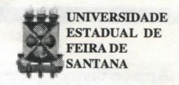

# **FOLHETIM DE EDUCAÇÃO MATEMÁTICA**

**Ano 6 - número 69 - Folhetim de Educação Matemática - Departamento de Ciências Exotos** 

**Agosto/1998** 

#### **OBJETIVO**

Este *Folhetim é* um veículo de divulgação, circulação de ideias e de estímulo ao estudo e à curiosidade intelectual. Dirige-se a todos os interessados pelos aspectos pedagógicos, filosóficos e históricos da Matemática. Pretende construir uma ponte para unir os que estão próximos e os que estão distantes.

### **EDITORIAL**

Desde o *Folhetim* de número 67, a coluna "Pergunte que o NEMOC Responde" está apresentando considerações sobre o Teorema de Gõdel. Com este número, o prof. Carloman conclui as suas reflexões sobre este importante Teorema.

Alguns fatos curiosos sobre este matemático Austríaco podem ser lidos na referida coluna.

Neste número, divulgamos uma solução para a curiosidade da coluna "Divertimentos Matemáticos", apresentada pelo leitor Antonio Sales, de Mato Grosso do Sul.

# **COMITÉ EDITORIAL**

Carloman Carlos Borges (Doutor) Inácio de Sousa Fadigas (Mestre)

## **PERGUNTE QUE O NEMOC RESPONDE**

**Pergunta.** *A Prova de Gõdel. (Continuação).* 

R. O Teorema de Gõdel é considerado como uma grande revolução conceituai; para alguns, a maior do século XX. Claramente, há uma dose de delírio nessa afirmativa. Mas, que tem a ver esse Teorema com o mecanismo da compreensão cerebral? Muitos vislumbram nos resultados do Teorema de Gõdel (TG) a confirmação dos limites do entendimento humano e, assim, Kant, mais uma vez, teria razão: a "coisa em si" jamais poderá ser compreendida... O TG faz lembrar o não menos famoso Princípio da Incerteza (PI) do físico alemão Heisenberg: pode-se determinar o momentum de uma partícula subatômica com qualquer grau de precisão e a posição da mesma partícula subatômica, até qualquer grau de precisão, porém, não se pode determinar ambos ao mesmo tempo, até qualquer grau de precisão. Quanto mais certeza tivermos na determinação do momentum de uma partícula, mais incerteza teremos de sua posição e vice-versa. O PI destrói, assim, a crença mantida pelos cientistas durante muito tempo de que, com instrumentos suficientes e uma metodologia adequada, todas as propriedades observáveis de um objeto poderiam ser medidas com exatidão. Assim, tanto o TG como PI, destroem a **ideia** fixa de um dia o homem encontrar um conhecimento acabado.

Apesar disso, atualmente ainda existem cientistas que falam no fim da Física... insinuando que esta já descobriu tudo, nada restanto, portanto, a ser descoberto... A impertinência excessiva de querer quantificar tudo, medir tudo, alcançar uma utópica certeza absoluta, parece não abandonar o homem. Até mesmo medidas do funcionamento da inteligência foram criadas através dos famosos QI. Ora, nenhum cientista sério e competente poderá definir o que é inteligência. Outros desejam sofregamente, construir um computador possuidor dos mesmos poderes do cérebro humano. Ora, nenhum cientista sério e competente pode afirmar que já exista um conhecimento suficiente sobre o cérebro humano para uma tal empreitada. O TG é bastante claro no seguinte: refere-se a sistemas formalizados. Exemplificando: conforme o seu segundo resultado mencionado no Folhetim anterior pode-se afirmar: nenhum computador jamais poderá ser programado para responder a todas as questões matemáticas. Como uma das singularidades do conhecimento humano é sua formalização, então, o TG deve ser considerado toda vez que fizermos uma opção nessa direção. Incontestavelmente, ele possui um grande valor epistemológico. Para início de conversa, o TG mostra que a lógica possui limites e isso é mostrado pela própria lógica! Ora, a lógica clássica não é mais o oásis da verdade e da certeza absolutas. Ahás, nenhuma das lógicas criadas após a lógica clássica, o é. No conhecimento humano, a contradição sempre se

constituiu em um problema de grande relevância: quando do seu surgimento em uma linha de pesquisa, o pesquisador a paralizava, dando-lhe sequência quando conseguia superar a própria contradição. Porém, durante dois séculos, na Física, o conflito entre teoria corpuscular e a teoria ondulatória da luz desafiava aos físicos. Foi preciso que o grande físico sueco Niels Bohr interrompesse esse pingue-pongue mostrando que as noções contraditórias de corpúsculo e onda são complementares, formulando, assim, o Principio da Complementaridade (PC): a clareza não está na simplificação e redução a um único modelo diretamente compreensível, mas na superposição exaustiva de diferentes descrições que incorporam noções visivelmente contraditórias. Desta forma, o PC mostra que nem sempre é possível superar as contradições, eliminando-as e considerando-as como um erro a ser evitado como acontece quando trabalhamos dentro dos limites da lógica clássica. O PC parece, portanto, enriquecer a própria lógica hegeliana. Finalizando, gostaríamos de transcrever o trecho abaixo, extraído do livro de David Ruelle, *Acaso e Caos,*  Editora UNESP, lembrando que esse autor é um eminente físico contemporâneo, membro do Institute for Advanced Study, de Princeton: "Lembro-me de ter visto Gõdel no Institute for Advanced Study de Princeton, nos anos 60 e no inicio dos anos 70. Era um homenzinho amarelado e magérrimo, e usava tampões de

algodão nas orelhas. Eis aqui uma história típica que ouvi a seu respeito. Tinham permitido a um colega visitante que utilizasse a escrivaninha de Gõdel enquanto ele estivesse ausente. Ao ir embora, o colega deixara um bilhete de agradecimento sobre a escrivaninha de Gõdel, lamentando não tê-lo encontrado e exprimindo a esperança de conhecê-lo de maneira mais íntima em outra ocasião. Um pouco mais tarde, o colega encontrava em meio à sua correspondência um envelope enviado por Gõdel. Ele continha o bilhete endereçado a Gõdel, onde este último sublinhara a frase espero ter a oportunidade de conhecê-lo de maneira mais íntima em outra ocasião, acrescentando a lápis: o que você quer dizer com isso exatamente? Kurt Gõdel morreu de inanição em 1978. Parece que tinha medo de que o envenenassem, ou Deus sabe o que, e se recusava a comer." •

*Pergunte que o NEMOC Responde é* uma coluna de autoria do prof. Dr. Carloman Carlos Borges e objetiva atingir ao púbhco interessado em Matemática nos seus múltiplos aspectos.

Caso o leitor queira fazer alguma pergunta escreva-nos.

# **PRÓXIMO NÚMERO**

*Matemática para Todos.* 

*Aguardem!* 

## **DIVERTIMENTOS MATEMÁTICOS**

*Thomaz de Jesus Ramos* 

#### Curiosidades aritméticas

1. Sejam os múltiplos de 91:

91x1 = 091

91 **X** 2 = 182

91x3 = 273

91x 4 = 364

91 **X** 5 = 455

91x 6 = 546

91x7 = 637

91x 8 = 728

91x9 = 819

#### Observar o seguinte:

A partir da *V* linha os algarismos da **r** e 3' colunas aumentam de uma urudade. enquanto que os algarismos da *2'* coluna diminuem de uma unidade.

2. Como 3 **X** 37 = 111, os múltiplos de 37 dados pelo produto 3k x 37 para k=l,2 , 3,...,9 são todos formados de algarismos iguais:

3x37 = 111

6 **X** 37 = 222

9 **X** 37 = 333

12x37 = 444

15 **X** 37 = 555

18 **X** 37 = 666

21 x37 =777

24x37 = 888

27 **X** 37 = 999

As respostas aos problemas propostos nesta coluna, serão publicadas tão logo recebamos soluções satisfatórias por parte do leitor. Qualquer leitor poderá enviar soluções.

Como resposta ao problema da coluna "Divertimentos Matemáticos", publicado no *Folhetim* n° 67, recebemos do leitor Antonio Sales, de Mato Grosso do Sul, a seguinte solução:

Lá está que:

12345679x9 = 111111111

12345679 x 18 = 222222222, etc.

É fácil perceber que:

12345679 x (10 - 1) = \_ ^

= 123456790 - 12345679 = 111111111

2 [12345679 x (10 - 1)] =

= 2 (111111111) = 222222222

e assim por diante.

sas de Matemática e, mais recentemente, uso do software Mathematica.

Para maiores informações, escrever para:

Sérgio Macias Marques - Diretor

Rua Antóiúo Saúde, 16 - 4° E

1500 Lisboa - Portugal

Tel.: (01)77 83107

## **NOTÍCIAS**

O NEMOC recebe o Jornal de Mathematica Elementar, publicação mensal de Lisboa - Portugal. Dispomos dos números 118 (1992); 138, 139, 140, 141 e 143 (1994); 145 a 151 (1995); 158 a 162 (1996); 165,168 a 173 (1997) e 174 a 179 (1998).

O informativo traz artigos, jogos, problemas, galeria de matemáticos. Olimpíadas Portugue-

## **NÚMEROS ATRASADOS**

Envie para cada folhetim um selo de postagem nacional de 1° porte. Dentro de no máximo quatro semanas, contadas a partir da data de recebimento do seu pedido, você estará recebendo os folhetins solicitados.

OBS.: É permitida a reprodução total ou parcial desse folhetim, desde que citada a fonte.

#### **NEMOC -NÚCLEO D E EDUCAÇÃO MATEMÁTICA OMARCATUNDA**

**Folhetim de Educação Matemática Ano 6. n. 69 Agosto/98** 

**Editores: Carloman e Inácio** 

**Secretária: Josenildes Oliveira Venas Editoração: Evandro Vaz e Nivaldo de Assis Impressão: Imprensa Gráfica Universitária** 

**Tiragem: 1.2(X)exemplares** 

**Endereço: Av. Universitária, s/n - km 03** 

**BR 116 - Campus Universitário** 

**Telefone: (075)224-8115** 

**Fax: (075)224-2284-CEP44031-460 Feira de Santana - BA - BEIASIL e-mail: nemoc@uefs.br**