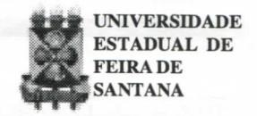
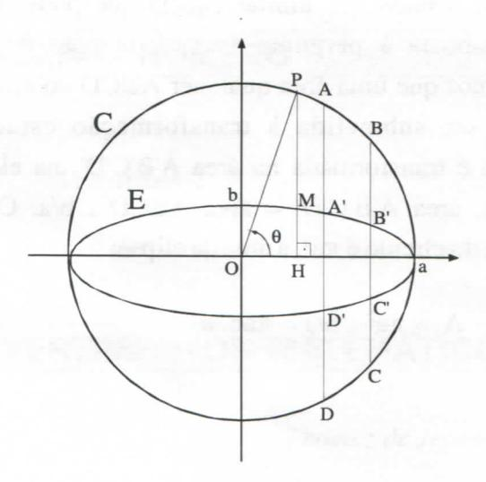
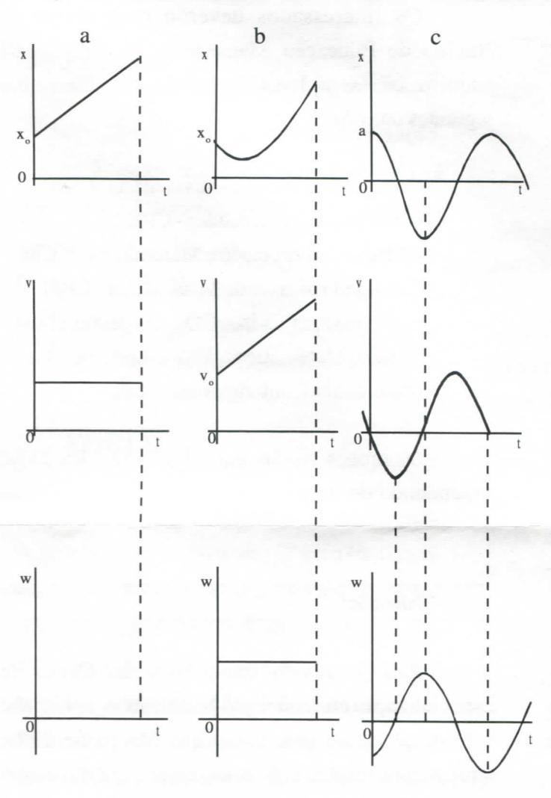

# FOLHETIM DE EDUCAÇÃO MATEMÁTICA

Folhetim de Educação Matemática, Ano 6, n. 71, out. 1998

ISSN 1415-8779

#### **OBJETIVO**

Este Folhetim é um veículo de divulgação, circulação de idéias e de estímulo ao estudo e à curiosidade intelectual. Dirige-se a todos os interessados pelos aspectos pedagógicos, filosóficos e históricos da Matemática. Pretende construir uma ponte para unir os que estão próximos e os que estão distantes.

#### **EDITORIAL**

Dois assuntos de particular interesse para os professores que ensinam 2º grau (mas também de interesse geral) são tratados na coluna "Pergunte que o NEMOC Responde". O primeiro trata de uma aplicação de transformação no plano, à determinação, de forma elementar, da área da elipse. O segundo envolve conceitos que muitas vezes não são claramente entendidos pelos alunos (ou até por professores) do 2º grau.

Chamamos a atenção do leitor para a notícia, na coluna própria, sobre livros da SBM.

Para aqueles mais curiosos, alguns problemas desafiantes estão na coluna "Divertimentos Matemáticos".

## COMITÉ EDITORIAL

Carloman Carlos Borges (Doutor) Inácio de Sousa Fadigas (Mestre)

#### PERGUNTE QUE O NEMOC RESPONDE

1ª Pergunta. J. N. Brito de Sousa, de Maceió indaga sobre a possibilidade do cálculo da área da elipse por processos elementares, partindo da área do círculo.

R. Quando se trata do cálculo de áreas de figuras planas, é razoável afirmar que o lugar adequado para tratar essas questões é o Cálculo Diferencial e Integral. Contudo, a nível elementar, isto é, nível do atual 2º grau, essa questão pode ser apresentada da seguinte maneira. Sejam <u>a</u> e <u>b</u> os dois semi-eixos da elipse E considerada e o sistema de eixos cartesianos conhecido dos nossos alunos do 2º grau. Seja, ainda, o círculo de centro na origem, tudo conforme a figura abaixo:

Quando a > b, o círculo C é chamado de círculo principal da elipse E. Consideremos a aplicação f do plano, nele mesmo, que a cada ponto P associa o ponto M tal que

HM = b/a HP (H é a projeção ortogonal de P sobre o eixo das abscissas). C é o conjunto de pontos tais que:

 $x'=x=a\;cos\theta,\,y'=b/a\;(a\;sen\theta)=b\;sen\theta\;,$   $\theta\in[0;\;2\pi\;[\;\;.\;\;Esta\;imagem\;\acute{e}\;a\;elipse\;E.\;\;Assim,$  pela transformação f, o círculo é transformado na elipse E. Resumindo:

Equações do círculo:

$$x^{2} + y^{2} = a^{2}$$

$$x = a \cos\theta$$

$$y = a \sin\theta, \theta \in [0;2\pi[$$

A tranformação f, leva o círculo na elipse:  $x' = x = a \cos\theta$   $y' = b/a (a \sin\theta) = b \sin\theta, \theta \in [0;2\pi[.$   $x^2/a^2 + v^2/b^2 = 1$ 

Há diversas aplicações do que foi mostrado acima. Vamos nos limitar àquela que pode servir de resposta à pergunta formulada pelo colega. Notemos que uma área qualquer ABCD do círculo, após ser submetida à transformação estudada acima é transformada na área A'B'C'D', na elipse, isto é, área A'B'C'D' = área ABCD . b/a. Como a área do círculo é  $\pi a^2$ , a área da elipse:

$$A_E = \pi a^2 \cdot b/a = \pi ab. \bullet$$

2ª Pergunta. Por diversas vezes, os alunos nos perguntam qual a diferença entre o gráfico de movimento e a trajetória.

R. Consideremos uma bola lançada verticalmente para cima e a que cai a partir de uma certa altura h. Nesse caso a bola move-se em uma trajetória representada por uma reta, enquanto seus gráficos são diferentes, considerando a natureza diferente do movimento (o movimento para cima é diferente do movimento para baixo). Estudemos os seguintes movimentos:

a) movimento uniforme. Por movimento uniforme retilíneo deve-se entender um movimento retilíneo com velocidade constante. A lei do movimento apresenta o seguinte aspecto:

 $x = x_o + vt$ , onde  $x_o$  é coordenada do ponto no instante t = 0 e v = constante.

b) movimento uniformemente variado. Por este movimento se entende um movimento retilíneo com aceleração constante ( w = constante). A lei desse movimento é a seguinte:

 $x = x_o + v_o t + \frac{1}{2} wt^2$ , onde  $v_o$  é a velocidade inicial do ponto (velocidade para t = 0).

c) Oscilações harmônicas. Vejamos o movimento retilíneo do ponto quando sua distância x à origem das coordenadas varia com o tempo de conformidade com a lei  $x = a \cos kt$ , onde  $\underline{a} e \underline{k} \sin kt$  são grandezas constantes. O ponto M (veja figura abaixo) durante este movimento oscila entre as posições M (+a) e M (-a).

$$M_1$$
 0 M M  $A$ 

## NEMOC - NÚCLEO DE EDUCAÇÃO MATEMÁTICA OMAR CATUNDA

Folhetim de Educação Matemática, Ano 6, n. 71, out. 1998 - Editores: Carloman e Inácio - Secretária: Josenildes Oliveira Venas - Editoração: Evandro Vaz e Nivaldo de Assis - Impressão: Imprensa Gráfica Universitária - Periodicidade: mensal - Tiragem: 1.200 exemplares - Distribuição gratuita - Endereço: Av. Universitária, s/n - km 03 - BR 116 - Campus Universitário - Telefone: (075)224-8115 - Fax: (075)224-2284 - CEP 44031-460 - Feira de Santana - Ba - BRASIL - E-mail: nemoc@uefs.br

Observemos os gráficos do movimento, da velocidade e aceleração do ponto em questão e cujas leis foram dadas acima.

Em todos os casos estudados, a trajetória é uma linha reta enquanto os gráficos desses movimentos estão exibidos nas figuras logo acima. Observemos que eles são representados por curvas no plano que liga os pontos representativos no plano coordenada - tempo. É preciso lembrar que um sistema de referência é um corpo rígido no qual são tomados os eixos coordenados e que a trajetória é a curva produzida pelo ponto material ao mover-se no sistema de referência. Nos exemplos estudados acima, como se trata do movimento retilíneo de um ponto, a linha reta é considerada como sistema

de referência respeito ao qual é examinado o movimento de um ponto. Mais um exemplo: seja o movimento de um ponto no plano Oxy e determinado pelas equações:

$$x = 2t$$
,  $y = 12 t^2$ 

A trajetória do ponto pode ser encontrada com a eliminação de t nessas equações. Assim, da primeira delas vem t = x/2; colocando esse valor de t na segunda equação, obtem-se:

 $y = 3 x^2$ , que representa uma parábola com vértices na origem de coordenadas.

Pergunte que o NEMOC Responde é uma coluna de autoria do prof. Dr. Carloman Carlos Borges e objetiva atingir ao público interessado em Matemática nos seus múltiplos aspectos.

Caso o leitor queira fazer alguma pergunta escreva-nos.

## PRÓXIMO NÚMERO

Aguardem!

### **DIVERTIMENTOS MATEMÁTICOS**

Thomaz de Jesus Ramos

1. Um automóvel cobre a distância entre duas cidades a 60 km por hora e faz a viagem de retorno a 40 km por hora. Qual foi a velocidade média percorrida pelo automóvel? Generalizar o problema. (Atenção: a velocidade média não é 50 km por hora).

- Demonstre que os números da forma a4 + 4
   (a ≠ 1) podem ser escritos na forma de dois fatores que não sejam iguais a ele e nem à unidade, isto é, é um número composto.
  - 3. Quanto valem:

a) 
$$-\log_2\log_2\sqrt{\sqrt{\sqrt{2}}} = ?$$

b) 
$$-\log_2\log_2\sqrt{\sqrt{\sqrt{\sqrt{\sqrt{2}}}}} = ?$$

c) 
$$-\log_2 \log_2 \underbrace{\sqrt{\sqrt{...}\sqrt{\sqrt{2}}}}_{\text{p vezes}} = ?$$

p, um número, inteiro e positivo.

Folhetim de Educação Matemática e aos interessados que está responsável pela venda das publicações da SBM.

Os interessados deverão comparecer ao Núcleo de Educação Matemática na UEFS para adquirir os exemplares. Dispomos de livros das seguintes coleções:

Coleção Matemática Universitária - CMU
Coleção Projeto Euclides - CPE
Coleção Computação e Matemática - CCM
Coleção Professor de Matemática - CPM
Coleção Olimpíadas - CO
Ensaios Matemáticos - EM
Matemática Contemporânea - MC

Os preços variam entre R\$ 9,00 e R\$ 25,00 dependendo do livro.

## NOTÍCIAS

Acontecerá em Goiânia - GO, a V Jornada Educação Matemática, entre os dias 05 e 07 de novembro de 1998.

Informações:

UFG - IME - LEMAT

Caixa Postal 131

Goiânia - GO

CEP: 74001-970

FAX: (062)821-8180

E-mail: lemat@mat.ufg.br

O professor Carloman Carlos Borges como Representante de Vendas da Sociedade Brasileira de Matemática (SBM) informa aos leitores do

#### Atenção!

Aos prováveis candidatos ao Curso de Especialização em Educação Matemática, avisamos: a próxima turma terá início em Março de 1999, sempre com aulas as segundas, terças e quartas-feiras às tardes.

### **NÚMEROS ATRASADOS**

Envie para cada folhetim um selo de postagem nacional de 1º porte. Dentro de no máximo quatro semanas, contadas a partir da data de recebimento do seu pedido, você estará recebendo os folhetins solicitados.

OBS.: É permitida a reprodução total ou parcial desse folhetim, desde que citada a fonte.