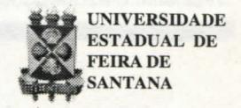

# **FOLHETIM DE EDUCAÇÃO MATEMÁTICA**

**Folhetim de Educação Matemática, Ano 6, n. 72, nov.1998** 

**ISSN 1415-8779** 

#### **OBJETIVO**

Este *Folhetim* é um veículo de divulgação, circulação de **ideias** e de estímulo ao estudo e **à**  curiosidade intelectual. Dirige-se a todos os interessados pelos aspectos pedagógicos, filosóficos e históricos da Matemática. Pretende construir uma ponte para unir os que estão próximos e os que estão distantes.

### **EDITORIAL**

**o** conceito de função constitui-se em um dos mais importantes da Matemática, principalmente para o ensino médio. Já tivemos oportunidade de ler na coluna "Pergunte que o NEMOC Responde", do Folhetim n° 16, uma abordagem sobre a origem da palavra função. Neste Folhetim, o prof Carloman trata da definição de função, fazendo um apanhado das diversas delas, encontradas nos manuais escolares.

No próximo número, estaremos divulgando uma lista das perguntas enviadas até este número, para a coluna *Pergunte que o NEMOC Responde.* Aguardem!

## **COMITÉ EDITORIAL**

Carloman Carlos Borges (Doutor) Inácio de Sousa Fadigas (Mestre)

#### **PERGUNTE QUE O NEMOC RESPONDE**

**1" Pergunta.** Muitos colegas nos escrevem: *Qual a "melhor" definição de função?* 

R. Acreditamos que não exista a melhor definição de função, isto é, de uma maneira geral. Relendo os manuais escolares, neles são apresentadas diversas definições:

Definição I : Uma função é uma coleção de pares de números com a seguinte propriedade: Se (a,b) e (a,c) pertencem ambos à coleção, então b c; em outras palavras, a coleção não deve conter dois pares distintos com o mesmo primeiro elemento.

Defnição II: Uma função f: A ^ B é simplesmente uma correspondência que a cada elemento x do domínio A associa um único elemento f(x) de B.

Definição III: "Uma correspondência f = (F, A, B) é uma função se, para qualquer x pertencente ao conjunto de partida A de f, a relação (x,y) pertencente a F é funcional em y; o único objeto correspondente a x mediante f chama-se valor de f para o elemento x de A, e denota-se por f(x)..."

Definição IV: Se a cada valor admissível de x corresponde um ou mais valores de y, então y é função de x.

Definição V: Sejam x e y duas variáveis representativas de conjuntos de números; diz-se que y é função de x e escreve-se: y = f (x) se entre as duas variáveis existe uma correspondência unívoca no sentido x ^ y. A x chama-se variável independente, a y variável dependente. E agora? Alguém já escreveu e de maneira judiciosa que a única lição que aprendemos com a História é que nunca aprendemos com ela. Apesar dessa declaração, cuja validade vem sendo comprovada a cada dia, vamos recorrer àquela que deveria ser sempre nosso guia: a História. Que nos ensina ela? Três grandes **ideias**  floresceram no século XVII: a **ideia** de função, a Geometria Analítica e, finalmente, o Cálculo. Atrás dessas três grandes **ideias** e anteriores a elas, um mundo se transformava na Era das Grandes Explorações, caracterizada pela expansão do comércio, pela conquista de novos territórios, pelos espanhóis, pelos portugueses e holandeses e outras nações poderosas na época. A **ideia** predominante era a **ideia** do movimento e, consequentemente, a da ação, a da variabilidade. Transformação, dependência, variável: onde encontrar o instrumento matemático adequado que não somente refletisse essas **ideias,**  mas que as tomassem operacionalizáveis? Como ajudar a artilharia em seus tiros mortais? Como **aju**dar Galileu no estudo da queda dos corpos? O instrumento adequado foi chamado de função, pelo matemático e filósofo alemão Leibniz, também um dos criadores do cálculo.A luz desses esclarecimentos históricos, analisaremos as definições citadas. No ensino médio são incabíveis definições como a I e a III: elas escondem a **ideia** de movimento, de variável, de dependência. A definição III é devida a Bourbaki e se encontra em *Eléments de Mathematique I. Théorie des ensembles.* Fascicule dés résultats, Paris 1966. Ambas as definições são estáticas e não levam o aluno a pensar em x como uma variável. A nefasta influência de Bourbaki no ensino médio só pode ser comparada com a aplicação das teorias de Piaget nesse mesmo ensino: um completo desastre. De um manual francês e para comprovar essa tese, transcrevo a definição: " Sejam E e F dois conjuntos. Chama-se função ou aplicação de E em F, toda tema (E, F, f) tal que f seja uma correspondência de E, no sentido de F verificando as duas condições seguintes:

a) o campo de definição de f é todo inteiro; b) a todo **X** de E, f faz corresponder um y único em F."

É preciso assinalar mais o seguinte: antes dessa definição, o autor define o que é correspondência: "Sejam E e F dois conjuntos e R uma parte não vazia de E **X** F. Consideremos todos os pares (a,b) verificando (a,b) **G** R, empregando a notação: ^

(a,b) **6** R c Ex F **a9í** b**.9í** chama-se correspondência de E no sentido de F e R é chamado de gráfico de **91** ." Então, gostaram? Apesar disso, inúmeros Congressos são realizados para discutirem a crise no ensino da Matemática... Estudos realizados em outros ramos do saber como, exemplificando a antropologia e a sociologia, atestam o primitivismo da **ideia** de correspondência, mesmo em relação à **ideia** de número: há exemplos históricos de "contagem" mesmo antes da elaboração dos números naturais.

#### **NEMOC - NÚCLEO DE EDUCAÇÃO MATEMÁTICA OMAR CATUNDA**

Folhetim de Educação Matemática, Ano 6., n. 72, nov. 1998 - **Editores:** Carloman e Inácio - **Secretária:** Josenildes Oliveira Venas - **Editoração:** Evandro Vaz e Nivaldo de Assis - **Impressão:** Imprensa Gráfica Universitária - **Periodicidade:** mensal - **Tiragem:** 1.200 exemplares - *Distribuição gratuita -* **Endereço:** Av. Universitária, s/n km 03 - BR 116 - Campus Universitário - **Telefone:** (075)224-8115 - **Fax:** (075)224-8085 - CEP 44031-460 - Feira de Santana - Ba - BRASIL - **E-mail:** nemoc@uefs.br

A formalização dessa **ideia,** nesse nível, é, portanto, em nosso entendimento, uma tolice pedagógica com os seus inúmeros efeitos negativos. A definição V, atribuída por alguns autores a Riemann-Dirichelet, dentro de nossa compreensão, nos parece a mais adequada, pois explicita o conceito de variável e concomitantemente, o de movimento. É preciso assinalar que o significado está no contexto; assim, a definição de Bourbaki e suas variantes, pode ser considerada mais adequada em outro contexto que não seja o do ensino médio e mesmo do ensino de graduação. A outra face de tal situação pode ser encontrada naquilo que alguns educadores chamam de "oficinas": geralmente, a cada aluno é dado um tipo de material (que pode ser cartolina), uma tesoura ou outro instrumento "concreto". Tudo preparado: vamos, agora, aprender a geometria ou a álgebra ou outra qualquer disciplina matemática. Ora, a maioria dessas oficinas é inútil na medida em que, com esse chamado material "concreto" e acompanhado das chamadas atividades manuais, não são explicitados os princípios lógicos envolvidos naquele saber proposto a ser estudado. Exemplificando: quer-se ensinar o sistema de numeração? Uma oficina será válida a partir do ábaco, instrumento do qual podemos explicitar todos os princípios lógicos dos sistemas de numeração e não com outro tipo de material, em cuja manipulação, o aluno não vislumbre esses princípios lógicos. Vemos assim, uma **ideia** boa, qual seja a das oficinas, ser transformada, através da incompetência, numa panaceia...»

**2" Pergunta.** Alice B. P. dos Santos, de Belo Horizonte indaga: *Pode uma equação algébrica*  *de grau n, possuir um número de raízes superior a n?* 

R. O Teorema Fundamental da Álgebra diz: uma equação polinomial, com coeficientes complexos e de grau n>0, tem, pelo menos, uma raiz complexa. Em sua tese de doutorado, escrita por volta dos 20 anos de idade, Gauss deu a primeira demonstração desse teorema. Uma consequência imediata da proposição acima é que uma equação polinomial, com as restrições mencionadas, possui n raízes complexas. Como o significado está no contexto, se você trabalha em outro, como, exemplificando, dentro dos números denominados de "quatemios", aquele teorema pode não se aplicar. Os "quatemios" são números da forma:

w = a^ **-I-** aj i **-f-** a^ j **-I-** a^ k, onde a^, a^, a^, *SL^*  são números reais arbitrários. Deve-se observar o seguinte:

ij = k; ji = -k; jk = i; kj = -i ; ki = j ; ik = -j ; **i2 = j2** = = -1 ; convém observar que se trata de um sistema numérico não comutativo; aliás, é um dos primeiros exemplos históricos no qual o princípio de permanência das leis formais é violado. A não comutatividade da multiplicação de quatemios pode provocar surpresas. Assim, dentro do contexto dos quatemios uma equação de grau n pode admitir um número superior a n raízes. A equação:

**-I-** 1 = O admite três quatemios como soluções: w = i, w = j e w= k. Na realidade, ela admite muitas outras soluções...No sistema numérico dos quatemios, a equação do segundo grau:

aw^**-I-**bw**-I-**c = O tem 16 raízes.

A Matemática confirma conclusões de algumas ciências humanas: todo estudo deve ser elaborado considerando-se os referenciais adequados. Este cuidado, no mínimo, evita a elaboração de falsos "absolutos". Isto me trás à recordação o seguinte fato: uma jovem professora, récem egressa do mestrado em matemática, chegou-se a mim, irritadíssima, comentando: veja só, o aluno não sabe, nessa altura (curso de graduação em matemática) que o número zero é um número par... •

*Pergunte que o NEMOC Responde é* uma coluna de autoria do prof. Dr. Carloman Carlos Borges e objetiva atingir ao público interessado em Matemática nos seus múltiplos aspectos.

Caso o leitor queira fazer alguma pergunta escreva-nos.

# **PRÓXIMO NÚMERO**

*Perguntas publicadas nos Folhetins anteriores.* 

*Aguardem!* 

## **NOTÍCIAS**

Conforme divulgado no número anterior do nosso Folhetim, a UEFS, através do NEMOC vai oferecer novamente à comunidade o CURSO DE ESPECIALIZAÇÃ O E M EDUCAÇÃ O MATEMÁTICA, com melhoria na grade curricular. As disciplinas oferecidas são:

- •Psicologia Cognitiva 45 h
- •Epistemologia e Metodologia da Pesquisa 45 h

- •Tópicos de Matemática de 1° e 2° graus 45 h
- •Álgebra Linear aplicada ao *2°* grau 45 h
- •Geometria Euclidiana 60 h
- •Ideias Fundamentais da Matemática 45 h
- •Didática da Matemática 45 h
- •Teoria dos Números 60 h
- •Seminários sobre Tóp. Gerais da Matemática 45 h
- •Álgebra Linear e Geometria Analítica 60 h (optativa)

O Curso será desenvolvido na modalidade Regular com Tempo Integral, totalizando 435 horas (quatrocentos e trinta e cinco horas).

Período de inscrição: **01 a 11 de fevereiro de 1999** 

Período da seleção: **22 a 24 de fevereiro de 1999** 

Divulgação dos resultados: **26 de fevereiro de 1999** 

Matrícula: **02 e 03 de março de 1999** 

Início do curso: **08 de março de 1999** 

#### **Informações adicionais:**

PPPG: (075) 224 - 8028; e-mail: pppg@uefs.br DEXA: (075) 224-8086; e-mail: exa@uefs.br NEMOC:(075)224-8115;e-mail: nemoc@uefs.br

# **NÚMEROS ATRASADOS**

Envie para cada folhetim um selo de postagem nacional de 1° porte. Dentro de no máximo quatro semanas, contadas a partir da data de recebimento do seu pedido, você estará recebendo os folhetins sohcitados.

OBS.: É permitida a reprodução total ou parcial desse folhetim, desde que citada a fonte.