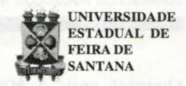

# **FOLHETIM DE EDUCAÇÃO MATEMÁTICA**

**Folhetim de Educação Matemática, Ano 6, n. 73, dez.1998**

**ISSN 1415-8779**

# **OBJETIVO**

Este _Folhetim é_ um veículo de divulgação, circulação de ideias e de estímulo ao estudo e à curiosidade intelectual. Dirige-se a todos os interessados pelos aspectos pedagógicos, filosóficos e históricos da Matemática. Pretende construir uma ponte para unir os que estão próximos e os que estão distantes.

# **EDITORIAL**

o fim do ano se aproxima, e desde já queremos externar os nossos agradecimentos a você leitor, que direta ou indiretamente, através de sugestões, críticas, palavras de incentivo, ou simplesmente lendo o nosso Folhetim, contribuiu para que pudéssemos prosseguir por mais um ano com este trabalho.

Sempre visando contribuir com o leitor, neste número publicamos todas as perguntas e assuntos que foram tratados nos Folhetins anteriores, sobretudo na coluna _Pergunte que o NEMOC Responde._ Desta forma, será mais fácil ao leitor recorrer a determinado assunto, e quem sabe nos questionar mais sobre o mesmo.

Pergunte que o NEMOC responde!

# **COMITÉ EDITORIAL**

Carloman Carlos Borges (Doutor) Inácio de Sousa Fadigas (Mestre)

# **PERGUNTE QUE O NEMOC RESPONDE**

_Pergunte que o NEMOC Responde é_ uma coluna de autoria do prof. Dr. Carloman Carlos Borges e objetiva atingir ao público interessado em Matemática nos seus múltiplos aspectos.

Caso o leitor queira fazer alguma pergunta escreva-nos.

Perguntas publicadas nos Folhetins anteriores:

N°0(An o 1. 1993)- Objetivos do NEMOC.

N° 1 (Ano 1. 01.08.93) - Biografia do Prof. Omar Catunda.

N°2(An o 1.08.08.93) - Resolução do CONSAD.

N°3(An o 1. 15.08.93)

**Pergunta.** _Existe algum ramo da Matemática no qual o conceito de número não possua importância?_

#### N°4(An o 1.22.08.93)

**1\* Pergunta.** _Você poderia aprofundar o que escreveu anteriormente sobre esse ramo fascinante da Matemática que se chama Topologia?_

**2" Pergunta.** A _Matemática pode nos dar alguma "dica" a respeito do popular "jogo da velha"?_

#### N°5(An o 1.29.08.93)

- **1^ Pergunta.** _O número zero é um número natural?_
- **2" Pergunta.** _Em alguns livros que tenho em casa, o zero é considerado um número par, enquanto em outros o primeiro número par é o 2. Oruie se encontra a certeza?_
- _y_ **Pergunta.** A pergunta abaixo, que se desdobra em cinco outras, foi formulada pela garotinha Camila Gonçalves de Jesus, de 9 anos de idade. Ei-la: _O que é a Matemática? Quando a Matemática foi inventada?_

_Quantos anos a Matemática tem? Por quem a Matemática foi inventada? Quantos sinais existem na Matemática?_

**4" Pergunta.** _No ensino da Matemática, o que é mais importante - o rigor ou a clareza?_

# N°6(Ano 1.05.09.93)

**1" Pergunta.** Uma colega de Salvador escreve-nos falando das grandes dificuldades por ela experimentadas no ensino do conceito do conjunto vazio. Seus alunos estão na faixa etária de 10 a 15 anos.

**2' Pergunta.** Um colega de Juazeiro da Bahia escreve-nos: Tenho um livro sobre Matemática no qual o autor escreve que "os números racionais são criações nossas e as regras que definem as operações entre eles dependem de nossa vontade". Eu pergunto: se é assim, se existe tal voluntarismo, por que não definimos a adição de duas frações desta maneira: basta somar os numeradores e os denominadores entre si; deste modo teríamos:

$$\frac{a}{b} + \frac{c}{d} = \frac{a+c}{b+d}$$
e, respectivamente

$$\frac{1}{3} + \frac{1}{3} = \frac{1+1}{3+3} = \frac{2}{6}$$

**3" Pergunta.** Um colega de Feira de Santana escreve-nos: "Acho que se deve possuir, em primeiro lugar, uma _compreensão exata_ (o grifo é nosso) dos conceitos matemáticos para, então, em seguida, eles serem manipulados. Qual a sua opinião arespeito?"

#### N°7(Ano 1. 12.09.93)

**Pergunta.** Claudene Ferreira Mendes, de Feira de Santana, pergunta: a) _Há um modelo para o ensino da "regra dos sinais"? b) Qual a melhor maneira de "passar" ao aluno o conceito de número primo?_

# N°8(An o 1. 19.09.93)

**1" Pergunta.** _A Matemática é uma ciência exata? Por quê?_

**2" Pergunta.** _Quem é Bourbaki?_

- _3"_ **Pergunta.** _Qual foi o matemático que inventou os números naturais: 1, 2, 3, 4, 5, etc. ?_
- **4" Pergunta.** _Posso somar duas laranjas com duas bananas?_

# N°9(Ano 1. 26.09.93)

**1\* Pergunta.** Um colega de Salvador indaga se _é correto afirmar que a Matemática, como ciência, foi criação dos gregos antigos._

**2\* Pergunta.** O mesmo colega da indagação anterior pergunta: _Há alguma relação entre a religião e a Matemática? {O grifo é nosso)._

# N°10(Ano 1.04.10.93)

**1^ Pergunta.** _Em uma de suas respostas dadas anteriormente, você mostrou-se contrário ao ensino da Teoria dos Conjuntos; ora, esta vem sendo ensinada para crianças de 10/15 anos, com_ êxito (o grifo é nosso). _Então, não acha melhor seguir uma prática proveitosa do que uma opinião?_

**2" Pergunta.** O mesmo colega da pergunta anterior, afirma indagando: _sabemos que o mundo fora da gente é contraditório; sabemos, também, ser a consistência (ausência de contradições) o critério de validade de qualquer teoria matemática. Pergunto: como pode a Matemática refletir tão bem a realidade se, ela, a Matemática, rejeita as contradições?_

_y_ **Pergunta.** _No artigo anterior, você afirma ser o homem produto biológico e do social. Acredito que você, sendo "progressista", considera prevalente o social, o adquirido; estou certo?_

# **NEMOC - NÚCLEO DE EDUCAÇÃO MATEMÁTICA OMAR CATUNDA**

Folhetim de Educação Matemática, Ano 6. ,n. 73, dez. 1998 - **Editores:** Carloman e Inácio - **Secretária:** Josenildes Oliveira Venas - **Editoração:** Evandro Vaz e Nivaldo de Assis - **Impressão:** Imprensa Gráfica Universitária - **Periodicidade:** mensal - **Tiragem:** 1.200 exemplares - _Distribuição gratuita -_ **Endereço:** Av. Universitária, s/n km 03 - BR 116 - Campus Universitário - **Telefone:** (075)224-8115 - **Fax:** (075)224-8085 - CEP 44031 -460 - Feira **de** Santana - Ba - BRASIL - **E-mail:** nemoc@uefs.br

#### N°ll (Anol. ll.lO.gS)

- **1" Pergunta.** Um colega de Feira de Santana indaga: _Que é a Medalha Fields?_
- _2"_ **Pergunta.** _Como pode a Matemática criar modelos_ em todas as áreas do conhecimento humano _e como esses podem_ funcionar tão bem? (os grifos são nossos).

Essa pergunta foi formulada por um colega de Salvador.

## N° 12 (Ano 1. 18.10.93)

**1" Pergunta.** A professora Urânia, da cidade de Serrinha, indaga _se a raiz quadrada de um número inteiro positivo, possui dois valores._

**2" Pergunta.** Um colega de Salvador pergunta afirmando: _existem condições necessárias e suficientes para um bom professor de matemática, quando concordamos, que a condição necessária é dominar o conteúdo matemático?_

# N°13(Ano 1.25.10.93)

- **1" Pergunta.** A professora Angélica, de Terra Nova, indaga: _Que argumento deve ser usado pelo professor para que o aluno compreenda o significado das potências, evitando-se assim, que ele, o aluno, não multiplique a base pelo expoente ?_
- _T_ **Pergunta.** Um colega de Salvador indaga: _qual o significado da palavra "algoritmo"?_
- _y_ **Pergunta.** Um colega de Feira de Santana indaga: _qual a relação entre Matemática e Numerologia?_

#### N° 14 (Ano 1.01.11.93)

- **1' Pergunta.** Um aluno da UNEB (Universidade do Estado da Bahia) indaga: _Como pode existir uma adição com infinitas parcelas e, mais do que isto, como pode esta soma ter como resultados um número finito?_
- _2'_ **Pergunta.** Maria A. do Carmo, escreve: _quando definimos a potenciação de base_ **a** _e expoente_ **n,** _destacamos que_ **n** _assume valores inteiros positivos a partir de 2. Como explicar, então, que_ **a" = 1**
- **3\* Pergunta.** Alice **P.** Silveira, de Salvador indaga: _a Matemática é uma criação ou uma descoberta?_

#### N°15(Ano 1.08.11.93)

- **1" Pergunta.** Ubiratan Cerqueira, de Salvador, levanta as seguintes questões: _(a) qual a origem dos princípios lógicos?_ (o grifo é nosso); _(b) será que estes princípios são inatos?_
- _2"_ **Pergunta.** Emiliano Gonçalves de Jesus, morador no Conjunto Morada das Arvores, em Feira de Santana, indaga se 2 _mais 2 também pode ser igual a 5._

#### N° 16 (Ano 1. 15.11.93)

**Pergunta.** Sônia de Salvador, escreve: _Qual a origem da palavra_ **função** _e qual o matemático que primeiro a empregou?_

#### N° 17 (Ano 1.22.11.93)

- **1" Pergunta.** Paulo L. Magalhães, de Salvador, indaga em qual época surgiu a Geometria Analítica e qual sua importância.
- **2" Pergunta.** O mesmo colega da pergunta anterior quer saber a razão da dificuldade encontrada por nossos alunos quando se defrontam, pela primeira vez, com o estudo da Álgebra.
- **3" Pergunta.** Ainda o mesmo colega das perguntas anteriores: quando surgiram os sinais de _mais_ e _menos?_ E os sinais de _maior_ e _menor?_

#### N° 18 (Ano 1.29.11.93)

**Pergunta.** Um colega de Feira de Santana deseja saber o significado da palavra _Álgebra._

#### N° 19 (Ano 1.06.12.93)

- **1" Pergunta.** Cláudio José Souza do Nascimento, aluno do Curso de Matemática da UEFS, indaga: Como funciona a _prova dos nove?_
- **2" Pergunta.** Um colega de Feira de Santana pergunta: _que é uma operação racional?_

#### N°20(Ano 1. 13.12.93)

**Pergunta.** Lucimar M . Nunes, aluno do Curso de Matemátic a da Faculdade de Formaçã o de Professores, de Alagoinhas escreve: Se aceitamos **a** Relatividade, o que dizer do ressuscitamento do _infinitésimo ?_ Que relacionamento há com a **ideia** filosófica em Matemática do _zero ? E_ se fosse possível ir mais longe, que tal incrementar uma trindade com **a** tão abominada _mônada ?_ (Os grifos são do leitor).

## N°21 (Ano 1.20.12.93)

**1" Pergunta.** Albertram, de Salvador, indaga: (a) _qual o motivo de empregarmos a base decimal;_ (b) _dentro do volumoso conhecimento matemático dos egípcios antigos, que já conheciam o Teorema de Pitágoras, existe algum teorema por eles demonstrado?_

**2" Pergunta.** Um colega de Entre Rios pergunta: _que são grandezas comensuráveis e grandezas incomensuráveis?_

#### . N° 22 (Ano 1.27.12.93)

- **" í' 1' Pergunta.** Jeová, de Salvador, pergunta: _quando devemos empregar o_ ponto _ou a_ vírgula _para escrever numerais ?_
- **2' Pergunta.** Nilson Silva indaga: _em um livro de Matemática li que, entre 13 pessoas existem, pelo menos duas delas que terão aniversários no mesmo mês. Como esta frase veio desacompanhada de qualquer outra explicação, pergunto: é possível justificá-la matematicamente?_
- **3" Pergunta.** José M . de Souza Guimarães, de Salvador, indaga: _Qual a explicação de a Matemática ser considerada a Rainha das Ciências?_

#### N°23 (Ano 1.03.01.94)

**1^ Pergunta.** Edson Ramos, de São Gonçalo dos Campos e aluno da UEFS, ingada: (a) _existe alguma representação geométrica para o produto notável (a-bf? e (b) qual a justificativa dos critérios de divisibilidade?_

**2" Pergunta.** Um colega de Feira de Santana pergunta: _Qualquer pessoa pode aprender matemática ?_

#### ' N° 24 (Ano 2. Março 1995)

**Pergunta.** Luiz **P.** de Carvalho pergunta: (a) _a ordem dentro da qual as palavras de um dicionário aparecem, tem algo a ver com a ordem estudada em Matemática?_ (b) _qual a finalidade de uma demonstração?_ (c) _ela deve ser ensinada no 1° ciclo ?_

#### N°25 (Ano 2. Março 1995)

**Pergunta.** Carlos A. M. Fonseca, de Salvador, indaga: (a) _qual a razão do horário de verão e_ (b) _por que a divisão por zero é proibida em Matemática._

## N°26 (Ano 2. Março 1995)

- **1^ Pergunta.** Um grupo de alunos da UEFS e também professores do 1° grau, indaga: (a) _qual a definição de ângulo? e_ (b) _a diferença entre ângulos consecutivos e ângulos adjacentes?_
- _2"_ **Pergunta.** _Uma professora leu, em um de seus livros, que a expressão 1/12 deve ser lida: um doze_ avos; _porém ao assistir uma palestra, o palestrante lhe assegurou que a expressão acima deve ser lida: um doze_ avo. _Em dúvida, ela indaga: e agora ?_
- _y_ **Pergunta.** Um colega de Feira de Santana perguntou: _sempre escutei dizer que zero escrito à esquerda de um número, não altera este número, porém, dado o número 54, por exemplo, 0,54 é outro número bem diferente de 54._
- **4^ Pergunta.** Sônia **P.** Albuquerque, pergunta: quando escrevemos A = B, o que queremos, realmente, afirmar com isto?

#### N°27 (Ano 2. Abril 1995)

- **1" Pergunta.** Cláudio José do Nascimento, aluno do Curso de Matemática, da UEFS, escreve: _No Português, a disjunção "ou" representa duas coisas separadas; exemplo: Quero falar com Pedro ou João, enquanto que, a conjunção "e" significa união; exemplo: Quero falar com Pedro e João. Na Matemática, "ou" representa união de conjuntos e "e" intersecção de conjuntos. Como se processa essa relação entre a linguagem comum e a linguagem matemática?_
- **2" Pergunta.** Ronaldo, de Salvador, quer saber se, _empregando as coordenadas cartesianas ortogonais e, usando escalas diferentes nos dois eixos, a inclinação de uma reta passando pelos pontos (x^ , e (x^, yj continua sendo definida como o quociente de y^ - y^ por_ **^2 " -^z •**
- **3" Pergunta.** Um colega de Feira de Santana escreve: _Venho lendo, semanalmente, a sua coluna Pergunte que o NEMOC responde e, às vezes o que você escreve me causa muita surpresa. Por exemplo: por que você é contrário ao ensino dessa bela ciência em cursos como Enfermagem, Odontologia, etc?_

#### N°28 (Ano 2. Abril 1995)

**1" Pergunta.** R. Rios, funcionário da UEFS,

escreve: _Três pessoas, em um restaurante, gastaram R\$ 30,00, porém, o dono do mesmo somente cobrou R\$ 25,00, dando-lhes o troco de R\$ 5,00; ao garçon foi dada uma gorjeta de R\$ 2,00, sobrando, assim, para cada pessoa um troco de R\$ 1,00. Como cada um dos três recebeu um troco de R\$ 1,00, eles gastaram 3.9 =27 reais, os quais somados aos R\$ 2,00 de gorjeta, perfazem um total de R\$ 29,00; falta, portanto, R\$ 1,00 e qual é a explicação?_

**2" Pergunta.** Fábio Pereira, da Rua Marechal Deodoro n° 219, de Xique-Xique, escreve: _Em que aspecto a Matemática ajuda na compreensão do Cosmo ou seja, sobre as constelações, planetas, etc?_

_3"_ **Pergunta.** Um colega de Aracaju escreve: _Alguns livros de Matemática denominam a função y =_ ax+b, _de função linear, enquanto outros a chamam de_ função afim, _reservando a denominação de função linear para_ y = ax. _Como ficamos?_

4" **Pergunta.** O mesmo leitor da pergunta anterior escreve: _Há algum critério para o emprego das unidades de medidas? Por exemplo, como devo abreviar quilómetro,_ Km _(com_ K _maiúsculo) ou_ km _(com kminúsculo)?_

# N°29 (Ano 2. Abril 1995)

**Pergunta.** Uma colega de Feira de Santana indaga: _Como introduzir a noção de número irracional a nível elementar?_

#### N°30 (Ano 2. Maio 1995)

**1" Pergunta.** Uma colega de Feira de Santana indaga: _O que você acha do uso da_ mnemónica _no ensino da Matemática ?_

**2" Pergunta.** A mesma colega da pergunta anterior indaga: _Como tornar-se um bom professor de Matemática?_

#### N°31 (Ano 2. Maio 1995)

**1\* Pergunta.** Fabíola de Oliveira Pedreira, aluna do Curso de Matemática, na UEFS, indaga: _Qual a origem da designação de ordinárias para frações como 2/3, 3/5, etc. ? Por que_ ordinária.^

**2" Pergunta.** O colega Lucimar M . Nunes, do curso de Matemática da Faculdade de Formação de Professores de Alagoinhas, indaga: A divisibilidade infinita _é possível, quer no mundo físico, quer no mundo da Matemática?_

#### N°32(Ano 2. Maio 1995)

**Pergunta.** Lucimar M . Nunes, da Faculdade de Formação de Professores de Alagoinhas indaga: _Há outra Geometria além daquela nossa conhecida, a Geometria de Euclides? Existe algum número que não seja nem real e nem imaginário?_

#### N° 33 (Ano 2. Junho 1995)

**1" Pergunta.** Um colega de Salvador indaga: _Sabemos que ^^2 — ''^_ ~ 4 . _Minha pergunta é a " x-2_

_so, claramente, escrever que x-\-2 = x^_ - 4 ^

_logo, posso afirmar que x-\-2 foi fatorado, tendo comofatores -A e_ 1 ? _x-2_

**2" Pergunta.** O mesmo leitor da pergunta anterior indaga: _a expressão a:b:c possui uma significação precisa ?_

**3" Pergunta.** Ainda o colega das duas perguntas acima escreve: _Para amenizar o assunto tratado nas minhas duas primeiras perguntas, indago: a matemática grega antiga produziu alguma mulher matemática ? ( O grifo é dele)._

#### N°34 (Ano 2. Junho 1995)

**Pergunta.** Vlademir R. dos Santos, de Salvador, escreve: _Já fiz diversos cursos de reciclagem em matemática e continuo insatisfeito quanto ao ensino dessa ciência. O que pensa você?_

## N°35(Ano 2. Junho 1995)

**Pergunta.** De Salvador, recebemos carta assinada por Paulo M . dos Santos: _Não entendo a razão pela qual você é contra a matemática, condenando, incluse, o seu ensino em curso como Enfermagem, Odontologia, etc. Ademais, você critica tópicos dessa ciência que são ensinados por sugestões, em Simpósios Internacionais, de matemáticos profissionais._

#### N°36(Ano 2. Junho 1995)

**1" Pergunta.** Olegário P. dos Santos, de Salvador, escreve indagando: _Que é um número_

_real? Por que real?_

**2\* Pergunta.** _Como você encara o ensino da Lógica no 2° grau?_

#### N°37 (Ano 2, Julho 1995)

**Pergunta.** Um colega de São Paulo, Buzolim, escreve: _como deveria ser o ensino de Lógica no 2° grau ou mesmo rui Universidade, no chamado ciclo básico?_

#### N° 38 (Ano 2. Julho 1995)

**Pergunta.** Ana Paula, pedagoga, do Rio de Janeiro, indaga _se a_ **reta** _pode ser considerada como uma curva._

#### N° 39 (Ano 3. Agosto 1995)

**Pergunta.** O colega Américo, de Alagoinhas, pede que eu mencione algumas _regras que o ajudem a tornar-se um bom professor de matemática._

# N°40 (Ano 3. Agosto 1995)

**Pergunta.** Luis Francisco, residente na Rua Cláudio Manoel, 878, apt° 301, Belo Horizonte, escreve: _Você critica bastante a Matemática que eu gostaria (a) de saber, finalmente e de maneira definitiva qual a sua opinião sobre ela? (b) como você encara o vínculo entre ela e o computador?_

#### N°41 (Ano 3. Agosto 1995)

**1' Pergunta.** José Nilson da Silva, morador na Avenida Princesa Leolpodina, 56 bairro da Graça em Salvador apresenta algumas dúvidas: (a) uma grandeza física que tenha _direção, sentido e um tamanho, é_ uma grandeza vetorial? (b) há diferença entre _circunferência e círculo ?_

**2" Pergunta.** O mesmo leitor da questão anterior quer saber a razão pela qual a _forma circular é_ considerada perfeita.

#### N°42 (Ano 3. Setembro 1995)

**Pergunta.** _Diversos professores de várias regiões do País têm nos solicitado a indicação de alguns livros para composição de uma pequena biblioteca._

#### N°43 (Ano3.Outubro 1995)

**Pergunta.** _Diversos professores de várias_

_regiões do País têm nos solicitado a indicação de alguns livros para composição de uma pequena biblioteca_ (Continuação).

# N° 44 (Ano 3. Novembro 1995)

**Pergunta.** _Diversos professores de várias regiões do País têm nos solicitado a indicação de alguns livros para composição de uma pequena biblioteca_ (Continuação).

#### N° 45 (Ano 3. Dezembro 1995)

**Pergunta.** O Ensino da Matemática.

# N° 46 (Ano 3. Janeiro 1996)

**Pergunta.** Marcelo da Rua Timóteo da Costa, 1033, Rio de Janeiro, pergunta: _a) como calcular a expressão:_ ^/^Q + lW f + ^20-1472 • ^"«^ « _natureza do número? c) como efetuar as suas extensões, a partir dos naturais até chegar aos complexos?_

#### N°47 (Ano 3. Fevereiro 1996)

**Pergunta.** Ronaldo M . Martins da Silva, residente no bairro Santana, São Paulo, escreve: _Como sabemos, os argumentos são divididos em dois tipos: dedutivos e indutivos._ No primeiro tipo o raciocínio vai do geral para o particular ou para o menos geral e neste o raciocínio parte do particular para o geral. _Isto posto, pergunto: a) a Indução Matemática é um método dedutivo ou indutivo? b) poderia dar um exemplo de uma proposição verdadeira para os números naturais e que não possa ser demonstrada por esse método ? Agora, uma pergunta diferente: como vocês, matemáticos, encaram a continuidade do movimento ?_

#### N° 48 (Ano 3. Março 1996)

**Pergunta.** Luiz Francisco, residente à Rua **Cláudio** Manoel, 878, apt° 301, Belo Horizonte, escreve: _a) que é uma estrutura matemática? b) por que a descoberta dos irracionais, na Grécia Antiga, provocou tanto alvoroço? c) você concorda que não se deve ensinar Matemática divorciada de sua História ? d) qual o exato significado de, exemplificando ?_

#### N° 49 (Ano 3. Abril 1996)

**Pergunta.** Nivaldo G. da Silva, de Aracaju - SE, escreve: _a) por que a raiz quadrada de um número_ _positivo não tem dois valores ? Exemplificando: a raiz quadrada de 4 poderia muito bem ter os dois valores: menos 2 e mais 2, pois ambos elevados ao quadrado reproduzem o número 4._

#### N°50 (Ano 3. Maio 19961

**1^ Pergunta.** _Alguns colegas nos indagam se é possível a existência de intervalos no conjunto dos naturais._

**2\* Pergunta**.Um leitor de São Paulo, que não quis identificar-se, escreve: _Quando estudamos frações aprendemos que: a ^c \_ad +bc . b d~ bd_

_Ora, não seria muito mais fácil somar assim: — ^—= ^"'"^ ^ Estarei errado em supor que os b d b + d_

_matemáticos adoram complicar as coisas?_

## N°51 (Ano 3. Junho 1996)

**1" Pergunta.** _Ao dividirmos um segmento AB em 10 outros do mesmo comprimento, podemos afirmar que eles são iguais, isto é, que o segmento AB ficou dividido em 10 segmentos iguais?_

_2"_ **Pergunta.** Muitos colegas estão, cada vez mais perplexos ante aquilo que eles chamam de _crise na Matemática_ e desejam minha opinião a respeito.

#### N°52 (Ano 3. Julho 1996)

**Pergunta.** Mariângela H. Silva, de Curitiba nos pergunta: _Qual a sua opinião a respeito da demonstração seguinte de que qualquer número real a elevado a zero igual a 1? a"" : a"' = 1 (divisão comum) (I); a"" :_ a" - a""" = _a" (divisão de potência de mesma base) (II). Ora, de (1) e (II) é fácil concluir que a° = 1. Peço-lhe sua opinião porque um colega daqui - sem me convencer - diz que se trata de uma demonstração errada._

#### N° 53 (Ano 4. Agosto-Dezembro 1996)

**Pergunta.** Abaixo a transcrição de um trecho da carta enviada por Marta R. L. Borges, residente na Tijuca, Rio de Janeiro: _Sendo a Matemática basicamente uma linguagem, acho que os pedagogos modernos estão com razão quando afirmam que em seu ensino (isto vale, também, para_ _outros campos) deve prevalecer o diálogo. Aulas dialogadas em lugar de aulas expositivas. Outra lição: o ensino deve ser mais_ formativo _do que_ informativo. _O que pensa você disto tudo?_

# N° 54 (Ano 4. Janeiro-Maio 1997)

**Pergunta.** Muitos colegas têm indagado: _mas, que é mesmo Educação Matemática?_

# N° 55 (Ano 4. Junho 1997)

**Pergunta.** Recebemos diversas cartas nas quais os leitores pedem nossa opinião a respeito do Construtivismo e a Matemática.

# N° 56 (Ano 4. Julho 1997)

**Pergunta.** Muitos colegas estão interessados **em** saber o significado da palavra _problema._

# N°57 (Ano 5. Agosto 1997)

**Pergunta.** Solange Garibalde A. de Menezes, do Rio Grande do Sul, indaga: _Como se verifica a criatividade matemática ?_

# N° 58 (Ano 5. Setembro 1997)

**Pergunta.** Clarisse A. S. dos Santos, **de** Recife, escreve: _É verdade que o raio não cai duas vezes no mesmo lugar? Caso afirmativo, o lugar mais seguro para a gente resguardar-se de um raio é permanecer em algum lugar onde a pouco tempo caiu um raio? Há uma maneira matemática de abordar o assunto ?_

# N° 59 (Ano 5. Outubro 1997)

**Pergunta.** Flávia C. de Souza, de Belo Horizonte, escreve: _Você não acha a hora de mudar a estrutura curricular no que diz respeito ao ensino de Matemática?_

# N° 60 (Ano 5. Novembro 1997)

**Pergunta.** Ainda continuamos recebendo cartas de leitores interessados em saber mais detalhes sobre o Construtivismo.

## N° 61 (Ano 5. Dezembro 1997)

**Pergunta.** Muitos colegas continuam indagando sobre a utilidade de uma nova disciplina no currículo de matemática, qual seja a de Modelagem Matemática.

# N°62 (Ano 5. Janeiro 1998)

**Pergunta.** A/gMAw _modelos e suafecundidade (continuação)._

# N° 63 (Ano 5. Fevereiro 1998)

**Pergunta.** Retomando a discussão do número anterior, _quais as três ideias básicas no Ensino da Matemática?_

# N°64 (Ano 5. Março 1998)

**Pergunta.** Gertrudes A. dos Santos de Natal, Rio Grande do Norte, escreve: _Adoraria receber mais informações sobre a vida do matemático francês Evariste Galois._

# N°65 (Ano 5. Abril 1998)

**Pergunta.** Elizângela Maria de Lucena, formanda do Curso de Pedagogia desta Universidade, escreve: _Gostaria de saber a respeito de algumas diferenças básicas entre a linguagem natural e a linguagem matemática._

#### N°66 (Ano 5. Maio 1998)

**Pergunta.** _Quais as diferenças básicas entre a linguagem natural e a linguagem matemática? (continuação)._

# N°67 (Ano 5. Junho 1998)

**Pergunta.** Temos recebido algumas cartas nas quais são postas questões assim apresentadas: _Qual o significado do Teorema de Gõdel? Que pensam os matemáticos sobre ele?_

# N°68 (Ano 5. Julho 1998)

**Pergunta.** _Em que consiste a Prova de Gõdel ? (Continuação)._

# N°69 (Ano 6. Agosto 1998)

**Pergunta.** _A prova de Gõdel (Continuação)._

## N° 70 (Ano 6. Setembro 1998)

**Pergunta.** Muitos colegas perguntam: _Qual a matemática que deve ser ensinada para_ _todos os cidadãos?_

# N° 71 (Ano 6. Outubro 1998)

**1^ Pergunta.** J. N. Brito de Sousa, de Maceió indaga sobre a possibilidade do cálculo da área da elipse por processos elementares, partindo da área do círculo.

_2'_ **Pergunta.** Por diversas vezes, os alunos nos perguntam qual a diferença entre o gráfico de movimento e a trajetória.

#### N° 72 (Ano 6. Novembro 1998)

**1^ Pergunta.** Muitos colegas nos escrevem: _Qual a "melhor" definição de função?_

_2'_ **Pergunta.** Alice B. P. dos Santos, de Belo Horizonte indaga: \*pode uma equação algébrica de grau n, possuir um número de raízes superior a n? \*\*

# **NÚMEROS ATRASADOS**

Envie para cada folhetim um selo de postagem nacional de 1° porte. Dentro de no máximo quatro semanas, contadas a partir da data de recebimento do seu pedido, você estará recebendo os folhetins solicitados.

OBS.: É permitida a reprodução total ou parcial desse folhetim, desde que citada a fonte.

**fioas Fesíax** _e um Ano Novo repleto de reali:jaçôes! São os sinceros votos da EquipedoNEMOC_
