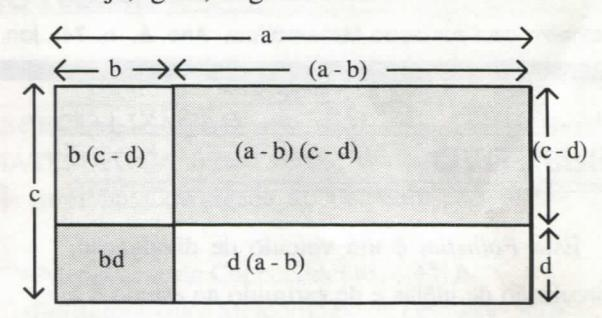

# **FOLHETIM DE EDUCAÇÃO MATEMÁTICA**

**UNIVERSIDADE ESTADUAL DE FEIRA DE SANTANA**

**Folhetim de Educação Matemática, Ano 6, n. 74, jan.1999**

**ISS N 1415-8779**

## **OBJETIVO**

Este _Folhetim é_ um veículo de divulgação, circulação de ideias e de estímulo ao estudo e à curiosidade intelectual. Dirige-se a todos os interessados pelos aspectos pedagógicos, filosóficos e históricos da Matemática. Pretende construir uma ponte para unir os que estão próximos e os que estão distantes.

### **EDITORIAL**

o NEMOC inicia o ano de 1999 com um resultado positivo em seus objetivos propostos para o ano de 98; com algumas dificuldades e às vezes privando o leitor de receber seu Folhetim de Educação Matemática em tempo hábil, conseguimos manter a periodicidade mensal. Estamos nos esforçando para sermos mais assíduos neste ano de 99.

Além do Folhetim, o Núcleo de Educação Matemática Omar Catunda, também esteve à frente do Curso de Especialização em Educação Matemática, cuja primeira turma conclui os créditos no próximo mês de março.

Levamos também ao conhecimento do leitor que, recentemente, tivemos a aprovação de um curso de aperfeiçoamento "A Matemática do Século XXI", dentro do programa Pró-Ciências - Bahiaque tem financiamento da CAPES/C ADCT.

# **COMITÉ EDITORIAL**

Carloman Carlos Borges (Doutor) Inácio de Sousa Fadigas (Mestre)

## **PERGUNTE QUE O NEMOC RESPONDE**

**1^ Pergunta.** Muitos leitores perguntam o _"porquê"_ de certas _"convenções"_ em matemática. Por exemplo: eles querem saber, por que O! = 1 (fatorial de zero igual a 1). Pela lógica, segundo eles, deveria ser O! = 0. Outros perguntam a razão da famosa _"regra dos sinais_ " e assim por diante.

R. O ponto de partida para se atingir o entendimento de tais questões está na compreensão de como o saber matemático é organizado; esta organização, denominada pelos matemáticos de axiomática compreende um conjunto de conceitos tais como: termos primitivos, definições, axiomas e teoremas. Com os conhecimentos fornecidos pela lógica, os especialistas os operacionalizam. Exemplificando: quando fazemos uma demonstração, além da lógica temos de levar em conta os termos primitivos, as definições e os axiomas da teoria em questão. Quando provamos que a soma dos ângulos internos de um triângulo mede 180 graus, estamos levando em questão o seguinte postulado também conhecido como 5° Postulado de Euclides: dada a reta r e um ponto P exterior a r, por P só podemos traçar uma paralela à reta r. Esta é uma das características da Geometria Euclidiana. Como esse postulado admite duas negações lógicas (por P passam infinitas retas que não cortam a reta r ou por P não passa nenhuma paralela à r) podemos construir duas novas geometrias nas quais a soma dos ângulos internos de um triângulo mede menos de 180° ou mede mais de 180°, tudo dependendo da postulação inicial. Qualquer "boa teoria" científica precisa ser coerente, isto é, não apresentar contradições internas. No conjunto dos naturais o fatorial de um número n é definido da forma:

n! = 1.2.3. •••.n, _n ^ O, o_ que equivale a afirmar que n! = (n-l)!n. Assim: 5! = 1.2.3.4.5 = 4!.5 = 120. Se defmíssemos O! = O, a fórmula acima (a definição de fatorial de um número n) para n = 1, daria:

1 ! = (l-l)!. l =0!.l =0.1 =Oechegaríamosaum resultado contraditório: 1 =0. Tal contradição interna é evitada fazendo-se O! = 1. O leitor poderá provocar outras contradições (quando se faz O! = 0) ao trabalhar com os números binomiais. Por exemplo:

_(2,_ ^ para n = p (e O! = 0) daria uma expressão sem significado. Quanto à "misteriosa regra dos sinais", o princípio em questão é o mesmo que foi empregado na definição de fatorial de 0. Quando os matemáticos organizaram os números reais em um sistema lógico, estabeleceram diversas regras. Uma das mais importantes (a nível do ensino médio) é a chamada distributividade: quaisquer que sejam os números reais a,b,c tem-se: a (b+c) = ab + ac. Se algum matemático, após uma noite de muita farra, resolvesse convencionar que (-1) (1) = 1, a propriedade distributiva, para a=l, b = le c = -l , nos forneceria: 1(1-1) = 1.1 + 1(-1).0 primeiro membro da "igualdade" acima reduz-se a O enquanto o segundo membro reduz-se a 2 e teríamos novamente outra contradição interna na teoria dos números reais: 0 = 2. Ainda a respeito desse assunto, há uma interpretação geométrica interessante e atribuída ao matemático Diofano de Alexandria. Seja a expressão: (a-b).(c-d) a qual, para ser resolvida exige o conhecimento da "regra dos sinais". Seja, agora, a figura abaixo:

Uma simples inspeção visual da figura nos leva à expressão:

(I) (a-b) (c-d) + b(c-d) -i-bd + d(a-b) = ac (observar que a área da figura acima é igual à área dos quatro retângulos). Com base apenas na figura, podemos escrever:

(II)
$$b(c-d) = bc-bd$$

$d(a-b) = ad-bd$  
(II) em (I), vem:

$$(a-b) (c-d) + bc - bd + bd + ad - bd = ac$$

$$(a-b)(c-d) + bc + ad - bd = ac$$

Subtraindo-se bc e ad de cada membro e adicionando-se bd, a igualdade logo acima se transforma em: (a-b) (c-d) = ac - ad - bc 4- bd.

Ao subtrairmos bc e ad de cada membro, aplicamos um dos Axiomas de Euclides. "Quantidades iguais permanecem quando adicionados a quantidades iguais". Isso vale, também para a subtração.

Porque, para a diferente de zero, a'' = 1? Essa é outra pergunta muito comum entre nossos alunos. Alguns livros chegam a apresentar a seguinte

#### **NEMOC - NÚCLEO DE EDUCAÇÃO MATEMÁTICA OMAR CATUNDA**

FolhetimdeEducaçãoMatemádca,Ano6. ,n. 74, jan. 1999 - **Editores:** Carloman e Inácio - **Secretária:** Josenildes Oliveira Venas - **Editoração:** Evandro Vaz e Nivaldo de Assis - **Impressão:** Imprensa Gráfica Universitária - **Periodicidade:** mensal - **Tiragem:** 1.200 exemplares - _Distribuição gratuita -_ **Endereço:** Av. Universitária, s/n km 03 - BR 116 - Campus Universitário - **Telefone:** (075)224-8115 - **Fax:** (075)224-8085 - CEP 44031-460 - Feira de Santana - Ba - BRASIL - **E-mail:** nemoc@uefs.br

"demonstração" de que *a° -*1 (diferente de zero):

$$a^0 = a^{m-m} = a^m : a^m = 1$$

Ora, isso não é uma demonstração. No máximo, uma justificativa para essa convenção. Por que não é uma demonstração? Porque qualquer demonstração é fundamentada em definições, proposições conhecidas, enfim: tudo que for empregado nela deve ser justificado. Exemplificando: é certo afirmamos que:

**5\*:5^** = 5^ pois sabemos, através de definições apropriadas o que representam 5"\*, 5^ e o que seja a divisão. Evidentemente, tais convenções não são feitas aleatoriamente. No caso presente, e em todos os outros casos, o convencionado não pode entrar em contradição com as chamadas leis formais da teoria em questão. Mas, que é uma M formal? Observemos a lei distributiva mencionada acima: tanto em seu primeiro como no segundo membro os dados são os mesmos; ela mostra apenas como os dados podem ser combinados de formas diferentes sem que o resultado sofra qualquer alteração. Outro exemplo: que nos diz a conhecida lei associativa dos números reais? Ela apenas mostra que há vários "caminhos" para se atingir um mesmo resultado. Tanto em seu primeiro como em seu segundo membros, os dados são os mesmos. Já a conhecida lei da unicidade na multiplicação:

a = a', b = b', a. b = a'. b' não é uma lei formal, por motivos óbvios. Uma das leis formais básicas da potenciação é apresentada sob a forma:

a'" .a " = a™^" sendo a um número real diferente de zero e m e n números naturais também diferentes de zero. Pois bem: vejamos se a convenção se encaixa nessa lei formal:

$$a^{0}.a^{m} = a^{0+m} = a^{m}$$

Resumindo, chegamos ao resultado:

$$a^0.a^m = a^m$$

A conclusão óbvia é que a ° = 1 não produz contradição com essa lei formal. E também com as demais leis formais, a convenção não entra em contradição. O leitor poderá exercitar-se nessa direção. Qualquer teoria matemática possui as suas leis formais: novas definições nessa teoria devem ser dadas de modo tal que as leis formais das operações lhes sejam ainda aplicáveis. Alguns autores chamam esse princípio pelo nome de princípio da permanência das leis formais ou princípio de Hankel. Agora, surge a inevitável pergunta: e 0° ? No livro "Meu Professor de Matemática e outras histórias" escrito pelo Prof. Elon Lages Lima (livro cuja leitura recomendo vivamente a todos os professores, principalmente do _2°_ grau) há uma discussão bem. interessante a tal respeito. Apesar da insistência de alguns (poucos) autores afirmarem que 0° = 1, o mais usual é considerar 0° como uma expressão indeterminada. Como a Matemática - em contraposição à Língua Portuguesa - detesta as exceções - em alguns contextos 0° poderáserconsideradoiguala 1.

Na fórmula do binómio de Newton:

$$(a+b)^n = \sum_{k=0}^n \binom{n}{k} a^{n-k} b^k$$

quando a = b = O pode-se considerar o símbolo inderterminado 0° como igual a 1. (Veja: k = n ou k = 0). Outra pergunta corriqueira: Por que a.O = O? Alguns autores chegam a apresentar a seguinte "demonstração":

$$a.0 + a.0 = a.(0 + 0) = a.0$$

Somando - (a.O) a ambos os membros, vem a. O = 0. Pelos mesmos motivos expostos acima, isso não é uma demonstração: a.O é convencionado ser igual a O pelo Princípio de Permanência das Leis

Formais. A propósito, já presenciei diálogos desse

Aluno: Professor, porque a°=l ?

Professor: Isso é por definição.

Aluno: Mas, não há uma outra explicação?

Professor: Definição é definição: não se discute.

Aluno: Mesmo quando se trata de matemática?

(Notar que se trata de um aluno curioso) Professor: Meu filho: vá estudar.

Evidentemente que o conselho dado pelo professor pode ser estendido igualmente ao próprio professor. Algumas palavras finais: o Princípio de Permanência das Leis Formais, de grande relevância no desenvolvimento do saber matemático - pelo menos em suas etapas iniciais - não é, obviamente, um Princípio sagrado: há teorias matemáticas nas quais ele foi derrogado. Assim, na Álgebra das Matrizes, não vale nem a lei da comutatividade, que é lei formal para os números reais. Finalizando: as chamadas convenções matemáticas, como as discutidas acima, são elaboradas pelos matemáticos de modo que não gerem contradições na teoria e, consequentemente, estendam as leis formais, evitando exceções desnecessárias. •

_Pergunte que o NEMOC Responde_ é uma coluna de autoria do prof Dr. Carloman Carlos Borges e objetiva atingir ao público interessado em Matemática nos seus múltiplos aspectos.

Caso o leitor queira fazer alguma pergunta escreva-nos.

# **PRÓXIMO NÚMERO**

_Ainda as "convenções matemáticas" e outras questões. ;_

_Aguardem!_

## **NOTÍCIAS**

Algumas alterações no CURSO DE ESPECIALIZAÇÃO EM EDUCAÇÃO MATEMÁTICA foram feitas, em relação ao elenco das disciplinas divulgado no Folhetim de número 72:

- •Psicogênese do Conhecimento 45 h
- •Epistemologia e Metodologia da Pesquisa 45 h
- •Tópicos de Matemática de 1° e 2° graus 45 h
- •Álgebra Linear aplicada ao 2° grau 45 h
- •Geometria Euclidiana 60 h
- •Ideias Fundamentais da Matemática 45 h
- •Didátíca da Matemática 60 h
- •Teoria dos Números 60 h
- •Seminários sobre Tóp. Gerais da Matemática 45 h

O Curso será desenvolvido na modalidade Regular com Tempo Integral, totalizando 450 horas (quatrocentos e cinquenta horas).

Período de inscrição: **01 a 24 de fevereiro de 1999** Período da seleção: **01 e 02 de março de 1999** Divulgação dos resultados: **05 de março de 1999** Matrícula: **10 e 11 de março de 1999** Início do curso: **15 de março de 1999**

#### **Informações adicionais:**

PPPG: (075) 224-8028; e-mail: pppg@uefs.br DEXA: (075)224- 8086; e-mail: exa@uefs.br NEMOC:(075)224-8115;e-mail: nemoc@uefs.br

# **NÚMEROS ATRASADOS**

Envie para cada folhetim um selo de postagem nacional de 1° porte. Dentro de no máximo quatro semanas, contadas a partir da data de recebimento do seu pedido, você estará recebendo os folhetins solicitados.

OBS.: É permitida a reprodução total ou parcial desse folhetim, desde que citada a fonte.
