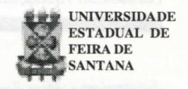

# **FOLHETIM DE EDUCAÇÃO MATEMÁTICA**

**Folhetim de Educação Matemática, Ano 6, n. 75, fev.1999**

**ISSN 1415-8779**

# **OBJETIVO**

Este _Folhetim_ é um veículo de divulgação, circulação de ideias e de estímulo ao estudo e à curiosidade imelectual. Dirige-se a todos os interessados pelos aspectos pedagógicos, filosóficos e históricos da Matemática. Pretende construir uma ponte para unir os que estão próximos e os que estão distantes.

# **EDITORIAL**

Nos últimos Folhetins, questões interessantes estão sendo propostas para a coluna "Pergunte que o NEMOC Responde". Neste não é diferente. Ainda continuando com perguntas ligadas às convenções matemáticas, os fundamentos da matemática são apresentados e aprofundados.

Uma importante abordagem envolvendo limites e decomposição de números reais é feita. Também alguns aspectos relevantes da Álgebra das Matrizes são reforçados.

Convidamos o leitor a se informar sobre as outras atividades do NEMOC na coluna "Notícias".

# **COMITÉ EDITORIAL**

Carloman Carlos Borges (Doutor) Inácio de Sousa Fadigas (Mestre)

#### **PERGUNTE QUE O NEMOC RESPONDE**

**1' Pergunta.** _As convenções matemáticas (continuação)._

R. Sempre quando a questão é levantada, volta e meia, surge a pergunta: e O"? A razão da persistência se acha em alguns livros (poucos) que postulam O" = 1. Claramente, é possível o desenvolvimento de uma Teoria Matemática levando em conta essa orientação. Porquê? Pelo simples motivo de que qualquer teoria matemática é fundamentada em uma axiomática, e esta é uma criação da mente humana possuindo, como toda criação, elementos arbitrários. Quanto a nossa questão particular a maioria dos especialistas aceitam Ccomo uma indeterminação. Não posso deixar nesta altura de trazer à memória (esta maravilhosafaculdade tão vilipendiada por alguns "modernos educadores"...) a seguinte história: há alguns anos, um(a) professor (a) em uma de nossas Universidades Federais, recentemente vindo de um doutorado, ao ministrar um curso de Cálculo I (basicamente: limites e derivadas) postulou que O" = 1. Como havia outras turmas dessa mesma disciplina com outros professores não adeptos da postulação mencionada - houve, então, um grande rebuliço entre os alunos quando o estudo de "limites" foi desenvolvido... Até hoje não sei como tudo acabou... Ainda sobre essa indeterminação, aconselhamos a leitura do livro _Meu Professor de Matemática e outras histórias,_ do sempre querido Prof. Elon Lages Lima.

_T_ **Pergunta:** Acácia Lima Borges, da rua Cláudio Manoel de Belo Horizonte escreve: " _Tenho duas questões que me provocaram dúvidas: a) em livro de exercícios_

deparei-me com o seguinte:

Seja a matriz $A = \begin{pmatrix} 1 & 1 \\ 0 & 1 \end{pmatrix}$ . Calcular $A^n$ (n inteiro superior ou igual a 2). Os autores apresentam a seguinte resolução:

Considerem a matriz
$$B = \begin{pmatrix} 0 & 1 \\ 0 & 0 \end{pmatrix}$$
. Têm-se: $A = I + B$ , onde I designa a matriz unidade. Daí:
$$A^n = (I + B)^n = I + \begin{pmatrix} n \\ 1 \end{pmatrix} B + \begin{pmatrix} n \\ 2 \end{pmatrix} B^2 + ... + \begin{pmatrix} n \\ n \end{pmatrix} B^n;$$
ora: $B^2 = \begin{pmatrix} 0 & 1 \\ 0 & 0 \end{pmatrix} \begin{pmatrix} 0 & 1 \\ 0 & 0 \end{pmatrix} = \begin{pmatrix} 0 & 0 \\ 0 & 0 \end{pmatrix}$ , donde
$$B^n = \begin{pmatrix} 0 & 0 \\ 0 & 0 \end{pmatrix} \forall n \geq 2 \text{ e, consequentemente:}$$

$$A^n = I + \begin{pmatrix} n \\ 1 \end{pmatrix} B = \begin{pmatrix} 1 & 0 \\ 0 & 1 \end{pmatrix} + n \begin{pmatrix} 0 & 1 \\ 0 & 0 \end{pmatrix} = \begin{pmatrix} 1 & n \\ 0 & 1 \end{pmatrix}.$$

Minha dúvida: pode-se aplicar o Binômio de Newton sobre estruturas matemáticas (no caso as Matrizes) não comutativas? b) Como calcular os limites: i) $\frac{X}{a} \left( E \begin{pmatrix} b \\ X \end{pmatrix} \right)$ ; ii) x+x+...x, com o número de parcelas igual a $\left[ \frac{1}{x} \right]$ ? Em ambos os limites, a variável x tende a zero. Em (i), $(a,b) \in \Re^* x \Re$ .

R. Em geral, a fórmula do Binômio de Newton não deve ser aplicada dentro de um anel não comutativo, como é o caso de matrizes. No caso apresentado por você, essa aplicação é válida, visto que a matriz I, elemento neutro da multiplicação dentro do anel M2 das matrizes quadradas de ordem 2, comuta com toda matriz de M2. Uma alternativa à resolução dessa questão, pode ser encontrada no método da Indução Matemática. Assim:

$$A^{2} = \begin{pmatrix} 1 & 1 \\ 0 & 1 \end{pmatrix} \begin{pmatrix} 1 & 1 \\ 0 & 1 \end{pmatrix} = \begin{pmatrix} 1 & 2 \\ 0 & 1 \end{pmatrix}, \text{ mostremos que,}$$

$$\forall n \ge 2, A^{n} = \begin{pmatrix} 1 & n \\ 0 & 1 \end{pmatrix}.$$

Sendo a fórmula verdadeira para n = 2 e supondo sua veracidade para um $\underline{n}$ qualquer, vem:

$$A^{n+1} = A^n \times A = \begin{pmatrix} 1 & n \\ 0 & 1 \end{pmatrix} \begin{pmatrix} 1 & 1 \\ 0 & 1 \end{pmatrix} = \begin{pmatrix} 1 & n+1 \\ 0 & 1 \end{pmatrix}. Logo,$$

$A^{n} = \begin{pmatrix} 1 & n \\ 0 & 1 \end{pmatrix} \text{\'e verdadeira para qualquer inteiro}$ n natural (n \ge 2).

A Álgebra das Matrizes é um dos primeiros exemplos da caduquice do histórico <u>princípio</u> <u>da permanência das leis formais</u> (PPLF), mencionado no artigo anterior. Também conhecido como princípio da permanência das formas equivalentes, o PPLF foi bastante relevante no desenvolvimento da aritmética. Quando fazemos a extensão das leis da potenciação, no caso de expoentes inteiros positivos para outros mais gerais, a sua importância fica bem clara. Hoje, em dia, com os modernos e assombrosos desenvolvimentos da matemática, o PPLF perdeu a sua importância.

Quanto ao item (b), aqui vai a resposta: Sabe-se que cada número real x, pode ser composto da seguinte maneira:

## NEMOC - NÚCLEO DE EDUCAÇÃO MATEMÁTICA OMAR CATUNDA

Folhetim de Educação Matemática, Ano 6, n. 75, fev. 1999 - Editores: Carloman e Inácio - Secretária: Josenildes Oliveira Venas - Editoração: Evandro Vaz e Nivaldo de Assis - Impressão: Imprensa Gráfica Universitária - Periodicidade: mensal - Tiragem: 1.200 exemplares - Distribuição gratuita - Endereço: Av. Universitária, s/n - km 03 - BR 116 - Campus Universitário - Telefone: (075)224-8115 - Fax: (075)224-8085 - CEP 44031-460 - Feira de Santana - Ba - BRASIL - E-mail: nemoc@uefs.br

$x = n + y; \ 0 \le y < 1; \ \underline{n}$ , pertencente a Z. Chama-se <u>parte inteira</u> de x, anotando-se E(x) ou [x], ao inteiro positivo ou negativo $\underline{n}$ . A parte y = x - [x] é a <u>mantissa</u> (significa: aquilo que sobrou) ou <u>parte fracionária de x</u>, e que se anota $\{x\}$ . Exemplificando:

[8]=8; [3,7]=3;
$$[-4,75]=-5$$

{8}=0; {3,7}=0,7; $\{-4,75\}=0,25$  
Retornemos aos limites das expressões:  
 $A = x + x + x + ... + x$ .

$$B = \frac{x}{a} \left( E\left(\frac{b}{x}\right) \right), \text{ com a variável x tendendo a}$$

zero. Conforme as definições dadas acima, podemos escrever:

$$A = \left[\frac{1}{x}\right]x = \left(\frac{1}{x} - mant\frac{1}{x}\right)x = 1 - x \cdot mant\frac{1}{x}$$

$$B = \frac{x}{a}\left(\frac{b}{x} - mant\frac{b}{x}\right) = \frac{1}{a}\left(b - x \cdot mant\frac{b}{x}\right) = \left(\frac{b}{a} - \frac{x}{a} \cdot mant\frac{1}{x}\right)$$

Assim, os limites de AeB são, respectivamente, iguais a 1 e a $\frac{b}{a}$ . (Notar que os limites: x.mant $\frac{1}{x}$ , bem como, x.mant. $\frac{b}{x}$ , são iguais a zero $(x \rightarrow 0)$ por um conhecido Teorema de Análise Matemática).

A estrutura conhecida como Álgebra das Matrizes possui notáveis diferenças quando comparada com a Álgebra comum estudada no ensino anterior àquele da Universidade. A <u>primeira diferença</u>: na multiplicação entre números reais, a ordem dos fatores simplesmente não interessa, isto é, tanto faz ab como ba; quando se trata de matrizes A e B, essa ordem é importante, pois, AB geralmente é diferente de BA. A <u>segunda diferença</u> entre a álgebra ordinária e a álgebra das matrizes: o produto de duas matrizes pode apresentar um resultado nulo sem que nenhuma das matrizes seja nula. Assim, dentro dos números reais, de ab = ac e a $\neq$ 0, vem b = c. Esta propriedade é denominada a <u>lei</u> <u>do</u>

<u>cancelamento para a multiplicação</u>. Nas matrizes, podemos ter AB = AC, com $A \neq 0$ e, no entanto, $B \neq C$ . (Verifique!). A <u>terceira diferença</u>: dada uma matriz, por exemplo, de ordem 2, ela pode possuir quatro raízes quadradas diferentes. Você pode verificar esse fato considerando as matrizes:

$$\begin{pmatrix} 1 & 0 \\ 0 & 1 \end{pmatrix} \begin{pmatrix} 1 & 0 \\ 0 & 1 \end{pmatrix} = \begin{pmatrix} 1 & 0 \\ 0 & 1 \end{pmatrix}; \begin{pmatrix} 1 & 0 \\ 0 & -1 \end{pmatrix} \begin{pmatrix} 1 & 0 \\ 0 & -1 \end{pmatrix} = \begin{pmatrix} 1 & 0 \\ 0 & 1 \end{pmatrix};$$

$$\begin{pmatrix} -1 & 0 \\ 0 & -1 \end{pmatrix} \begin{pmatrix} -1 & 0 \\ 0 & -1 \end{pmatrix} = \begin{pmatrix} 1 & 0 \\ 0 & 1 \end{pmatrix}; \begin{pmatrix} -1 & 0 \\ 0 & -1 \end{pmatrix} \begin{pmatrix} -1 & 0 \\ 0 & -1 \end{pmatrix} = \begin{pmatrix} 1 & 0 \\ 0 & 1 \end{pmatrix}.$$

Assim a matriz $I = \begin{pmatrix} 1 & 0 \\ 0 & 1 \end{pmatrix}$ possui as quatros

raízes quadradas diferentes:

$$I = \begin{pmatrix} 1 & 0 \\ 0 & 1 \end{pmatrix}; J = \begin{pmatrix} 1 & 0 \\ 0 & -1 \end{pmatrix}; K = \begin{pmatrix} -1 & 0 \\ 0 & 1 \end{pmatrix} e$$

$$L = \begin{pmatrix} -1 & 0 \\ 0 & -1 \end{pmatrix}.$$

Existem mais. Para qualquer $x \neq 0$ , temos:

$$\begin{pmatrix} 0 & x \\ \frac{1}{x} & 0 \end{pmatrix} \begin{pmatrix} 0 & x \\ \frac{1}{x} & 0 \\ \end{pmatrix} = \begin{pmatrix} 1 & 0 \\ 0 & 1 \end{pmatrix}.$$

Para uma infinidade de valores reais diferentes de x, obtem-se um número infinito de raízes quadradas diferentes para a matriz I. Maiores detalhes pode-se consultar: _Mathematics for High School. Introduction to Matrix Algebra (Student's text)_. Publicado pela YALE University Press, New Haven, U.S.A.

Pergunte que o NEMOC Responde é uma coluna de autoria do prof. Dr. Carloman Carlos Borges e objetiva atingir ao público interessado em Matemática nos seus múltiplos aspectos.

Caso o leitor queira fazer alguma pergunta escreva-nos.

### **PRÓXIMO NÚMERO**

_Ainda as "convenções matemáticas" e outras questões._

_Aguardem! • "_

### **NOTÍCIAS**

A CAPES/CADCT - PROJETO PRÓ-CIÊNCIAS aprovou o Curso de Aperfeiçoamento _"A Matemática do Século XXI"._ O projeto elaborado pelo NEMOC será coordenado pelo Prof. Carloman Carlos Borges, e tem início previsto para abril de 1999.

Público alvo preferencial: Professores de Ensino Médio da Rede Pública.

Inscrições:

Período: 25 e 26 de março de 1999

Local: UEFS - NEMOC - MT 61

Horário: 08:00h-1 l:30he 14:00h- 17:30h

Documentos Exigidos:

- 01 foto 3x4
- Cópia da identidade e do CPF
- Ficha de Inscrição preenchida
- -Cópia do contra-cheque ou outro comprovante
- Curriculum Vitae comprovado

Informações Adicionais:

NEMOC-UEFS

Módulo VI-M T 61

Telefone: (075)224-8115

E-Mail: nemoc@uefs.br

Algumas alterações no CURSO DE ESPECIALIZAÇÃO EM EDUCAÇÃO MATEMÁ-TICA foram feitas, em relação ao elenco das disciplinas divulgado nos Folhetins de números 72 e 74:

- •Psicologia Cognitiva 45 h
- •Epistemologia e Metodologia da Pesquisa 45 _h_
- •Tópicos de Matemática de 1° e 2° graus 45 h
- •Álgebra Linear aplicada ao 2° grau 45 h
- •Geometria Euclidiana 60 h
- •Ideias Fundamentais da Matemática 45 h
- •Didática da Matemática 45 h
- •Teoria dos Números 60 h
- •Seminários sobre Tóp. Gerais da Matemática 45 h

O Curso será desenvolvido na modalidade Regular com Tempo Integral, totalizando 435 horas (quatrocentos e trinta e cinco horas).

As aulas terão início em 15 de março de 1999. No módulo I as disciplinas ofertadas serão: Psicologia Cognitiva, Epistemologia e Metodologia da Pesquisa e Álgebra Linear aplicada ao _2°_ grau.

#### **Informações adicionais:**

NEMOC:(075)224-8115**;e**-mail: nemoc@uefs.br

#### **NÚMEROS ATRASADOS**

Envie para cada folhetim um selo de postagem nacional de 1° porte. Dentro de no máximo quatro semanas, contadas a partir da data de recebimento do seu pedido, você estará recebendo os folhetins solicitados.

OBS.: É permitida a reprodução total ou parcial desse folhetim, desde que citada a fonte.
