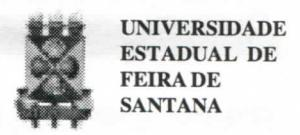
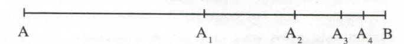

# FOLHETIM DE EDUCAÇÃO MATEMÁTICA

Folhetim de Educação Matemática, Ano 6, n. 76, mar.1999.

ISSN 1415-8779

#### **OBJETIVO**

Este Folhetim é um veículo de divulgação, circulação de idéias e de estímulo ao estudo e à curiosidade intelectual. Dirige-se a todos os interessados pelos aspectos pedagógicos, filosóficos e históricos da Matemática. Pretende construir uma ponte para unir os que estão próximos e os que estão distantes.

#### **EDITORIAL**

Rosana Santana dos Reis, aluna do curso de Letras / UEFS, nos enviou a seguinte poesia:

#### **MATEMÁTICA**

Quero toda a sua álgebra, Toda a sua expressão numérica... Quero toda trigonometria e intercessão, A sua razão...

Quero ser e o seu radical, O exato número, o seu sub e o seu total... Quero o seu inteiro, o máximo dos teus divisores, Mesmo o mínimo...

Quero o grau das tuas circunferências, O superlativo das tuas grandezas, Ser absoluta e relativa...

Quero a probabilidade, o campo amostral, A incógnita, o valor em cada 'X'

O verso, anverso e o inverso das tuas proporções! Todos os parênteses, chaves, colchetes, ainda o mais e menos, sinal...

Quero você, meu número Real,
Quero te amar em todos os planos e ângulos...
Sua área, seu vértice e tangente,
Quero suas regras, quiçá exceções,
Sua soma, nunca adição...
Os seus pertences, a união, interseção,
O menor e o maior desejos...
Quero ser ímpar para contigo formar um par,
O unitário dos teus pensamentos,
Quero ser e o seu amor, sendo
Infinito por ser finito!

# COMITÉ EDITORIAL

Carloman Carlos Borges (Doutor) Inácio de Sousa Fadigas (Mestre)

#### PERGUNTE QUE O NEMOC RESPONDE

**Pergunta.** Muitos leitores escrevem: como é possível o ponto não possuir dimensão. Ainda: gerar um ente, no caso a reta, unidimensional? De onde vem tal dimensão?

R. Vamos tentar esclarecer o problema da adimensionalidade do ponto. Seja o segmento de reta AB, formado, como se sabe, de uma infinidade de pontos:

Dividimos o segmento AB dicotomicamente. Assim, $AA_1$ representa a sua metade, $A_1A_2$ representa a metade de $A_1B$ ; continuando, mentalmente, tal operação,pode-se perguntar: esta operação terminará? A resposta depende do seguinte:

1ª Hipótese : a reta é formada por pontos dimensionais,isto é, a reta é formada por pontos minúsculos que possuem o tamanho diferente de zero;

2ª Hipótese: a reta é formada por uma infinidade de pontos adimensionais. Vamos mostrar que a primeira hipótese nos conduz a uma contradição e , consequentemente é a segunda hipótese que deve ser admitida. Partindo da primeira suposição, a operação dividir sempre ao meio (chamada dicotomia) terminará quando for obtido o segmento AB de tamanho igual a d. (Observe que, considerando a segunda hipótese, essa operação pode repetir-se indefinidamente). Terminada a operação considerada, podemos escrever:

med AB = m.d (m um número natural)

Considerando outro segmento CD, podemos escrever:
med CD = n.d (n sendo um número natural).

Desta forma.

med AB = m/n (basta considerar CD unitário). Chegamos, assim, à conclusão de que toda medida de segmento resulta ser um número racional. Onde, pois, se encontra a contradição mencionada nas linhas acima? Ora, ao considerarmos AB como a diagonal de um quadrado de lado unitário, veremos que:

med AB = $\sqrt{2}$ (um número irracional). Chegamos a esse resultado aplicando o Teorema de Pitágoras. Há uma falta de adequação lógica entre a primeira hipótese e o Teorema de Pitágoras. É precisamente

essa incompatibilidade lógica que leva àrejeição da 1 "hipótese e a aceitação da _2"_ hipótese. Para o leitor que ainda não notou a contradição referida , basta prestar atenção ao seguinte: a aceitação da primeira hipótese pode ser traduzida assim: dois segmentos quaisquer AB e CD são sempre comensuráveis, isto é, possuem uma medida comum; por outro lado, a aplicação do célebre Teorema de Pitágoras, nos mostra a existência de segmentos incomensuráveis, isto é , segmentos que não admitem um submúMplo comum. Aesta altura convémlembrar que a Escola Pitagórica afirmava ser a reta formada por corpúsculos (mônadas) de extensão não nula. É o próprio Teorema de Pitágoras (TP) que estiçalha a primeira hipótese. Quando os pitagóricos afirmavam que tudo é número. referiamse ao número inteiro natural (segundo alguns historiadores) ou ao número racional (segundo outros historiadores)...A existência de números irracionais, apontada pelo TP(que lástima!) é considerada como a primeira crise na História da Matemática. Ela foi considerada como uma verdadeira calamidade pelos seus próprios descobridores. Talvez a consequência mais notável dessa descoberta e a sua não aceitação pelos pitagóricos tenha sido a subordinação da matemática grega antiga à geometria. Um problema simples como _y}=2_ não possuia solução dentro dos racionais, porém, possuia a solução geométrica: x é diagonal de um quadrado de lado unitário. Segundo o historiador dinamarquês Asger Aaboe, em seu interessante livro Episódios da História Antiga da Matemática, Coleção Fundamentos da Matemática Elementar, SBM "toda a álgebra foi reformulada em termos geométricos; por exemplo, a frase 'o retângulo de lados a e b 'era usada em vez de 'a vezes b', e aderimos ainda hoje a esta tradição quando chamamos x- e x' de quadrado e de cubo de x, respectivamente." Retornemos, agora , à segunda pergunta sobre a unidimensionalidade dareta, emboraela sejaformadade pontos, entes adimensionais. Esta questão liga-se naturalmente à Filosofia. Trata-se do estabelecimento de relações entre uma determinada totaUdade e as suas partes contituintes. Em nosso caso, a totalidade é a reta e a parte é o ponto. Na Grécia Antiga duas correntes filosóficas persistiam, uma, em afirmar que a realidade está em perene movimento, nada se encontra parado. pois tudo é mudança. Quem não se lembra da célebre frase de Heráclito (576-480 a.C.)" Tu não podes banhar-te duas vezes no mesmo rio; visto que novas ÁGUAS CORREM SOBRE TI?"; aoutra corrente postulava: "arealidadeéapermanência, aquilo que não muda, porque o movimento é contraditório e jamais será alcançado pela compreensão". Filiado à última corrente, Zenão de Eléa construiu alguns paradoxos (paradoxo é uma opinião contaria ao senso comum) para mostrar que o movimento é incompreensível. Destaquemos dois deles:

Paradoxo I ( PI ): Tudo que se move deve atingir metade do percurso, antes de chegar ao fim; e, ainda antes do meio, deve atingir um quarto e, antes de um quarto, um oitavo, e, assim, sucessivamente, sem nunca acabar. Logo, o movimento não chega a realizar-se, contrariando o senso comum.

Paradoxo II (PII): Aquiles corre para apanhar uma tartaruga que se afasta dele; mas, quando chega no lugar onde estava a tartaruga, esta não mais se encontra lá. A distância que agora os separa é menor que a anterior, mas, enquanto Aquiles a percorre, também a tartaruga se desloca; e, assim, sucessivamente, ao infinito. Logo, Aquiles, embora correndo bem mais depressa, nunca alcança a tartaruga, contrariando, mais uma vez, o senso comum. Estes paradoxos, bem como outros de Zenão que não citaremos aqui, somente foram compreendidos a partir do século XIX, quando os matemáticos criaram o instrumental adequado: os conceitos de função. variável, continuidade e de limite. Não causa, pois, admiração que eles tenham desafiado a mente dos mais ilustres sábios durante mais de dois mil anos. Este é mais um exemplo da importânciacultural damatemática: problemas levantados por filósofos e resolvidos com o instrumental matemático. Vejamos, agora, mais de perto, PI e PII. PI pode ser reformulado assim:

ParaumadistânciaAB serpercorrida,deve-se,primeiro, percorrer a metade; em seguida a metade da outra metade, em seguida, a metade dessa última e, assim sucessivamente. Conclusão: sobrarão sempre metades a serem percorridas e,portanto,nuncaadistânciatotal AB será percorrida. Solução: as distâncias percorridas formam a seguinte progressão geométrica de infinitos termos e de razão igual a 1/2:

# **NEMOC - NÚCLEO DE EDUCAÇÃO MATEMÁTICA OMAR CATUNDA**

Folhetim de Educação Matemática, Ano 6 , n. 76, mar. 1999 - **Editores:** Carloman e Inácio - **Secretária:** Josenildes Oliveira Venas - **Editoração:** Evandro Vaz e Nivaldo de Assis - **Impressão:** Imprensa Gráfica Universitária - **Periodicidade:** mensal - **Tiragem:** 1.3(X) exemplares - _Distribuição gratuita -_ **Endereço:** Av. Universitária, s/n - km 03 - BR 116 - Campus Universitário - **Telefone:** (075)224-8115 - **Fax:** (075)224-8085 - CEP 44031-460 - Feira de Santana - Ba - BRASIL - **E-mail:** nemoc@uefs.br

$$\frac{1}{2} + \frac{1}{4} + \frac{1}{8} + \frac{1}{16} + \frac{1}{32} + \frac{1}{64} + \dots$$

**2 + 4 + 8 + 16 + 32 + 64** Para os gregos e Zenão, inclusive, qualquer totalidade com um número infinito de termos é, também infiiúta. Assim raciocinavam os filósofos: uma soma com infinitos termos tem por resultado um número infinito. Os matemáticos, com o conceito de limite, mostraram que o limite da progressão geométrica acima é igual a um e portanto (que alívio!) pode-se percorrer a distância AB. Quanto ao PII,suponhamos que o veloz corredor grego Aquiles anda dez vezes mais depressa que a tartaruga, começando por estar à distância de 10 metros desta, isto é, a distância antes de começar a corrida entre Aquiles (atrás) e a tartaruga (na frente) é de 10 metros. Então, quando Aquiles percorre esses 10 metros, a tartaruga percorre 1 metro; depois, quando Aquiles percorre essa distância, a tartarugapercorremais **1** decímetro,e, assim, sucessivamente; logo, Aquiles jamais alcançará a tartaruga. Irritante, não? Você saber, de antemão,que Aquiles não apenas alcançaráatartaruga como a deixará quilómetros para trás e não poder provar uma "banalidade" dessas. Assim se debateram algumas dezenas (ou centenas?) de filósofos em suas nebulosas especulações filosóficas, sem chegarem ao resultado apontado pelo senso comum.

Nesta altura, talvez seja conveniente lembrar o Axioma V dos Elementos de Euclides : O todo é sempre maior que qualquer uma de suas partes. Desta forma, se eu considerar como todo esta máquina na qual escrevo, é claro que ela é maior que cada uma de suas teclas, que é uma de suas partes... E, assim, por diante... Sempre a totalidade prevalecendo sobre qualquer uma de suas partes... É uma assertiva que se adequa perfeitamente no senso comum. Será que o V Axioma de Euclides vale para conjuntos infinitos ? Para conjuntos finitos, sabemos que ele vale. Mais umavez os matemáticos mostraram que, quando se trata de conjuntos infinitos, o senso comum não é o melhor guia. Veja o que dizem os matemáticos: um conjunto é infinito sempre que for equivalente a um subconjunto próprio de si mesmo. Caso contrário, o conjunto será finito. E quando é que um conjunto é equivalente a um outro conjunto? O conjunto A, dizem os matemáticos, é equivalente ao conjunto B, quando a cada elemento de A corresponder um único elemento de B e a cada elemento de B corresponder um único elemento de A. Se forpossível mostrar que entre, exemplificando, o segmento [0,1 ] e o segmento [a,b], ae b reais quaisquer, existe uma tal correspondência, então, entre [0,1] existe a mesma quantidade de pontos que existe entre [a,b]. E isso os matemáticos já fizeram. A função : f(x) = a + (b-a)x traduz muito bem a

correspondência citada. Logo, a quantidade de pontos do segmento [0,1] é igual à quantidade de pontos do segmento [a,b]. Mas, como isso é possível? Esta possibilidade existe porque a reta é constituída de infinitos pontos adimensionais; se o ponto tivesse dimensão, isto não seria possível. Como já admitimos que o ponto não tem dimensão, temos que aceitar essa equivalência. Conclusão: quando se trata de conjuntos infinitos: o todo não é maior que uma de suas partes próprias e, desta forma o Axioma V de Euclides ficarestrito aos conjuntos firútos. Mas, no final das contas, que tem isso a ver com PII? Seja a representação , :

A **10** metros T B I **1 1**

Se B é o ponto de encontro de Aquiles com atartaruga, então aquele deverá correr até a distância AT mais a distância TB (lembre-se que o movimento é uniforme). Ora, Aquiles passará por infinitos pontos de A até B (a cada ponto podemos associar um tempo t.) e a tartaruga, igualmente, passará por infinitos pontos de T até B(a cada ponto ou lugar é também associado um t). Como a cada ponto do segmento AB corresponde um ponto do segmento TB e vice-versa (os matemáticos já provaram isso conforme escrevemos linhas acima...) então, ao se encontrarem no ponto B, ambos gastaram o mesmo tempo. O encontro de Aquiles com a tararuga mostra:

1. que o ponto deve ser adimensional, porque, não o sendo, Aquiles jamais alcançaria a tartaruga;

2. existe a mesma quantidade de pontos no segmento AB e no segmento TB;

3. o todo (o segmento AB) é equivalente à uma de suas partes(o segmento TB);

4. não se deve confundir o tamanho do segmento AB com o tamanho do segmento TB;

A que distância de A dar-se-á o encontro dos dois? Para o caso acima, as distâncias de Aquiles ao seu ponto de partida vão sendo as seguintes:

0;10;11**;11,1**;11**,11;11**,111;11,1111;...

Ao mesmo tempo, as distâncias da tartarugaao ponto de partida de Aquiles vão sendo :

10; 11; 11,1; 11,11; 11,111; 11,1111;...

Ora, ambas as sucessões têm por linúte o mesmo número:

11,1111... = 11 1/9.

Agora, podemos acompanhar alguns historiadores, tentando especular sobre o que Zenão pensava ao formular tais argumentos. Quando afirmava que Aquiles jamais alcançaria a tartaruga, ele argumentava que em cada momento a tartaruga ocupava um lugar e Aquiles outro e durante a corrida os dois não poderiam ocupar o mesmo lugar. Isso é correto. Como a cada lugar ocupado por Aquiles corresponde também um lugar ocupado pelo animal, então o herói grego percorre tantos lugares quantos o ocupados pela tartaruga. Para que o encontro dos dois fosse no ponto B, Aquiles, necessariamente, passariaem mais lugares que a tartaruga, pois o percurso dele seria de A até B, enquanto o do animal, apenas de T até B. Assim, o famoso corredor grego jamais alcançaria atartaruga. Claro que Zenão aceitava o Axioma Vde Euclides, que o todo (no caso o percurso de A até B) possui mais pontos que uma de suas partes (no caso de T até B). Como pode, indagava Zenão, acontecer esse tal encontro se, de um lado:

- 1. Aquiles vai a tantos lugares quanto os lugares percorridos pela tartaruga;
- " 2) e de outro lado, Aquiles percorrer de A até B (o todo), enquanto, a tartaruga percorreria apenas de T até B (a parte); não é verdade que de A até B há mais lugares (pontos) do que de T até B ?

Admitindo-se o axioma euclidiano, o argumento é impecável e, apartirdele, só há uma conclusão: o veloz corredor jamais alcançará a lenta tartaruga. O que é estranho, parafraseando Bertrand Russell (filósofo e lógico-matemático) é que nos últimos dois mil anos, muitos filósofos aceitaram o axioma e negaram a conclusão.

Mas afinal de contas, porque tanta confusão a cerca de uma questão, aparentemente trivial? Quem, nos primeiros anos escolares tomou conhecimento de problemas envolvendo o movimento (movimento de trens, de torneiras que enchem ou esvaziam tanques d'água e acabam enchendo a paciência...) relembra muito bem a dificuldade encontrada para achar as soluções. Afinal de contas: que é o movimento? Que significa deslocar-se no tempo e no espaço? Em primeiro lugar, o movimento de que estamos tratando é tão somente uma correspondência entre posição e tempo. Quando eu me movo, encontro-me num determinado lugar e, simultaneamente, não me encontro nele; é a interação entre o descontínuo e o contínuo que toma possível o movimento. Neste, há uma sucessão infinita de estados de repouso. Absurdo? ora, você já não se acha convencido de que o ponto não tem dimensão? Admitamos, sem mais delonga, a dicotomia do espaço (da reta) pois isto é facilmente concretizado: basta cortar um barbante ao meio. Por que não fazer o mesmo com o tempo? Uma das lições a serem tiradas dos argumentos é a de que a suposição da dicotomia do espaço deve levar, necessariamente, à dicotomia do tempo. Quando vemos uma andorinha em pleno vôo, vemos o movimento como um todo e não como uma sucessão infinita de estados de repouso, como a reunião dialética entre o descontínuo e o contínuo no espaço e no tempo.

Finalmente, chegamos à última pergunta de nossos leitores: como pode a reta possuir uma dimensão se ela é gerada pelo ponto adimensional? Esta questão nos leva às relações entre uma determinada totalidade (no caso a reta) e as suas partes (no caso os pontos). O exemplo em foco mostra apenas o seguinte: o todo (a reta) não é a simples soma de suas partes (os pontos), pois possui propriedades não existentes em nenhuma de suas partes. Outro exemplo: considere os números reais (o todo) constituído das partes que são os números racionais e os números irracionais. Que se verifica? Nem o conjunto dos racionais e nem o conjunto dos irracionais possui a propriedade da continuidade; no entanto, esta é uma das características dos números reais.

Finalmente, quando explodimos de raiva, geralmente retomamos à tranquilidade após a ingestão de um copo d'água bem fresca, sem a preocupação de pensar que a água (o todo) é composta de dois gases explosivos (as partes), o hidrogénio e o oxigénio...»

_Pergunte que o NEMOC Responde é_ uma coluna de autoria do prof. Dr. Carloman Carlos Borges e objetiva atingir ao público interessado em Matemática nos seus múltiplos aspectos.

Caso o leitor queira fazer alguma pergunta escreva-nos.

# **PRÓXIMO NÚMERO**

_Continuação do Paradoxo de Zenão._

_Aguardem!_

# **NÚMEROS ATRASADOS**

Envie para cada folhetim um selo de postagem nacional de 1° porte. Dentro de no máximo quatro semanas, contadas a partir da data de recebimento do seu pedido, você estará recebendo os folhetins soUcitados.

OBS.: É permitida a reprodução total ou parcial desse folhetim, desde que citada a fonte.
