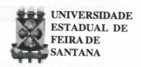
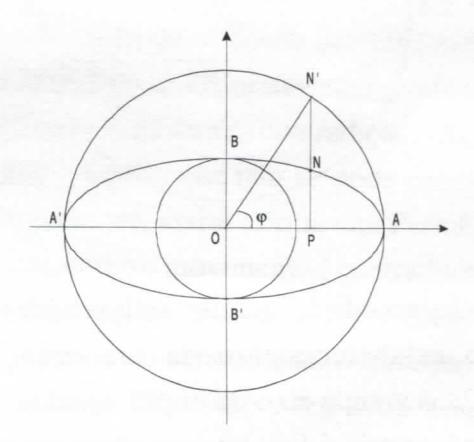
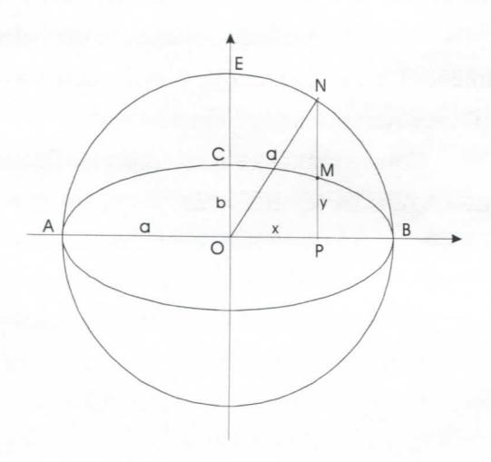

# FOLHETIM DE EDUCAÇÃO MATEMÁTICA

Folhetim de Educação Matemática, Ano 6, n. 77, abr.1999

ISSN 1415-8779

#### **OBJETIVO**

Este Folhetim é um veículo de divulgação, circulação de idéias e de estímulo ao estudo e à curiosidade intelectual. Dirige-se a todos os interessados pelos aspectos pedagógicos, filosóficos e históricos da Matemática. Pretende construir uma ponte para unir os que estão próximos e os que estão distantes.

#### **EDITORIAL**

Se os Paradoxos de Zenão, citados com bastante freqüência, muitas vezes não vêm acompanhados de uma explicação clara e objetiva, como foi feito no último Folhetim (Folhetim nº 76), menos ainda faz-se o seu aspecto filosófico.

Com essa visão, a coluna *Pergunte que o NEMOC Responde* penetra nesse aspecto, apontando para a questão do infinito, cuja compreensão ainda hoje não é atingida, sobretudo no que diz respeito ao infinito físico.

Além disso, o Folhetim apresenta respostas a duas outras perguntas de caráter mais prático. Na resposta à terceira pergunta, o prof. Carloman nos leva a refletir a questão do livro didático, que fortemente tem influenciado o ensino.

Agradecemos aos leitores pelo envio das perguntas.

## COMITÊ EDITORIAL

Carloman Carlos Borges (Doutor) Inácio de Sousa Fadigas (Mestre)

# PERGUNTE QUE O NEMOC RESPONDE

1ª Pergunta. Paradoxos de Zenão (continuação).

R. Envolvendo os Paradoxos de Zenão (PZ) mais mencionados do que compreendidos, existem muitas controvérsias. Portanto, achamos conveniente contextualizá-los da seguinte maneira. Com esses paradoxos, Zenão, claramente não quis negar o movimento físico. Logo, quando o filósofo Diógenes "demonstrou" a existência do movimento, simplesmente andando, e pensando, desta forma, ter refutado Zenão - estava apenas, sendo engraçado. Zenão foi discípulo de Parmênides que, ao contrário de outro filósofo, Heráclito, afirmava: o ser é; o não ser não é - princípio hoje conhecido pelos estudantes de Lógica, como Princípio da Identidade, isto é, A é A. Para Parmênides, o mundo sensível, o mundo que nos é dado pelos nossos sentidos é ininteligível. O mundo inteligível é sujeito à lei lógica da identidade, à lei da não contradição. "Ser e pensar é uma só coisa". Aquilo que não se pode pensar (sem contradição), não pode ser, assim afirmavam Parmênides e seus discípulos. Ora, como o movimento é contraditório pela sua própria natureza, logo, ele não existe, isto é, ele não pode ser pensado sem cairmos em contradição. Depreende-se que não se pode enfrentar os PZ, como o fez Diógenes, recorrendo ao movimento físico. A solução dos PZ, já exposta anteriormente, só foi alcançada em virtude dos trabalhos de Dedekind e Cantor. Após os incríveis resultados desses dois matemáticos, sobre o infinito e a continuidade, essas duas categorias entraram definitivamente no discurso científico. Não custa repetir: os PZ envolvem questões teóricas e questões filosóficas. As questões epistemológicas levantadas pelos PZ são, ainda hoje, pertinentes. Que questões são essas? Uma delas: há limites ao conhecimento humano? Aquilo que afirmamos conhecer é mesmo um "retrato" da realidade? E que é

realidade? Especulações mais variadas existem em torno do assunto; algumas delas chegam mesmo a passar as raias do absurdo, como, exemplificando: existe o conhecimento? Ora, duvidar da existência do conhecimento, ante a assombrosa tecnologia dos dias de hoje é, no mínimo, o máximo do absurdo! Claramente: há limites para o conhecimento derivados da própria constituição de nossa mente e, a famosa "coisa em si" do não menos famoso filósofo alemão Kant, continua sendo inatingível, pois, com essa tese, Kant quis referir-se aos limites do conhecimento. A Lógica pode conduzir-nos anão Lógica. Vejamos este trecho do pensador contemporâneo Edgar Morin, em Ciência com Consciência, Bertrand Brasil: "...quando pensamos no 'Big-Bang' cósmico, não percebemos que é o caminho empírico-racional que conduz à irracionalidade absoluta. Uma vez foi constatada uma dispersão das galáxias, era preciso supor uma concentração inicial e uma vez que foi descoberto nos horizontes do universo o testemunho fóssil de uma explosão, era preciso supor que essa explosão estava na própria origem desse universo. Dito de outro modo, é por motivos lógicos que chegamos a esse absurdo lógico no qual o tempo nasce do não tempo, o espaço, do não espaço, e a energia do nada". Quando o eminente matemático Hilbert (1862-1943), baseado em impecáveis raciocínios lógicos afirmou a não existência do infinito físico, ele estava sendo temerário, uma vez que essa questão, provavelmente, continuará sempre sem comprovação empírica. Tanto a suposição de um início para o Universo, o famoso "Big-Bang" - um sucesso mais da mídia do que da ciência - como a hipótese de um Universo sem começo e sem fim - leva a razão para um verdadeiro labirinto.

Para finalizar, transcrevemos o trecho do filósofo, matemático e lógico inglês contemporâneo, Bertrand Russelem Misticismo e Lógica, Cia. Editora Nacional: "Neste mundo de caprichos, nada é mais caprichoso do que a fama póstuma. Um dos mais notáveis exemplos da falta de discernimento da posteridade é o de Zenão, o eleático. Este homem, que pode ser considerado fundador da filosofia do infinito, aparece em Parmênides, de Platão, no papel privilegiado de mestre de Sócrates. Ele inventou quatro argumentos, todos imensuravelmente sutis e profundos, para provar que o movimento é impossível, que Aquiles jamais pode alcançar a tartaruga, e que uma flecha em vôo na verdade está em repouso. Depois de refutados por Aristóteles, e por todos os filósofos subsequentes, da sua à nossa época, esses argumentos foram restabelecidos, e erguidos em base de um renascimento matemático, por um professor matemático que talvez nunca soubesse haver ligação entre ele e Zenão. Weierstrass, banindo rigorosamente da matemática o uso dos infinitesimais, por fim mostrou que vivemos num mundo imutável e que a flecha em vôo na verdade está em repouso".

O trecho acima merece os seguintes comentários:
Ao falar em renascimento matemático, o filósofo, matemático e lógico Bertrand Russel, refere-se à Teoria dos Conjuntos, cujo objeto é o estudo de conjuntos infinitos e cuja maior singularidade é mostrar a equivalência entre a totalidade infinita e qualquer uma de suas partes. É justamente nessa equivalência - mostrada genialmente por Cantor - onde reside o cerne da

### NEMOC - NÚCLEO DE EDUCAÇÃO MATEMÁTICA OMAR CATUNDA

Folhetim de Educação Matemática, Ano 6, n. 77, abr. 1999 - **Editores:** Carloman e Inácio - **Secretária:** Josenildes Oliveira Venas - **Editoração:** Evandro Vaz e Nivaldo de Assis - **Impressão:** Imprensa Gráfica Universitária - **Periodicidade:** mensal - **Tiragem:** 1.300 exemplares - *Distribuição gratuita* - **Endereço:** Av. Universitária, s/n - km 03 - BR 116 - Campus Universitário - **Telefone:** (075)224-8115 - **Fax:** (075)224-2284 - CEP 44031-460 - Feira de Santana - Ba - BRASIL - **E-mai**l: nemoc@uefs.br

argumentação zenoniana.

Quanto à afirmativa do "banimento rigoroso do infinitesimal da Matemática" supostamente feito por Weierstrass, o grande filósofo não viveu o suficiente para assistir ao seu renascimento graças aos trabalhos do filósofo, físico e matemático Robinson, criador da Análise não Standard.

2ª Pergunta. Um leitor de Alagoinhas, nos envia a seguinte pergunta: Quais as condições que devem ser estabelecidas sobre o número

$$\frac{ax+b}{a'x+b'}=r (1)$$

para que ele seja racional, considerando que a, b, a' e b' são números racionais e x é um número irracional?

R. De (1) vem: 
$$ax+b=r(a'x+b')$$

$$\chi$$
 (a - ra')x = rb'- b (2)

O segundo membro de (2) sendo racional, impõe a racionalidade do primeiro membro. Como x é irracional, e (a-ra') é racional, então, necessariamente

$$a - ra' = 0$$
 (3)

pois, se a - ra'  $\neq 0$  e racional, x(a - ra') seria um número irracional ( um número irracional, no caso x, multiplicado por um número racional diferente de zero, é igual a um número irracional). De (3), vem:

$$\frac{a}{a'} = r \qquad (4)$$

oque implica:

$$rb' - b = 0$$
 ou  $\frac{b}{b'} = r (5);$ 

de (4) e (5), deduzimos:

$$\frac{a}{a'} = \frac{b}{b'}$$
.

De uma maneira recíproca, vem:

$$\frac{a}{a'} = \frac{b}{b'} = r$$
 e  $\frac{ax+b}{a'x+b'} = \frac{r(a'x+b')}{a'x+b'} = r$ 

donde resulta que o número

 $\frac{ax+b}{a'x+b'}$  é um número racional se e somente se, os números a e b forem proporcionais aos números a' e b'. Como exemplo, o leitor poderá verificar que  $\frac{3\sqrt{2}+5}{6\sqrt{2}+10}$  é um número racional. Notar que neste caso: a=3; a'=6; b=5; b'=10 e  $x=\sqrt{2}$ . Mesma questão para  $\frac{ax+by}{a'x+b'y}$ , x, y irracionais, a, b, a' e b' racionais.

3ª Pergunta. Onofre A. L. dos Santos, de Belém do Pará, indaga: como calcular a área de uma elipse por processos elementares?

R. Esse problema foi assunto do Folhetim de número 71. Acrescentamos mais detalhes àquela explicação contida nesse Folhetim.

Consideremos a elipse, conforme figura abaixo sendo AA' = 2a e BB' = 2b.

Considerando-a como projeção de um círculo sobre um plano, ao multiplicarmos suas ordenadas por a/b, obteremos o círculo principal e se multiplicarmos as abcissas por b/a obteremos o círculo de diâmetro BB'. Seja a elipse considerada como a projeção sobre seu plano do círculo que se obtém quando é efetuado um giro do círculo principal, em torno de AA', de ângulo  $\alpha$ , definido por  $\cos \alpha = b/a$ . O círculo de diâmetro BB' pode ser considerado como a projeção da elipse obtida após

girar a elipse dada em torno de BB' do mesmo ângulo  $\alpha$ . Ao fazermos N'OP =  $\phi$  vem  $x = a \cos \phi$ ,  $y = b \sin \phi$  (x e y as coordenadas do ponto N da elipse). Um conhecido teorema assegura que a projeção de uma área plana sobre um plano qualquer é igual ao produto da área projetada pelo cosseno do ângulo que o seu plano forma com o plano de projeção; assim, teremos conforme exposição acima:

Área da Elipse = Área do círculo .  $\cos \alpha = \pi a^2 \cdot \frac{b}{a} = \pi ab$ .

Nesta altura, me vem à memória um pequenino livro intitulado Pontos de Álgebra, o qual continha o programa completo da antiga 5ª série ginasial. A transcrição abaixo é desse livrinho: "Equação da Elipse - Uma elipse provém da redução, sempre na mesma proporção, das ordenadas de um círculo".

Este modo de "definir" a elipse há de nos ajudar para o estabelecimento da sua equação. Seja AB = 2a o grande eixo da elipse, igual ao diâmetro do círculo principal. Seja bo semi-eixo menor da elipse, NP a ordenada do ponto N do círculo, OP = x a abscissa do mesmo ponto e MP = y a ordenada do ponto correspondente na elipse. Temos, segundo a definição:

$$\frac{EO}{CO} = \frac{NP}{MP}$$

Mas, EO = a, CO = b, MP = y, NP =  $\sqrt{a^2 - x^2}$ , donde, substituindo:

$$\frac{a}{b} = \frac{\sqrt{a^2 + x^2}}{y} \quad \text{ou} \quad \begin{cases} ay = b\sqrt{a^2 + b^2} \\ a^2y^2 = a^2b^2 - b^2x^2 \\ a^2y^2 + b^2x^2 = a^2b^2 \end{cases}$$

 $a^2y^2 + b^2x^2 = a^2b^2$  é a equação da elipse. Dividindo por  $a^2b^2$ , tomará nova forma:

$$\frac{y^2}{b^2} + \frac{x^2}{a^2} = 1$$
 ou  $\frac{x^2}{a^2} + \frac{y^2}{b^2} = 1$ 

Deixo a cargo dos leitores a avaliação do transcrito perguntando-lhes: Será que antigamente os livros de matemática eram escritos de maneira mais simples ou de maneira mais obscura do que os atuais? A resposta, necessariamente, não precisa ser enquadrada dentro da lógica bivalente...

Pergunte que o NEMOC Responde é uma coluna de autoria do prof. Dr. Carloman Carlos Borges e objetiva atingir ao público interessado em Matemática nos seus múltiplos aspectos.

Caso o leitor queira fazer alguma pergunta escreva-nos.

## PRÓXIMO NÚMERO

Quadrados Mágicos.

Aguardem!

# **NÚMEROS ATRASADOS**

Envie para cada folhetim um selo de postagem nacional de 1º porte. Dentro de no máximo quatro semanas, contadas a partir da data de recebimento do seu pedido, você estará recebendo os folhetins solicitados.

OBS.: É permitida a reprodução total ou parcial desse folhetim, desde que citada a fonte.