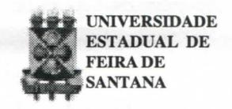
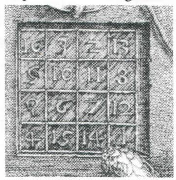
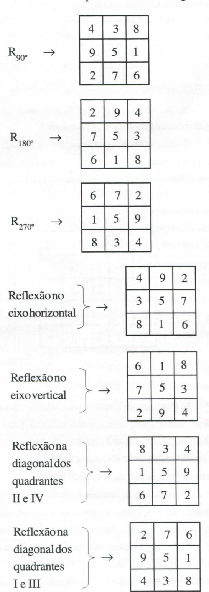

# **FOLHETIM DE EDUCAÇÃO MATEMÁTICA**

**Folhetim de Educação Matemática, Ano 6, n. 78, maio 1999** 

**ISSN 1415-8779** 

#### **OBJETIVO**

Este *Folhetim é* um veículo de divulgação, circulação de **ideias** e de estímulo ao estudo e à curiosidade intelectual. Dirige-se a todos os interessados pelos aspectos pedagógicos, filosóficos e históricos da Matemática. Pretende construir uma ponte para unir os que estão próximos e os que estão distantes.

#### **EDITORIAL**

o tema principal tratado neste *Folhetim*  refere-se aos *quadrados mágicos.* Estes aparecem por volta de 2.200 a.C, quando os chineses os chamavam de *lo-shu.* Daí foram para a índia e difundidos no ocidente através dos árabes. Cornélius Agripa (1486-1535) constuiu quadrados mágicos para 9, 16, até 81 números. Em seu famoso quadro Melancolia, de 1514, Albrecht Diirer apresenta um quadrado mágico ao fundo, cujo detalhe apresentamos na figura abaixo.

## **COMITÉ EDITORIAL**

Carloman Carlos Borges (Doutor) Inácio de Sousa Fadigas (Mestre)

#### **PERGUNTE QUE O NEMOC RESPONDE**

**Pergunta.** Muitos colegas se mostram curiosos a respeito dos famosos *quadrados mágicos.* 

R. Os quadrados mágicos são conhecidos há centenas de anos e estão ligados a supostas "virtudes" de determinados números. Como a história registra, trata-se de uma crença muito cultivada pela Escola Pitagórica, cujos primeiros registros datam do século V I a.C. Como se sabe, a crença maior dos pitagóricos se resumia na divisa: tudo é númeroThá uma medida para tudo. Na Idade Média eles serviam de amuletos e suas supostas virtudes foram exploradas pelos sabidos astrólogos da época. Assim, o quadrado de ordem 1 simbolizava a unidade e a eternidade, enquanto o de ordem 2 representava o pecado original... Comecemos com algumas definições:

a) um quadrado mágico de ordem n é um arranjo, uma disposição, em forma de quadrado de n^ inteiros distintos distribuídos de modo tal que os números de uma linha qualquer, de uma coluna qualquer ou diagonal principal têm a mesma soma, chamada constante mágica do quadrado. Exemplo de um quadrado mágico:

| 8 | 1 | 6 |     |
|---|---|---|-----|
| 3 | 5 | 7 | ( I |
| 4 | 9 | 2 |     |

o quadrado mágico representado acima é denominado normal, porque os n^ números que o formam são os n^ primeiros números inteiros positivos. Sua constante mágica é igual a 15. Logo, as horizontais dão as somas: 8**-1**-1**-1**-6 = 3**-1**-5**-1**-7 = 4 + 9**-1**-2 = 15, as verticais: 8**-1**-3**-1**-4=1**-1**-5**-1**-9 = 6-^7**-1**-2 = 15 e as diagonais: 4 + 5**-1**-6 = 8 + 5**-1**-2 = 15.

Ele é de ordem 3, pois possui apenas 3 linhas (e 3 colunas). Estas (linhas e colunas) são chamadas ortogonais: ^

b) um quadrado semi-mágico é aquele no qual a soma de uma diagonal ou as somas de ambas as diagonais principais diferem das somas ortogonais. Exemplo:

| 3  | 6 | 6 |  |
|----|---|---|--|
| 10 | 5 | 0 |  |
| 2  | 4 | 9 |  |

c) a constante mágica de um quadrado mágico de ordem normal n é iguala — .De fato, temos:

$$\frac{1+2+...+n^2}{n} = \frac{\frac{n(1+n^2)}{2}}{n} = \frac{n(1+n^2)n}{2n} = \frac{n(1+n^2)}{2}$$

d) a cela central de **Uin** quadrado mágico normal de ordem três é sempre ocupada pelo número 5. Seja o quadrado abaixo:

| a | b | c |          |
|---|---|---|----------|
| d | e | f | (IH ) |
| g | h | i |          |

Como ele é normal e de ordem três, então a sua constante mágica é igual a 15. Desse modo temos: (a + e + i) + (g + e + c) + (d + e + f) + (b + e + h) = 60 = = 3e + (a + d + g) + (i + f + c) + b + e + h) = 3e + 45 .•. e = 5.

Seja, ainda, o quadrado (IH). Dizemos que os números representados por: a, c, g e i ocupam os

"ângulos" do quadrado mágico. De uma simples inspeção visual de (III ) e levando em conta (d), podemos escrever:

$$a + i = b + h = c + g = d + f$$

Agora, podemos demonstrar que o número 1 não pode ocupar nenhum desses quatro ângulos. Para fixar ideias, suponhamos a = 1; então, i = 9. Neste caso, nenhum dos números 2, 3 e 4 poderão ocupar a mesma ortogonal que 1. Por quê? Pelo simples fato de que se assim fosse, teríamos as situações seguintes:

$$1 + 2 + 12$$
;  $1 + 3 + 11$ ;  $1 + 4 + 10$ .

Ora, o maior número, no caso do quadrado examinado é 9. Como consequência dessa impossibilidade, restariam apenas duas casas para serem ocupadas por três números (2, 3, 4), o que é impossível. A figura abaixo ilustra a situação (as casas assinaladas com X, não podem, claramente serem preenchidas por qualquer dos números 2,3 ou 4).

| 1 | X | X |
|---|---|---|
| X | 5 |   |
| X |   | X |

Raciocíiúo análogo vale para 1 ocupando os restantes três ângulos.

Uma pergunta: e o número 3 pode ocupar a mesma fila do número 9? A resposta é negativa, pois se assim fora, teríamos: 3 + 9 + 3 = 15, impossível devido àrepetição do 3. Consideremos, agora, o Grupo de Rotações e Simetrias do quadrado. Suponhamos o quadrado ABCD, feito de um plástico transparente colocado num plano onde haja um sistema ortogonal cartesiano, de modo que seus lados sejam paralelos aos conhecidos eixos OX e OY e o seu centro coincida

# **NEMOC - NÚCLEO DE EDUCAÇÃO MATEMÁTICA OMAR CATUNDA**

Folhetim de Educação Matemática, Ano 6, n. 78, maio 1999 **-Editores:** Carloman e Inácio - **Secretária:** Josenildes Oliveira Venas - **Editoração:** Evandro Vaz e Nivaldo de Assis - **Impressão:** Imprensa Gráfica Universitária - **Periodicidade:** mensal - **Tiragem:** 1.200 exemplares - *Distribuição gratuita -* **Endereço:** Av. Universitária, s/n km 03 - BR 116 - Campus Universitário - **Telefone:** (075)224-8115 - **Fax:** (075)224-2284 - CEP 44031-460 - Feira de Santana - Ba - BRASIL - **E-mail:** nemoc@uefs.br

com a origem das coordenadas. O quadrado poderá ser levado a coincidir consigo mesmo através de rotações e simetrias, pois existem oito isometrias que o deixam globalmente invariante. Ei-las:

| Movimento                                         | Símbolo | Posição Inicial | Posição Final |  |
|---------------------------------------------------|---------|--------------------|------------------|--|
| Nenhum movimento                               | R 0°    | A B D C   | A B D C |  |
| Rotação de 90° no sentido horário              | R 90°   | A B D C   | D A C B |  |
| Rotação de 180° no sentido horário             | R 180°  | A B C D   | D c A B |  |
| Rotação de 270° no sentido horário             | R 270°  | A B D C   | B C A D |  |
| Reflexão no eixo horizontal                    |         | A B D C   | D C A B |  |
| Reflexão no eixo vertical                      |         | A B D C   | A B D C |  |
| Reflexão na diagonal dos quadrantes II e IV |         |                    |                  |  |
| Reflexão na diagonal dos quadrantes I e III |         |                    |                  |  |

Essas transformações nos ajudarão a construir oito quadrados mágicos normais. Suponhamos a = 8, c = 6, g = 4e i = 2, isto é, A = 8; B = 6; C = 2 e D = 4.

$$R_{0^{\circ}} \rightarrow \begin{array}{|c|c|c|c|c|c|c|c|c|c|c|c|c|c|c|c|c|c|c$$

As demais correspondências são as seguintes:

Nesta altura, como é fácil observar, vemos que há tão somente um quadrado mágico normal fundamental, de ordem 3, o qual, submetido às transformações isométricas acima mencionadas, produz 7 quadrados equivalentes. O quadrado abaixo:

| 8 | 1 | 6 |
|---|---|---|
| 3 | 5 | 7 |
| 4 | 9 | 2 |

pode, assim, ser considerado como o quadrado mágico normal fundamental de ordem 3.

Construção de um quadrado de ordem ímpar, devida ao francês De la Loubére. Vamos ilustrar o método considerando um quadrado de ordem 5:

|                                 |            |    |    |    |            | 1:-1                          |
|---------------------------------|------------|----|----|----|------------|-------------------------------|
|                                 |            | 18 | 25 | 2  |            | l ← linha auxiliar   X  |
| $1^{\rm a}$ linha $\rightarrow$ | 17         | 24 | 1  | 8  | 15         | 17                            |
|                                 | 23         | 5  | 7  | 14 | 16         | 23                            |
|                                 | 4          | 6  | 13 | 20 | 22         | 4                             |
|                                 | 10         | 12 | 19 | 21 | 3          | 10                            |
| $5^a$ linha $\rightarrow$       | 11         | 18 | 25 | 2  | 9          |                               |
|                                 | $\uparrow$ |    |    |    | $\uparrow$ | ↑coluna auxiliar              |
| 1                               | 1ª coluna  |    |    |    | colu       |                               |

- 1) Partindo de 1, que é colocado na casa mediana da primeira linha, começamos a contar, para cima e em diagonal: 1, 2; como 2 caiu fora do quadrado numa casa enfileirada com a 4ª coluna, ele é deslocado, nesta mesma coluna para a casa 4, da 5ª linha;
- 2) Novamente, contamos, para cima (sempre em diagonal): 2, 3, 4; como 4 caiu fora do quadrado, ele é deslocado, nessa linha, para a primeira casa (3ª linha);
- 3) Analogamente, contamos, para cima: 4,5,6; como a suposta casa do 6, está ocupada pelo 1, ele é colocado logo abaixo do 5; e o processo continua como nas casas já explicadas.
- 4) Quando um número "cai" na casa X, ele é colocado imediatamente abaixo do que lhe precedeu, na diagonal. Neste exemplo (6 fica logo abaixo de 15).

Quadrado mágico de ordem 7:

| i  | 31 | 40 | 49 | 2  | 11 | 20 | X   |
|----|----|----|----|----|----|----|-----|
| 30 | 39 | 48 | 1  | 10 | 19 | 28 | 30  |
| 38 | 47 | 7  | 9  | 18 | 27 | 29 | 38  |
| 46 | 6  | 8  | 17 | 26 | 35 | 37 | 46  |
| 5  | 14 | 16 | 25 | 34 | 36 | 45 | 5 ¦ |
| 13 | 15 | 24 | 33 | 42 | 44 | 4  | 13  |
| 21 | 23 | 32 | 41 | 43 | 3  | 12 | 21  |
| 22 | 31 | 40 | 49 | 2  | 11 | 20 |     |

Ex. Construir o quadrado mágico normal de ordem 9.

Mais informações, pode-se consultar:

Matemáticas Recreativas

Maurício Kraitchik

"El Ateneo" - Buenos Aires (1946).

Pergunte que o NEMOC Responde é uma coluna de autoria do prof. Dr. Carloman Carlos Borges e objetiva atingir ao público interessado em Matemática nos seus múltiplos aspectos.

Caso o leitor queira fazer alguma pergunta escreva-nos.

#### PRÓXIMO NÚMERO

Quadrados Mágicos (continuação). Aguardem!

### **NÚMEROS ATRASADOS**

Envie para cada folhetim um selo de postagem nacional de 1º porte. Dentro de no máximo quatro semanas, contadas a partir da data de recebimento do seu pedido, você estará recebendo os folhetins solicitados.

OBS.: É permitida a reprodução total ou parcial desse folhetim, desde que citada a fonte.

#### **ERRATA**

Na 1ª coluna, página 3 do *Folhetim* nº 77, na linha 19, onde se lê  $\chi$ . leia-se  $\hat{\downarrow}$ .