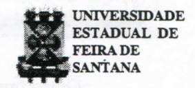
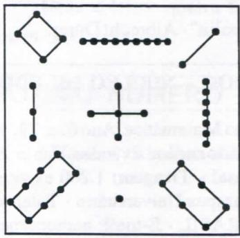
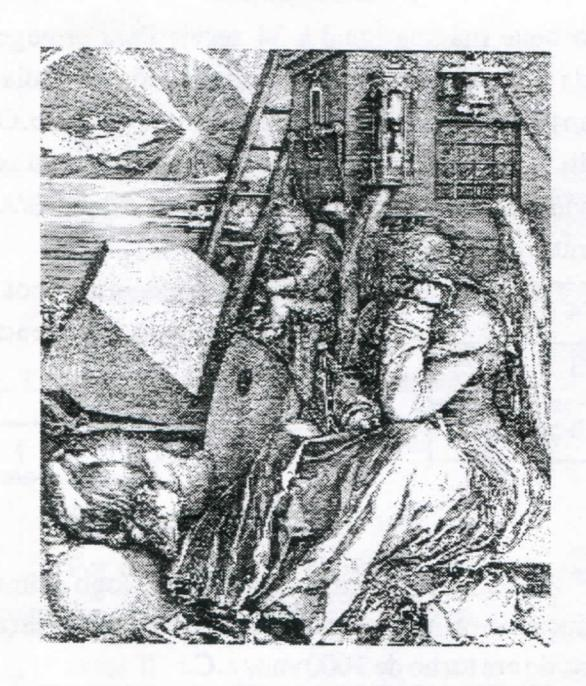
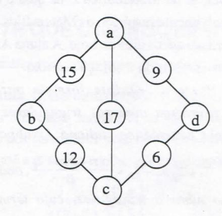

# **FOLHETIM DE EDUCAÇÃO MATEMÁTICA**

**Folhetim de Educação Matemática, Ano 6, n. 79, jun. 1999 ISSN 1415-8779** 

### **OBJETIVO**

Este *Folhetim.é\xm.* veículo de divulgação, circulação de ideias e de estímulo ao estudo e à curiosidade intelectual. Dirige-se a todos os interessados pelos aspectos pedagógicos, filosóficos e históricos da Matemática. Pretende construir uma ponte para unir os que estão próximos e os que estão distantes.

#### **EDITORIAL**

Os números têm trazido fascínio ao espírito humano há milénios, e ainda hoje nos encantamos com as "mágicas" por eles provocadas. Em particular, os quadrados mágicos trazem esse encantamento, e por isso, este número do *Folhetim* continua versando sobre o assunto. O quadrado mágico que apareceu no editorial do Folhetim 78, como destaque do quadro A Melancolia, é agora analisado com mais profundidade.

Como novidade, chamamos a atenção do leitor para uma seção nova, intitulada "Problemas", onde, como primeira contribuição, apresentamos a criativa solução da estudante Ana Cristina Salviano para uma propriedade dos "números triangulares". Esta seção constará no *Folhetim* sempre que tivermos a colaboração do leitor com problemas e soluções interessantes.

# **COMITÉ EDITORIAL**

Carloman Carlos Borges (Doutor) Inácio de Sousa Fadigas (Mestre)

## **PERGUNTE QUE O NEMOC RESPONDE**

Pergunta. *Quadrados mágicos* (Continuação).

R. As virtudes terapêuticas dos números, aqui representados por quadrados mágicos, são cultivadas desde a antiguidade até a presente época. Assim, o quadrado abaixo

| 1 |      | 15 14 4 |         |
|---|------|---------|---------|
|   | 12 6 | 7       | 9       |
| 8 |      |         | 10 11 5 |
|   | 13 3 | 2       | 16      |

de constante mágica igual a 34 servia para proteger o seu dono da peste, doença muito comum na Idade Média e ainda hoje em países infelizes do chamado terceiro mundo. O conhecido divulgador científico Lancelot Hogbeen, em seu livro *Maravilhas da Matemática,* Livraria da Globo S/A, 1950, apresenta o quadrado

| 4 | 9 | 2 |  |
|---|---|---|--|
| 3 | 5 | 7 |  |
| 8 | 1 | 6 |  |

o qual data de mais de mil anos. Ao seu lado, no mesmo livro, aparece achamada cruz cabalística:

1

**o** quadrado mágico representado logo acima é uma reprodução do primeiro quadrado mágico da história (abaixo), construído em tomo de 1000 anos a.C.:

"LOSHUN0 2° LIVRO DAS PERMUTAÇÕES"

Outro famoso quadrado mágico é aquele que aparece em um dos cantos da famosa gravura de Albrecht Dürer, denominada A Melancolia. Albrecht Dürer nasceu em Nuremberg, em 21 de maio de 1471. A sua gravura A Melancolia, nas palavras do Professor Joseph Cibulka, da Universidade Carlos IV. Praga: "representa um tema compreensível: uma mulher com grandes abas, sentada, com o olhar distante, sem fazer nada, enquanto tem ao alcance suas mãos um livro e outros objetos. A Melancolia, segundo Dürer, significa o desprezo pelo trabalho. É assim que deve ser compreendido esse trabalho que é a imagem de seu estado de ânimo; pensou tanto na beleza, em sua essência, em quais eram suas leis, a mediu com tantos cálculos, que terminou esgotado, por reconhecer 'que não sabia o que era a beleza'".

"A Melancolia" - Albrecht Dürer

Abaixo, destacamos o quadrado mágico que aparece no canto direito dessa gravura.

| 16 | 3  | 2  | 13 | ← 4ª linha |
|----|----|----|----|------------|
| 5  | 10 | 11 | 8  | OVER 314   |
| 9  | 6  | 7  | 12 | modern mod |
| 4  | 15 | 14 | 1  | ← 1ª linha |

É fácil verificar, além das propriedades conhecidas dos quadrados mágicos, as seguintes:

- 1) Nas duas casas centrais da primeira linha, aparece o ano no qual foi feita a gravura: 1514.
- 2) A soma dos quadrados dos números da primeira e da terceira linhas é igual à soma dos quadrados dos números da segunda e quarta linhas.
- 3) A soma dos números das diagonais é igual à soma dos números fora das diagonais.
- 4) A soma dos quadrados dos números das diagonais é igual à soma dos quadrados dos números fora das diagonais.
- 5) A soma dos cubos dos números das diagonais é igual à soma dos cubos dos números fora das diagonais.
- 6) A soma dos quadrados dos números das duas linhas superiores é igual à soma dos quadrados dos números das duas linhas inferiores.

A teoria para a construção de quadrados mágicos de ordem três é simples e completa; a referente à construção de quadrados mágicos de ordem ímpar qualquer também já foi esboçada acima. Quanto à elaboração dos de ordem par, a teoria é mais complicada e vamos nos limitar a alguns casos particulares.

# NEMOC - NÚCLEO DE EDUCAÇÃO MATEMÁTICA OMAR CATUNDA

Folhetim de Educação Matemática, Ano 6, n. 79, junho 1999 - Editores: Carloman e Inácio - Secretária: Josenildes Oliveira Venas - Editoração: Evandro Vaz e Nivaldo de Assis - Impressão: Imprensa Gráfica Universitária - Periodicidade: mensal - Tiragem: 1.200 exemplares - Distribuição gratuita - Endereço: Av. Universitária, s/n - km 03 - BR 116 - Campus Universitário - Telefone: (075)224-8115 - Fax: (075)224-8085 - CEP 44031-460 - Feira de Santana - Ba - BRASIL - E-mail: nemoc@uefs.br

Assim, para quadrados mágicos (QM) de ordem 4n, nada há de complicado. Exemplifiquemos para n = 1:

- a) Primeiro são traçados as duas diagonais e a seguir, a partir do canto esquerdo da 4\* Hnha começamos a contar de 1 até 16, tendo o cuidado de escrever apenas alguns desses números nas casas "vazias",istoé, não "cortadas" pelas duas diagonais.
- b) a partir do canto direito da primeira linha, novamente, conta-se de 1 até 16, tendo o cuidado de escrever apenas nas "casas" "cortadas" pelas diagonais:

| 4* linha -> |    |    |    |
|-------------|----|----|----|
|             |    |    |    |
|             |    |    | 12 |
| l"Unha      | 14 | 15 |    |

| 16 | 2      | 3  | 13 |
|----|--------|----|----|
| 5  | 11     | 10 | 8  |
| 9  | 7 6 |    | 12 |
| 4  | 14     | 15 | 1  |

Para n = 2, o procedimento é o mesmo. A contagem, agora, é de 1 até 64. Abaixo, esboçamos a etapa (a), deixando ao leitor a tarefa de completar o trabalho.

| /  | 2  | 3  |    |    | 6  | 7  | /  |
|----|----|----|----|----|----|----|----|
| 9  |    |    | 12 | 13 | 1  |    | 16 |
| 17 |    | 1  | 20 | 21 |    |    | 24 |
|    | 26 | 27 |    |    | 30 | 31 | /  |
|    | 34 | 35 |    | /  | 38 | 39 | /  |
| 41 |    |    | 44 | 45 |    |    | 48 |
| 49 |    | 1  | 52 | 53 |    |    | 56 |
|    | 58 | 59 |    |    | 62 | 63 | /  |

Para outros detalhes, consultar a excelente obra *"Introdução à História da Matemática"* de Howard Eves, Editora da Unicamp.

Nesta altura, recordo-me da seguinte questão proposta por um aluno de graduação em Matemática daUEFS: calcular a, b, ç e d para que o losango abaixo seja mágico:

Vejamos como resolvê-la. Da figura vem:

(1) 
$$a + 15 + b$$
 (4)  $b + 12 + c$ 

$$(4) b + 12 + c$$

$$(2) a + 17 + c$$
  $(5) c + 6 + d$ 

$$(5) c + 6 + d$$

$$(3) a + 9 + d$$

Sabemos que (1) = (2) = (3) = (4) = (5). Da comparação de (2) e (4), de (3) e (5) vem, respectivamente: b = 5-i-a (6) e c = 3 + a (7), de (2) = (5), vem d = 11 -h a (8). Para a = O, teremos: 0**-1**-15 + 5 = 0+17 + 3 = 0 + 9 + 11 = = 0 + 5 + 12 + 3 = 3 + 6 + 11 =20. O leitor, agora, poderá verificar se para a um inteiro qualquer, o losango em apreço continua sendo mágico. •

*Pergunte que o NEMOC Responde é* uma coluna de autoria do prof. Dr. Carloman Carlos Borges e objetiva atingir ao público interessado em Matemática nos seus múltiplos aspectos.

Caso o leitor queira fazer alguma pergunta escreva-nos.

# **PRÓXIMO NÚMERO**

*O que a Álgebra estuda e o que é uma Álgebra?* 

*Aguardem!* 

## **PROBLEMAS**

O exercício abaixo foi proposto na disciplina Evolução da Matemática I , na qual é estudado o desenvolvimento histórico da Matemática - a partir da Antiguidade até os dias de hoje. A aluna Ana Cristina Salviano apresentou a solução abaixo.

*Prove a seguinte fórmula para a soma dos n primeiros números triangulares, estabelecida pelo matemático indiano Aryabhata:* 

$$\begin{split} T_1 + T_2 + \ldots + T_n &= \frac{n(n+1)(n+2)}{6}, onde \quad T_n \quad \acute{e} \ o \\ \textit{n-\'esimo n\'umero triangular, cujo termo geral} \ \acute{e} \\ \textit{dado por: } T_n &= \frac{n(n+1)}{2} \,. \end{split}$$

Solução:

Usaremos os fatos de que

$$T_{n-1} + T_n = n^2$$
 (I) e

$$1^{2} + 2^{2} + 3^{2} + ... + n^{2} = \frac{n(n+1)(2n+1)}{6}$$
 (II)

Temos dois casos a analisar: n par e n ímpar.

Se n for par, começaremos a agrupar Tj com T^, com T^, e assim sucessivamente.

Seja A=T**,+T2+T3**+...+T^,+T", por (I), obtemos:

$$A = 2^2 + 4^2 + 6^2 + ... + n^2$$
 (III).

Por outro lado, se começarmos a agrupar os termos a partir de T,, ficarão de fora Tj = 1 = P

e 
$$T_n = \frac{n(n+1)}{2}$$
, ou seja:

$$A = T_1 + T_2 + T_3 + ... + T_{n-1} + T_n$$

A=12+32+52+...+(n-1)2+
$$\frac{n(n+1)}{2}$$
 (IV)

Somando **(ni)** com (TV), obtemos:

$$2A = 1^{2} + 2^{2} + 3^{2} + \dots + (n-1)^{2} + n^{2} + \frac{n(n+1)}{2}$$

$$2A = \frac{n(n+1)(2n+1)}{6} + \frac{n(n+1)}{2}$$

$$A = \frac{n(n+1)(n+2)}{6}$$

O caso em que n é ímpar é análogo.

# **NOTICIAS**

1° SEMINÁRIO DE MATEMÁTICA

"A Visão da Matemática para o 2° Grau" Universidade Estadual de Feira de Santana Período: 18 e 19 de Agosto de 1999 Informações: D.A. de Matemática Colegiado de Matemática

Tel: 75 224 - 8233 - FAX: 75 224 - 1926

e-mail: colmat@uefs.br

# **NÚMEROS ATRASADOS**

Envie para cada folhetim um selo de postagem nacional de 1° porte. Dentro de no máximo quatro semanas, contadas a partir da data de recebimento do seu pedido, você estará recebendo os folhetins solicitados.

OBS.: É permitida a reprodução total ou parcial desse folhetim, desde que citada a fonte.

#### **ERRATA**

**No Folhetim 78:** 

**pág. 01, Editorial, linha 06 - onde se lê constuiu, leia-se construiu.** 

**pág. 04, último parágrafo da 1" coluna - onde se lê... Neste exemplo (6 fica logo abaixo de 15)leia-s e ... Neste exemplo 16 fica logo abaixo de 15.**