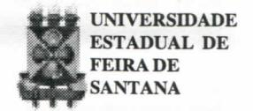

# **FOLHETIM DE EDUCAÇÃO MATEMÁTICA**

**Folhetim de Educação Matemática, Ano 6, n. 80, jul. 1999**

**ISSN 1415-8779**

#### **OBJETIVO**

Este _Folhetim é_ um veículo de divulgação, circulação de **ideias** e de estímulo ao estudo e à curiosidade intelectual. Dirige-se a todos os interessados pelos aspectos pedagógicos, filosóficos e históricos da Matemática. Pretende construir uma ponte para unir os que estão próximos e os que estão distantes.

### **EDITORIAL**

Um dos aspectos importantes no ramo do conhecimento é a resposta à pergunta" Qual o seu objeto".

Quando estudamos Cálculo, Topologia, Geometria, entre outros, devemos ter em mente qual o seu objeto.

Nessa perspectiva, é oportuno encontrarmos neste folhetim uma exposição clara sobre "Qual o objeto da Álgebra?", ou seja, o que a Álgebra estuda.

Associado ao seu objeto, o texto da coluna _"Pergunte que o NEMOC responde"_ apresenta também através de exemplos, o que é uma Álgebra, essa riquíssima estrutura algébrica que se enriquece continuamente.

# **COMITÉ EDITORIAL**

Carloman Carlos Borges (Doutor) Inácio de Sousa Fadigas (Mestre)

### **PERGUNTE QUE O NEMOC RESPONDE**

**1" Pergunta.** Muitos alunos querem saber: _O que a Álgebra estuda e o que é uma Álgebra?Eles ficam confusos quando encontram expressões tais como: a álgebra das proposições, a álgebra das matrizes, etc._

R. A Álgebra é um ramo da matemática que tem por objeto, modernamente, o estudo das estruturas algébricas, como grupo, anel, espaço vetorial. etc. Até o século XVI I a Álgebra era a extensão da aritmética e estudava basicamente operações com números racionais, reais e os números complexos. Era a chamada Álgebra Clássica. Qual é o objeto da Álgebra Clássica? É o estudo das equações algébricas:

$$x^{n} + a_{n-1} x^{n-1} + ... + a_{1} x + a_{0} = 0$$
(1)

cuj as soluções procuradas deveriam ser indicadas por meio de expressões dependentes dos coeficientes a., empregando as operações racionais e os radicais. Em 1799 o grande matemático alemão GAUSS, então com apenas 22 anos, provou o assim chamado Teorema Fundamental da Álgebra: _Toda equação_ (1) _com coeficientes complexos e_ n _maior do que zero tem pelo menos uma raiz, isto é, existe pelo menos um número complexo_ x _que satisfaz a igualdade._ Embora esse teorema, ainda hoje seja básico em muitos domínios científicos, o nome (fundamental) foi-lhe dado num período em que o objeto fundamental desse ramo da matemática (a álgebra) era o estudo das equações algébricas. Hoje em dia esse nome não mais se justifica. O século XVI I é considerado como o do nascimento da Matemática Moderna. Foi nele que surgiram a noção de função (Leibniz). a criação da Geometria Anahtica. por Fermat e Descartes e, finalmente, a criação daquela que pode ser considerada como a maior invenção da matemática: o Cálculo Infinitesimal (Newton e Leibniz). A partir do século XVII , mais precisamente, na segunda metade desse século. surgiram duas novas direções no desenvolvimento da álgebra, sendo a primeira delas marcada pela extensão da noção de número. Foi nessa época, devido principalmente aos trabalhos de GAUSS, que os números complexos entraram definitivamente na matemática, embora ainda houvesse, nesses trabalhos de GAUSS, um aspecto intuitivo a respeito dos números reais. Esse aspecto intuitivo foi ehminado quando a propriedade fundamental dos reais, a continuidade, foi rigorosamente esclarecida através daquilo que hoje denominamos de Princípios de Continuidade:

I . Princípio de DEDEKIND: _se o conjunto dos reais é dividido em duas classes não vazias X e Y e disjuntas, de maneira que para x e X e_ y £ Y _arbitrários se cumpra_ x < y , _existe, então um único número_ a _para o qual_ x < a < y , _quaisquer que sejam_ x **G** X e y **G** Y.

I I . Princípio de CANTOR: _dado um sistema de intervalos encaixantes (isto é, um sistema de intervalos com duas propriedades: a) cada qual está contido em todos os seus predecessores e b) suas amplitudes,_ 0,1 , 0,01 , 0,001,... _vão decrescendo e tendendo para zero), existe um único número real que pertence a cada um dos intervalos._

**m.** Princípio de WEIERSTRASS: _se uma sucessão não decrescente de números reais está cotada superiormente, então é convergente._

I V. Princípio de CAUCHY: _toda sucessão fundamental de números reais converge._

A álgebra denominada de moderna, para alguns autores, surge no século XIX, com a teoria dos "grupos", devida fundamentalmente aGalois,jovemmatemático francês morto prematuramente em um duelo infeliz. A segunda e fundamental direçã o surgida no desenvolvimento da álgebra diz respeito à resolução de equações algébricas por radicais. Esse problema foi resolvido brilhantemente pelos jovens e infeUzes matemáticos: ABE L (1765-1822) e o citado G ALÓIS (1811-1832). O objeto da álgebra moderna, passa, assim, a ser o estudo de conjuntos organizados axiomaticamente pelas chamadas operações algébricas, isto é, o objeto da álgebra moderna passa a ser o estudo das "estruturas algébricas". Passamos a responder à segunda parte da pergunta: _o que é álgebra?_ Esse assunto já foi ventilado no Folhetim de Educação Matemática de número 18. Procuremos esclarecer, acrescentando às explicações desse Folhetim, mais alguns detalhes. Vejamos o assim chamado sistema matricial M . cujos elementos sejam as matrizes quadradas de ordem 2x2 . Com relação a esse sistema, definimos três operaçõe s algébricas: i) a adição de matrizes; ii) a multiphcação de matrizes; iii) multipUcação de um número real por uma matriz. Como se comportam esssas operações? Em relação às operações (i) e (ii), as matrizes 2 X 2 se comportam da seguinte maneira:

I) O conjunto é fechado para a adição (isto é: a soma de duas matrizes é outra matriz).

II) A adição é comutativa.

III) A adição é associativa.

IV) Existe um elemento identidade para a adição.

V) Existe um inverso aditivo para cada elemento do conjunto M das matrizes 2x2 .

VI) O conjunto é fechado para a multiplicação, isto é, a multiplicação de duas matrizes é outra matriz.

VII) A multiplicação é associativa.

VIII) A multiplicação é distributiva em relação à adição. " '

## **NEMOC - NÚCLEO D E EDUCAÇÃO MATEMÁTICA OMAR CATUNDA**

FolhetimdeEducaçãoMatemática, Ano6,n. 80, julho 1999 - **Editores:** Carloman e Inácio - **Secretária:** Josenildes Oliveira Venas - **Editoração:** Evandro Vaz e Nivaldo de Assis - **Impressão:** Imprensa Gráfica Universitária - **Periodicidade:** mensal - **Tiragem:** 1.300 exemplares - _Distribuição gratuita -_ **Endereço:** Av. Universitária, s/n km 03 - BR 116 - Campus Universitário - **Telefone:** (075)224-8115 - **Fax:** (075)224-8085 - CEP 44031-460 - Feira de Santana - Ba - BRASIL - **E-mail:** nemoc@uefs.br

' Quando um conjunto de elementos é organizado por uma operação conforme as cinco primeiras propriedades acima, dizemos que ele forma um grupo comutativo ou abeliano com respeito à essa operação. Assim, o conjunto M das matizes 2x2 , munido da operação de adição forma um grupo abeliano. Porém, o conjunto M , com as duas operações, a adição e a multiplicação matricial, possuindo as oito propriedades acima, se constitui em outra estrutura algébrica denominada pelos matemáticos de anel. De maneira mais precisa: um anel é um conjunto com duas oprerações, chamadas adição e multiplicação, que possuam as propriedades mencionadas acima. Repetindo: em relação à adição, M forma um grupo abeliano e, em relação à adição e multipUcação matricial, M forma um anel. O conjunto M apresenta mais uma propriedade importante, pois ele contém um elemento identidade

$$I = \begin{pmatrix} 1 & 0 \\ 0 & 1 \end{pmatrix}$$

para a multipUcação em M , isto é, para todo A e M , tem-se:

$$IA = A = AI$$

Desta forma, o conjunto M é um anel com um elemento identidade. Além das duas operações citadas, no sistema M pode-se definir a multipUcação de matrizes por um número real a, com as seguintes propriedades:

IX)
$$a(A + B) = aA + aB$$

X) $(a + b)A = aA + bA$  
XI) $(ab)A = a(bA)$  
XII) $1A = A$

a e b números reais e A e B matrizes 2x2 . Então, podemos afirmar: a operação de adição junto com a operação de multiplicação matricial fazem de M um anel, enquanto que as operações de adição e de multipUcação de matriz por um número real fazem de M um espaço vetorial sobre os números reais. Assim, temos, repetindo: o conjunto M , munido da adição e da multiplicação matricial, é um anel, e munido da adição e da multipUcação por um número real é um espaço vetorial. Além disso, sendo a um número real e A e B elementos de M , é fácil verificar que:

XIII)
$$a(AB) = (aA)B = A(aB)$$

Agora, estamos em condições de definir o que seja "uma álgebra sobre os números reais": uma álgebra sobre o conjunto R dos números reais é um conjunto de elementos munido de uma lei aditiva e de uma lei multiplicativa que o transformam em anel, de uma lei externa (multipUcação de uma matriz por um número real) que, juntamente com a lei aditiva faz de M um espaço vetorial sobre R e, além disso, em M vale a propriedade XIII , a qual poderá ser verificada facilmente pelo leitor. Seja, agora, os elementos de M constituídos não de matrizes 2 x 2 e sim de funções reais de variáveris reais e, ainda o conjunto R dos reais. O conjunto F(M,R) das aplicações de M em R com as três leis seguintes

a)
$$(f+g)(x) = f(x) + g(x)$$

b)
$$(fg)(x) = f(x)g(x)$$

c) (af)(x) = af(x)

com f e g pertencentes a M e a e x pertencentes a R, é uma álgebra sobre R. Quando M = N (conjunto dos números naturais), a álgebra F(M,R) é denominada de álgebra das sequências de elementos de R. Considere a lógica estudada elementarmente, com os seus dois valores (V,F), as duas operaçõe s internas A (conjunção), v (disjunção) e mais a operação unária "~" (negação). Aqui, temos, também, a chamada álgebra das proposições. De maneira análoga podemos falar em "álgebra de conjuntos". Consideremos duas operações binárias A **e v** em B tais que sejam verificadas as seguintes propriedades:

- **1) Para todo x e y emB, x = y**
- **2) ParatodoxeyemB,x A y = y A X**
- **3) Para todo x e y em B, x ^ (y v z ) = (x A y ) v(x**
- **4) ParatodoxeyemB,x V (yAz ) =(x^y)A(xVz )**
- **5) Para todo e em B, x v o = x**
- **6) ParatodoxemB,x ^ l=x**
- **7) Para todo x em B, x ^ x'= 1**
- **8) Paratodo X em B, X ^ x'= O**
- **9) 0 ^ 1 '**

Essas propriedades fazem de B, munido com aquelas operações, uma álgebra booleana. nome dado em homenagem ao lógico e matemático inglês George Boole (1815 - 1864). Finalmente seja B o conjunto de todos os inteiros positivos que são divisores de 70:

$$B = \{1, 2, 5, 7, 10, 14, 35, 70\}$$

Para quaisquer x e y em B, seja x ^ y o máximo divisor comum de x e y, e seja _y o_ mínimo múltiplo comum de x e y e seja x' = 70/x. Exemplificando: 2 5 = 1; 5 ^ 14 = 70; 10 ^ 35 = 5; 5' = 14; 10'= 7.

Então ( B, A , V ,' , 1, 70 ) é uma álgebra booleana.

Como sabemos, a álgebra das matrizes possui a propriedade associativa mas não a propriedade comutativa da multiplicação. Ultimamente, ganha grande importância as chamadas "álgebras não associativas", isto é, aquelas nas quais a multiphcação é não-associativa. Em alguns países existem grupos formados por matemáticos e geneticistas trabalhando em álgebras não associativas, também conhecidas como "álgebras genéticas". Na Física, mais precisamente, na Mecânica Quântica, essa álgebra assume grande importância. •

_Pergunte que o NEMOC Responde é_ uma coluna de autoria do prof. Dr. Carloman Carlos Borges e objetiva atingir ao púbUco interessado em Matemática nos seus múltiplos aspectos.

Caso o leitor queira fazer alguma pergunta escreva-nos.

# **PRÓXIMO NÚMERO**

_O que é uma "função característica" de um conjunto ?_

_Aguardem!_

### **NOTÍCIAS**

Será reaUzada de 19 a 22 de outubro de 1999,

#### a **III Semana de Matemática da UEFS/Ba .**

Tema: A "Complexidade" da Matemática e suas Perspectivas.

> Inscrições: **Estudantes Profissionais** _] " Período_ (04 a 08/10) R\$ 10,00 R\$ 15,00 _2" Período_ (11 a 18/10) R\$ 15,00 R\$ 20,00 Informações:

> D.A. de Matemática/ UEFS /Mód . V - M T 51. Colegiado de Matemática / Módulo V

A v . Universitária, km 03, BR 116

Feira de Santana - Ba

Tel.:(0xx75) 224-8233

E-mail: colmat@uefs.br

O professor Carloman Carlos Borges como Representante de Vendas da Sociedade Brasileira de Matemática (SBM) informa aos leitores e aos demais interessados que se encontram no NEMOC livros das seguintes coleções:

> Coleção Matemática Universitária - CM U Coleção Projeto EucUdes - CPE Coleção Computação e Matemática - CCM Coleção Professor de Matemática - CPM Coleção Olimpíadas - CO Ensaios Matemáticos - E M Matemática Contemporânea - M C

# **NÚMEROS ATRASADOS**

Envie para cada folhetim um selo de postagem nacional de 1° porte. Dentro de no máximo quatro semanas, contadas a partir da data de recebimento do seu pedido, você estará recebendo os folhetins solicitados.

OBS.: É permitida a reprodução total ou parcial desse folhetim, desde que citada a fonte.
