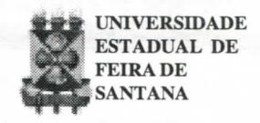
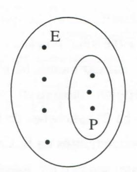
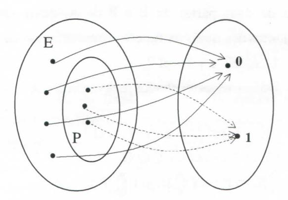
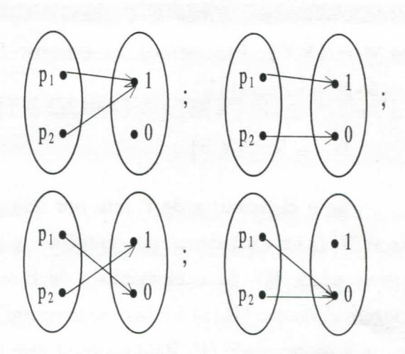

# **FOLHETIM DE EDUCAÇÃO MATEMÁTICA**

**Folhetim de Educação Matemática, Ano 7, n. 81, ago. 1999** . ISSN 1415-8779

#### **OBJETIVO**

Este _Folhetim é_ um veículo de divulgação, circulação de **ideias** e de estímulo ao estudo e à curiosidade intelectual. Dirige-se a todos os interessados pelos aspectos pedagógicos, filosóficos e históricos da Matemática. Pretende construir uma ponte para unir os que estão próximos e os que estão distantes.

### **EDITORIAL**

Sem dúvida um dos mais importantes conceitos da matemática é o de função. Ele permeia vários campos desta Ciência e muitas vezes o empregamos de forma a dar precisão e elegância a determinados conteúdos. Neste _Folhetim,_ este conceito apareceu aproximando campos como Teoria dos Conjuntos e Lógica das Proposições através do conceito de _função característica._

Os exemplos apresentados ilustram este importante papel desempenhado _pela função característica._

## **COMITÊ EDITORIAL**

Carloman Carlos Borges (Doutor) Inácio de Sousa Fadigas (Mestre)

#### **PERGUNTE QUE O NEMOC RESPONDE**

**Pergunta.** A colega Acácia R. Borges do Carmo, moradora na Rua Cláudio Manoel, 878, ap. 301, Belo Horizonte, quer maiores explicações sobre _'função característica" de um conjunto A._

R. Considere o conjunto E e uma de suas parte? próprias:

Essa parte P define a função p: E ^ {0,1} chamada função característica da parte P de E. A função característica da parte P de E está definida da seguinte forma:

Para todo x e P: p(x) = 1

Para todo x g P: p(x) = O

Vamos dar dois exemplos para ilustrar o uso dessa

função. Antes do primeiro exemplo, recordemos: dado um conjunto E com p elementos há n^ aplicações de E no conjunto F com n elementos. Reahnente: há n valores possíveis para a imagem do primeiro elemento e para cada um desses valores; n valores possíveis para a imagem do segundo elemento, etc, n valores possíveis para a imagem do p-ésimo elemento, donde

$$\underbrace{n \times n \times n \times ... \times n}_{p \text{ vezes}} = n^p \text{ possibilidades.}$$

A primeira aplicação da função característica: mostrar que todo conjunto finito de n elementos contém 2" partes. Vejamos: Pode-se identificar o conjunto das partes de E e o conjunto das aplicações de E em {0,1}: uma parte F de E é identificada a f tal que f (x) = 1 se **X** e F, f (x) = O se **X** g F (f é uma "função característica" de F). Como vimos anteriormente, há n'' aplicações de um conjunto com p elementos em um conjunto com n elementos. Então há 2" aplicações de E em {0,1} e, portanto, há 2" subconjuntos de E. Uma segunda apUcação é a seguinte: sendo e e f funções características de duas partes de E e F de A, quais são os conjuntos dos quais as funções características são

$$1 - e, ef, e + f - ef$$
?

Utilizar esses resultados para verificar que:

$$(E \cap F) \cap G = E \cap (F \cap G)$$

$$(E \cap F) \cup G = (E \cup G) \cap (F \cup G)$$

$$(E \cap F) = (CE) \cup (CF)$$

Primeira questão:

$$1 - e(x) = \begin{cases} 1 \text{ se } x \notin E, \text{ isto } é, x \in CE, \\ 0 \text{ se } x \in E, \text{ isto } é, x \notin CE. \end{cases}$$

Logo, 1 - e é a função característica de

$$(ef)(x) = e(x) f(x) = \begin{cases} 1 \text{ se } x \in E \text{ e } x \in F, \\ 0 \text{ se } x \notin E \text{ ou } x \notin F, \end{cases}$$

pois um dos fatores ao menos é nulo no segundo caso; ef é a função característica de E n F.

$$g(x) = e(x) + f(x) - e(x) f(x) =$$

$$= e(x) + f(x)[1 - e(x)] = f(x) + e(x)[1 - f(x)]$$

Se e toma o valor 1, g igualmente toma esse valor; da mesma forma se f assume o valor 1. Se e (x) e f (x) são nulos, g (x) também se anula:

$$g(x) = \begin{cases} 0 \text{ se } x \notin E \text{ e } x \notin F, \\ 1 \text{ se } x \in E \text{ ou } x \in F. \end{cases}$$

Portanto, g é a função característica de E u F.

Segunda questão:

Para verificar que dois conjuntos são idênticos, é suficiente mostrar que suas funções características são idênticas, isto é, tomam o mesmo valor qualquer que seja x. Chamando e, f, g as funções características de E, F,G e utilizando os resultados da primeira questão logo acima, basta verificar que: -

## NEMOC - NÚCLEO DE EDUCAÇÃO MATEMÁTICA OMAR CATUNDA

Folhetim de Educação Matemática, Ano 7 ,n. 81, agosto 1999 - Editores: Carloman e Inácio - Secretária: Josenildes Oliveira Venas - Editoração: Evandro Vaz e Nivaldo de Assis - Impressão: Imprensa Gráfica Universitária - Periodicidade: mensal - Tiragem: 1.500 exemplares - _Distribuição gratuita -_ Endereço: Av. Universitária, s/n km 03 - BR 116 - Campus Universitário - Telefone: (075)224-8115 - Fax: (075)224-8085 - CEP 44031-460 - Feira de Santana - Ba - BRASIL - E-mail: nemoc@uefs.br

$$[e(x) f(x)] g(x) = e(x) [f(x) g(x)];$$

$$g(x) + e(x) f(x) - e(x) f(x) g(x) =$$

$$= [e(x) + g(x) - e(x) g(x)] [f(x) + g(x) - f(x) g(x)];$$

(observar que $g^2(x) = g(x)$ , pois g(x) é igual a 0 ou a 1);

$$1 - e(x) f(x) = [1 - e(x)] + [1 - f(x)] - [1 - e(x)] \cdot [1 - f(x)].$$

Aplicações do tipo mencionado são comuns em Matemática. Exemplificando: se designarmos por f a aplicação do conjunto C das proposições dentro de $\mathfrak{D} = \{ V, F \} = \{ 0, 1 \}$ teremos:

Se p é verdadeira, então f (p) = 1 (verdadeiro) Se p é falso, então f (p) = 0 (falso)

Assim, sejam as proposições P1 e P2, pertencentes a C e sejam p1 e p2 seus valores lógicos. Façamos corresponder a todo conjunto de valores lógicos um valor lógico q; desta forma, essa lei de correspondência é uma função f de duas variáveis, definida apenas para os valores 0 (falso) e 1 (verdadeiro) dessas variáveis. A tabelinha abaixo ilustra a situação:

| $\mathbf{p}_{1}$ | $p_2$ | q   |
| ---------------- | ----- | --- |
| 1                | 1     | 1   |
| 1                | 0     | 0   |
| 0                | 1     | 0   |
| 0                | 0     | 0   |

Observe que a letra q acima representa, neste caso, o conector lógico conjuntivo: ∧ . De um modo geral, se tivermos um conjunto com n proposições e uma lei f, como dito acima, teremos 2n aplicações do conjunto E no conjunto {0,1}. Para apenas duas

proposições, as aplicações são as seguintes:

Ainda, mais um exemplo: se na frase "x + 5 = 10", convencionarmos que a variável $\underline{x}$ representa um inteiro natural, então ela permite que se defina a aplicação de N (conjunto dos naturais) dentro de $\mathfrak{V} = \{V, F\} = \{0,1\}$ .

$$
\begin{array}{c}
N \longrightarrow \{V, F\} \\
5 \longmapsto V \\
3 \longmapsto F \\
340 \longmapsto F
\end{array}
$$

Se na frase " $x \le y$ ", as variáveis x e y forem, também inteiros naturais, teremos a aplicação $N \times N$ dentro do conjunto $\{V,F\} = \{0,1\}$ :

$$
\begin{array}{ccc}
N \times N & \longrightarrow \{V, F\} \\
(2,3) & \longmapsto V \\
(2,2) & \longmapsto V \\
(5,7) & \longmapsto V \\
(21,29) & \longmapsto V \\
(35,5) & \longmapsto F \\
(70,2) & \longmapsto F
\end{array}
$$

Os exemplos acima permitem a definição do importante conceito lógico de função proposicional definida sobre um conjunto E: é uma aplicação de E em °D = {V,F} . Precisemos os termos: Seja a função proposicional H:

$$E \rightarrow \mathcal{D} = \{V,F\}$$

Se o elemento x de E tem por imagem V, diz-se "H (x) é verdadeiro" ou, também " x possui a propriedade H". Se o elemento x de E tem por imagem F, diz-se: "H (x) é falso" ou também: "x não possui a propriedade H". Para encerrar este tópico, vale a pena lembrar o que nos ensina o grande lógico, filósofo e sociólogo inglês Bertrand Russel: "Uma 'função proposicional' é, na verdade, uma expressão contendo um ou mais componentes indeterminados tais que, quando lhes são atribuídos valores, a expressão se toma uma proposição. Em outras palavras, ela é uma função cujos valores são proposições". •

**r — — — — — — — — — — ^ — ^** I _Folhetim Especial sobre o Professor^ Elon Lages Lima. Aguardem!!!_

_Pergunte que o NEMOC Responde_ é uma coluna de autoria do prof. Dr. Carloman Carlos Borges e objetiva atingir ao púbhco interessado em Matemática nos seus múltiplos aspectos.

Caso o leitor queira fazer alguma pergunta escreva-nos.

## **PRÓXIMO NÚMERO**

_Demonstrações matemáticas._

_Aguardem!_

#### **NOTÍCIAS**

Será realizada de 19 a 22 de outubro de 1999,

#### a II I Semana de Matemática da UEFS/Ba.

Tema: A "Complexidade" da Matemática e suas Perspectivas.

> Inscrições: **Estudantes Profissionais** _r Período {QA a OmO)_ R\$10,00 R\$15,00 _2" Período_ (11 a 18/10) R\$ 15,00 R\$ 20,00 Informações:

D. A. de Matemática/UEFS / Mód. V - MT 51. Colegiado de Matemática/Módulo V

Av. Universitária, km 03, BR 116

Feira de Santana - Ba

Tel.:(0xx75) 224-8233 E-mail: colmat® uefs.br

O professor Carloman Carlos Borges como Representante de Vendas da Sociedade Brasileira de Matemática (SBM) informa aos leitores e aos demais interessados que se encontram no NEMOC livros das seguintes coleções:

> Coleção Matemática Universitária - CMU Coleção Projeto Euchdes - CPE Coleção Computação e Matemática - CCM Coleção Professor de Matemática - CPM Coleção Olimpíadas - CO Ensaios Matemáticos - EM _j^.._ Matemática Contemporânea - MC

## **NÚMEROS ATRASADOS**

Envie para cada folhetim um selo de postagem nacional de 1° porte. Dentro de no máximo quatro semanas, contadas a partir da data de recebimento do seu pedido, você estará recebendo os folhetins solicitados. - ^."X

OBS.: É permitida a reprodução total ou parcial desse folhetim, desde que citada a fonte. . ..
