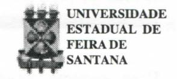
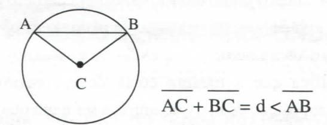

# **FOLHETIM DE EDUCAÇÃO MATEMÁTICA**

**Folhetim de Educação Matemática, Ano 7, n. 82, set. 1999** 

**ISSN 1415-8779** 

## **OBJETIVO**

Este *Folhetim é* um veículo de divulgação, circulação de **ideias** e de estímulo ao estudo e **à**  curiosidade intelectual. Dirige-se a todos os interessados pelos aspectos pedagógicos, filosóficos e históricos da Matemática. Pretende construir uma ponte para unir os que estão próximos e os que estão distantes.

# **EDITORIAL**

Não é difícil constatar uma certa aversão da maioria dos alunos (e isso inclui alunos do 3° grau de cursos de Licenciatura em Matemática) pelas demonstrações. Chega-se até a questionar a sua utilidade. Talvez seja isso causado por uma incompreensão do que seja uma demonstração e quais os tipos que podemos lançar mão na Matemática.

Este *Folhetim,* na coluna *Pergunte que o NEMOC Responde,* trata dessas questões de forma clara e objetiva, a partir de uma pergunta do leitor. Uma ênfase é dada a demonstração por absurdo, tantas vezes não compreendida.

Em breve estaremos disponibilizando os Folhetins de Educação "on-line" através da Internet. Aguardem.

# **COMITÉ EDITORIAL**

Carloman Carlos Borges (Doutor) Inácio de Sousa Fadigas (Mestre)

### **PERGUNTE QUE O NEMOC RESPONDE**

**Pergunta.** Inês Trombini Scheid, Rua Padre Ago<: tinho Gastaldo, 1054, Bairro Ana Rech, Caxias do Sul - . através de e-mail escreve - "Sou estudante do curso **de**  Matemática na Universidade de Caxias do Sul e no primeiro semestre de 1999 cursei a disciplina Fundamentos de Matemática. Na disciplina, a professora incentivava as demonstrações matemáticas e apresentou o seguinte problema: *demonstre que se* n *é um inteiro positivo que não é quadrado perfeito, então, a raiz quadrada dené um número irracional.* Gostaria de ajuda na demonstração do problema acima".

R. A demonstração solicitada pela colega é um exemplo daquilo que se denomina de "demonstração por redução ao absurdo", a qual faz parte de um método mais geral de demonstração chamado de "demonstração indireta". A "demonstração por redução ao absurdo" consiste no seguinte: para mostrar a veracidade da proposição P, parte-se da hipótese de que a proposição P', contrária da proposição P é verdadeira. Então, após alguns raciocínios, chega-se a uma contradição com P', o que demonstra o absurdo da hipótese P'. Então, tendo por fundamento o princípio do terceiro excluído (toda proposição ou é só verdadeira ou é só falsa, nunca ocorrendo um terceiro caso), a falsidade de P' mostra que P é verdadeira. Esse tipo de demonstração sempre recebeu por parte de alguns matemáticos severas críticas, destacando-se entre eles Kronecker e Brouwer, os quais privilegiavam outro tipo de demonstração: a demonstração construtivista. Qual a diferença básica entre esses dois tipos de demonstração? Na demonstração construtivista prova-se a existência de um determinado objeto por intermédio de uma construção de um exemplo desse objeto, enquanto que, na chamada demonstração por absurdo, tem-se apenas uma contradição **e** não a construção do objeto desejado. Uma pergunta, agora, talvez, se faça necessária: por que não apresentar apenas demonstrações construtivistas, relegando ao total esquecimento, as chamadas demonstrações por absurdo? A resposta é bem simples: existem teoremas que, pela sua própia natureza não podem ser demonstrados de maneira direta e construtiva. Exemplificando: o conjunto dos números reais não é enumerável. A conhecida demonstração por absurdo desse teorema apresentada por Cantor, permanece, aindahoje, como modelo para esse tipo de demonstração. Para aclarar a questão, consideremos o teorema sobre a infmidade dos números primos. Eis a demonstração dada por Euclides:

1) Ele supõe que o teorema é falso; 2) então, existe um número finito de números primos; 3) logo, podemos simbolizá-los por p^, p^, ...,p^; 4) outro número inteiro qualquer seria composto e, portanto, divisível por algum p. acima, pelo menos; (5) mostremos que isso nos leva a uma contradição; (6) seja o número **N** = Pj. **P2**. ••• • p\_^ + 1; (7) como N é composto, deve ter, pelo menos, na sua decomposição, um fator primo p.; (8) ao dividirmos N por qualquer p,, sobra sempre um resto igual a 1, donde se conclui que N não possui nenhum divisor primo que esteja entre os p^ mencionados: Pj, Pj, ...,p\_^; (9) assim, ahipótese inicial de umafinitude de números primos, nos leva a uma contradição e, consequentemente, a hipótese contrária, deve ser verdadeira, isto é, o teorema não é falso e, assim, existe uma infinidade de números primos. Essa demonstração **é** por redução ao absurdo e, pode ser modificada para dar origem a uma demonstração construtiva: (1) vamos construir o número **Q** = (2.3.5.7. •• .p) **-1-** 1 (produto dos primos de (2 até p) **-1-** 1); (2) sobre **Q** 

caberão apenas duas hipóteses: **Q** primo e **Q** não primo: (3) se ocorrer a primeira, teremos obtido um primo **Q** > p. Ocorrendo a outra, **Q** admitirá algum divisor primo d, o qual não é nenhum dos primos 2,3,5,..., p, uma vez que a divisão de **Q** por qualquer desses números deixa resto igual a 1. Por exemplo:

**1 2 . 5 . 7 . ••• . p** 

(3) logo, também na segunda hipótese, obtivemos um primo, d, maior que p. Como se trata de um processo iterativo, a conclusão é óbvia: existe uma infinidade de números primos. Vejamos, agora, a demonstração soUcitada pela colega Inês.

A questão levantada pela colega, leva-nos a escrever mais alguma coisa sobre Dedução e os Métodos Usuais de Demonstração. Dentro de uma teoria *T,* a formação de um enunciado verdadeiro, T, a partir de enunciado H, suposto verdadeiro, é chamada de dedução de T a partir de H. Essa dedução é dita justificada se existemregras lógicas assegurando ser a formação de T a partir de H, na teoria considerada, um enunciado verdadeiro. Convém lembrar que as lejs lógicas exprimemtautologias. Intuitivamente,podemos afirmar que uma proposição composta é uma tautologia, se é verdadeira independentemente dos valores de verdade de suas orações atómicas componentes. Por exemplo: P ou não P é uma tautologia.

#### Métodos Usuais de Demonstração

Três métodos importantes na demonstração matemática podem ser destacados: 1) método construtivo; (2) método de contradição ou de redução ao absurdo;

# **NEMOC - NÚCLEO DE EDUCAÇÃO MATEMÁTICA OMAR CATUNDA**

FolhetimdcEducaçãoMatemádca, Ano7,n. 81, agosto 1999 - **Editores:** Carloman e Inácio - **Secretária:** Josenildes Oliveira Venas - **Editoração:** Evandro Vaz e Nivaldo de Assis - **Impressão:** Imprensa Gráfica Universitária - **Periodicidade:** mensal - **Tiragem:** 1.500 exemplares - *Distribuição gratuita* **- Endereço:** Av. Universitária, s/n km 03 - BR 116 - Campus Universitário - **Telefone:** (075)224-8115 - **Fax:** (075)224-8085 - CEP 44031-460 - Feira de Santana - Ba - BRASIL - **E-mail:** nemoc@uefs.br

(3) método de indução. Exemplos de (1) e (2) já foram dados. Vejamos a chamada demonstração por indução matemática, também conhecida como demonstração por recorrência. Esse método é empregado para estabelecer que uma dada proposição dentro da qual intervém uma variável natural n, inteiro natural, é verdadeira para todo n. Basicamente consiste no seguinte: seja B um subconjunto de inteiros positivos. Se B possui as duas seguintes propriedades: i) 1 pertence a B; ii) n + 1 pertence a B sempre que n pertence a B. Então B contém todos os inteiros positivos. O princípio da Indução Matemática baseia-se em propriedades básicas dos inteiros naturais: depois de cada inteiro k há o seguinte k + 1 e que todo inteiro n pode ser alcançado após um número finito de tentativas, a partir de 1 (essas duas propriedades valem para todos racionais?). Vejamos o seguinte exemplo: Teorema: todo inteiro natural diferente de 1 é um sucessor de um inteiro natural. Demonstração: seja Bo subconjunto de N formado pelo elemento 1 e pelos elementos que lhes são sucessores. Consequentemente: 1 é elemento de N; e se né elemento de B, seu sucessor n + 1 é também elemento de N. Logo B = N. Visto que 1 não é sucessor de nenhum natural, o teorema está demonstrado. Quase sempre uma demonstração matemática é encarada pelo aluno como um simples jogo de engenhosos (quando não enfadonhos) artifícios. Por isso, é conveniente que o professor, nas suas demonstrações, procure sempre justificá-los, explicitando os princípios lógicos que lhes são subjacentes e que os justificam. Não custa muito ter sempre em mente o princípio lógico de Pascal: "Os entes definidos devem ser substituídos por suas definições". Exemplificando: sabe-se que "corda de uma circunferência é um segmento cujos extremos estão sobre a circunferência" e que "circunferência é o lugar geométrico dos pontos do plano que equidistam de um mesmo ponto desse plano (o seu centro)". Assim, na demonstração da proposição: "uma corda AB de uma circunferência que não é um diâmetro. émenor que um diâmetro" é a definição de circunferência que justifica unir os extremos da corda AB ao centro da circunferência. O artifício unir os extremos da corda ao centro fica plenamente justificado e mostra o valor do princípio de Pascal.

Após o "passeio" acima, apresentamos finalmente a demonstração solicitada pela colega: "Mostre que  $\sqrt{n}$  é um número irracional, toda vez que o número n não seja o quadrado de outro número natural". A demonstração abaixo é por redução ao absurdo, sendo fundamentada na tautologia (verifique!):

$$(H \Rightarrow T) \Leftrightarrow [(H \land \sim T) \Rightarrow f]$$
. Temos:

$$H: \left\{ \begin{array}{l} n \neq m^2, \, m \in N \\ x = \sqrt{n} \end{array} \right. \qquad T: \left\{ \begin{array}{l} x \, \text{\'e irracional} \end{array} \right.$$

Aplicando a tautologia acima, tem-se:

$$H' : \left\{ \begin{array}{ll} n \neq m^2, \, m \in N \\ x = \sqrt{n} \\ x \, \text{\'e racional} \end{array} \right. \quad T' : \, \left\{ \begin{array}{ll} f \end{array} \right.$$

#### Demonstração:

 $x = \sqrt{n} = \frac{p}{q}$  é racional (conf. H'; aqui, p e q são dois números inteiros, primos entre si).

 $nq^2 = p^2$  (elevando ambos os membros ao quadrado e transpondo  $q^2$  ao primeiro membro).

Mostremos, agora, que  $nq^2 = p^2$ , que é o nosso T', representa uma contradição. Realmente, devido ao sinal de igualdade, os dois números  $nq^2$  e  $p^2$  quando decompostos em fatores primos deverão coincidir, isto é, a representação de  $nq^2$  como produto de fatores primos deverá apresentar os mesmos fatores primos da representação de  $p^2$  quando escrito como produto de

fatores primos, conforme o Teorema Fundamental da Aritmética (Todo número inteiro N maior que 1, pode ser decomposto em um produto de fatores primos, e esta decomposição é única, a menos da ordem desses fatores). Cada número primo deve aparecer um número par de vezes na decomposição tanto de p- como de q- (pois ambos os números p e q estão ao quadrado) e isto significa que a mesma coisa deverá ocorrer na decomposição de n, o que implica ser n um quadrado perfeito, contrariando, portanto H. Logo, de acordo com a tautologia, **Vn** é um número irracional toda vez que n não for um quadrado perfeito.

Comentários Gerais:

As demonstrações "por absurdo" envolvem algumas ideias que devem ser discutidas. A primeira delas diz respeito ao problema de existência em Matemática, isto é, como se deve provara existência de um determinado objeto. Claro, podemos, por um lado, fazê-lo por intermédio de exemplos "palpáveis" acompanhados do correspondente método que serviu para construí-lo. Por outo lado podemos fazê-lo mostrando que a simples negação de sua existência conduz a uma contradição lógica. À primeira prova mencionada acima dá-se o nome de prova construtiva e a ela se filiam eminentes matemáticos como Kronecker (1823-1891), Poincaré, Lebesgue e outros; entre estes pode-se citar o seu grande teórico, o matemático holandês Luitzen Egbertus Jan Brouwer que em 1907 lança os princípios da chamada escola "Intuicionista". Eis algumas de suas teses:

- a) rejeição, pura e simples, do *infinito acabado*  (isto é, a tomada de consciência de todos os elementos de um conjunto infinito);
  - b) aceitação de uma "intuição primordial";
- c) aceitação do terceiro excluído somente em domínios finitos.

Os intuicionistas, portanto, não aceitam demonstrações baseadas no terceiro excluído como as demonstrações por absurdo. Eles colocam na origem do conhecimento matemático a "intuição primordial", que

nãoé "sensorial" nem "empírica", mas "uma espécie de certeza imediata que se associa aos fatos da lógica, da aritmética e do cálculo combinatório". Essa intuição daria sentido ao conceito de número e a outros conceitos importantes, dos quais, por construções graduais, é possível construir-se a Matemática. É interessante observar que um dos conceitos fundamentais de intuicionismo, qual seja, o da "intuição primordial" ainda não foi devidamente esclarecido por nenhum intuicionista, persistindo, portanto, ainda, como uma noção obscura. Ao referir-se às pretensões dessa escola, os matemáticos R. Courant e H. Robbins (What is Matfiematics? Editorial Oxford University Press) escrevem: "Mesmo que se considere desej ável este programa, no estado atual da Matemática ele introduziria uma grande complicação e também a parcial destruição do edifício matemático atual. Por esta razão não é de estranhar que a escola "intuicionista", a qual adotou este programa, tenha encontrado forte resistência e que, os intuicionistas mais puros não podem em certas ocasiões permanecer fiéis a seus princípios"^

*Pergunte que o NEMOC Responde* é uma coluna de autoria do prof. Dr. Carloman Carlos Borges e objetiva atingir ao púbUco interessado em Matemática nos seus múltiplos aspectos. **'=3 '** 

Caso o leitor queira fazer alguma pergunta cscreva-nos. \_ , ^.

# **PRÓXIMO NÚMERO**

*Aguardem!* 

# **NÚMEROS ATRASADOS**

Envie para cada folhetim um selo de postagem nacional de 1° porte. Dentro de no máximo quatro semanas, contadas a partir da data de recebimento do seu pedido, você estará recebendo os folhetins solicitados.

OBS.: É permitida a reprodução total ou parcial desse folhetim, desde que citada a fonte.