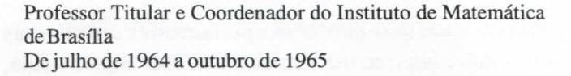

# FOLHETIM DE EDUCAÇÃO MATEMÁTICA

UNIVERSIDADE ESTADUAL DE FEIRA DE SANTANA

Número Especial ISSN 1415-8779

Folhetim Educ. Mat., Feira de Santana, Número Especial, 1999

#### **OBJETIVO**

Este Folhetim é um veículo de divulgação, circulação de idéias e de estímulo ao estudo e à curiosidade intelectual. Dirige-se a todos os interessados pelos aspectos pedagógicos, filosóficos e históricos da Matemática. Pretende construir uma ponte para unir os que estão próximos e os que estão distantes.

#### **EDITORIAL**

É com grande prazer que apresentamos aos leitores este número especial do *Folhetim de Educação Matemática*. Uma singela homenagem a um educador que vem, nos últimos anos, prestando um relevante serviço ao nosso país.

O professor Elon Lages Lima tem se destacado principalmente pela forma didática e comunicativa com que escreve seus textos. Um exemplo disso é este artigo que muito gentilmente escreveu para o nosso *Folhetim*, onde, de forma clara e precisa, apresenta idéias importantes sobre a questão sempre presente do ensino de Matemática. Sem dúvida este artigo será de grande utilidade, principalmente para nossos professores do ensino básico. Agradecemos ao professor Elon, e o parabenizamos pelos seus 70 anos.

# COMITÉ EDITORIAL

Carloman Carlos Borges (Doutor) Inácio de Sousa Fadigas (Mestre)

# A atualização do Ensino da Matemática por Elon Bages Bima\*

A análise conjuntural com vistas a adequar o ensino da Matemática ao momento presente nos leva inevitavelmente a considerar os anseios dos grupos a quem tal ensino é dirigido, as aspirações da sociedade onde o processo educativo tem lugar, bem como as restrições e obstáculos para a execução de projetos teoricamente ideais. Entre essas restrições encontram-se naturalmente as de ordem econômica, mas há outras, de natureza bem diversas, como a lentidão inevitável dos programas de retreinamento de professores, além do natural apego a certas tradições, mesmo de natureza intelectual.

Os professores do ensino básico, quer por formação quer por hábito, acham-se envolvidos numa rotina de trabalho onde os assuntos abordados são aqueles em que se sentem seguros de tratar e os exercícios propostos são quase sempre aqueles mesmos que eles já sabem resolver, mesmo porque a necessidade de complementar seus parcos salários com trabalho adicional não lhes permite muito tempo para estudar.

Se um grupo de matemáticos, cientistas e tecnólogos que usam Matemática propõe um novo currículo, o êxito da proposta vai depender de sua execução pelos professores que atuam no momento. Evidentemente, isto requer atualização desses professores.

Mas, ao contrário da indústria, do comércio e atividades similares, a readaptação do professor não pode ser feita simplesmente por meio de um manual de instruções. Mesmo em países desenvolvidos, essas mudanças de hábitos para professores levam tempo e nem sempre podem ser levadas a cabo. Muitas vezes devem ser feitas da maneira como foram concebidas teoricamente.

A seguir ilustraremos este ponto com alguns exemplos.

#### 1. Três exemplos recentes

A) É do conhecimento geral a onda que se iniciou na década de 60, chamada Matemática Moderna. Motivada

pelo justificado desejo de adaptar o ensino da Matemática aos padrões utilizados pelos matemáticos do século 20 (ou pelo menos por um grande número deles), foi proposta uma reformulação radical dos currículos, com ênfase nos métodos abstratos e gerais.

As conseqüências desse movimento em nosso país foram desastrosas, em que pese o fato de que algumas das práticas propostas eram aconselháveis. Acontece que, tradicionalmente, desde nossos dias de colônia, estamos acostumados a seguir a moda que nos ditam os países mais desenvolvidos. E, em geral, imitamos o que é fácil, superficial e frívolo. Nossa imitação da Matemática Moderna resultou em abandono da geometria e dos cálculos numéricos, substituídos por exageros e um pseudo-formalismo vazio e desligado da realidade.

Hoje todos reconhecem esses erros, mas não é fácil mudar a mentalidade dos professores habituados a esse tipo de atitude, nem provê-los do conhecimento necessário para que possam orientar suas aulas num sentido mais objetivo e condizente com a importância da Matemática na vida moderna.

B) O Japão é um dos países do mundo onde o número de computadores por habitante é o mais alto. Entretanto, apesar dos esforços das autoridades, a utilização de computadores no ensino da Matemática nas escolas japonesas teve que enfrentar resistência e demora pois a maioria dos professores não estava preparada e relutava em preparar-se para mudar seus métodos tradicionais de ensino.

Essa demora, afinal de contas resultou benéfica, pois hoje os japoneses parecem convencidos de que o uso de computadores no ensino da Matemática e suas aplicações é muito mais eficiente para alunos a partir de 15 ou 16 anos, em cujos currículos tal uso realmente se justifica. Nos anos iniciais da escola é mais importante fortalecer os hábitos de auto-

disciplina, trabalho, organização, esforço e imaginação, o que se faz melhor sem o uso de computadores e sem os problemas logísticos ligados à sua utilização pelos professores.

Este exemplo serve como advertência aos dirigentes de nosso país, os quais, na ânsia de uma modernidade ilusória e em busca de uma publicidade fácil, colocam a aquisição de máquinas acima do aperfeiçoamento, da melhoria das condições de trabalho e da remuneração adequada dos professores.

C) De 1893 até o final da década de 60, o ensino da Geometria na Rússia, depois União Soviética, foi decisivamente influenciado pelo livro "Geometria Elementar", de A. P. Kiselev (1852-1940), que em mais de 50 edições sofreu melhoramentos e adaptações visando a aperfeiçoar suas reconhecidas qualidades didáticas e sólida concepção, nas quais se baseou a formação de muitas gerações de cientistas, tecnólogos e matemáticos daquele país.

Entretanto, o grande desenvolvimento da ciência e da tecnologia ocorrido no meado deste século levou a União Soviética a realizar uma profunda reforma no ensino da Matemática, atualizando material obsoleto e introduzindo novos conhecimentos compatíveis com as exigências da época.

O novo curso de Geometria foi elaborado segundo duas tendências distintas. Uma delas foi liderada pelo extraordinário matemático A.N. Kolmogorov, que comandou uma equipe para redigir os textos de Geometria baseados nos grupos de transformações geométricas. A outra tendência foi a do eminente geômetra A.V. Pogorelov, que adotou os princípios metodológicos de Kiselev, dando-lhes melhor consistência lógica, simplificando a apresentação, provendo-a de mais objetividade, modernizando o estilo e tirando proveito de progressos matemáticos obtidos em épocas recentes.

# NEMOC - NÚCLEO DE EDUCAÇÃO MATEMÁTICA OMAR CATUNDA

Folhetim Educ. Mat., Feira de Santana, Número Especial, out. 1999 - Editores: Carloman e Inácio - Secretária: Josenildes Oliveira Venas - Editoração: Evandro Vaz e Nivaldo de Assis - Impressão: Imprensa Gráfica Universitária - Periodicidade: mensal - Tiragem: 1.500 exemplares - Distribuição gratuita - Endereço: Av. Universitária, s/n - km 03 - BR 116 - Campus Universitário - Telefone: (075)224-8115 - Fax: (075)224-8085 - CEP 44031-460 - Feira de Santana - Ba - BRASIL - E-mail: nemoc@uefs.br

Apesar do grande entusiasmo inicial provocado entre os professores pelas novas idéias de Kolmogorov e seus colaboradores, pouco a pouco se foi constatando que o uso sistemático das transformações geométricas como enfoque básico exige um nível de abstração que está acima da maturidade de compreensão dos alunos em geral, embora se reconheça que o emprego ocasional dessas transformações contribui para enriquecer o conhecimento geométrico e simplificar algumas demonstrações. Um longo período de aperfeiçoamento do texto e anos de trabalho com eles nas escolas não lograram melhorar a qualidade do ensino como se esperava.

A partir de 1982-83, o texto estruturado por Pogorelov foi adotado como guia principal em Geometria para todas as escolas da União Soviética. (Vide "Estúdios en Educación Matemática", vol.3, Unesco (1986), pag.119).

#### 2. O que os exemplos nos ensinam

Há algumas lições que se podem tirar destes exemplos.

O primeiro deles nos faz lembrar que a Matemática é muito mais do que um encadeamento lógico de proposições referentes a conceitos abstratos, a partir das quais se pode chegar a conclusões de rara beleza e vasto alcance. Não apenas por isso que ela é universalmente ensinada.

Nem tampouco é verdade que a aprendizagem se faz sob forma de silogismos, do geral para o particular. O lado prático, algorítmico e utilitário de certos tópicos da Matemática Elementar não pode ser menosprezado.

Por outro lado, é errado pensar que tudo que veio com a onda da Matemática Moderna deve ser posto de lado. Algumas de suas coisas boas foram: o uso da linguagem de conjuntos, que facilita, dá precisão e assegura generalidade à expressão das idéias matemáticas (desde que usada com moderação) e a ênfase na conceituação adequada dos objetos matemáticos. Paradoxalmente, a conceituação precisa é indispensável nas aplicações: numa situação concreta em que se estuda um fenômeno, este nunca vem

acompanhado de uma fórmula matemática. Para saber se uma determinada noção se exprime como uma integral, uma derivada, uma transformação linear ou uma função exponencial, é necessário ter bem estabelecidos o significado e a definição desses conceitos matemáticos.

O segundo exemplo é, em si, uma lição. Um político brasileiro, conhecido por suas realizações no campo educativo, disse-me certa vez que nosso país ingressaria rapidamente no primeiro mundo, daria o passo decisivo para o terceiro milênio no momento em que contássemos com computadores Macintosh em cada sala de aula.

Nenhum de nós é suficientemente tolo para ignorar a enorme importância dos computadores na vida de hoje. Isto se vê todos os dias, ao verificarmos o saldo de nossa conta bancária ou nos comunicarmos via correio eletrônico, isto para mencionar apenas exemplos corriqueiros, que poderíamos estender a milhares de outros casos.

Muito menos negaríamos a influência positiva dos computadores na Ciência e na Tecnologia atuais. Ela é tão grande que se costuma dizer que vivemos na era da informática.

No que diz respeito à Matemática, a importância do computador também é imensa, mas é necessário ter em conta, com clareza, seus limites. Ela é, naturalmente, bem maior em Matemática Aplicada, onde permite efetuar com enorme rapidez cálculos que seriam impensáveis concluir sem o uso da máquina. Essa eficácia, por sua vez, trouxe um feedback bem vindo, sob a forma de problemas que suscitaram o aparecimento de teorias matemáticas importantes, como a Complexidade Computacional, e da revitalização de certas áreas tradicionais, como a Teoria das Matrizes, por exemplo.

Na Matemática em geral (sem adjetivos) o computador contribui para divulgar e expandir o uso do método experimental, que consiste em constatar, mediante verificações numéricas ou gráficas, a validez de uma conjetura numa grande quantidade de casos particulares, a fim de adquirir a certeza moral de sua verdade. Cabe observar, de passagem, que esse tipo de utilização do computador tem caráter meramente

preliminar. A verificação de milhões de casos particulares de um teorema não significa necessariamente que esse teorema seja verdadeiro.

Quanto ao uso do computador no ensino da Matemática, devemos primeiro levar em conta nossa realidade sócio-econômica. Caso fosse verdade que a existência de computadores em cada sala de aula constituisse uma solução definitiva para os problemas da aprendizagem e nos desse o passaporte para o desenvolvimento e a modernidade, caso isso fosse um fato indiscutível, acima de qualquer dúvida, ainda assim teríamos grandes problemas para implementar tal solução, como por exemplo os custos de aquisição, instalação e manutenção, a elaboração de programas (softwere), o treinamento dos professores, as medidas de segurança para evitar que os equipamentos fossem roubados, além da chocante discrepância cultural entre um sonhado ambiente hightec na escola e o nível de vida não apenas dos alunos como dos mal-pagos professores.

Felizmente o exemplo japonês vem mostrar o que alguns de nós já sabíamos mas a mania da solução mágica não deixava que alguns aceitassem: o computador não é um remédio milagroso. A formação matemática dos jovens deve dar prioridade ao seu desenvolvimento mental. A máquina deve ser colocada em seu devido lugar e ser usada quando for necessária, não como um substituto do cérebro nem como uma novidade modernosa, que desperta curiosidade e interesse fugazes mas cujo uso nas escolas, em diversos países onde tem sido experimentada, não teve até agora um êxito compensatório.

Finalmente, o exemplo soviético nos mostra que nem sempre o caminho nitidamente melhor para o matemático (ou mesmo para o cientista) é o melhor para o professor e para o aluno. Que a reciclagem dos professores é uma tarefa inadiável e permanente. Que ela deve ser feita com a participação de matemáticos e cientistas que usam a Matemática, conjuntamente com professores experientes, todos dispostos a acompanhar os resultados e abertos a levar as mudanças de rumo que a experiência recomendar.

Quando o grande matemático alemão David Hilbert, na virada deste século, estruturou em bases lógicas inatacáveis os fundamentos da Geometria de Euclides, tudo leva a crer que boa parte de sua motivação foi de natureza metodológica, determinada pelo desejo de oferecer às novas gerações uma apresentação da Geometria que fosse livre de lacunas no encadeamento lógico de suas proposições atingindo assim, o ideal de perfeição perseguido por Euclides. E, de fato, vários compêndios escolares chegaram a ser organizados nos moldes da axiomática de Hilbert.

Cedo porém se constatou que, a fim de colocar em bases lógicas corretas certas noções intuitivas como a ordem dos pontos numa reta, ou sua continuidade, é necessário passar por uma seqüência de proposições de natureza técnica que pouco têm de geométricas, que contêm enunciados completamente óbvios do ponto de vista intuitivo, porém que necessitam de demonstrações, às vezes muito sutis, pois não estavam explicitamente admitidos entre os axiomas adotados.

Desenvolver essa tarefa enfadonha até atingir um ponto onde estão permitidos os raciocínios e as construções geométricas tradicionais da Geometria Euclidiana pode ser um trabalho logicamente necessário, mas é didaticamente desastroso.

Hoje em dia prevalece o ponto de vista de que, para apresentar a Geometria sob a forma sintética (isto é, sem coordenadas) deve-se usar o método da axiomatização local, onde se admitem sem demonstração alguns fatos básicos, intuitivamente plausíveis, muitos dos quais poderiam perfeitamente ter o status de teoremas. A partir deles se desenvolvem temas geométricos(como áreas, volumes, semelhança, etc) de forma consideravelmente rigorosa.

# \*Elon Bages Bima

Carloman Carlos Borges

O Brasil ainda não possui a cultura da divulgação científica. Os grandes jornais do País não lhe reservam, de forma sistemática, espaço suficiente. Algumas notícias soltas, desordenadas, são publicadas, de quando em quando, em algumas revistas interessantes... enquanto outros semanários de grande circulação nacional são destinados à cobertura de notícias pertencentes ao

universo político-partidário, juntamente com notícias criminais. No que diz respeito ao saber matemático, através de livros, tem-se apenas uma diminuta e muitas vezes pálida divulgação. Olhando para um passado não muito remoto, o que vemos? Um dos mais famosos divulgadores foi Malba Tahan, pseudônimo de Júlio César de Melo e Souza (1895-1974), conhecidíssimo nas décadas de 40, 50 e 60 entre os amantes desse saber. Autor de dezenas de livros tratando de assuntos desde Literatura Oriental até Didática e Matemática. ele celebrizou-se com o livro O Homem que Calculava. Quem não se lembra de seu personagem principal, Beremis, deitado sobre a relva a contar as folhas da frondosa árvore que lhe dava cobertura? Eos "intrincados" problemas que lhe eram propostos por reis, herdeiros e plebeus? Eo mais famoso deles: o problema dos camelos? Ainda hoje - quando o nome de Malba Tahan vem à tona - algumas pessoas me perguntam se ele foi um grande matemático. Atualmente, o movimento conhecido como Educação Matemática vem tentando ressucitar esse admirável contador de histórias. Relendo, hoje, seus escritos, chega-se a uma melancólica conclusão: Malba Tahan ou Júlio César de Mello e Souza não tinha conhecimento matemático suficiente para tornar-se um confiável divulgador desse saber. Outro divulgador, este mais preparado que àquele, foi Manoel Amoroso Costa, nascido em janeiro de 1885 e falecido, prematuramente, aos 43 anos de idade. Seu livro As Idéias Fundamentais da Matemática e outros Ensaios, Editora Convívio, EDUSP, ainda hoje pode ser lido com proveito. Se mais vivesse, talvez com novas publicações pudesse ser considerado o iniciador dessa divulgação em nível de seriedade e competência. Em meu entendimento, o pioneiro - dentro das condições mencionadas tanto em nível universitário como em nível de Ensino Médio continua sendo o Prof. Elon Lages Lima. Há quatro décadas, mais precisamente, desde a década dos 50 com a edição de Topologia dos Espaços Métricos (seu primeiro livro ainda escrito quando estudante) esse matemático vem iluminando o caminho de gerações e gerações de matemáticos brasileiros, quer por intermédio de seus livros, cursos e conferências, quer através de suas ações como o Projeto Euclides, a criação e desenvolvimentos de Departamentos de Matemática

em Brasília, Fortaleza e PUC do Rio de Janeiro. A história dos Colóquios Brasileiros de Matemática e dos Programas de Verão do IMPA faz parte da própria história da vida de Elon Lages Lima.

Em 1961 ele publicou o clássico *Introdução à Topologia Diferencial*, cujo único "pecado" foi ter sido escrito em Português, "túmulo do pensamento humano". Se fosse escrito em qualquer outra Língua, em Inglês, exemplificando, seria hoje uma obra de renome.

Ultimamente, o Prof. Elon Lages Lima parece preferir a Matemática no Ensino Médio, tendo, recentemente, com alguns companheiros, lançado sob o prestígio da SBM, a coleção A Matemática do Ensino Médio, excelente manual indispensável às atividades didáticas de nossos professores do Ensino Médio. Mas, o que o torna autor tão lido? A sua competência matemática? Embora essa seja uma condição necessária para o grande divulgador desse saber, não é apenas isso que o torna agradável de ser lido. Talvez alguns exemplos do cotidiano nos indique uma pista segura capaz de esclarecer essa indagação. Vejamos, primeiro, como se comporta, em sala de aula, um professor inexperiente, jovem, porém possuidor daquela já mencionada condição: a preocupação maior dele é mostrar conhecimento e, daí, torna-se prolixo e obscuro. Na outra face da moeda temos o professor que só fala o que ele acha indispensável, tornando-se, igualmente obscuro. Esses dois exemplos mostram que tanto a verbosidade como a concisão, estão ambos ligados à obscuridade; podem mostrar, também, que ensinar ou divulgar qualquer saber é mais uma arte e menos uma ciência mas. cuidado: é indispensável possuir conhecimento matemático para saber divulgá-lo. Em meu entendimento, o que torna o Prof. Elon Lages Lima, um escritor que sempre consegue estabelecer uma relação necessária com o leitor é, além do que já citamos, o seu estilo convidativo, a sua fina ironia, a sua paixão pelo que faz, fazendo-o com seriedade e competência. Essas qualidades são sentidas pelo leitor e criam aquele laço necessário entre o Prof. Elon e o leitor. Leiam, mais um exemplo, o seu livro Meu Professor de Matemática: ele começa mostrando uma das qualidades básicas no caráter humano, a gratidão. Assim, começa homenageando o seu professor Benedito, lá de Maceió, onde fez seus primeiros estudos escolares. Em seguida, com todas as outras qualidades apontadas, escreve páginas admiráveis: Ainda sobre o Teorema de Euler para Poliedros Convexos, A Equação do Terceiro Grau, Grandezas Proporcionais...

É, portanto, com alegria, que o homenageamos com este *Folhetim* na passagem do seu 70° aniversário acontecido em 09/07/99 conforme consta em sua Certidão de Nascimento...

# Alguns dados do Curriculum Vitae do Prof. Elon Bages Bima

- 1. Nasceu em 9 de Julho de 1929, em Maceió, Alagoas.
- 2. Pesquisador-Titular, no IMPA.
- 3. Mais de 30 livros publicados.
- 4. Prêmios e distinções Acadêmicas:
- a) Prêmio "Edna M. Allen"-Universidade de Chicago, 1955.
- b) Prêmio "Jabuti" de Ciências Exatas, Câmara Brasileira do Livro, com o livro "Espaços Métricos", 1978.
- c) Professor "Honoris Causa" -Universidade Federal do Ceará, 1989.
- d) Prêmio Anísio Teixeira do Ministério de Educação, Julho de 1991.
- e) Prêmio em memória do Prof. Dr. Enzo Gentile Sociedade Matemática do Chile, Julho de 1992.
- f) Prêmio "Jabuti" de Ciências Exatas, Câmara Brasileira do Livro, 1996, com o livro "Álgebra Linear".

#### ACADEMIAS E SOCIEDADES A QUE PERTENCE

Academia Brasileira de Ciências Membro Titular desde 1966

Sociedade Brasileira de Matemática Sócio Fundador

Third World Academy of Sciences Fellow

#### ALGUMAS POSIÇÕES ANTERIORMENTE EXERCIDAS

Professor Titular Instituto de Matemática Pura e Aplicada - IMPA 1959 a 1962 (inclusive)

Visiting Member Institute for Advanced Study Princeton - USA De 1962 a 1963

Research Associate Columbia University 1963 a 1964

Visiting Professor University of Rochester De janeiro a junho de 1966

Visiting Associate Professor University of California 1966-1967

#### **OUTRAS ATIVIDADES**

Idealizador e Coordenador Projeto Euclides

Co-Editor e Colaborador Revista do Professor de Matemática Publicada pela Sociedade Brasileira de Matemática

Membro do Conselho Editorial da EDUERJ (editora da UERJ)

Co-Editor e Colaborador Revista "Matemática Universitária" Publicada pela Sociedade Brasileira de Matemática

Membro da Comissão de Redação Anais da Academia Brasileira de Ciências

Idealizador e Coordenador Coleção Matemática Universitária Publicada pelo IMPA

Coordenador Projeto IMPA-VITAE para aperfeiçoamento de Professores de Matemática do segundo grau

# PRÓXIMO NÚMERO

Aguardem!

### **NÚMEROS ATRASADOS**

Envie para cada folhetim um selo de postagem nacional de 1º porte. Dentro de no máximo quatro semanas, contadas a partir da data de recebimento do seu pedido, você estará recebendo os folhetins solicitados.

OBS.: É permitida a reprodução total ou parcial desse folhetim, desde que citada a fonte.