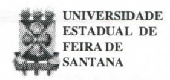
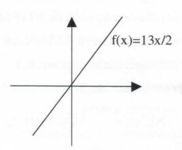
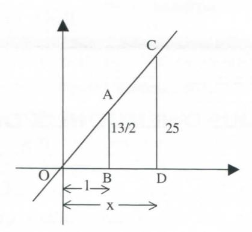
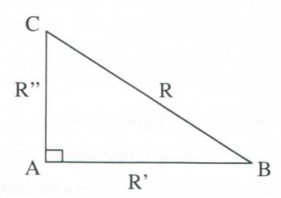
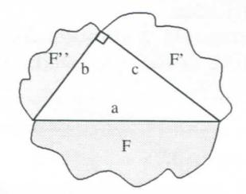
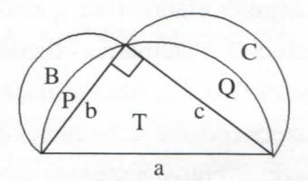

# **FOLHETIM DE EDUCAÇÃO MATEMÁTICA**

**Folhetim Educ. Mat., Ano 7, n. 84, nov. 1999** 

**ISS N 1415-877 9** 

## **OBJETIVO**

Este *Folhetim é* um veículo de divulgação, circulação de **ideias** e de estímulo ao estudo e **à**  curiosidade intelectual. Dirige-se a todos os interessados pelos aspectos pedagógicos, filosóficos e históricos da Matemática. Pretende construir uma ponte para unir os que estão próximos e os que estão distantes.

### **EDITORIAL**

É interessante notar como assuntos tratados por livros "antigos", e que hoje não são mais encontrados em nossos manuais despertam a curiosidade do leitor. Neste *Folhetim,*  é abordado o método da "Falsa Posição", cuja raiz está na proporcionalidade. Sempre que se fala em proporcionalidade, vem logo à mente a Aritmética de Antônio Trajano, cujas primeiras edições remontam ao século passado. Isso vem reforçar a proporcionalidade como uma das ideias fundamentais da Matemática. Essa é inseparável da também fundamental ideia de semelhança. Já tivemos a oportunidade de discorrer sobre o assunto no *Folhetim*  de número 59, de outubro de 1997. Vale a pena conferir. Os dois textos formam um conjunto, como sempre numa linguagem simples eobjetiva.

## **COMITÉ EDITORIAL**

Carloman Carlos Borges (Doutor) Inácio de Sousa Fadigas (Mestre)

### **PERGUNTE QUE O NEMOC RESPONDE**

**1^ Pergunta.** Max Denis de L. Santos, Conjunto Rui Palmeira, B1-2A, Apt° 404, Maceió (Serraria), escreve: *"certa vez, lendo um livro de matemática, vi uma maneira muito interessante de resolver uma equação do 1° grau com uma incógnita. Acho fantástico esse método e peço uma explicação".* 

R. Em seguida, o amável colega mostra como o livro resolveu a equação 6x-i-x/2 = 25. O método empregado é o chamado de "Falsa Posição". No caso, o autor atribui à incógnita um "valorfalso" x = V2, obtendo:

$$6\sqrt{2} + \frac{\sqrt{2}}{2} = \frac{13\sqrt{2}}{2}$$

para, depois, usando os "valores falsos" (V2 e^^ ) construirá Regra de Três:

$$\begin{array}{cccc}
\sqrt{2} & & & x \\
\frac{13\sqrt{2}}{2} & & & 25
\end{array}$$

50 chegando ao resultado x = — . O pnmeiro membro da equac-j!\*^ **13x**  dada, representado pela função f(x) = pode ser represei;;;. por uma reta passando pela origem dos eixos coordenados.

Nessa equação encontra-se a pergunta: qual é o número que multiplicado por 13/2 "transforma-se" em 25? Como não sabemos que número é esse, podemos imaginá-lo. No caso, vamos imaginá-lo x = I , logo f(l) = 13/2 e como f(x)=25. temos o gráfico:

Agora, basta observar que os triângulos OAB e OCD são semelhantes, donde:

$$\frac{13}{2} = \frac{25}{x} \Rightarrow 13x = 50 \Rightarrow x = \frac{50}{13}$$

É claro que se imaginarmos outros valores para **X** diferentes de 1, o método funcionaria apresentando o mesmo "resultado verdadeiro" x=50/13. Para mim, falar em "Falsa Posição" para quem cursou o Curso Ginasial, antes da Segunda GuerraMundial, é lembrar de Aritmética ftogressiva de Antônio Trajano, Uvro adotado, no então chamado Curso Primário. Vej a como Traj ano formula a falsa posição: "REGRA: Na falsa posição toma-se um número falso, e com ele se fazem todas as operações indicadas no problema; depois, o total falso está para o total verdadeiro, assim como o número falso, que se tomou, está para o número requerido". Essa regra se encontra na página 161,77^ edição, ano de 1946. A 2\* edição é de 1884 e pode ser encontrada na Biblioteca Nacional. Voltemos à pergunta de Max Denis: qual a expUcação para a "Falsa Posição"? Segundo Trajano: "A falsa posição é uma apUcação curiosa da Regra de Três." Um aluno um pouco mais atento, ante essa "expUcação"

poderia perguntar: e como explicar a regra de três? Se formos aprofundar a questão, depois de algumas tentativas ,, expUcativas chegaríamos **à ideia** de semelhança, central não apenas em Matemática, porém nas mais variadas ati vidades humanas, a começar pelo chamado raciocínio analógico, quando busca a generahdade através do estudo do objeto em questão visto pelas suas semelhanças surgidas em suas variadas diferenças. O mais célebre teorema da matemática, talvez sej a o teorema de Pitágoras (TP): a área do quadrado construído sobre a hipotenusa é equivalente à soma das áreas dos quadrados construídos sobre os catetos. Lembra-se? Não é assim que nos foi ensinado no ensino médio? Será que poderíamos reformulá-lo escrevendo: a área do triângulo equilátero construído sobre a hipotenusa é equivalente à soma das áreas dos triângulos equiláteros construídos sobre os catetos? Sim. No triângulo retângulo ABC, de lados a (hipotenusa) e catetos b e ç, tem-se a conhecida relação: = b^-l-c^, a qual multiplicada pelo número *JE^~é-***4**transformada em

$$\frac{a^2\sqrt{3}}{4} = \frac{b^2\sqrt{3}}{4} + \frac{c^2\sqrt{3}}{4}$$

Ora, o primeiro membro dessa relação exibe a área do triângulo equilátero construído sobre a hipotenusa, e o segundo exibe a soma das áreas dos triângulos equiláteros construídos sobre os catetos, o que prova que o TP também funciona quando substituímos os quadrados por triângulos equiláteros. E se, em lugar de quadrados ou triângulos equiláteros, construirmos sobre os lados do triângulo retângulo ABC polígonos regulares convexos, poderíamos afirmar: a área do polígono regular convexo construído sobre a hipotenusa é igual à soma das áreas dos dois outros polígonos regulares

## **NEMOC - NÚCLEO DE EDUCAÇÃO MATEMÁTICA OMAR CATUNDA**

Folhetim Educ. Mat., Ano 7 ,n. 84, novembro 1999 **-Editores:** Carloman e Inácio - **Secretária:** Josenildes Oliveira Venas - **Editoração:** Evandro Vaz e Nivaldo de Assis - **Impressão:** Imprensa Gráfica Universitária - **Periodicidade:**  mensal - **Tiragem:** 1.500 exemplares - *Distribuição gratuita -* **Endereço:** Av. Universitária, s/n - km 03 - BR 116 - Campus Universitário - **Telefone:** (075)224-8115 - **Fax:** (075)224-8085 - CEP 44031-460 - Feira de Santana - Ba - BRASIL - **E-mail:** nemoc@uefs.br

convexos construídos sobre os catetos? A resposta é afirmativa. E se, agora, fizermos essa mesma construção, porém usando círculos, será que a área construída sobre a hipotenusa é igual à soma das áreas dos dois círculos construídos sobre os catetos? Vejamos: SejaotriânguloretânguloABCe sejam R, R' e R" os raios de três círculos construídos, respectivamente sobre a hipotenusa e os catetos conforme figura:

Mais uma vez tem-se a conhecida relação: **R2=R'2+R"2** Multiphcando-se seus termos pelo número n, vem:

$$\pi R^2 = \pi R'^2 + \pi R''^2 = \pi [R'^2 + R''^2] = \pi R^2$$

Logo: a área do círculo construído sobre a hipotenusa é igual à soma das áreas dos dois outros círculos construídos sobre os catetos. A exposição acima nos leva à algumas reflexões. Por que o TP é aplicável para figuras aparentemente tão diferentes como quadrados, círculos, triângulos, polígonos regulares convexos? A resposta é resumida numa só palavra: semelhança: dois quadrados quaisquer são semelhantes entre si, dois círculos quaisquer são semelhantes entre si e isto vale parapoKgonos regulares convexos entre si. Se F, F' e F" representam respectivamente, áreas de três figuras, duas a duas semelhantes entre si, então

F=F'-i-F"(Aqui as letras F,F' e F" representam não só as figuras como suas áreas respectivas).

Uma aplicação histórica do TP, é aquela que, para alguns historiadores, representa o primeiro exemplo de "quadraturas de figuras curvilíneas", as chamadas lúnulas de Hipócrates. Sobre os três lados de um triângulo retângulo ABC, tomados como diâmetros, podem ser traçadas três semi-circunferências; as "figuras curvilíneas" B e C, formadas pelas semicircunferências, são as lúnulas de Hipócrates de Chio.

Por questão de simplicidade, consideremos que B, C, T, P e Q representam, também, as áreas das figuras de mesmas letras. AphcandooTP, vem:

> Área construída sobre a hipotenusaa: T-i-P-i-Q Área construída sobre o cateto b: P-l-B Área construída sobre o cateto ç: Q-i-C \_\_\_ \_ Donde pelo TP: T-i-P+Q=P+B-i-Q-i-C

#### T=B+C

Outra reflexão pode ser desenvolvida pela pergunta: por que nossos hvros escolares continuam ensinando o TP, mencionando apenas o quadrado? Muitos alunos só vão descobrir a ligação do TP com o conceito de semelhança quando prosseguem seus estudos na Universidade, voltados para a matemática (uma Ucenciatura em Matemática) e, mesmo assim, isso nem sempre acontece. Terminam a licenciatura acreditando que o TP se resume em: a área construída sobre a hipotenusa de um dado triângulo retângulo ABC é igual à soma das áreas dos quadrados construídos sobre os catetos. A Escola Pitagórica, além de ser uma escola matemática, era, igualmente, uma escola de misticismo, principalmente em tomo do número (claro que somente os números positivos inteiros ou fracionários). O quadrado era uma figura mística para os pitagóricos e, daí, talvez, seu papel privilegiado no TP... Como o ensino atualmente começa a democratizar-se, que tal generalizar um pouco esse famoso teorema, libertando-o do quadrado? Uma terceira reflexão é em tomo do próprio conceito de semelhança. Nossos manuais escolares se fixam nos triângulos semelhantes, isto é, aqueles de "ângulos iguais e lados homólogos proporcionais". Vejam bem: um dos conceitos fundamentais nas ati vidades humanas (o conceito de semelhança) é definido "amarrado" a ângulos e lados. Ora, quando uma criança - que nunca estudou matemática - reconhece em duas fotos, uma 3 por 4 e a outra, sua ampliação por um fator mil, emprega o conceito de semelhança que nada tem a ver com lados ou ângulos. Sabemos que dois círculos quaisquer são figuras semelhantes, embora eles não tenham nem lados nem ângulos. Para maiores reflexões aconselhamos fortemente a leitura do livrinho (apenas 98 páginas) *Medida e Forma em Geometria - Comprimento, Área, Volume e Semelhança, do*  Prof. Elon Lages Lima, Coleção do Professor de Matemática, Sociedade Brasileira de Matemática.

**2^ Pergunta.** O mesmo missivista Denis escreve: *"gostaria que os senhores tentassem encontrar a 3" raiz da equação* 

*x-^l", pois as duas primeiras raízes eu consegui encontrar. Verificando o gráfico de f(x)=x^ e g(x) = 2\ que existe uma terceira raiz para x. Como encontrá-la?"* 

R. A terceira raiz é um número transcendente e, assim, não pode ser calculada por processos algébricos e, sim, através das "aproximações sucessivas"- método que você poderá encontrar em um bom texto sobre Cálculo numérico. Ahás, essa equação encontra-se resolvida no livro *Meu Professor de Matemática e outras histórias,* do Prof. Elon Lages Lima, Coleção do Professor de Matemática, SBM. »

# **NOTÍCIAS**

A UEFS. através do NEMOC, vai oferecer novamente à comunidade o CURSO DE ESPECIALIZAÇÃO EM EDUCAÇÃO MATEMÁTICA.

As disciplinas oferecidas são:

- •Psicologia Cognitiva - **45** h
- •Epistemologia e Metodologia da Pesquisa - **45** h
- •Tópicos de Matemática de 1° e **2°** graus - **45** h
- •Álgebra Linear aplicada ao *2°* grau - **45** h
- •Seminários sobre Tóp. Gerais da Matemática - **45** h
- •Didática da Matemática - **45** h
- •Teoria dos Números - **60** h **-íia?'**
- •GeometriaEuclidiana - **60** h
- •Ideias Fundamentais da Matemática - **60** h

O Curso será desenvolvido na modalidade Regular com Tempo Integral, totalizando **450** horas (quatrocentos e cinquenta horas).

Peri^odo de inscrição: **14 a 30 de dezembro de 1999**  Penodo da seleção: **08 a 10 de fevereiro de 2000**  Matrícula: **22,23 e 29 de fevereiro de 2000**  Imcio do curso: **13 de março de 2000** 

#### **Informações adicionais:**

PPPG: **(75) 224-8257;** e-mail: pppg@uefs.br DEXA: **(75) 224 - 8086;** e-mail: exa@uefs.br NEMOC: **r75) 224**-8115: e-mail: nemoc@uefs.br

*Pergunte que o NEMOC Responde é* uma coluna de autoria do prof. Dr. Carloman Carlos Borges e objetiva atingir ao púbhco interessado em Matemática nos seus múltiplos aspectos.

Caso o leitor queira fazer alguma pergunta escreva-nos.

## **PRÓXIMO NÚMERO**

*Aguardem!* 

## **NÚMEROS ATRASADOS**

Envie para cada folhetim um selo de postagem nacional de 1° porte. Dentro de no máximo quatro semanas, contadas a partir da data de recebimento do seu pedido, você estará recebendo os folhetins solicitados.

OBS.: É permitida a reprodução total ou parcial desse folhetim, desde que citada a fonte.

#### **ERRAT A**

No Folhetim **82:** 

pág. 3, *Pergunte que o NEMOC Responde, T* coluna, onde se lê ÃC +BC^= d < ÃB , leia-se ÃC + BC = d>ÃB.