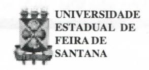
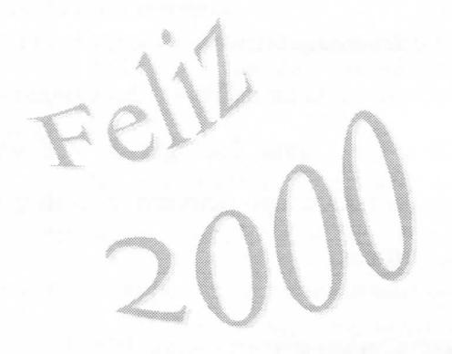
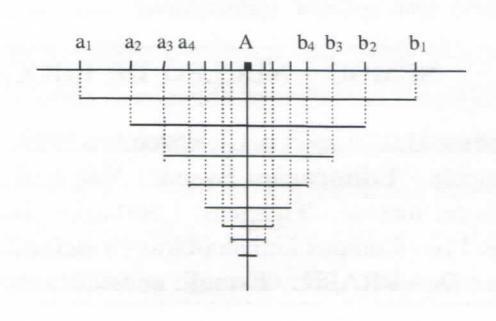
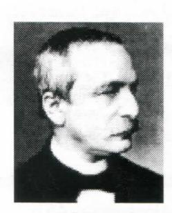

# **FOLHETIM DE EDUCAÇÃO MATEMÁTICA**

**Folhetim Educ. Mat., Ano 7, n. 85, dez. 1999**

**ISSN 1415-8779**

#### **OBJETIVO**

Este _Folhetim é_ um veículo de divulgação, circulação de ideias e de estímulo ao estudo e à curiosidade intelectual. Dirige-se a todos os interessados pelos aspectos pedagógicos, filosóficos e históricos da Matemática. Pretende construir uma ponte para unir os que estão próximos e os que estão distantes.

#### **EDITORIAL**

É interessante o fascínio que os números exercem sobre as pessoas. Nesse final de ano, estamos diante de dois deles, com uma característica em comum: os três últimos algarismos são iguais em cada um, respectivamente. Trata-se de 1999 e 2000. Por várias razões, o número (ou o ano?) 2000 traz uma expectativa maior. Essa introdução é apaenas à guisa de desejar a todos os leitores de nosso Folhetim um...

## **COMITÊ EDITORIAL**

Carloman Carlos Borges (Doutor) Inácio de Sousa Fadigas (Mestre)

#### **PERGUNTE QUE O NEMOC RESPONDE**

_V_ **Pergunta.** Cristóvão P. dos Santos, de São Paulo, indaga: _"qual o valor que deve ser atribuído a 10" ?"_

R. Assunto similar a esse já foi ventilado no _Folhetim_ de número 48 . No caso específico do colega, primeiro calculamos as aproximações de _n_ "por falta" e "por excesso", as quais formam os chamados intevalos encaixantes:

| Intervalos               |     |                            | Longitudes |
| ------------------------ | --- | -------------------------- | ---------- |
| Aproximação por falta |     | Aproximação por excesso |            |
| [3                       |     | 4 ]                     | 1          |
| [3,1                     |     | , 3,2] na,^          | 0,1        |
| [3,14                    |     | , 3,15]                 | 0,01       |
|                          |     | [3,141 , 3,142]            | 0,001      |
|                          |     |                            |            |

Observe o seguinte: os intervalos assim formados: [3;4], [3,1;3,2], [3,14;3,15]; satisfazem os dois requisitos: a) cada qual está contido em todos os seus predecessores; b) suas amplitudes 0,1; 0,01; 0,001; 0,0001; ... vão decrescendo sempre e tendem a zero. De maneira geral lemos: . . . . ,

Assim, podemos dizer que foram formadas duas sequências (a^) e (b^) as quais satisfazem às três condições seguintes: l.(a\_^) é crescente; 2. (b ) é decrescente; 3. lim (b - a ) = 0. Nessas condições, as seqiiências (a^) e (b^) são denominadas de adjacentes. No caso particular, o número _n é_ definido por esses intervalos encaixantes descritos acima. Como já foi verificado:

3<3,1 < 3,14 < 3,141 <... 4>3,2>3,15>3,142>...

Claramente (isso pode ser demonstrado) as potências de 10" seguem a mesma lei de crescimento já observada para os expoentes:

$$10^3 < 10^{3,1} < 10^{3,14} < 10^{3,141} < \dots$$

$10^4 > 10^{3,2} > 10^{3,15} > 10^{3,142} > \dots$

O significado de cada potência é dado por uma raiz real. Exemplificando:

$$10^{3,1} = \sqrt[10]{10^{31}}$$

Evidentemente, por esse processo, pode-se obter o valor de 10" com a precisão desejada.

**2\* Pergunta.** O mesmo leitor quer saber o significado da frase: _"Deus criou os números naturais. O resto é obra dos homens."_

R. Essa célebre frase é atribuída ao matemático alemão Leopold Kronecker (1823-1891)\*. Houve uma época na qual os números naturais eram admitidos como ponto de partida para as demais generalizações numéricas (inteiros, racionais, reais, complexos,...). A fundamentação da Matemática a partir dos números naturais (criação de Deus...) é uma das teses favoritas do intuicionismo. criado por Brouwer em 1911 e seguido por outros ilustres matemáticos como L. Kronecker - em uma reação ante a axiomática e o logicismo. Hoje em dia não se pode mais levar a sério essa frase de Kronecker, pois os espantosos desenvolvimentos matemáticos mostram claramente que essa ciência não pode ser baseada naquela obscura noção de número natural. O matemático Kronecker não possuía apenas um invulgar talento matemático. Como banqueiro, acumulou considerável fortuna empregando naturalmente, os meios usuais que os banqueiros até hoje empregam. Outro incomum talento de Kronecker manifestou-se através de uma desumana crítica que ele fez ao grande matemático Cantor, criador da Teoria dos Conjuntos, considerando-a mais uma Teologia do que uma teoria Matemática. O tempo demonstrou o despropósito de suas críticas.

#### **NEMOC - NÚCLEO DE EDUCAÇÃO MATEMÁTICA OMAR CATUNDA**

FolhetimEduc.Mat., Ano7 ,n. 85, dezembro 1999 - **Editores:** Carloman e Inácio - **Secretária:** Josenildes Oliveira Venas Almeida - **Editoração:** Evandro Vaz e Nivaldo de Assis - **Impressão:** Imprensa Gráfica Universitária - **Periodicidade:** mensal - **Tiragem:** 1.500 exemplares - _Distribuição gratuita -_ **Endereço:** Av. Universitária, s/n km 03 - BR 116 - Campus Universitário - **Telefone:** (075)224-8115 - **Fax:** (075)224-8085 - CEP 44031-460 - Feira **de** Santana - Ba - BRASIL - **E-mail:** nemoc@uefs.br

**3" Pergunta.** Albertram C. Passos, de Salvador, pede para mostrarmos ser o número

$$x = \sqrt[3]{3 + \sqrt{9 + \frac{125}{27}}} - \sqrt[3]{-3 + \sqrt{9 + \frac{125}{27}}}$$
racional.

R. Consideremos a equação do terceiro grau: + px + q = O, p e q reais, cuja fórmula de resolução é dada por

$$x = \sqrt[3]{-\frac{q}{2} + \sqrt{\frac{q^2}{4} + \frac{p^3}{27}}} + \sqrt[3]{-\frac{q}{2} - \sqrt{\frac{q^2}{4} + \frac{p^3}{27}}}$$

na qual o radicando

$$D = \frac{q^2}{4} + \frac{p^3}{27}$$

mostra a natureza das raízes. Se:

- 1. D > O, a equação tem uma raiz real e duas raízes complexas conjugadas;
- 2. D = O, a equação tem três raízes reais, sendo uma repetida;
- 3. **D** < O, a equação tem três raízes reais distintas.

No caso presente, temos: q = - 6 e p = 5, donde vem a equação: x V 5x - 6 = 0. Como essa equação não possui raízes fracionárias (o coeficiente de x"\* é igual a 1) suas possíveis raízes inteiras estão entre os divisores de - 6. Testando o divisor 1, vemos que ele é raiz, aliás, a única raiz real dessa equação, uma vez que o discriminante D é maior que zero. Logo, fica demonstrado que x é um número racional.

Outra maneira:

Fazendo

$$a = 3 + \sqrt{9 + \frac{125}{27}}$$
(I) $e b = -3 + \sqrt{9 + \frac{125}{27}}$ (II)

Logo,

$$x^{3} = (\sqrt[3]{a} - \sqrt[3]{b})^{3} =$$

$$= a - b - 3\sqrt[3]{a}\sqrt[3]{b}(\sqrt[3]{a} - \sqrt[3]{b}) =$$

$$= a - b - 3\sqrt[3]{ab} x$$

Tendo em conta (I) e (II) tem-se:

$$a-b=6$$
e $ab = 9 + \frac{125}{27} - 9 = \frac{125}{27} = \left(\frac{5}{3}\right)^3$

donde:

$$x^3 = 6 - 3.\frac{5}{3}x = 6 - 5x$$
, isto $ext{\'e}: x^3 + 5x - 6 = 0$ ou $x^3 - x + 6(x - 1) = 0$ ou $(x - 1)(x^2 + x + 6) = 0$ e, consequentemente $x = 1$ .

\* Leopoldo Kronecker nasceu em 7 de dezembro de 1823,

em Liegnitz, Prússia (atualmente Legnica, Polónia) e morreu em 29 de dezembro de 1891 em Berlim, Alemanha. Seu pai, Isidor Kronecker, foi um homem de negócios de sucesso. Em 1841, Kronecker tornou-se estudante em Berlim. Seus estudos iniciais de matemática tiveram como

finalidade acompanhar tópicos tais como astronomia, meteorologia e química. Interessou-se especialmente em filosofia, estudando os trabalhos filosóficos de Decartes, Leibniz, Kant, Spinozae Hegel. Em julho de 1845 defendeu sua tese de doutorado em teoria dos números algébricos, sob a supervisão de Dirichlet, o qual fez o seguinte comentário a seu respeito: _"...incomum profundidade._ _grande assiduidade, e um exato conhecimento do presente estágio da matemática superior"._ Em 1861 foi eleito para a Academia de Berlim, o que lhe trouxe muitos benefícios. A contribuição inicial de Kronecker foi na teoria das equações e álgebra superior, com destaque nas funções elípticas e teoria dos números algébricos. Porém os tópicos estudados foram restritos, por acreditar na redução de toda matemática a argumentos envolvendo somente os naturais e um número finito de passos. Por isso, a bem conhecida frase _"Deus criou os números naturais. O resto é obra dos homens."_

Kronecker acreditava que a matemática deveria lidar somente com números finitos e com finito número de operações. Foi o primeiro a por em dúvida a existência de provas não-construti vas. Por estas razões, fez forte oposição às ideias de Cantor na teoria dos conjuntos. Não somente Dedekind, Heine e Cantor foram inaceitáveis para seu modo de pensar, mas também Weierstrass, cujo traballho em análise, Kronecker tentou convencer as novas gerações de matemáticos a não valorizar.

**NOTÍCIAS**

A UEFS, através do NEMOC, vai oferecer novamente à comunidade o CURSO DE ESPECIA-LIZAÇÃO EM EDUC AÇÃO MATEMÁTICA.

As disciplinas oferecidas são:

- •Psicologia Cognifiva 45 h
- •Epistemologia e Metodologia da Pesquisa 45 h
- •Tópicos de Matemática de 1° e 2° graus 45 h
- •Álgebra Linear aplicada ao 2° grau 45 h
- •Seminários sobre Tóp. Gerais da Matemática 45 h
- •Didática da Matemática 45 h
- •Teoria dos Números 60 h
- •Geometria Euclidiana 60 h
- •Ideias Fundamentais da Matemática 60 h

O Curso será desenvolvido na modalidade Regular com Tempo Integral, totalizando 450 horas (quatrocentos e cinquenta horas).

Perí^odo de inscrição: **14 a 30 de dezembro de 1999** Período da seleção: **08 a 10 de fevereiro de 2000** Matrícula: **22,23 e 29 de fevereiro de 2000** Início do curso: **13 de março de 2000**

#### **Informações adicionais:**

PPPG: (75) 224- 8257; e-mail: pppg@uefs.br DEXA: (75) 224 - 8086; e-mail: exa@uefs.br NEMOC: (75) 224-8115; e-mail: nemoc @ uefs.br

_Pergunte que o NEMOC Responde é_ uma coluna de autoria do prof. Dr. Carloman Carlos Borges e objetiva atingir ao público interessado em Matemática nos seus múltiplos aspectos.

Caso o leitor queira fazer alguma pergunta escreva-nos.

### **PRÓXIMO NÚMERO**

_Aguardem!_

### **NÚMEROS ATRASADOS**

Envie para cada folhetim um selo de postagem nacional de 1° porte. Dentro de no máximo quatro semanas, contadas a partir da data de recebimento do seu pedido, você estará recebendo os folhetins solicitados.

OBS.: É permifida a reprodução total ou parcial desse folhetim, desde que citada a fonte.
